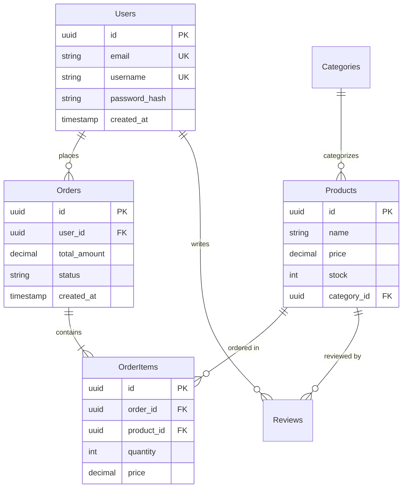

# 数据库Schema设计


## 何时使用此技能

以下是需要触发此技能的具体场景：

- **新项目**：为新应用设计数据库Schema
- **Schema重构**：为提升性能或可扩展性重新设计现有Schema
- **关系定义**：实现表之间的1:1、1:N、N:M关系
- **迁移**：安全应用Schema变更
- **性能问题**：为解决慢查询优化索引及Schema

## 输入格式 (Input Format)

用户需提供的输入格式及必填/可选信息：

### 必填信息
- **数据库类型**：PostgreSQL、MySQL、MongoDB、SQLite等
- **领域说明**：需要存储的数据类型（例如：电商、博客、社交平台）
- **核心实体**：关键数据对象（例如：User、Product、Order）

### 可选信息
- **预计数据量**：小(<10K行)、中(10K-1M行)、大(>1M行)（默认：中）
- **读/写比例**：读密集型、写密集型、均衡型（默认：均衡型）
- **事务要求**：是否需要ACID（默认：是）
- **分片/分区**：是否需要分散大容量数据（默认：否）

### 输入示例

```
请设计电商平台的数据库：
- DB: PostgreSQL
- 实体: User(用户), Product(商品), Order(订单), Review(评论)
- 关系:
  - User可拥有多个Order
  - Order包含多个Product（N:M）
  - Review关联User和Product
- 预计数据: 10万用户，1万商品
- 读密集型（商品查询频繁）
```

## 操作步骤

需严格遵循的分步操作流程：

### Step 1: 实体及属性定义

识别核心数据对象及其属性。

**工作内容**:
- 从业务需求中提取名词 → 实体
- 列出每个实体的属性（列）
- 确定数据类型（VARCHAR、INTEGER、TIMESTAMP、JSON等）
- 指定主键（UUID vs 自增ID）

**示例**（电商）:
```
Users (用户)
- id: UUID PRIMARY KEY
- email: VARCHAR(255) UNIQUE NOT NULL
- username: VARCHAR(50) UNIQUE NOT NULL
- password_hash: VARCHAR(255) NOT NULL
- created_at: TIMESTAMP DEFAULT NOW()
- updated_at: TIMESTAMP DEFAULT NOW()

Products (商品)
- id: UUID PRIMARY KEY
- name: VARCHAR(255) NOT NULL
- description: TEXT
- price: DECIMAL(10, 2) NOT NULL
- stock: INTEGER DEFAULT 0
- category_id: UUID REFERENCES Categories(id)
- created_at: TIMESTAMP DEFAULT NOW()

Orders (订单)
- id: UUID PRIMARY KEY
- user_id: UUID REFERENCES Users(id)
- total_amount: DECIMAL(10, 2) NOT NULL
- status: VARCHAR(20) DEFAULT 'pending'
- created_at: TIMESTAMP DEFAULT NOW()

OrderItems (订单项 - 中间表)
- id: UUID PRIMARY KEY
- order_id: UUID REFERENCES Orders(id) ON DELETE CASCADE
- product_id: UUID REFERENCES Products(id)
- quantity: INTEGER NOT NULL
- price: DECIMAL(10, 2) NOT NULL
```

### Step 2: 关系设计与规范化

定义表之间的关系并应用规范化。

**工作内容**:
- 1:1关系：外键 + UNIQUE约束
- 1:N关系：外键
- N:M关系：创建中间（关联）表
- 确定规范化级别（1NF ~ 3NF）

**判断标准**:
- OLTP系统 → 规范化至3NF（保证数据完整性）
- OLAP/分析系统 → 允许非规范化（提升查询性能）
- 读密集型 → 部分非规范化以减少JOIN
- 写密集型 → 完全规范化以消除冗余

**示例**（Mermaid ERD）:


### Step 3: 制定索引策略

为提升查询性能设计索引。

**工作内容**:
- 主键会自动创建索引
- WHERE子句中频繁使用的列 → 添加索引
- JOIN中使用的外键 → 添加索引
- 考虑复合索引（WHERE col1 = ? AND col2 = ?）
- 唯一索引（email、username等）

**检查项**:
- [x] 为频繁查询的列添加索引
- [x] 为外键列添加索引
- [x] 优化复合索引顺序（选择性高的列优先）
- [x] 避免过度索引（会降低INSERT/UPDATE性能）

**示例**（PostgreSQL）:
```sql
-- 主键（自动创建索引）
CREATE TABLE users (
    id UUID PRIMARY KEY DEFAULT gen_random_uuid(),
    email VARCHAR(255) UNIQUE NOT NULL,  -- UNIQUE = 自动创建索引
    username VARCHAR(50) UNIQUE NOT NULL,
    password_hash VARCHAR(255) NOT NULL,
    created_at TIMESTAMP DEFAULT NOW(),
    updated_at TIMESTAMP DEFAULT NOW()
);

-- 外键 + 显式索引
CREATE TABLE orders (
    id UUID PRIMARY KEY DEFAULT gen_random_uuid(),
    user_id UUID NOT NULL REFERENCES users(id) ON DELETE CASCADE,
    total_amount DECIMAL(10, 2) NOT NULL,
    status VARCHAR(20) DEFAULT 'pending',
    created_at TIMESTAMP DEFAULT NOW()
);

CREATE INDEX idx_orders_user_id ON orders(user_id);
CREATE INDEX idx_orders_status ON orders(status);
CREATE INDEX idx_orders_created_at ON orders(created_at);

-- 复合索引（status和created_at频繁一起查询）
CREATE INDEX idx_orders_status_created ON orders(status, created_at DESC);

-- Products表
CREATE TABLE products (
    id UUID PRIMARY KEY DEFAULT gen_random_uuid(),
    name VARCHAR(255) NOT NULL,
    description TEXT,
    price DECIMAL(10, 2) NOT NULL CHECK (price >= 0),
    stock INTEGER DEFAULT 0 CHECK (stock >= 0),
    category_id UUID REFERENCES categories(id),
    created_at TIMESTAMP DEFAULT NOW()
);

CREATE INDEX idx_products_category ON products(category_id);
CREATE INDEX idx_products_price ON products(price);  -- 价格范围查询
CREATE INDEX idx_products_name ON products(name);    -- 商品名称查询

-- 全文搜索（PostgreSQL）
CREATE INDEX idx_products_name_fts ON products USING GIN(to_tsvector('english', name));
CREATE INDEX idx_products_description_fts ON products USING GIN(to_tsvector('english', description));
```

### Step 4: 设置约束与触发器

添加保证数据完整性的约束。

**工作内容**:
- NOT NULL：必填列
- UNIQUE：不可重复列
- CHECK：值范围限制（例如: price >= 0）
- 外键 + CASCADE选项
- 设置默认值

**示例**:
```sql
CREATE TABLE products (
    id UUID PRIMARY KEY DEFAULT gen_random_uuid(),
    name VARCHAR(255) NOT NULL,
    price DECIMAL(10, 2) NOT NULL CHECK (price >= 0),
    stock INTEGER DEFAULT 0 CHECK (stock >= 0),
    discount_percent INTEGER CHECK (discount_percent >= 0 AND discount_percent <= 100),
    category_id UUID REFERENCES categories(id) ON DELETE SET NULL,
    created_at TIMESTAMP DEFAULT NOW(),
    updated_at TIMESTAMP DEFAULT NOW()
);

-- 触发器：自动更新updated_at
CREATE OR REPLACE FUNCTION update_updated_at_column()
RETURNS TRIGGER AS $$
BEGIN
    NEW.updated_at = NOW();
    RETURN NEW;
END;
$$ LANGUAGE plpgsql;

CREATE TRIGGER update_products_updated_at
BEFORE UPDATE ON products
FOR EACH ROW
EXECUTE FUNCTION update_updated_at_column();
```

### Step 5: 编写迁移脚本

编写用于安全应用Schema变更的迁移脚本。

**工作内容**:
- UP迁移：应用变更
- DOWN迁移：回滚变更
- 用事务包裹
- 防止数据丢失（谨慎使用ALTER TABLE）

**示例**（SQL迁移）:
```sql
-- migrations/001_create_initial_schema.up.sql
BEGIN;

CREATE EXTENSION IF NOT EXISTS "uuid-ossp";

CREATE TABLE users (
    id UUID PRIMARY KEY DEFAULT gen_random_uuid(),
    email VARCHAR(255) UNIQUE NOT NULL,
    username VARCHAR(50) UNIQUE NOT NULL,
    password_hash VARCHAR(255) NOT NULL,
    created_at TIMESTAMP DEFAULT NOW(),
    updated_at TIMESTAMP DEFAULT NOW()
);

CREATE TABLE categories (
    id UUID PRIMARY KEY DEFAULT gen_random_uuid(),
    name VARCHAR(100) UNIQUE NOT NULL,
    parent_id UUID REFERENCES categories(id)
);

CREATE TABLE products (
    id UUID PRIMARY KEY DEFAULT gen_random_uuid(),
    name VARCHAR(255) NOT NULL,
    description TEXT,
    price DECIMAL(10, 2) NOT NULL CHECK (price >= 0),
    stock INTEGER DEFAULT 0 CHECK (stock >= 0),
    category_id UUID REFERENCES categories(id),
    created_at TIMESTAMP DEFAULT NOW(),
    updated_at TIMESTAMP DEFAULT NOW()
);

CREATE INDEX idx_products_category ON products(category_id);
CREATE INDEX idx_products_price ON products(price);

COMMIT;

-- migrations/001_create_initial_schema.down.sql
BEGIN;

DROP TABLE IF EXISTS products CASCADE;
DROP TABLE IF EXISTS categories CASCADE;
DROP TABLE IF EXISTS users CASCADE;

COMMIT;
```

## 输出格式

定义结果需遵循的严格格式。

### 基本结构

```
项目/
├── database/
│   ├── schema.sql                    # 完整Schema
│   ├── migrations/
│   │   ├── 001_create_users.up.sql
│   │   ├── 001_create_users.down.sql
│   │   ├── 002_create_products.up.sql
│   │   └── 002_create_products.down.sql
│   ├── seeds/
│   │   └── sample_data.sql           # 测试数据
│   └── docs/
│       ├── ERD.md                     # Mermaid ERD图
│       └── SCHEMA.md                  # Schema说明文档
└── README.md
```

### ERD图（Mermaid格式）

```markdown
# Database Schema

## 实体关系图

\`\`\`mermaid
erDiagram
    Users ||--o{ Orders : places
    Orders ||--|{ OrderItems : contains
    Products ||--o{ OrderItems : "ordered in"

    Users {
        uuid id PK
        string email UK
        string username UK
    }

    Products {
        uuid id PK
        string name
        decimal price
    }
\`\`\`

## 表说明

### users
- **用途**: 存储用户账户信息
- **索引**: email, username
- **预计行数**: 100,000

### products
- **用途**: 商品目录
- **索引**: category_id, price, name
- **预计行数**: 10,000
```

## 约束规则

必须遵守的规则与禁止事项：

### 必守规则（MUST）

1. **必填主键**: 所有表必须定义主键
   - 唯一标识记录
   - 保证引用完整性

2. **显式外键**: 存在关系的表必须设置外键
   - 明确ON DELETE CASCADE/SET NULL选项
   - 防止孤立记录

3. **合理使用NOT NULL**: 必填列设置NOT NULL
   - 明确是否允许NULL
   - 建议提供默认值

### 禁止事项（MUST NOT）

1. **滥用EAV模式**: 实体-属性-值模式仅适用于特殊场景
   - 会大幅增加查询复杂度
   - 导致性能下降

2. **过度非规范化**: 为提升性能的非规范化需谨慎
   - 引发数据一致性问题
   - 存在更新异常风险

3. **明文存储敏感信息**: 绝对禁止明文存储密码、卡号等敏感信息
   - 必须进行哈希/加密
   - 避免法律责任风险

### 安全规则

- **最小权限原则**: 应用数据库账户仅授予必要权限
- **防止SQL注入**: 使用预编译语句/参数化查询
- **加密敏感列**: 考虑加密存储个人信息

## 示例

通过实际使用案例展示技能的应用方法。

### 示例1: 博客平台Schema

**场景**: 设计Medium风格博客平台的数据库

**用户请求**:
```
请设计博客平台的PostgreSQL Schema：
- 用户可撰写多篇文章
- 文章可关联多个标签（N:M）
- 用户可点赞、收藏文章
- 支持评论功能（含回复）
```

**最终结果**:
```sql
-- Users
CREATE TABLE users (
    id UUID PRIMARY KEY DEFAULT gen_random_uuid(),
    email VARCHAR(255) UNIQUE NOT NULL,
    username VARCHAR(50) UNIQUE NOT NULL,
    bio TEXT,
    avatar_url VARCHAR(500),
    created_at TIMESTAMP DEFAULT NOW()
);

-- Posts
CREATE TABLE posts (
    id UUID PRIMARY KEY DEFAULT gen_random_uuid(),
    author_id UUID NOT NULL REFERENCES users(id) ON DELETE CASCADE,
    title VARCHAR(255) NOT NULL,
    slug VARCHAR(255) UNIQUE NOT NULL,
    content TEXT NOT NULL,
    published_at TIMESTAMP,
    created_at TIMESTAMP DEFAULT NOW(),
    updated_at TIMESTAMP DEFAULT NOW()
);

CREATE INDEX idx_posts_author ON posts(author_id);
CREATE INDEX idx_posts_published ON posts(published_at);
CREATE INDEX idx_posts_slug ON posts(slug);

-- Tags
CREATE TABLE tags (
    id UUID PRIMARY KEY DEFAULT gen_random_uuid(),
    name VARCHAR(50) UNIQUE NOT NULL,
    slug VARCHAR(50) UNIQUE NOT NULL
);

-- 文章-标签关系（N:M）
CREATE TABLE post_tags (
    post_id UUID REFERENCES posts(id) ON DELETE CASCADE,
    tag_id UUID REFERENCES tags(id) ON DELETE CASCADE,
    PRIMARY KEY (post_id, tag_id)
);

CREATE INDEX idx_post_tags_post ON post_tags(post_id);
CREATE INDEX idx_post_tags_tag ON post_tags(tag_id);

-- 点赞
CREATE TABLE post_likes (
    user_id UUID REFERENCES users(id) ON DELETE CASCADE,
    post_id UUID REFERENCES posts(id) ON DELETE CASCADE,
    created_at TIMESTAMP DEFAULT NOW(),
    PRIMARY KEY (user_id, post_id)
);

-- 收藏
CREATE TABLE post_bookmarks (
    user_id UUID REFERENCES users(id) ON DELETE CASCADE,
    post_id UUID REFERENCES posts(id) ON DELETE CASCADE,
    created_at TIMESTAMP DEFAULT NOW(),
    PRIMARY KEY (user_id, post_id)
);

-- 评论（自引用实现嵌套评论）
CREATE TABLE comments (
    id UUID PRIMARY KEY DEFAULT gen_random_uuid(),
    post_id UUID NOT NULL REFERENCES posts(id) ON DELETE CASCADE,
    author_id UUID NOT NULL REFERENCES users(id) ON DELETE CASCADE,
    parent_comment_id UUID REFERENCES comments(id) ON DELETE CASCADE,
    content TEXT NOT NULL,
    created_at TIMESTAMP DEFAULT NOW(),
    updated_at TIMESTAMP DEFAULT NOW()
);

CREATE INDEX idx_comments_post ON comments(post_id);
CREATE INDEX idx_comments_author ON comments(author_id);
CREATE INDEX idx_comments_parent ON comments(parent_comment_id);
```

### 示例2: MongoDB Schema（NoSQL）

**场景**: 设计实时聊天应用的MongoDB Schema

**用户请求**:
```
请设计实时聊天应用的MongoDB Schema。
读操作非常频繁，需要快速查询消息历史。
```

**最终结果**:
```javascript
// users 集合
{
  _id: ObjectId,
  username: String,  // 已索引，唯一
  email: String,     // 已索引，唯一
  avatar_url: String,
  status: String,    // 'online', 'offline', 'away'
  last_seen: Date,
  created_at: Date
}

// conversations 集合（非规范化 - 优化读性能）
{
  _id: ObjectId,
  participants: [    // 已索引
    {
      user_id: ObjectId,
      username: String,
      avatar_url: String
    }
  ],
  last_message: {    // 非规范化实现快速查询最新消息
    content: String,
    sender_id: ObjectId,
    sent_at: Date
  },
  unread_counts: {   // 每个参与者的未读消息数
    "user_id_1": 5,
    "user_id_2": 0
  },
  created_at: Date,
  updated_at: Date
}

// messages 集合
{
  _id: ObjectId,
  conversation_id: ObjectId,  // 已索引
  sender_id: ObjectId,
  content: String,
  attachments: [
    {
      type: String,  // 'image', 'file', 'video'
      url: String,
      filename: String
    }
  ],
  read_by: [ObjectId],  // 已读用户ID数组
  sent_at: Date,        // 已索引
  edited_at: Date
}

// 索引
db.users.createIndex({ username: 1 }, { unique: true });
db.users.createIndex({ email: 1 }, { unique: true });

db.conversations.createIndex({ "participants.user_id": 1 });
db.conversations.createIndex({ updated_at: -1 });

db.messages.createIndex({ conversation_id: 1, sent_at: -1 });
db.messages.createIndex({ sender_id: 1 });
```

**设计特点**:
- 为优化读性能采用非规范化（嵌入last_message）
- 为频繁查询的字段创建索引
- 利用数组字段（participants、read_by）

## 最佳实践

### 提升质量

1. **统一命名规则**: 表/列名使用snake_case
   - 例如: users, post_tags, created_at
   - 统一单复数（表用复数，列用单数等）

2. **考虑软删除**: 重要数据采用逻辑删除而非物理删除
   - 添加deleted_at TIMESTAMP（NULL表示活跃，非NULL表示已删除）
   - 可恢复误删数据
   - 便于审计追踪

3. **必加时间戳**: 大多数表需包含created_at、updated_at
   - 便于数据追踪与调试
   - 支持时序分析

### 提升效率

- **部分索引**: 使用条件索引最小化索引大小
  ```sql
  CREATE INDEX idx_posts_published ON posts(published_at) WHERE published_at IS NOT NULL;
  ```
- **物化视图**: 用物化视图缓存复杂聚合查询
- **分区**: 大容量表按日期/范围分区

## 常见问题（Common Issues）

### 问题1: N+1查询问题

**症状**: 本可一次查询完成却多次调用数据库

**原因**: 未使用JOIN而是在循环中逐个查询

**解决方法**:
```sql
-- ❌ 不良示例: N+1查询
SELECT * FROM posts;  -- 1次
-- 每个post单独查询
SELECT * FROM users WHERE id = ?;  -- N次

-- ✅ 良好示例: 1次查询
SELECT posts.*, users.username, users.avatar_url
FROM posts
JOIN users ON posts.author_id = users.id;
```

### 问题2: 无索引外键导致JOIN缓慢

**症状**: JOIN查询速度极慢

**原因**: 外键列未创建索引

**解决方法**:
```sql
CREATE INDEX idx_orders_user_id ON orders(user_id);
CREATE INDEX idx_order_items_order_id ON order_items(order_id);
CREATE INDEX idx_order_items_product_id ON order_items(product_id);
```

### 问题3: UUID vs 自增ID的性能差异

**症状**: 使用UUID作为主键时插入性能下降

**原因**: UUID是随机值，会导致索引碎片化

**解决方法**:
- PostgreSQL: 使用`uuid_generate_v7()`（时序UUID）
- MySQL: 使用`UUID_TO_BIN(UUID(), 1)`
- 或考虑使用自增BIGINT

## 参考资料

### 官方文档
- [PostgreSQL Documentation](https://www.postgresql.org/docs/)
- [MySQL Documentation](https://dev.mysql.com/doc/)
- [MongoDB Schema Design Best Practices](https://www.mongodb.com/docs/manual/core/data-modeling-introduction/)

### 工具
- [dbdiagram.io](https://dbdiagram.io/) - 绘制ERD图
- [PgModeler](https://pgmodeler.io/) - PostgreSQL建模工具
- [Prisma](https://www.prisma.io/) - ORM + 迁移工具

### 学习资料
- [Database Design Course (freecodecamp)](https://www.youtube.com/watch?v=ztHopE5Wnpc)
- [Use The Index, Luke](https://use-the-index-luke.com/) - SQL索引指南

## 元数据

### 版本
- **当前版本**: 1.0.0
- **最后更新**: 2025-01-01
- **兼容平台**: Codex, ChatGPT, Gemini

### 相关技能
- [api-design](../api-design/SKILL.md): 结合API设计Schema
- [performance-optimization](../../code-quality/performance-optimization/SKILL.md): 查询性能优化

### 标签
`#database` `#schema` `#PostgreSQL` `#MySQL` `#MongoDB` `#SQL` `#NoSQL` `#migration` `#ERD`