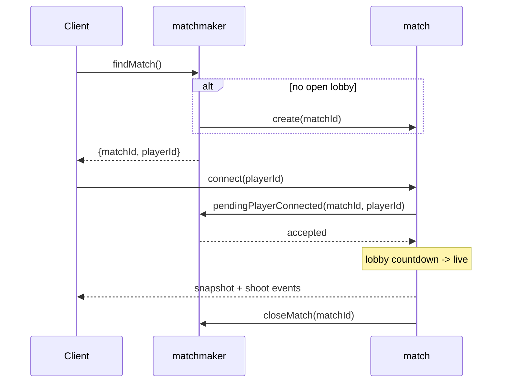
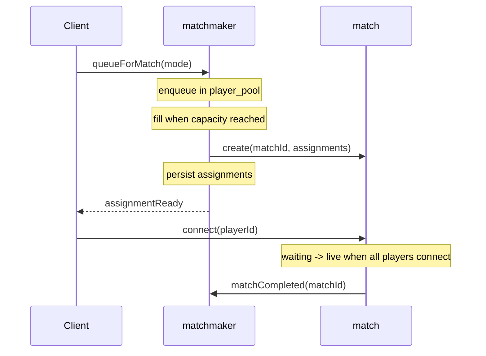
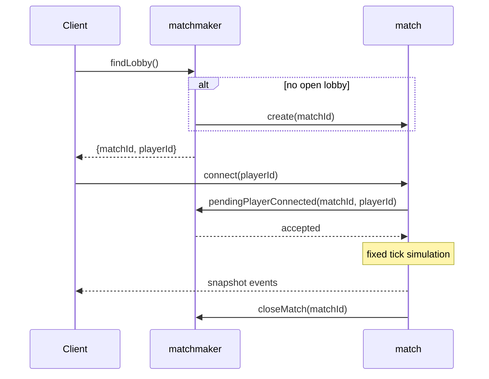
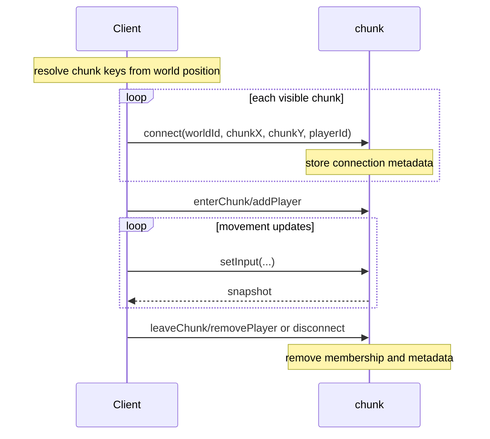
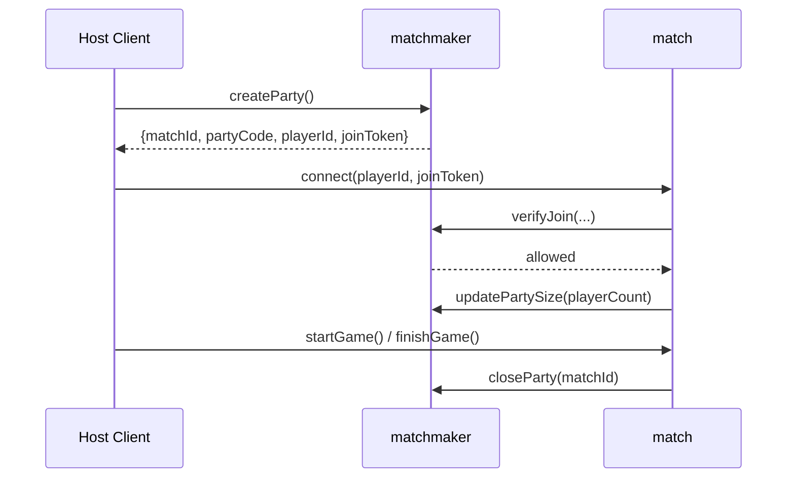
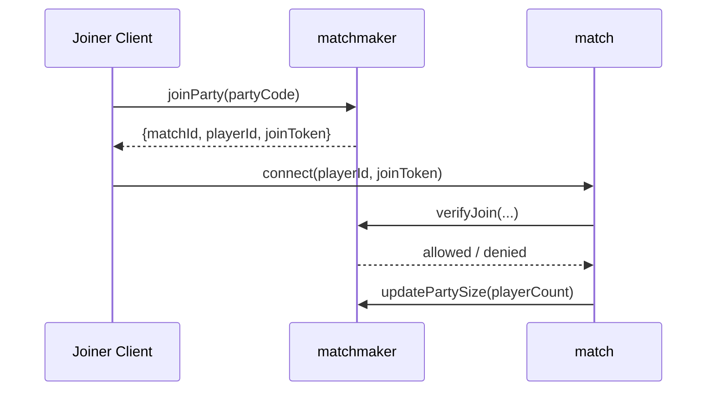
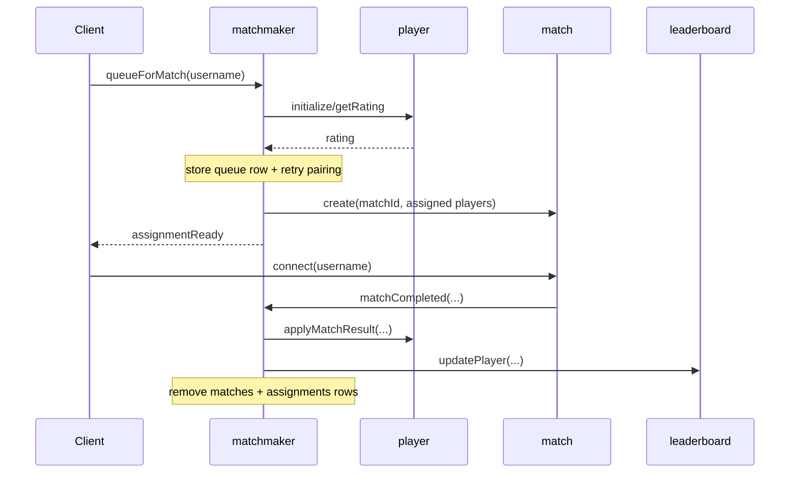
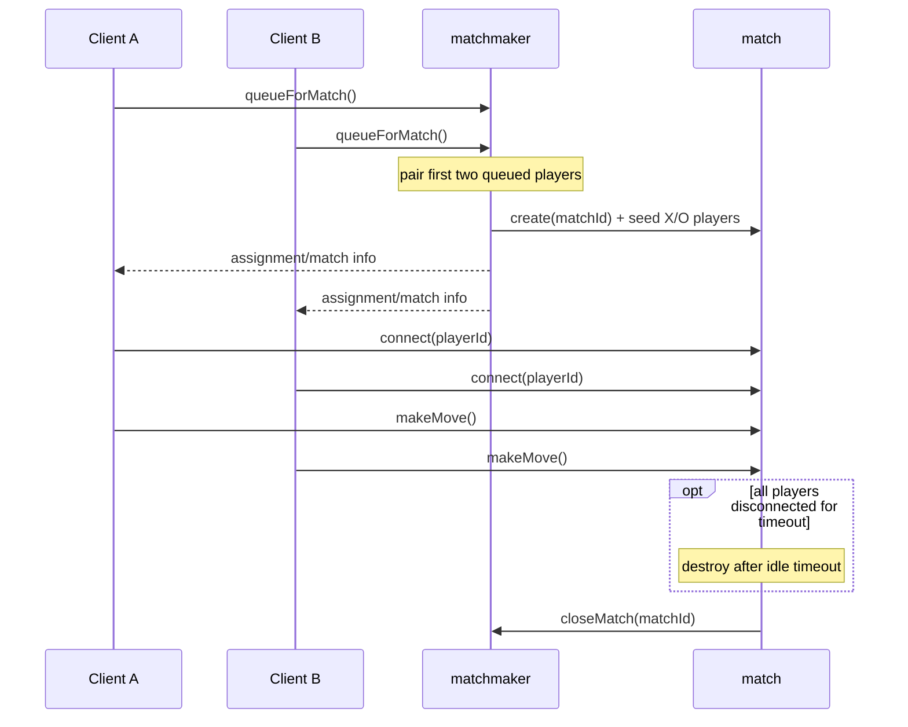
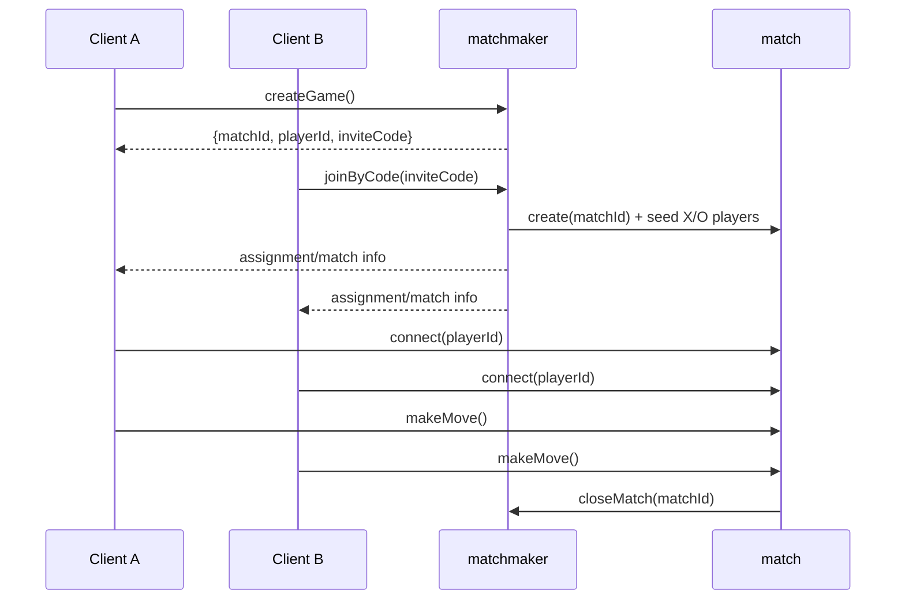
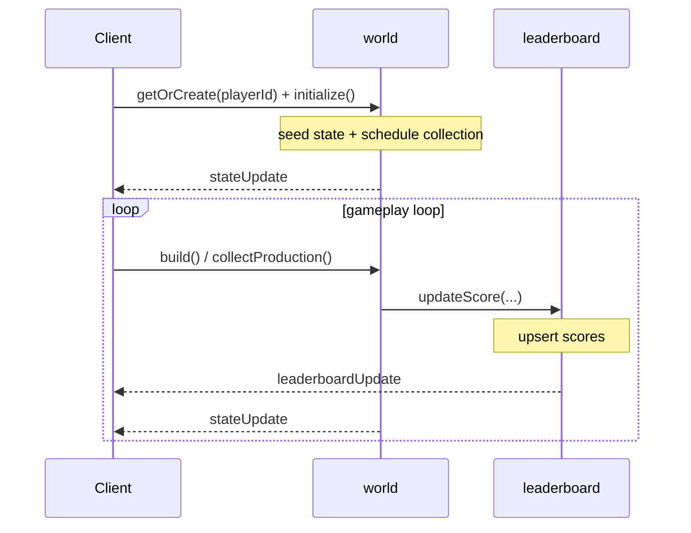

# 多人游戏

**重要提示：在进行任何操作前，你必须阅读本技能目录下的`BASE_SKILL.md`文件。其中包含了调试、错误处理、状态管理、部署及项目搭建的关键指导。这些规则和模式适用于所有RivetKit相关工作。以下所有内容均假设你已阅读并理解该文件。**

本文档是使用RivetKit构建多人游戏的实用模式集合，可作为你根据游戏类型调整的参考清单。

## 起始代码

从[GitHub](https://github.com/rivet-dev/rivet/tree/main/examples/multiplayer-game-patterns/src/actors/)上的可用示例开始，根据你的游戏需求进行适配。不要从零开始开发匹配机制和生命周期流程。

| 游戏分类 | 起始代码 | 常见示例 |
| --- | --- | --- |
| 大逃杀 | [GitHub](https://github.com/rivet-dev/rivet/tree/main/examples/multiplayer-game-patterns/src/actors/battle-royale/) | Fortnite, Apex Legends, PUBG, Warzone |
| 竞技场 | [GitHub](https://github.com/rivet-dev/rivet/tree/main/examples/multiplayer-game-patterns/src/actors/arena/) | Call of Duty TDM/FFA, Halo Slayer, Counter-Strike休闲模式, VALORANT无排位模式, Overwatch快速游戏, Rocket League |
| IO类游戏 | [GitHub](https://github.com/rivet-dev/rivet/tree/main/examples/multiplayer-game-patterns/src/actors/io-style/) | Agar.io, Slither.io, surviv.io |
| 开放世界 | [GitHub](https://github.com/rivet-dev/rivet/tree/main/examples/multiplayer-game-patterns/src/actors/open-world/) | Minecraft生存服务器, 类Rust世界, MMO区域/分块世界 |
| 派对房间 | [GitHub](https://github.com/rivet-dev/rivet/tree/main/examples/multiplayer-game-patterns/src/actors/party/) | Fall Guys私人房间, 自定义游戏房间, 社交派对会话 |
| 2D物理类 | [GitHub](https://github.com/rivet-dev/rivet/tree/main/examples/multiplayer-game-patterns/src/actors/physics-2d/) | 俯视角物理格斗游戏, 2D竞技场游戏, 平台格斗游戏 |
| 3D物理类 | [GitHub](https://github.com/rivet-dev/rivet/tree/main/examples/multiplayer-game-patterns/src/actors/physics-3d/) | 物理沙盒会话, 3D竞技场游戏, 移动玩法沙盒 |
| 排位赛 | [GitHub](https://github.com/rivet-dev/rivet/tree/main/examples/multiplayer-game-patterns/src/actors/ranked/) | 国际象棋天梯, 竞技卡牌游戏, 决斗场排位队列 |
| 回合制 | [GitHub](https://github.com/rivet-dev/rivet/tree/main/examples/multiplayer-game-patterns/src/actors/turn-based/) | 异步国际象棋, Words With Friends, 异步桌游 |
| 放置类 | [GitHub](https://github.com/rivet-dev/rivet/tree/main/examples/multiplayer-game-patterns/src/actors/idle/) | Cookie Clicker, Idle Miner Tycoon, Adventure Capitalist |

## 服务器模拟

### 游戏循环与Tick速率

| 模式 | 适用场景 | 实现指导 |
| --- | --- | --- |
| 固定实时循环 | 大逃杀、竞技场、IO类游戏、开放世界、排位赛 | 在`run`函数中通过`sleep(tickMs)`运行，并在`c.aborted`时退出。 |
| 动作驱动更新 | 派对房间、回合制 | 仅在触发动作/事件时修改并广播状态，而非按固定Tick调度。 |
| 粗粒度离线进度 | 任何包含放置进度的模式 | 使用`c.schedule.after(...)`设置较长的时间窗口（例如5到15分钟），并根据流逝的实际时间应用进度补全。 |

### 物理引擎

对于简单游戏，先从自定义运动学逻辑开始。当你需要关节、堆叠物体、高碰撞密度或复杂形状（旋转多边形、胶囊体、凸包、三角形网格）时，再切换到完整的物理引擎。

每个模拟仅选择一个引擎。将前端专用库排除在后端模拟流程之外，以服务器状态作为权威来源。

| 维度 | 首选引擎 | 备选引擎 | 示例代码 |
| --- | --- | --- | --- |
| 2D | `@dimforge/rapier2d` | `planck-js`, `matter-js` | [GitHub](https://github.com/rivet-dev/rivet/tree/main/examples/multiplayer-game-patterns/src/actors/physics-2d/) |
| 3D | `@dimforge/rapier3d` | `cannon-es`, `ammo.js` | [GitHub](https://github.com/rivet-dev/rivet/tree/main/examples/multiplayer-game-patterns/src/actors/physics-3d/) |

### 空间索引

对于非物理类的空间查询，使用专用索引而非简单的`O(n^2)`检查：

| 索引类型 | 推荐方案 |
| --- | --- |
| AABB索引 | 针对兴趣区域（AOI）、可见性和非碰撞实体，动态集合使用`rbush`，半静态集合使用`flatbush`。 |
| 点索引 | 针对最近邻或范围内查询，使用`d3-quadtree`。 |

## 网络与状态同步

### 网络代码

| 模型 | 适用场景 | 实现方式 |
| --- | --- | --- |
| 混合模式（客户端控制移动，服务器控制战斗） | 射击游戏、动作体育游戏、排位决斗 | 客户端拥有移动控制权，并发送限速的位置更新。服务器进行反作弊验证。战斗（投射物、命中、伤害）完全由服务器权威控制。 |
| 服务器权威+插值 | IO类游戏、持久化世界 | 客户端发送输入指令。服务器按固定Tick模拟并发布权威状态快照。客户端在快照之间进行插值。 |
| 服务器权威（基础逻辑） | 回合制、事件驱动类 | 服务器验证并应用离散动作（回合、阶段转换、投票）。客户端显示已确认的状态。 |

### 实时数据模型

- **快照与差异更新**：将状态作为事件发布。玩家加入/重新同步时发送完整快照，之后在每个Tick发送差异更新。
- **按Tick批量处理**：保持事件小巧且类型明确。将高频更新按Tick批量处理。
- **避免使用UI框架状态处理游戏更新**：使用`requestAnimationFrame`或Canvas/Three.js循环处理模拟，而非React状态。仅将UI框架状态用于菜单、HUD和表单。
- **广播 vs 单连接发送**：使用`c.broadcast(...)`发送共享更新，使用`conn.send(...)`发送私有/玩家专属数据。

### 共享模拟逻辑

共享模拟逻辑同时在客户端和服务器运行。例如，`applyInput(state, input, dt)`函数用于整合速度并限制在世界边界内，可在客户端用于预测，在服务器用于验证。

- **混合模式**：客户端将共享移动逻辑作为主要权威，服务器将其用于反作弊验证。
- **服务器权威模式**：客户端仅将共享逻辑用于插值和预测。
- **保持纯函数特性**：仅包含移动整合、输入转换、碰撞辅助函数及常量。
- **将共享代码放入`src/shared/`目录**：将确定性辅助函数放在`src/shared/sim/*`中，且无副作用。

### 兴趣管理

控制每个客户端接收的数据，以减少带宽消耗并防止信息泄露。

#### 按玩家复制过滤

- **按相关性过滤**：仅向每个客户端发送与该玩家相关的状态（距离、视野、队伍或游戏阶段）。
- **射击游戏和动作游戏**：通过距离和可选的视野检查限制数据复制。
- **仅在服务器端处理**：客户端绝不能接收其不应看到的数据。

#### 分块世界

- **分割大型世界**：使用以`worldId:chunkX:chunkY`为键的分块Actor。
- **订阅附近分块**：客户端仅连接到附近的分块（例如3x3分块窗口）。
- **谨慎使用**：仅在世界庞大且状态繁重时使用（沙盒建造游戏、MMO），不要作为小型匹配的默认方案。

## 后端基础设施

### 持久化

- **内存状态**：最适合每Tick变化的实时游戏状态（玩家位置、输入、匹配阶段、分数）。
- **SQLite (`rivetkit/db`)**：更适合需要查询、索引或长期持久化的大型或表格状状态（地图块、 inventory、匹配池）。由于多个动作可能同时访问同一个Actor，需通过队列序列化数据库操作。

### 匹配模式

以下是架构模式中常用的基础组件。

#### Actor拓扑结构

| 基础组件 | 适用场景 | 典型所有权 |
| --- | --- | --- |
| `matchmaker["main"]` + `match[matchId]` | 基于会话的多人游戏（大逃杀、竞技场、排位赛、派对房间、回合制） | 匹配器负责发现/分配。匹配会话负责生命周期和游戏玩法状态。 |
| `chunk[worldId,chunkX,chunkY]` | 需要分块的大型连续世界 | 每个分块负责本地玩家、分块状态和本地模拟。 |
| `world[playerId]` | 按玩家划分的进度循环（放置/单人世界状态） | 玩家专属资源、建筑、计时器和进度。 |
| `player[username]` | 跨匹配复用的标准档案/评级 | 持久化玩家统计数据（例如评级和胜负记录）。 |
| `leaderboard["main"]` | 跨多个匹配/玩家的共享排名 | 全局有序分数行和排行榜。 |

#### 排队策略

- 多个玩家可能同时访问匹配器，因此查找/创建、排队/取消排队、关闭等动作需通过Actor队列序列化，以避免竞争条件。
- 匹配本地动作（游戏玩法、计分）无需排队，除非需要写回匹配器。

## 安全与反作弊

先从以下基线开始，然后针对竞技或高风险环境进一步强化。

### 基础检查清单

- **身份验证**：使用`c.conn.id`作为权威传输身份。将参数中的`playerId`/`username`视为不可信输入，并通过服务器颁发的分配/加入凭证进行绑定。
- **授权验证**：验证调用者是否有权修改目标实体（房间成员、回合所有权、仅房主可执行的动作）。
- **输入验证**：限制大小/长度、验证枚举值、验证用户名（长度、允许字符、避免无界Unicode）。
- **速率限制**：对频繁触发的动作（聊天、加入/离开、射击、移动更新）按连接设置速率限制。
- **状态完整性**：服务器重新计算派生状态（分数、胜利条件、排名）。绝不允许客户端修改inventory/货币/排行榜总数。

### 移动验证

对于任何客户端拥有移动权威的模式（混合流程），客户端可能会发送位置/旋转更新以保证流畅性，但服务器必须：

- 根据流逝时间，限制每次更新的最大变化量（速度上限）。
- 拒绝或限制瞬移操作。
- 强制执行世界边界（如有必要，还需基础碰撞检查）。
- 限制更新频率（例如最高20Hz）。

## 架构模式

以下每种游戏类型均以快速摘要表开头，随后详细介绍Actor和生命周期。

### 大逃杀

| 主题 | 摘要 |
| --- | --- |
| 匹配机制 | 立即路由到未满员且未开始的最旧房间；玩家在房间中等待直到满员，然后开始匹配。 |
| 网络代码 | 混合模式。客户端拥有移动、相机和本地预测权。服务器拥有区域状态、投射物、命中判定、淘汰、战利品和最终排名权。 |
| Tick速率 | 10次/秒（`100ms`），固定循环用于区域推进和生命周期检查。 |
| 物理引擎 | 客户端拥有移动权，服务器进行反作弊验证；投射物、命中和伤害由服务器权威控制。3D游戏使用`@dimforge/rapier3d`，俯视角2D游戏使用`@dimforge/rapier2d`。 |

**Actors**

- **键**：`matchmaker["main"]`
- **职责**：查找或创建房间，跟踪待处理的预留，维护房间占用情况。
- **动作**
  - `findMatch`
  - `pendingPlayerConnected`
  - `updateMatch`
  - `closeMatch`
- **队列**
  - `findMatch`
  - `pendingPlayerConnected`
  - `updateMatch`
  - `closeMatch`
- **状态**
  - SQLite
  - `matches`
  - `pending_players`
  - `player_count` 包含已连接和待处理的玩家

- **键**：`match[matchId]`
- **职责**：运行房间/进行中/结束阶段，管理玩家状态、区域推进和淘汰记录。
- **动作**
  - `connect`
  - 移动和战斗动作
- **队列**
  - 无
- **状态**
  - JSON
  - `phase`
  - `players`
  - `zone`
  - `eliminations`
  - `snapshot data`

**生命周期**

### 竞技场

| 主题 | 摘要 |
| --- | --- |
| 匹配机制 | 基于模式的固定容量队列（`双人`、`小队`、`自由对战`），仅组建满员匹配，并预先分配队伍（自由对战除外）。 |
| 网络代码 | 混合模式。客户端拥有移动权及预测和平滑处理。服务器拥有队伍或自由对战分配、投射物、命中判定、阶段转换和计分权。 |
| Tick速率 | 20次/秒（`50ms`），更紧凑的循环用于实时队伍和自由对战快照。 |
| 物理引擎 | 中高强度；客户端移动由服务器验证，战斗/实体由服务器权威控制。 |

**Actors**

- **键**：`matchmaker["main"]`
- **职责**：运行模式队列，组建满员匹配，分配队伍，并发布分配结果。
- **动作**
  - `queueForMatch`
  - `unqueueForMatch`
  - `matchCompleted`
- **队列**
  - `queueForMatch`
  - `unqueueForMatch`
  - `matchCompleted`
- **状态**
  - SQLite
  - `player_pool`
  - `matches`
  - `assignments` 按连接和玩家键存储

- **键**：`match[matchId]`
- **职责**：运行匹配阶段和匹配内玩家/队伍的分数及胜利条件状态。
- **动作**
  - `connect`
  - 游戏玩法动作
- **队列**
  - 无
- **状态**
  - JSON
  - `phase`
  - `players`
  - `team assignments`
  - `score and win state`

**生命周期**

### IO类游戏

| 主题 | 摘要 |
| --- | --- |
| 匹配机制 | 开放房间路由到未满员的最满房间；房间数量通过心跳更新，必要时自动创建新房间。 |
| 网络代码 | 服务器权威+插值。客户端发送输入意图并进行插值。服务器拥有移动、边界、房间成员资格和权威快照权。 |
| Tick速率 | 10次/秒（`100ms`），轻量级周期性房间快照。 |
| 物理引擎 | 中低强度；服务器权威运动学移动，仅在碰撞变得复杂时升级到物理引擎。 |

**Actors**

- **键**：`matchmaker["main"]`
- **职责**：将玩家路由到最满的开放房间，并跟踪预留和占用情况。
- **动作**
  - `findLobby`
  - `pendingPlayerConnected`
  - `updateMatch`
  - `closeMatch`
- **队列**
  - `findLobby`
  - `pendingPlayerConnected`
  - `updateMatch`
  - `closeMatch`
- **状态**
  - SQLite
  - `matches`
  - `pending_players`
  - 占用情况包含待处理预留

- **键**：`match[matchId]`
- **职责**：运行每个匹配的移动模拟并广播快照。
- **动作**
  - `connect`
  - `setInput`
- **队列**
  - 无
- **状态**
  - JSON
  - `players`
  - `inputs`
  - `movement state`
  - `snapshot cache`

**生命周期**

### 开放世界

| 主题 | 摘要 |
| --- | --- |
| 匹配机制 | 客户端根据世界坐标驱动分块路由，通过相邻分块连接预加载附近的分块窗口。 |
| 网络代码 | 沙盒游戏使用混合模式（客户端移动+验证），MMO类流程使用服务器权威模式。服务器拥有分块路由、持久化和权威世界状态权。 |
| Tick速率 | 每个分块Actor 10次/秒（`100ms`），因此负载随活跃分块数量扩展。 |
| 物理引擎 | 规模扩大时为中高强度；分块本地模拟可以是服务器权威（类MMO）或客户端移动+服务器验证（类沙盒）。 |

**Actors**

- **键**：`chunk[worldId,chunkX,chunkY]`
- **职责**：管理分块本地玩家、方块、移动Tick和分块成员资格。
- **动作**
  - `connect`
  - `enterChunk`
  - `addPlayer`
  - `setInput`
  - `leaveChunk`
  - `removePlayer`
- **队列**
  - 无
- **状态**
  - JSON
  - `connections`
  - `players`
  - `blocks` 限定在一个分块键范围内

**生命周期**

### 派对房间

| 主题 | 摘要 |
| --- | --- |
| 匹配机制 | 房主创建的私人派对流程，使用派对代码和明确的加入操作。 |
| 网络代码 | 服务器权威（基础逻辑）。服务器拥有成员资格、房主权限和阶段转换权。 |
| Tick速率 | 无连续Tick；更新由事件驱动（`加入`、`开始`、`结束`）。 |
| 物理引擎 | 低强度（以房间为主的流程）；通常无需专用物理引擎或索引，除非添加实时小游戏。 |

**Actors**

- **键**：`matchmaker["main"]`
- **职责**：处理派对创建/加入流程，验证加入凭证，并跟踪派对规模。
- **动作**
  - `createParty`
  - `joinParty`
  - `verifyJoin`
  - `updatePartySize`
  - `closeParty`
- **队列**
  - `createParty`
  - `joinParty`
  - `verifyJoin`
  - `updatePartySize`
  - `closeParty`
- **状态**
  - SQLite
  - `parties`
  - `join_tickets` 用于派对查找和加入验证

- **键**：`match[matchId]`
- **职责**：管理派对成员、房主角色、准备状态和阶段转换。
- **动作**
  - `connect`
  - `startGame`
  - `finishGame`
- **队列**
  - 无
- **状态**
  - JSON
  - `members`
  - `host`
  - `ready state`
  - `phase`
  - `party events`

**生命周期**

### 房主流程

### 加入者流程

### 排位赛

| 主题 | 摘要 |
| --- | --- |
| 匹配机制 | 基于ELO的队列配对，随着等待时间增加扩大搜索范围。 |
| 网络代码 | 混合模式。客户端拥有移动权及本地预测和插值。服务器拥有投射物、命中判定、匹配结果和评级更新权。 |
| Tick速率 | 20次/秒（`50ms`），固定实时Tick用于确定性节奏和广播频率。 |
| 物理引擎 | 中高强度；客户端移动由服务器验证，战斗/命中判定由服务器权威控制。 |

**Actors**

- **键**：`matchmaker["main"]`
- **职责**：运行基于评级的排队、配对、分配持久化和完成结果分发。
- **动作**
  - `queueForMatch`
  - `unqueueForMatch`
  - `matchCompleted`
- **队列**
  - `queueForMatch`
  - `unqueueForMatch`
  - `matchCompleted`
- **状态**
  - SQLite
  - `player_pool`
  - `matches`
  - `assignments` 包含评级窗口和连接范围

- **键**：`match[matchId]`
- **职责**：运行排位匹配阶段、计分和胜者报告。
- **动作**
  - `connect`
  - 游戏玩法动作
- **队列**
  - 无
- **状态**
  - JSON
  - `phase`
  - `players`
  - `score`
  - `winner`
  - `completion payload`

- **键**：`player[username]`
- **职责**：存储标准玩家MMR和胜负档案。
- **动作**
  - `initialize`
  - `getRating`
  - `applyMatchResult`
- **队列**
  - 无
- **状态**
  - JSON
  - `rating`
  - `wins`
  - `losses`
  - `match counters`

- **键**：`leaderboard["main"]`
- **职责**：存储并提供顶级玩家排名。
- **动作**
  - `updatePlayer`
- **队列**
  - 无
- **状态**
  - SQLite
  - Leaderboard score rows
  - Top-list ordering

**生命周期**

### 回合制

| 主题 | 摘要 |
| --- | --- |
| 匹配机制 | 异步私人邀请和公共队列配对使用相同模式。 |
| 网络代码 | 服务器权威（基础逻辑）。客户端可在提交前草拟走法。服务器拥有回合所有权、已提交走法日志、回合顺序和完成状态权。 |
| Tick速率 | 无连续Tick；走法提交和回合转换驱动更新。 |
| 物理引擎 | 极低强度；无实时物理循环，仅需离散规则验证。索引为可选，主要用于大规模下的棋盘或查询便利。 |

**Actors**

- **键**：`matchmaker["main"]`
- **职责**：处理异步匹配的私人邀请和公共队列配对。
- **动作**
  - `createGame`
  - `joinByCode`
  - `queueForMatch`
  - `unqueueForMatch`
  - `closeMatch`
- **队列**
  - `createGame`
  - `joinByCode`
  - `queueForMatch`
  - `unqueueForMatch`
  - `closeMatch`
- **状态**
  - SQLite
  - `matches`
  - `player_pool`
  - `assignments` 用于邀请和队列映射

- **键**：`match[matchId]`
- **职责**：管理棋盘状态、回合顺序、走法验证和最终结果。
- **动作**
  - `connect`
  - `makeMove`
- **队列**
  - 无
- **状态**
  - JSON
  - `board`
  - `turns`
  - `players`
  - `connection presence`
  - `result`

**生命周期**

### 公共队列

### 私人邀请

### 放置类

| 主题 | 摘要 |
| --- | --- |
| 匹配机制 | 无匹配器；每个玩家使用专属的Actor和共享的排行榜Actor。 |
| 网络代码 | 服务器权威（基础逻辑）。客户端拥有UI和建造意图权。服务器拥有资源、生产速率、建造验证和排行榜总数权。 |
| Tick速率 | 无连续Tick；使用`c.schedule.after(...)`设置粗粒度间隔，并根据流逝的实际时间计算离线进度补全。 |
| 物理引擎 | 标准放置循环无需物理引擎；转换为离散操作（`建造`、`收集`、`升级`），无需空间索引。 |

**Actors**

- **键**：`world[playerId]`
- **职责**：管理单个玩家的进度、建筑、生产调度和状态更新。
- **动作**
  - `initialize`
  - `build`
  - `collectProduction`
- **队列**
  - 无
- **状态**
  - JSON
  - 玩家专属建筑
  - `resources`
  - `timers`
  - `progression state`

- **键**：`leaderboard["main"]`
- **职责**：存储全局分数并提供排行榜更新。
- **动作**
  - `updateScore`
- **队列**
  - `updateScore`
- **状态**
  - SQLite
  - `scores`表按玩家键存储
  - 当前排行榜总数

**生命周期**

## 参考地图

### Actors

- [访问控制](reference/actors/access-control.md)
- [动作](reference/actors/actions.md)
- [Actor键](reference/actors/keys.md)
- [Actor调度](reference/actors/schedule.md)
- [AI与用户生成Rivet Actors](reference/actors/ai-and-user-generated-actors.md)
- [身份验证](reference/actors/authentication.md)
- [Cloudflare Workers快速入门](reference/actors/quickstart/cloudflare-workers.md)
- [Actor间通信](reference/actors/communicating-between-actors.md)
- [连接](reference/actors/connections.md)
- [调试](reference/actors/debugging.md)
- [设计模式](reference/actors/design-patterns.md)
- [销毁Actor](reference/actors/destroy.md)
- [临时变量](reference/actors/ephemeral-variables.md)
- [错误处理](reference/actors/errors.md)
- [外部SQL数据库](reference/actors/postgres.md)
- [Fetch与WebSocket处理器](reference/actors/fetch-and-websocket-handler.md)
- [辅助类型](reference/actors/helper-types.md)
- [图标与名称](reference/actors/appearance.md)
- [内存状态](reference/actors/state.md)
- [输入参数](reference/actors/input.md)
- [生命周期](reference/actors/lifecycle.md)
- [限制](reference/actors/limits.md)
- [底层HTTP请求处理器](reference/actors/request-handler.md)
- [底层KV存储](reference/actors/kv.md)
- [底层WebSocket处理器](reference/actors/websocket-handler.md)
- [元数据](reference/actors/metadata.md)
- [Next.js快速入门](reference/actors/quickstart/next-js.md)
- [Node.js & Bun快速入门](reference/actors/quickstart/backend.md)
- [队列与运行循环](reference/actors/queues.md)
- [React快速入门](reference/actors/quickstart/react.md)
- [实时功能](reference/actors/events.md)
- [扩展与并发](reference/actors/scaling.md)
- [状态共享与加入](reference/actors/sharing-and-joining-state.md)
- [SQLite](reference/actors/sqlite.md)
- [SQLite + Drizzle](reference/actors/sqlite-drizzle.md)
- [测试](reference/actors/testing.md)
- [类型](reference/actors/types.md)
- [原生HTTP API](reference/actors/http-api.md)
- [版本与升级](reference/actors/versions.md)
- [工作流](reference/actors/workflows.md)

### 客户端

- [Node.js & Bun](reference/clients/javascript.md)
- [React](reference/clients/react.md)
- [Swift](reference/clients/swift.md)
- [SwiftUI](reference/clients/swiftui.md)

### 部署

- [部署到Amazon Web Services Lambda](reference/connect/aws-lambda.md)
- [部署到AWS ECS](reference/connect/aws-ecs.md)
- [部署到Cloudflare Workers](reference/connect/cloudflare-workers.md)
- [部署到Freestyle](reference/connect/freestyle.md)
- [部署到Google Cloud Run](reference/connect/gcp-cloud-run.md)
- [部署到Hetzner](reference/connect/hetzner.md)
- [部署到Kubernetes](reference/connect/kubernetes.md)
- [部署到Railway](reference/connect/railway.md)
- [部署到Vercel](reference/connect/vercel.md)
- [部署到虚拟机与裸金属服务器](reference/connect/vm-and-bare-metal.md)
- [Supabase](reference/connect/supabase.md)

### 实践指南

- [多人游戏](reference/cookbook/multiplayer-game.md)

### 通用

- [Actor配置](reference/general/actor-configuration.md)
- [架构](reference/general/architecture.md)
- [跨域资源共享](reference/general/cors.md)
- [面向LLM与AI的文档](reference/general/docs-for-llms.md)
- [边缘网络](reference/general/edge.md)
- [端点](reference/general/endpoints.md)
- [环境变量](reference/general/environment-variables.md)
- [HTTP服务器](reference/general/http-server.md)
- [日志](reference/general/logging.md)
- [注册中心配置](reference/general/registry-configuration.md)
- [运行时模式](reference/general/runtime-modes.md)

### 自托管

- [配置](reference/self-hosting/configuration.md)
- [Docker Compose](reference/self-hosting/docker-compose.md)
- [Docker容器](reference/self-hosting/docker-container.md)
- [文件系统](reference/self-hosting/filesystem.md)
- [安装Rivet Engine](reference/self-hosting/install.md)
- [Kubernetes](reference/self-hosting/kubernetes.md)
- [多区域部署](reference/self-hosting/multi-region.md)
- [PostgreSQL](reference/self-hosting/postgres.md)
- [Railway部署](reference/self-hosting/railway.md)
