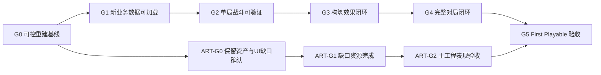

# First Playable 开发路线总览

> 状态：开发路线已按“旧业务重建”重新规划  
> 当前项目：`D:\unity\UnityProject\GameDesinger`  
> Unity：2022.3.62f3  
> 开发投入基准：个人程序开发每周约 20 小时；美术资源制作单独统计  
> 本文不是 OpenSpec 实现方案，也不提前替代测试用例。

## 目的

本计划把已经确认的 First Playable 策划转成可执行的重建顺序，回答：

1. 哪些旧业务必须先隔离和清理。
2. 哪些框架、场景和美术资产可以安全保留。
3. 新业务合同、数据、代码、UI 和测试应按什么依赖顺序建立。
4. 每个里程碑达到什么结果后，才能继续下一阶段。

## 当前判断

上一轮六人纯 PVP 重构形成了可运行技术切片，但此后玩法合同发生了实质变化。当前业务代码、业务 DataTable、Gameplay Catalog、Runtime Asset Catalog 和旧测试不能继续视为产品基线。

本次不做整个 Unity 工程推倒重来。保留 GF_X 框架、Launch、OasisCity、交互物品和已经确认的美术资产；在其上重建 First Playable 业务层，并在新链路逐域接管后清理旧链路。

## 版本边界

### 本计划包含

- 旧业务代码、数据、配置、UI 入口、测试和资源键的审计与分阶段清理。
- 新的六人三队、本地真人 + Bot、五轮流程、四次缩圈和测试撤离闭环。
- 150 生命、单步枪、准星直射命中扫描、弱点、闪避、倒地救援和观战。
- P01/P02 × 六部位的 12 个效果、独立冷却、`PhaseEpoch`、事件队列和成果归因。
- 三层火/冰/雷、三种反应、颜料经济、构筑情报和队友颜料请求。
- MainMenu、HUD、构筑、情报、资源请求、倒地/观战、暂停、设置和结果 UI。
- Bot 行为、业务配置、运行时资源索引、自动化、诊断、人工试玩和调参记录。
- 已完成并导入的场景、交互物、UI、纹身和表现资源的接入复验，以及尚未制作的正式角色和实际覆盖缺口的并行补齐。

### 本计划不包含

- Enemy、PVE、Encounter、EnemyLoot、Boss 和正式 Boss 撤离。
- 高阶资源、Boss 贡献强化和击杀者特殊效果。
- 实际后端联机、房间、匹配、账号、重连和反作弊。
- 多武器、角色选择、角色固有技能、P03～P08 体验卡和局外成长。
- 未经重新设计的旧玩法兼容层。

## 保留、替换和删除原则

| 类型 | 处理方式 |
|---|---|
| GF_X、ScriptsBuiltin、Launch 与通用诊断 | 保留并复验，不写入产品业务 |
| `Assets/Game` 中现存美术资产 | 全部保留并视为已确认导入，只复验运行时接口和策划覆盖，不重新判定美术状态 |
| 正式角色资源 | 当前不存在，登记为尚未制作；不得用旧二维角色或不存在的 3D Prefab 冒充 |
| `Sprites/UI/FirstPlayable` 已制作 UI | 全部保留；按新信息架构核对覆盖，只补目录中不存在的页面和状态 |
| 现有业务服务、合同、模型和 UI Presenter | 作为迁移参考；新骨架接管后分域删除 |
| 业务 DataTable、Gameplay/Asset Catalog | 按新合同重建，不延续旧字段兼容层 |
| 旧 EditMode、PlayMode 和诊断 | 保留可复用夹具，替换旧规则断言 |
| Enemy/PVE、多武器、旧角色选择与旧商店等残留 | 零引用后物理清理 |

## 开发阶段

具体任务数和工时以《第一版开发任务表.xlsx》的公式统计为准。

| 阶段 | 里程碑 | 阶段目标 |
|---|---|---|
| 阶段0 现状收容 | G0 可控重建基线 | 冻结保留资产，建立旧业务清单、引用地图、删除门和新业务目录骨架 |
| 阶段1 新合同与数据 | G1 新业务数据可加载 | 新领域模型、InputModule 语义、配置表、资源索引和校验器形成可运行骨架 |
| 阶段2 角色与枪战 | G2 单局战斗可验证 | 六人三队、准星直射步枪、伤害弱点、动画闪避、倒地救援和基础 Bot 成立 |
| 阶段3 纹身与元素 | G3 构筑效果闭环 | 12 效果、独立冷却、事件队列、元素反应、PhaseEpoch 和成果归因成立 |
| 阶段4 五轮与资源 | G4 完整对局闭环 | 构筑情报、颜料请求、地图拾取、五轮缩圈、测试撤离和结果返回成立 |
| 阶段5 UI与玩法验证 | G5 First Playable 验收 | 全部 UI、Bot 体验、资源接入、清理、自动化、诊断和人工试玩共同通过 |

## 关键路径

## 里程碑验收门

### G0 可控重建基线

- 保留资产、旧业务域、序列化引用、数据来源和测试覆盖均有清单。
- 新业务目录与程序集边界确定，产品业务不进入 `ScriptsBuiltin`。
- 每类旧内容都有替代任务和删除门，不执行无回滚证据的批量删除。
- Launch、OasisCity 和保留 Prefab 能在未改业务规则的情况下通过基础健康检查。

### G1 新业务数据可加载

- 新领域合同不引用 Enemy/PVE、多武器、角色选择和旧技能模型。
- 所有真人按键语义经过 InputModule；Bot 通过命令 Provider 进入相同业务入口。
- 新业务 DataTable/Catalog 可以加载，非法 ID、引用、数值和范围会明确失败。
- 旧业务表与新表不存在双重权威。

### G2 单局战斗可验证

- 6 名参赛者稳定形成 3 支双人队，同队无友伤。
- 步枪按住连射、准星直射、无吸附/随机散布/穿透；150 生命与 1.5 倍头部弱点正确。
- 4 米闪避按动画事件开关无敌并触发左腿效果入口，旧回调不能跨阶段生效。
- 倒地、处决、救援、观战和 Bot 基础战斗通过自动化与 PlayMode smoke。

### G3 构筑效果闭环

- P01/P02 六部位共 12 个效果和 12 项独立冷却均由配置驱动。
- 左臂技能激活、确认和取消输入正确，P01/P02 目标规则和遮挡一致。
- 火、冰、雷三层状态、衰减、反应和多方归因可以确定性复现。
- 进入构筑后旧 `PhaseEpoch` 延迟逻辑失效，临时状态清除且不会漏掉迟到回调。

### G4 完整对局闭环

- 从 MainMenu 进入 OpeningBuild，完整经历五轮、四次缩圈、四次后续构筑并进入 Result。
- 构筑情报、成果、基础/局内属性、颜料请求和原子转移正确。
- 地图拾取按配置和 seed 刷新，测试撤离通过 InputModule 解锁并结束本地对局。
- 返回菜单后无上一局状态、对象、事件、UI 或资源残留。

### G5 First Playable 验收

- 当前版本所需 UI、角色、场景、纹身、武器、动画和 VFX 均已存在、接入并通过可读性检查；其中正式角色与动画在资源制作完成前明确阻塞本验收项。
- 旧业务脚本、表、枚举、资源键、测试和入口达到零引用清理门。
- EditMode、PlayMode、20 局 Bot 稳定性、固定 seed、GF_X 全量诊断和结构化证据通过。
- 至少完成多轮人工试玩，记录构筑选择、反制、元素、救援、撤离、TTK 和理解问题。
- 自动化与人工结果共同证明结构完整；若玩法问题明显，只能标记技术切片完成，不能宣称玩法验证成功。

## 美术并行路线

### ART-G0 保留资产与 UI 缺口确认

- 登记并复验 `Assets/Game` 中现存的 OasisCity、交互物、纹身、UI、Shader/VFX 和其它美术资源；现存资源不再进入“不采用/待确认”分类。
- 将正式角色及其它策划要求但工程中不存在的内容登记为“尚未制作”，建立实际覆盖缺口清单。
- 冻结逻辑根、锚点、碰撞、材质、动画事件和 UI 运行时插槽合同。

### ART-G1 缺口资源完成

- 只生产当前 First Playable 缺少或不符合新信息架构的 UI、图标、动画、VFX 和声音。
- 场景和交互物品不重复制作；只有复验失败时安排局部修正。
- 资源按页面或战斗反馈域完成后立即分批接入，不等待整包完成。

### ART-G2 主工程表现验收

- 正式资源绑定真实运行状态，并完成分辨率、材质、Shader、动画事件、性能和可读性验收。
- 视觉替换不能改变玩法逻辑、事件时序和数据合同。

## 推荐执行方式

1. 每次只把一个程序里程碑作为当前目标，同时允许满足依赖的美术任务并行。
2. 从任务表选择依赖已完成的 2～5 项内聚任务组成一个 OpenSpec。
3. 清理类 OpenSpec 必须同时包含替代入口、引用审计、删除动作和回归验证。
4. 单项达到 DoD 后报告“待验收”；任务表由用户本人更新。
5. 每个里程碑结束执行一次完整验收门，不能靠单个测试替代。

## 主要风险

- 旧业务虽然能运行，但其合同与新策划不同；复用过多会形成隐性兼容层和长期双权威。
- 先删除后重建容易造成 Prefab/Scene Missing Script、GUID 丢失和大面积测试失效。
- 12 个效果与元素事件时序交叉，是当前最高复杂度业务模块。
- `PhaseEpoch`、动画事件和异步表现如果没有统一失效规则，跨轮迟到回调会产生难复现问题。
- `Sprites/UI/FirstPlayable` 中现存 UI 已确认可用；风险只来自页面/状态覆盖不足或运行时接线偏差，不得再用旧 UI 台账推翻其验收状态。
- 单开发者在程序、UI、数据、测试和美术接入间切换成本高，必须按里程碑与并行组批处理。
- 自动 Bot 只能证明稳定性，不能替代真人对构筑反制和信息可读性的判断。

## 与测试用例的边界

本计划只提供任务 DoD 和阶段验收门。正式的输入、前置状态、操作步骤、预期结果和回归矩阵在相关任务进入 OpenSpec 后，根据当时的最新策划单独建立。
