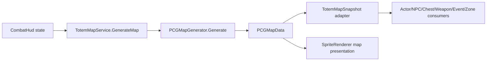

# Design: PCG 地图运行时接入

## 接入策略

PCG 不作为第二套地图系统并存，而是作为 `TotemMapService` 的地图生成后端。

## 数据适配

- PCG 逻辑格：`64 x 64`。
- 当前战斗地形格：`100 x 100`，`4m` 每格，地图尺寸继续读取 `MapTemplateConfig` 的 `400m`。
- 地形映射：
  - `water` -> `Blocked`
  - `mud` -> `Slow`
  - `forest_ground` -> `Cover`
  - `corruption` -> `Hazard`
  - `danger_zone` 内一部分可行走格 -> `Hazard`
  - 其它可行走格 -> `Ground`
- PCG 中 `Occupied` 的阻挡对象会进入当前地形网格的 `Blocked` 语义，让移动/AI/锚点查询共享同一套阻挡判断。

## 锚点策略

继续保留当前 16 个锚点契约，下游系统不改：

- 玩家：`team_spawn`
- Boss：`danger_zone`
- 纹身师：`loot_zone`
- 商人：`combat_zone`
- 宝箱/资源/事件/敌人：继续由 `BuildAnchorPlacements` 在对应房间附近 deterministic jitter，并通过 `ResolveWalkableAnchorPosition` 保证落在可行走格。

## 表现策略

- 地表 cell 使用 `TerrainTileSetCatalog` 的 sliced terrain assets。
- 对象/POI 使用 `WorldObjectCatalog`。
- 示例中缺失的旧可选 transition/decal/mask 资源会被运行时跳过，不创建洋红占位，也不计入基础缺图错误。
- 基础地表或站立对象缺失仍记入 `pcgMissingSpriteCount`，诊断必须失败。

## 降级策略

如果 PCG catalog 缺失或 JSON 解析失败，`TotemMapService` 会回退到旧确定性布局并输出 `GFTrace.Warning("TotemMap", "PCG.FallbackToLegacyLayout")`。正式诊断要求 `IsPcgGenerated == true`，所以回退不会被视为通过。

