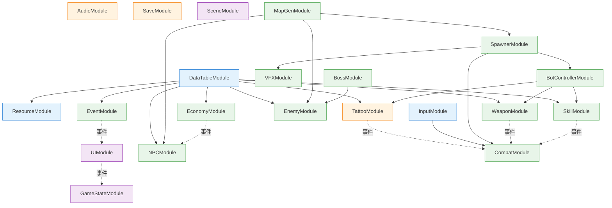

# CONTRACT — 05-gdd-v2-full-design-docs

> **骨架契约**：Phase B-1 主对话产出，B-3/B-4 实施期间**锁死签名**，仅允许往里加新条目，不许改已有签名。
> **作用**：33 份文档的"接口契约"——15 系统 GDD 引用本文档定义事件，16 模块详设按本文档实现。
> **更新策略**：B-4 期间若发现新事件 / 新依赖，**主对话 review 后追加**，不允许 Agent 自行改。

---

## 一、全局事件总表

> 命名规范：所有事件类后缀为 `Event`；订阅方法名以 `On` 开头。
> 文件位置（未来实现时）：`Assets/Scripts/Events/<主题>Events.cs`。

### 1.1 战斗触发事件（input 类）

```csharp
class AttackHitEvent      { Actor Attacker; Target Target; float BaseDamage; int WeaponId; }
class CritHitEvent        { Actor Attacker; Target Target; float BaseDamage; int WeaponId; }
class DamagedEvent        { Actor Victim;   Actor Attacker; float Damage; ElementType Element; }
class SkillCastEvent      { Actor Caster;   int SlotIndex; string SkillId; Target AimTarget; }
class DodgePressedEvent   { Actor Performer; Vector2 Direction; }
class MoveTickEvent       { Actor Mover; Target[] Path; float Distance; }
class ChargedAttackEvent  { Actor Attacker; Target Target; float ChargeRatio; float BaseDamage; int WeaponId; }
// WeaponId 追加：让 VFXModule/AudioModule/EnemyModule 能根据武器类型选择击中效果/音效/弹道。
// 追加日期：2026-06-25（B-3 第 3 批 03-武器系统 GDD 阶段，主对话 review 后追加）
```

> ⚠️ **变化点 vs v1**：所有战斗事件加入 `Actor` 字段——v1 假定只有玩家发起，v2 50 actor 同场，必须区分发起者。

### 1.2 战斗结果事件

```csharp
class EffectAppliedEvent  { IReadOnlyList<EffectResult> Results; Actor SourceActor; }
class TargetKilledEvent   { Target Target; Actor Killer; }
class ActorDiedEvent      { Actor DeadActor; Actor Killer; Vector3 DeathPos; }
class CombatEndedEvent    { Actor Winner; CombatEndReason Reason; }
class VFXTriggerEvent     { /* 已存在 — 加 Actor Source 字段 */ }
```

### 1.3 Build / 装备事件

```csharp
class BuildChangedEvent       { Actor Owner; IReadOnlyList<TattooSlot> Equipped; }
class PassiveRecomputedEvent  { Actor Owner; PassiveStats Stats; }
class TattooEquippedEvent     { Actor Owner; TattooSlot NewSlot; }
class TattooClearedEvent      { Actor Owner; }
class SkillSlotChangedEvent   { Actor Owner; int SlotIndex; int OldSkillId; int NewSkillId; }
// === v2.1 修订（2026-06-25 grill 共识 #2-3-7）：玩家自纹身读条 + 词缀附魔 ===
class TattooInProgressEvent   { Actor Owner; int PartId; int ColorId; int PatternId; float DurationSec; }
class TattooFinishedEvent     { Actor Owner; TattooSlot NewSlot; }
class TattooCancelledEvent    { Actor Owner; CancelReason Reason; }
// CancelReason 枚举：Damaged / Moved / Killed / UserAbort
class TattooEnchantedEvent    { Actor Owner; TattooSlot Slot; List<TattooAffix> NewAffixes; int CostCoin; int CostRareInk; }
class RequestSelfTattooEvent  { Actor Requester; int PartId; int ColorId; int PatternId; }
// RequestSelfTattooEvent：玩家或智能 Bot 发起自纹身请求，TattooModule 监听并启动读条状态机。
// 追加日期：2026-06-25（B-3 16-BotControllerModule 详设阶段，主对话 review 后追加）
// === v2.1 修订：死亡宝箱包含配方拓本 ===
class DeathChestRecipeTakenEvent { Actor Looter; int RecipeId; bool LocalRunOnly; }
// SkillSlotChangedEvent 追加：玩家或 Bot 替换技能槽时，HUD 刷新图标 / Bot 重新评估策略。
// 追加日期：2026-06-25（B-4 04-SkillModule 详设阶段，主对话 review 后追加）
```

### 1.4 经济与拾取事件

```csharp
class CoinChangedEvent        { Actor Owner; int Delta; int NewTotal; CoinChangeReason Reason; }
class ItemPickedEvent         { Actor Picker; int ItemId; int Count; }
class ChestOpenedEvent        { Actor Opener; ChestType Type; LootRollResult Roll; }
class DeathChestSpawnedEvent  { Actor DeadActor; Vector3 Pos; List<int> ItemIds; List<int> TempRecipeIds; }
// v2.1：TempRecipeIds = 死亡玩家身上已刻纹身对应配方的一半（向下取整），仅本局可用（拓本）
class DeathChestLootedEvent   { Actor Looter; Actor DeadActor; }
class AmmoChangedEvent        { Actor Owner; int WeaponId; int OldAmmo; int NewAmmo; }
// AmmoChangedEvent 追加：远程武器弹药变化。供 HUD 实时显示、AudioModule 触发"空弹"音效。
// 追加日期：2026-06-25（B-4 03-WeaponModule 详设阶段，主对话 review 后追加）
```

### 1.5 NPC 事件

```csharp
class NPCInteractStartEvent  { Actor Interactor; NPCRef Npc; }
class TattooSessionEndEvent  { Actor Customer; TattooSlot NewSlot; int CostCoin; }
class ShopPurchaseEvent      { Actor Buyer; int ItemId; int CostCoin; }
class ShopRefreshEvent       { NPCRef Shop; List<int> NewStock; }
```

### 1.6 地图事件

```csharp
class MapGeneratedEvent      { int Seed; MapTheme Theme; List<RoomInfo> Rooms; }
class RoomEnteredEvent       { Actor Enterer; RoomRef Room; }
class ZoneShrinkPhaseEvent   { int PhaseIndex; Vector2 NewCenter; float NewRadius; float Duration; }
class OutsideZoneTickEvent   { Actor Victim; float TickDamage; }
```

### 1.7 事件房与三选一

```csharp
class RoomEventTriggeredEvent { Actor Enterer; RoomEventId Id; }
class ThreeChoiceShownEvent   { Actor Chooser; ThreeChoiceOption[] Options; }
class ThreeChoiceMadeEvent    { Actor Chooser; int SelectedIndex; ThreeChoiceOption Selected; }
```

### 1.8 AI 决策事件

```csharp
class BotDecisionMadeEvent   { Actor Bot; BotDecisionType Type; object Payload; }
class BotBuildPlannedEvent   { Actor Bot; List<TattooSlot> PlannedBuild; }
class BotTargetChangedEvent  { Actor Bot; Target NewTarget; }
class BotLODChangedEvent     { Actor Bot; LODBucket OldBucket; LODBucket NewBucket; }
// LODBucket 枚举：SmartInView / SmartOutView / LightInView / LightOutView
// 用途：qa debug overlay / VFX LOD 切换订阅 / Audio 远近声场切换
// 追加日期：2026-06-25（B-4 16-BotControllerModule 详设阶段，主对话 review 后追加）
```

### 1.9 局/Run 事件

```csharp
class GameReadyEvent       { }
class RunStartedEvent      { Actor PlayerActor; int Seed; MapTheme Theme; }
class RunEndedEvent        { Actor PlayerActor; bool Win; RunStats Stats; }
class PlayerDiedEvent      { /* 复用已有 — 加 Actor Killer 字段 */ }
```

### 1.10 怪物 / Boss 事件

```csharp
class EnemySpawnedEvent       { Actor Enemy; EnemyTier Tier; RoomRef SpawnRoom; }
class BossSpawnedEvent        { Actor Boss; int BossId; RoomRef SpawnRoom; }
class BossPhaseChangedEvent   { Actor Boss; int OldPhase; int NewPhase; float HpRatio; }
// 追加日期：2026-06-25（B-4 第 3 批 08-EnemyModule+BossModule 详设阶段，主对话 review 后追加）
// EnemyTier 枚举：Light / Elite / Boss
```

### 1.11 输入语义（已有）

```csharp
class InputAttackEvent { }
class InputSkillEvent  { int SlotIndex; }
class InputDodgeEvent  { Vector2 Direction; }
class InputInteractEvent { }  // E 键
```

---

## 二、模块依赖图



**规则**：
- 实线 = Dependencies 数组依赖（初始化顺序）
- 虚线 = 运行时通过 EventBus 通信，**不**进 Dependencies

---

## 三、IPlayerController 抽象接口

> **核心契约**：玩家与所有 actor（人 / AI / 未来网络回放）共用本接口，**业务模块永不感知背后是谁在驱动**。
> 文件位置（未来实现时）：`Assets/Scripts/Modules/Combat/IPlayerController.cs`。

```csharp
public interface IPlayerController
{
    // ===== 移动与瞄准 =====
    Vector2 GetMoveInput();        // 期望移动方向（-1..1 normalized）
    Target  GetAimTarget();        // 当前瞄准目标（人=鼠标指向, AI=AI 估算, 网络=回放）
    Vector3 GetFacingDirection();  // 朝向（与 move 分离，支持背身射击）

    // ===== 主动行为意图（每帧轮询，由 CombatModule 消费）=====
    bool ShouldAttack();           // 普攻
    bool ShouldChargedAttack();    // 蓄力满 + 松开 → true 一帧
    bool ShouldDodge();
    bool ShouldUseSkill(int slot); // 多技能槽，slot 0/1/2
    bool ShouldInteract();         // E 拾取 / NPC

    // ===== Build 决策（低频，由 BotControllerModule / 玩家 UI 触发）=====
    bool ShouldEquipNewTattoo(out int partId, out int colorId, out int patternId);
    bool ShouldPurchase(out int itemId);

    // ===== Actor 标识 =====
    Actor OwnerActor { get; }
    PlayerControllerType Type { get; } // Human / SmartBot / LightBot / NetworkReplay
}

public enum PlayerControllerType { Human, SmartBot, LightBot, NetworkReplay }
```

### 三种实现策略（本期实现前两种 + 占位第三种）

| 实现 | 何时驱动 | LOD |
|---|---|---|
| `HumanPlayerController` | InputModule 轮询 | 每帧 |
| `SmartBotPlayerController` | BotControllerModule (8-10 个智能 AI) | 视野内每帧 / 视野外 0.5s |
| `LightBotPlayerController` | BotControllerModule (40 个轻量 AI) | 视野内 0.2s / 视野外 2s |
| `NetworkPlayerController` | **本期占位**，未来真联机用 | 60Hz tick |

---

## 四、50 actor 性能预算

| 项 | 预算 | 备注 |
|---|---|---|
| AI 决策频率 — 视野内智能 | 60 Hz（每帧） | 不超过 8-10 个 |
| AI 决策频率 — 视野外智能 | 2 Hz（0.5s） | |
| AI 决策频率 — 视野内轻量 | 5 Hz（0.2s） | |
| AI 决策频率 — 视野外轻量 | 0.5 Hz（2s） | |
| Tattoo 计算预算 | < 0.1ms/actor/decision | EffectContext 不 alloc |
| VFX 并存上限 | 64 实例 | 已有 32 基础上扩 |
| Pathfinding | NavMesh + simplified grid | 50 actor × pathfind 不超过 2ms/帧 |
| GC 总预算 | < 100KB/秒 | 全模块共担 |
| 帧目标 | 60fps (16.7ms/帧) | PC，移动端单算 |

### 视野定义

「视野内」= actor 与玩家距离 ≤ 20m。该值可在 `BotControllerConfig.json` 调整。

### LOD 切换规则

- actor 进 / 出视野时 BotControllerModule 切换决策频率
- 切换时已存在的 build / 装备状态不变
- 不要在切换瞬间触发 `BuildChanged` 事件（仅 LOD 变化，不算行为）

---

## 五、AI 装备纹身的数据通路

智能 AI 与玩家**走完全相同的 `TattooModule.Equip(partId, colorId, patternId)` API**。区别在于：

| 玩家 | 智能 AI |
|---|---|
| UI dropdown 选完 → Equip | `SmartBotPlayerController.ShouldEquipNewTattoo` 返回 true → Equip |
| 配方限制 = 玩家拥有的颜料 | 配方限制 = AI 等级（按 Run 进度脱钩）|
| 决策频率 = 玩家操作 | 决策频率 = `BotBuildPlanner.RethinkInterval`（≈ 30s）|

→ `BotBuildPlanner` 是独立子系统，输入"AI 已拥有 build + 当前局势" → 输出"下一个想刻的槽"，与 `TattooModule` 完全解耦。

---

## 六、状态与版本

| 字段 | 值 |
|---|---|
| Contract 版本 | v1.0 |
| 锁死日期 | 2026-06-25（Phase B-1 完成时刻） |
| 解锁条件 | 仅主对话 review 后允许 append（不允许 mutate） |
| 当前 watermark | 50+ 事件类 / 16 模块 / 4 个 controller type / 50 actor 预算 |

---

## 七、引用

- [proposal.md](./proposal.md) §一（为什么做）
- [design.md](./design.md) §三（CONTRACT 骨架 4 段说明）
- [brainstorm.md](./brainstorm.md) §阶段 A 5 条
- [.claude/AGENTS.md](../../../.claude/AGENTS.md) 模式 5
