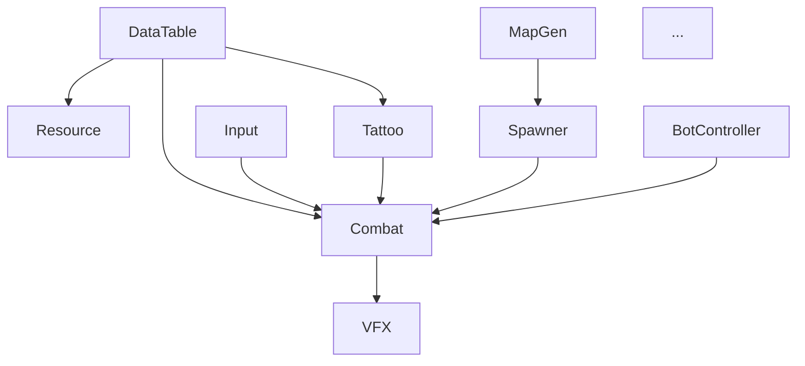

# Design — 05-gdd-v2-full-design-docs

> 本文档不是策划案本体，而是**「33 份文档生产的元设计」**——文档结构、命名规范、引用关系、多 Agent 调度策略。

---

## 一、产出目录结构

所有文档落到 `项目知识库（AI自行维护）/GDD-v2/`：

```
项目知识库（AI自行维护）/GDD-v2/
├─ 00-总策划案v2.md                      ← 1 篇 producer + gd-lead
├─ systems/                              ← 15 篇 系统 GDD（玩家视角）
│  ├─ 01-纹身构筑系统.md
│  ├─ 02-战斗手感.md
│  ├─ 03-武器系统.md
│  ├─ 04-主动技能.md
│  ├─ 05-闪避与身法.md
│  ├─ 06-角色设定与骨架.md
│  ├─ 07-地图生成.md
│  ├─ 08-宝箱与探财节奏.md
│  ├─ 09-纹身师与商人NPC.md
│  ├─ 10-事件与三选一.md
│  ├─ 11-怪物与Boss.md
│  ├─ 12-数值平衡与曲线.md
│  ├─ 13-UI与HUD.md
│  ├─ 14-音效与环境音.md
│  └─ 15-世界观与轻剧情.md
└─ modules/                              ← 16 篇 模块详设（工程视角）
   ├─ 01-TattooModule.md  (基于已交付代码 + 50 actor 补强)
   ├─ 02-CombatModule.md  (基于已交付代码 + 50 actor 补强)
   ├─ 03-WeaponModule.md  (新建)
   ├─ 04-SkillModule.md   (新建)
   ├─ 05-InputModule.md   (基于已有 + IPlayerController 抽象)
   ├─ 06-SpawnerModule.md (基于已交付代码 + 50 actor 补强)
   ├─ 07-MapGenModule.md  (新建)
   ├─ 08-EnemyModule+BossModule.md (新建)
   ├─ 09-NPCModule.md     (新建)
   ├─ 10-EventModule.md   (新建)
   ├─ 11-EconomyModule.md (新建)
   ├─ 12-UIModule+各UIForm.md (基于已有 + 新增表单清单)
   ├─ 13-AudioModule.md   (新建)
   ├─ 14-SaveModule.md    (新建)
   ├─ 15-VFXModule.md     (基于已交付代码 + 50 actor 补强)
   └─ 16-BotControllerModule.md (新建,核心)
```

`openspec/changes/05-gdd-v2-full-design-docs/CONTRACT.md` 仍留在本 change 目录，作为骨架契约（Phase B-1 主对话产出，B-3/B-4 实施期间锁死，B-4 末尾视情况补充）。

---

## 二、文档统一格式

### 2.1 系统 GDD 模板（玩家视角）

每份 `systems/NN-*.md` 应至少含以下 8 节：

```markdown
# NN-<系统名>

> **主导 Agent**: gd-lead / gd-system / ...
> **协作 Agent**: ...
> **依赖系统**: 01-纹身 / 06-角色 ...
> **被依赖系统**: 02-战斗手感 / 12-数值平衡 ...

## 一、玩家体验目标（30 秒读懂）
## 二、核心机制（状态机 / 公式 / 表）
## 三、与其它系统的耦合点
## 四、数值与配置（DataTable schema 草案）
## 五、UX / UI 触点
## 六、AI 行为侧需求（智能 AI 是否要懂这个系统）
## 七、风险与开放问题
## 八、引用与依赖文档链接
```

**篇幅区间**：500–2000 字。超过的拆子文档放 `systems/<NN-*>/` 子目录。

### 2.2 模块详设模板（工程视角）

每份 `modules/NN-*.md` 应至少含以下 9 节：

```markdown
# NN-<ModuleName> 模块详设

> **主导 Agent**: client-lead / client-unity / client-ta
> **对应系统 GDD**: ../systems/XX-*.md
> **当前代码状态**: 新建 / 已存在(路径) / 已存在需补强

## 一、模块职责一句话
## 二、IGameModule 接口签名
   - ModuleCategory: 0/1/2/3
   - Dependencies: [其他模块]
## 三、订阅的事件 / 发布的事件（全签名）
## 四、DataTable Schema（JSON 字段定义）
## 五、与其他模块的交互序列（Mermaid 时序图或文字版）
## 六、50 actor 性能预算（决策频率 / 内存 / GC）
## 七、伪联机 → 真联机的迁移点
## 八、测试策略（EditMode / PlayMode 各一例）
## 九、风险与开放问题
```

**篇幅区间**：800–2500 字。

### 2.3 总策划案 v2

`00-总策划案v2.md` 是入口文档，含：

- 一句话核心概念
- 设计基本盘（沿用 v1 表格，更新 5 条 Phase A 共识）
- 核心差异化 USP（4 项：纹身构筑 / 死亡宝箱 / 多元末日 / 伪联机分级 AI）
- 玩家旅程图（FTUE 第 1 局到第 10 局的成长心智）
- 系统 GDD 索引（15 篇链接）
- 模块详设索引（16 篇链接）
- CONTRACT 链接
- 修订记录

**篇幅区间**：1500–3000 字。

---

## 三、CONTRACT.md 骨架（B-1 阶段主对话写）

包含 4 大段：

### 3.1 全局事件总表

列出所有跨模块事件类（预估 50+ 个），按主题分组：

```
战斗触发: AttackHitEvent / CritHitEvent / DamagedEvent / SkillCastEvent / DodgePressedEvent / MoveTickEvent
战斗结果: EffectAppliedEvent / TargetKilledEvent / ActorDiedEvent / CombatEndedEvent
Build:    BuildChangedEvent / PassiveRecomputedEvent
经济:     CoinChangedEvent / ItemPickedEvent / ChestOpenedEvent / DeathChestSpawnedEvent
NPC:      NPCInteractStartEvent / TattooSessionEndEvent / ShopPurchaseEvent
地图:     ZoneShrinkEvent / MapGeneratedEvent / RoomEnteredEvent
事件:     RoomEventTriggeredEvent / ThreeChoiceShownEvent
VFX:      VFXTriggerEvent (已存在)
AI:       BotDecisionMadeEvent / BotBuildPlannedEvent
Game:     GameReadyEvent / RunStartedEvent / RunEndedEvent
```

**Step 2 严禁修改这里的签名**，仅可往里加新事件。

### 3.2 模块依赖图（Mermaid）



明确：
- ModuleCategory 0/1/2/3 分层
- 哪些模块互相依赖（Dependencies 数组）
- 哪些模块**不能**互相依赖（运行时通过 EventBus 通信）

### 3.3 IPlayerController 抽象接口

```csharp
public interface IPlayerController
{
    Vector2 GetMoveInput();        // 移动方向
    bool ShouldAttack();           // 是否攻击
    bool ShouldDodge();
    bool ShouldUseSkill(int slot);
    Target GetAimTarget();         // 瞄准目标（玩家=鼠标指向, AI=AI 决策, 网络=回放）
    int GetWantedTattooSlot();     // 想刻第几个槽（AI 玩家也可以刻纹身）
}
```

三种实现：
- `HumanPlayerController` — 接 InputModule
- `BotPlayerController` — 接 BotControllerModule（智能 + 轻量两个子类）
- `NetworkPlayerController` — **本期不写**，但接口预留

### 3.4 50 actor 性能预算

| 项 | 预算 |
|---|---|
| AI 决策频率 — 视野内智能 | 每帧 |
| AI 决策频率 — 视野外智能 | 每 0.5s |
| AI 决策频率 — 视野内轻量 | 每 0.2s |
| AI 决策频率 — 视野外轻量 | 每 2s |
| Tattoo 计算预算 | < 0.1ms/actor/decision |
| VFX 并存上限 | 64 个实例（已有 32 基础上扩） |
| Pathfinding | AI 用 NavMesh + 简化网格 |
| GC | 每秒 < 100KB allocation |

---

## 四、多 Agent 调度策略

按 [AGENTS.md](../../../.claude/AGENTS.md) 模式 5。

### 4.1 骨架先行（B-1，主对话）

- proposal / design / tasks / brainstorm 已就位
- CONTRACT.md 骨架本阶段产出

### 4.2 总策划案 v2（B-2，单 Agent）

- 调 `gd-lead`（主）+ `producer` review
- 这是**入口文档**，必须先于 15 系统 GDD 写完，否则系统之间没有"为什么这样划分"

### 4.3 15 系统 GDD（B-3，DAG 并行）

按依赖图分批：

**第 1 批（无依赖，可并行）**：
- 01-纹身构筑（gd-lead，沿用已有 05B v2）
- 06-角色设定与骨架（gd-lead）
- 15-世界观与轻剧情（gd-lead）

**第 2 批（依赖第 1 批）**：
- 02-战斗手感（gd-lead，依赖 01 + 06）
- 11-怪物与 Boss（gd-system，依赖 06）
- 12-数值平衡（gd-system，依赖 01 + 02 + 03 + 04 + 11）

**第 3 批（依赖第 2 批）**：
- 03-武器系统（gd-system，依赖 02）
- 04-主动技能（gd-system，依赖 02）
- 05-闪避与身法（gd-system，依赖 02）

**第 4 批（最后并行）**：
- 07-地图生成（level-designer）
- 08-宝箱与探财节奏（gd-system，依赖 07）
- 09-纹身师 / 商人 NPC（gd-system，依赖 07 + 08）
- 10-事件与三选一（gd-system，依赖 07）
- 13-UI / HUD（art-ui，依赖前 12 篇）
- 14-音效与环境音（art-director，依赖前 12 篇）

每批之间显式 `await`，每批内部用 `WhenAll` 并行。

### 4.4 16 模块详设（B-4，并行 Fan-Out）

模块详设之间通过 CONTRACT.md 解耦，可全部并行。

调用 `client-lead`（架构敏感模块）+ `client-unity`（实现敏感模块）+ `client-ta`（VFX）三类 Agent，依任务分配。

### 4.5 验证与归档（B-5，主对话）

- 跨文档引用一致性 check（mermaid 图与目录链接对得上）
- INDEX.md 同步
- `openspec verify-change` + 手工 archive

---

## 五、不打断条件再确认

按 CLAUDE.md §五 Phase B「例外打断条件」：

| 触发情况 | 处理 |
|---|---|
| 与 Phase A 共识冲突 | 立即停 + AskUserQuestion 弹窗对齐 |
| 引入不可逆变更 | 立即停 + 弹窗 |
| 触及 `.claude/` / `openspec/` 模板 / `Assets/Scripts/Core/` | 立即停 + 弹窗 |
| **其他模糊点**（命名、内部结构、未在 v1 GDD 出现的细节） | **自决**，写日志 + 备注 |

文档中遇到的"⭐⭐⭐ 8 项未决问题"中**未与 Phase A 共识冲突的**，Agent 直接给出"推荐方案 + 替代方案 + 取舍"写进文档"风险与开放问题"节，**不打断用户**。
