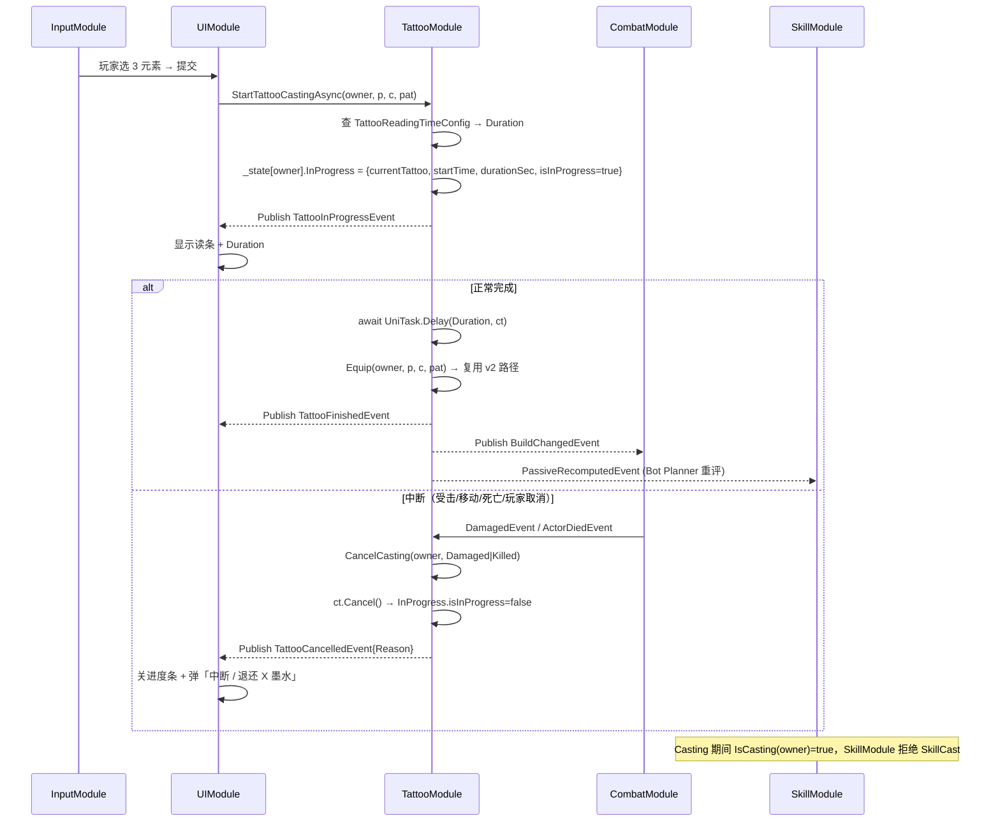
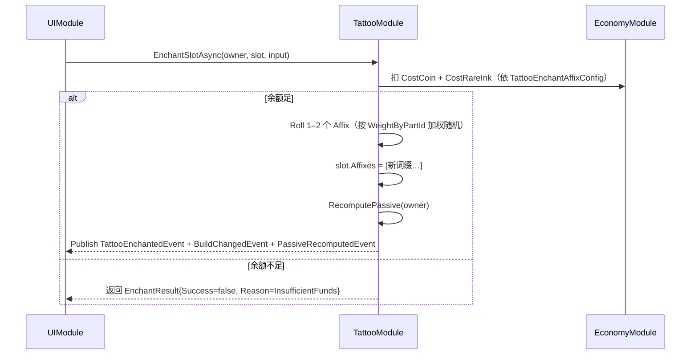

# 01-TattooModule 模块详设

> **版本**: v2.1 ｜ **修订日期**: 2026-06-25
> **主导 Agent**: client-lead
> **对应系统 GDD**: ../systems/01-纹身构筑系统.md
> **当前代码状态**: 已存在（[Assets/Scripts/Modules/Tattoo/TattooModule.cs](../../../Assets/Scripts/Modules/Tattoo/TattooModule.cs)），需 50 actor 补强 + v2.1 新增 InProgress 状态机与 Affix 数据结构（不破坏 v2 已交付的 Equip API）
> **依赖契约**: [CONTRACT.md](../../../openspec/changes/05-gdd-v2-full-design-docs/CONTRACT.md) §1.3（含 4 条 v2.1 新事件）/ §3 IPlayerController / §4 性能预算

> **v2.1 修订摘要**：
> 1. 新增 `InProgressTattoo` 状态机：玩家自纹身改为 3–8s **读条** Cast（受击 / 移动 / 死亡 / 玩家主动取消会中断）。NPC 纹身师走 `NPCTattooSession`，与本状态机正交。
> 2. CONTRACT §1.3 新增 4 条事件：`TattooInProgressEvent` / `TattooFinishedEvent` / `TattooCancelledEvent` / `TattooEnchantedEvent`。
> 3. 新增 **Affix（词缀）**数据结构：每个 `TattooSlot` 可挂 0–2 个 Affix；`Affix.Apply(magnitude)` 与 `ElementBehavior.ModifyMagnitude` 同链执行。
> 4. 与 04-SkillModule 协调两处（详 §三 / §五）：自纹身读条期间禁用 `SkillCastEvent`；附魔成功后 `BuildChangedEvent` 触发 SkillModule 重评 Bot 决策。
> 5. **TattooModule.Equip API 签名不动** —— v2.1 仅在 API 外层加 UX 加层（`StartTattooCastingAsync`），v2 已交付代码兼容。

---

## 一、模块职责（一句话）

承载「6 部位 × 7 颜色 × 8 图案 × 0–2 词缀 = 336 + Affix 组合」的运行时行为：装备 Build / 重算被动 / 监听 6 个战斗事件 / 调用 Part·Element·Shape·**Affix** 四层策略产出 `EffectAppliedEvent` 与 `VFXTriggerEvent`；v2.1 新增玩家自纹身读条状态机（`InProgressTattoo`）与词缀附魔流程；**不**承担伤害判定（归 CombatModule）、渲染（归 VFXModule）与 UI 进度条绘制（归 UIModule）。

---

## 二、IGameModule 接口签名

```csharp
public sealed class TattooModule : IGameModule {
    public int    ModuleCategory => 1;                              // 配置/数据层
    public Type[] Dependencies   => new[] { typeof(DataTableModule) };
    public TattooModule(ModuleRunner runner, EventBus bus);
    public UniTask InitializeAsync(CancellationToken ct = default); // 注册 21 策略 + 读 7 张表（含 v2.1 新增 2 张），不发事件
    public UniTask ShutdownAsync (CancellationToken ct = default);

    // v2 已交付（不动，兼容 v1 调用方）
    public bool Equip(Actor owner, int partId, int colorId, int patternId);
    public void Clear(Actor owner);

    // v2.1 新增（UX 加层，封装读条 + 中断 + 完成）
    public UniTask<EquipResult> StartTattooCastingAsync(
        Actor owner, int partId, int colorId, int patternId, CancellationToken ct);
    public bool CancelCasting(Actor owner, CancelReason reason);

    // v2.1 新增（词缀附魔）
    public UniTask<EnchantResult> EnchantSlotAsync(
        Actor owner, TattooSlot slot, EnchantInput input, CancellationToken ct);
}
```

`StartTattooCastingAsync` 内部按 `TattooReadingTimeConfig` 查 Duration，启动 `InProgressTattoo` 状态机；完成才调用既有 `Equip(owner,p,c,pat)`，保证 336 枚举测试不破。`InitializeAsync` 仍同步完成（`UniTask.CompletedTask`），严守「InitAsync 不发事件」戒律——所有新事件仅在状态机迁移点发布。

---

## 三、订阅 / 发布事件全签名

### 3.1 订阅（`[EventHandler]`，v2 共 6 条 + v2.1 加 2 条）

```csharp
// v2 已有
[EventHandler] void OnAttackHit   (AttackHitEvent    e);   // → RightArm
[EventHandler] void OnCritHit     (CritHitEvent      e);   // → Head
[EventHandler] void OnDamaged     (DamagedEvent      e);   // → Torso   + v2.1: 触发 InProgress 中断检查
[EventHandler] void OnSkillCast   (SkillCastEvent    e);   // → LeftArm + v2.1: 在 Casting 状态下被 Predicate 拒绝
[EventHandler] void OnDodgePressed(DodgePressedEvent e);   // → LeftLeg
[EventHandler] void OnMoveTick    (MoveTickEvent     e);   // → RightLeg + v2.1: 位移 > Threshold 时触发 Cancel(Moved)

// v2.1 新增
[EventHandler] void OnActorDied   (ActorDiedEvent    e);   // 如果 Owner 死亡 → 强制 Cancel(Killed)
```

> v2 升级点延续：6 个事件已携带 `Actor` 字段；TattooModule 按 `e.Actor` 路由到对应 `PlayerState`。v2.1 在 `OnDamaged / OnMoveTick / OnActorDied` 三个 handler 顶部增加 InProgress 状态检查分支——若该 Owner 处于 Casting，依条件 `CancelCasting(owner, Damaged|Moved|Killed)`。

### 3.2 发布（v2 共 4 条 + v2.1 加 4 条）

```csharp
// v2 已有
BuildChangedEvent       { Actor Owner; IReadOnlyList<TattooSlot> Equipped; }
PassiveRecomputedEvent  { Actor Owner; PassiveStats Stats; }
EffectAppliedEvent      { IReadOnlyList<EffectResult> Results; Actor SourceActor; }
VFXTriggerEvent         { Actor Source; string Part/Element/Shape; Target Primary; Target[] Nearby; float Magnitude; bool Intercepted; }

// v2.1 新增（CONTRACT §1.3 已落账）
TattooInProgressEvent   { Actor Owner; int PartId; int ColorId; int PatternId; float DurationSec; }
TattooFinishedEvent     { Actor Owner; TattooSlot NewSlot; }
TattooCancelledEvent    { Actor Owner; CancelReason Reason; }                  // CancelReason: Damaged/Moved/Killed/UserAbort
TattooEnchantedEvent    { Actor Owner; TattooSlot Slot; List<TattooAffix> NewAffixes; int CostCoin; int CostRareInk; }
```

`TattooFinishedEvent` 与既有 `BuildChangedEvent` **同帧顺序**发布（先 Finished → 后 BuildChanged → 后 PassiveRecomputed），下游订阅者按事件语义自决：UIModule 监听 Finished 关闭进度条，SkillModule 监听 BuildChanged 重评 Bot 决策。

### 3.3 与 04-SkillModule 协调（2 处）

| # | 协调点 | 实现位置 |
|---|---|---|
| C1 | **Casting 期间禁用技能释放**：SkillModule 在 `OnSkillCastRequest` 内调 `TattooModule.IsCasting(owner)` 谓词；为 true 则发 `SkillCastRejectedEvent{Reason=TattooCasting}`，HUD 提示「正在纹身」 | SkillModule 侧调用 / TattooModule 侧暴露 `public bool IsCasting(Actor)` |
| C2 | **附魔后 Bot 重评**：`TattooEnchantedEvent` 之后紧跟 `BuildChangedEvent`；SkillModule 中 BotBuildPlanner 订阅 BuildChanged 即可，无需直接订阅 Enchant | 复用既有事件总线，零额外耦合 |

---

## 四、DataTable Schema（v2 5 张 + v2.1 新增 2 张 = 7 张）

| 表 | 主键 | 关键字段 | 来源 / 状态 |
|---|---|---|---|
| **TattooPartConfig** | Id 1-6 | `Name`, `TriggerEvent`, `ScaleStat`, `SymmetryGroup`, `ScaleFactor`, `PassiveDimension` | [TattooPartConfig.json](../../../Assets/Resources/DataTable/TattooPartConfig.json)（v2 已交付） |
| **TattooColorConfig** | Id 1-7 | `Name`, `Element`, `ColorMultiplier` | v2 已交付 |
| **TattooPatternConfig** | Id 1-8 | `Name`, `Shape`, `PatternMultiplier` | v2 已交付 |
| **TattooElementConfig** | Id 1-7 | `Name`, `BaseMultiplier`, `Param1..3` | v2 已交付 |
| **TattooShapeConfig** | Id 1-8 | `Name`, `Param1..3` | v2 已交付 |
| **TattooReadingTimeConfig** ★v2.1 | `(PartId, ColorId, PatternId)` 复合键 | `BaseDurationSec`（3.0–8.0）, `RarityModifier`（按 Element 稀有度乘 0.8–1.5）, `CancelRefundRate`（0–0.5，取消后退还墨水比例） | 新建 [TattooReadingTimeConfig.json](../../../Assets/Resources/DataTable/TattooReadingTimeConfig.json) |
| **TattooEnchantAffixConfig** ★v2.1 | AffixId 1-N | `Name`, `Tier`（普通/稀有/史诗）, `Tag`（Offensive/Defensive/Utility）, `Magnitude`, `ApplyTiming`（PreElement/PostShape/Final）, `WeightByPartId[6]`, `CostCoin`, `CostRareInk` | 新建 [TattooEnchantAffixConfig.json](../../../Assets/Resources/DataTable/TattooEnchantAffixConfig.json) |

部位 × 元素 × 形状 × Affix 四层策略仍以 `Name` 为索引（`_partBehaviors / _elementBehaviors / _shapeBehaviors / _affixBehaviors` 字典）。`TattooSlot` 数据结构升级：

```csharp
public sealed class TattooSlot {
    public int PartId, ColorId, PatternId;
    public List<TattooAffix> Affixes;        // v2.1 新增：0–2 个，null 表示未附魔
}
public sealed class TattooAffix {
    public int AffixId;
    public AffixTiming ApplyTiming;          // PreElement / PostShape / Final
    public float Magnitude;
}
```

`Affix.Apply` 嵌入既有 `Fire` 链：`Part.PrepareContext → Affix[PreElement].Apply → Element.ModifyMagnitude → Shape.Apply → Affix[PostShape].Apply → Element.AffectSelf → Affix[Final].Apply`。三个 Timing 让词缀可以分别作用在元素增益前 / 形态扩散后 / 最终结算前，避免词缀与元素之间隐式耦合。

---

## 五、与其他模块的交互序列

### 5.1 玩家自纹身读条流程（v2.1 新增）



### 5.2 词缀附魔流程（v2.1 新增）



### 5.3 战斗触发链（v2 既有，词缀注入点已标）

参 v2 文档 §五，新增 4 个 Affix 注入点（见 §四），其余不变。`PendingTrigger` 跨事件传递语义保持。

---

## 六、50 actor 性能预算（v2.1 增补）

| 项 | 单 actor | 50 actor 满载 | v2.1 增量 |
|---|---|---|---|
| Tattoo 计算 / 决策 | <0.1ms | 视野内智能 8×60Hz = 480 calls/s ≈ <0.5ms/帧 | Affix 链增 0.02ms/call，可忽略 |
| GC alloc / 帧 | 0 | 0 | InProgress 状态机用 struct + 复用 `CancellationTokenSource`（每 actor 1 个），不增量 |
| Casting 任务 | — | 50 actor × 1 in-flight `UniTask.Delay`，60 任务/秒峰值 | UniTask 池化机制保证零 alloc |
| `_state[owner].InProgress` 字段 | 24B（struct） | 1.2KB | 可忽略 |
| Affix 字段（每 slot 2 个 × 平均 5 槽） | 80B | 4KB | 可忽略 |
| VFXTriggerEvent | ≤8 / 帧 | ≤64 / 帧（CONTRACT §4 上限） | 不变 |

补强项延续 v2：`ListPool<TattooSlot>` / `ObjectPool<EffectContext>` / `ArrayPool` for `NearbyTargets`。

**新增预算注意**：
- `StartTattooCastingAsync` 中 `await UniTask.Delay(Duration, ct)` **必须**传入 `_state[owner].CastingCts.Token`，禁止用 `destroyCancellationToken` 之外的其它 token——OnDestroy 时统一 Cancel。
- 中断检查放在 `OnDamaged / OnMoveTick / OnActorDied` 顶部，单次开销 = 1 次字典查找 + 1 次 bool 判断，0 alloc。

---

## 七、伪联机 → 真联机迁移点（v2.1 修订）

CONTRACT §3 已锁死：玩家与所有 Bot 都走 `IPlayerController` 与 `TattooModule.Equip(owner, p, c, pat)`；v2.1 的 `StartTattooCastingAsync` 是 UX 包装，**仅玩家**用，Bot 走 `Equip` 即时刻。

| 阶段 | Equip 触发源 | 网络消息 |
|---|---|---|
| 单机 / 伪联机（本期） | 玩家 → `StartTattooCastingAsync` + 读条；Bot → `Equip` 即时（由 `BotBuildPlanner` 决策） | 无 |
| 真联机（未来） | 玩家 → 本地读条 → 完成时 Send `RequestEquip{owner,p,c,pat}` → 服务端验权 → 广播 `TattooEquippedEvent` | TattooInProgressEvent/Cancelled 仅本地广播给 UI；Finished/Enchanted 需服务端权威 |

→ TattooModule 本身**零改动**即可上联机；`InProgressTattoo` 状态机是纯客户端体验加层，不进同步包。

---

## 八、测试策略（v2.1 增补 4 个 PlayMode 用例）

### 已有覆盖（不动）

- [Tattoo336EnumerationTests.cs](../../../Assets/Tests/EditMode/Tattoo336EnumerationTests.cs)：6×7×8 = 336 种 build 单实例枚举触发各事件。v2.1 因 `Equip` 签名不变，零修改。
- v2 新增的 3 个 PlayMode 用例（50 actor 并发 / GC 预算 / PendingTrigger 隔离）保留。

### v2.1 新增（PlayMode）

| 用例 | 目的 |
|---|---|
| `Tattoo_Casting_CompletesAndPublishesFinished` | 启动 5s Cast，等待 6s，断言收到 `TattooInProgressEvent` → `TattooFinishedEvent` → `BuildChangedEvent` 顺序正确。 |
| `Tattoo_Casting_DamageInterrupt` | Casting 中 3s 时发 `DamagedEvent{Victim=Owner}`，断言 `TattooCancelledEvent{Reason=Damaged}` 立即发出且 `Equip` 未被调用。 |
| `Tattoo_Casting_MoveInterrupt` | Casting 中位移超过 Threshold，断言 `TattooCancelledEvent{Reason=Moved}`。 |
| `Tattoo_Enchant_AffixApplyChain` | 给一个 slot 加 PreElement / PostShape / Final 各 1 词缀，Fire AttackHitEvent，断言 `EffectResult.Magnitude` 等于手算的 4 层链式乘积（误差 < 1e-4）。 |

### 测试位置

- EditMode：`Assets/Tests/EditMode/`（现有）
- PlayMode：`Assets/Tests/PlayMode/Tattoo50ActorTests.cs`（v2）+ `Tattoo21CastingAndAffixTests.cs`（v2.1 新建）

---

## 九、风险与开放问题（v2.1 更新）

| # | 风险 | 应对 |
|---|---|---|
| R1（v2 延续） | v1 整个 `TattooModule` 假设单玩家 | Adapter 策略沿用，336 枚举测试不破。 |
| R2（v2 延续） | `EffectContext` 每次 `Fire` new | `ObjectPool<EffectContext>` + 明确 Reset。 |
| R3（v2 延续） | `ConsumePendingTrigger` O(n) | actor ≤ 5 PendingTrigger 时忽略，超阈值改 `RingBuffer`。 |
| **R5 ★v2.1** | Casting 中**频繁微位移**（玩家手抖 / 物理推挤）可能误触发 Cancel | `OnMoveTick` 累积位移 ≥ `MoveCancelThreshold = 0.3m` 才取消；同时给「站桩」状态机一个 0.5s 容忍窗（CONTRACT 未约束，写入 TattooModule 内部常量并加注释）。 |
| **R6 ★v2.1** | Casting 期间 Owner 死亡，`ActorDiedEvent` 与 `UniTask.Delay` 完成竞态 | `CancellationToken.IsCancellationRequested` 判定优先；`StartTattooCastingAsync` 在 `Delay` 后立即 `ct.ThrowIfCancellationRequested()` 才调 `Equip`，确保死亡帧不会刻成。 |
| **R7 ★v2.1** | 词缀稀有度对玩家「保底感」的影响未明 | EnchantSlotAsync 内置「连续 3 次纯白 Affix 后下一次必出稀有」保底；写入 `TattooEnchantAffixConfig.PityCounter` 字段（玩家级，存档持久）。 |
| **R8 ★v2.1** | Affix.ApplyTiming 与既有 PartBehavior 的执行顺序协议需文档化 | 在 [Strategies/README.md](../../../Assets/Scripts/Modules/Tattoo/Strategies/) 顶部加「Fire Pipeline 6 阶段图」，与本节 §四 链路一致。 |
| R4（v2 延续） | 远端 actor 装备同步带宽 | v2.1 Affix 加成本：`TattooEquippedEvent` 改 `(owner, partId, colorId, patternId, affixIds[2])` = 16 字节，仍 ≤ 5KB / actor 满装。 |
| O1（v2 延续） | 玩家热替换 SO 配置 | Equip 时拷贝策略引用快照；Affix 同理。 |
| O2（v2 延续） | `SynergyCalculator` 50 actor 缓存策略 | 已迁 `_state[owner]` 内挂版本号，Equip / Enchant 时递增。 |
| **O3 ★v2.1** | `StartTattooCastingAsync` 是否允许在 Run 外（大厅）调用？ | 当前限定 Run 内（防止大厅刷资源）；待 14-LobbyModule 详设确认是否开放「赛前预刻」UX。 |

---

## 引用

- [CONTRACT.md §1.3 / §3 / §4](../../../openspec/changes/05-gdd-v2-full-design-docs/CONTRACT.md)
- [TattooModule.cs](../../../Assets/Scripts/Modules/Tattoo/TattooModule.cs)
- [TattooEvents.cs](../../../Assets/Scripts/Events/TattooEvents.cs)
- [Strategies/](../../../Assets/Scripts/Modules/Tattoo/Strategies/)（21 个策略类，v2.1 新增 Affix 策略目录）
- [Tattoo336EnumerationTests.cs](../../../Assets/Tests/EditMode/Tattoo336EnumerationTests.cs)
- 系统 GDD：[01-纹身构筑系统.md](../systems/01-纹身构筑系统.md)
- 同级模块：[04-SkillModule.md](./04-SkillModule.md)（C1/C2 协调点）
- v1 草案：[05B-三层原子系统设计v2.md](../../raw/初版GDD-2026-06/05B-三层原子系统设计v2.md)
