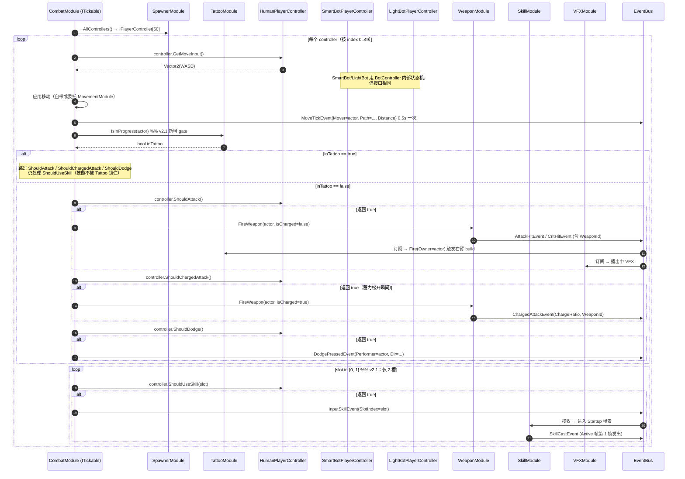
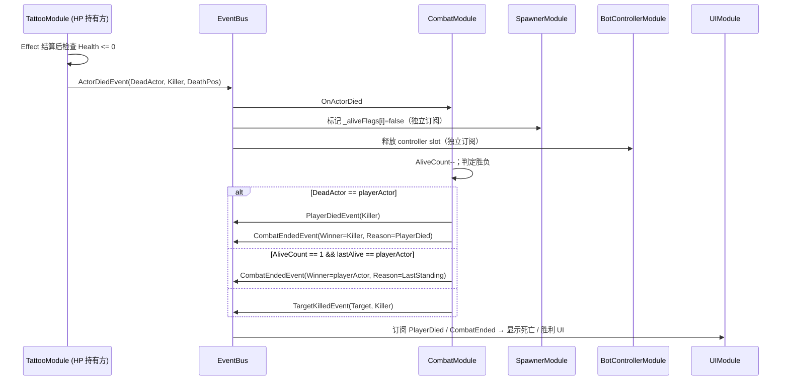

# 02-CombatModule 模块详设

> **版本**: v2.1 ｜ **修订日期**: 2026-06-25

> **主导 Agent**: client-lead
> **对应系统 GDD**: ../systems/02-战斗与判定.md（输入 → 事件链路）/ ../systems/06-角色设定与骨架.md（actor 抽象）
> **当前代码状态**: 已存在 [`Assets/Scripts/Modules/Combat/CombatModule.cs`](../../../Assets/Scripts/Modules/Combat/CombatModule.cs)；v2 关键改造点 = OnUpdate 重构为遍历所有 `IPlayerController`，不再直接持有 `InputModule`。
> **CONTRACT**: [../../../openspec/changes/05-gdd-v2-full-design-docs/CONTRACT.md](../../../openspec/changes/05-gdd-v2-full-design-docs/CONTRACT.md) §1.1 / §1.2 / §3 / §4

---

## v2.1 修订摘要

| 改动项 | v2.0 | v2.1 | 影响范围 |
|---|---|---|---|
| 技能槽数量 | 3 槽（slot ∈ 0/1/2） | **2 槽**（slot ∈ 0/1） | §三 InputSkillEvent / §五 OnUpdate 循环 / §八 单测 |
| Tattoo 刻入期禁操作 | 未约束 | **TattooInProgress 期间跳过 ShouldAttack / ShouldDodge** | §五 主循环新增前置 gate / §三 不新增事件 |
| 50 actor 配比 | 9 智能 + 40 轻量 + 1 玩家 | **20 智能 + 29 轻量 + 1 玩家** | §六 性能预算重算 |
| 单局时长 | 未在本模块约束 | **10–15 min**（CombatTuningConfig 同步） | §四 新增 4 个时长字段 |

---

## 一、模块职责一句话

驱动战斗主循环：**每帧遍历全部 50 个 `IPlayerController`**，把每个 actor 的意图（移动 / 普攻 / 蓄力 / 闪避 / 技能 / 拾取）翻译成 CONTRACT §1.1 战斗触发事件，下游 `WeaponModule / SkillModule / TattooModule` 接力执行；同时监听 `EffectAppliedEvent / ActorDiedEvent` 判定击杀与战斗终结——**永不区分意图背后是人、SmartBot 还是 NetworkPlayer**。v2.1 起新增「TattooInProgress gate」：刻纹身期间的 actor 在主循环里被跳过攻击 / 闪避意图判定，但移动与瞄准照常处理。

> **v2 关键升级 vs v1**：
> - v1 `OnUpdate` 直接 `_input.IsAttackPressed()`，硬编码玩家 1 人；v2 改为 `foreach controller in _spawner.AllControllers() { controller.ShouldAttack() ... }`。
> - v1 暴击 `Random.value < 0.25f` 写死；v2 走 `CombatTuningConfig.CritChance` + Tattoo Passive 加成。
> - v1 击杀判定扫 `_spawner.Enemies`；v2 改为订阅 `ActorDiedEvent`（由其他模块判定 HP≤0 后统一发布），CombatModule 只统计胜负。
> - **v2.1**：技能槽 3→2、Tattoo 刻入期禁攻击 / 禁闪避、50 actor 配比改为 20 智能 + 29 轻量 + 1 玩家、单局时长 10–15 min。

## 二、IGameModule 接口签名

```csharp
public sealed class CombatModule : IGameModule, ITickable
{
    public int ModuleCategory => 3;          // Cat-3 业务系统层
    public Type[] Dependencies => new[]
    {
        typeof(TattooModule),     // 读 Stats / 触发 Fire / 查询 IsInProgress(actor)
        typeof(SpawnerModule),    // 拿 AllControllers() / PlayerActor
        typeof(WeaponModule),     // FireWeapon(actor, isCharged)
        typeof(SkillModule),      // 通过 InputSkillEvent 触发（事件解耦但前置就绪）
    };
    // 注意：v2 已**移除** typeof(InputModule)——改造主战场
}
```

> **为什么移除 InputModule 依赖**：CONTRACT §3 明确 `InputModule` 只服务 `HumanPlayerController`。CombatModule 直接调 `InputModule` 等于强行让所有 actor 共用键鼠状态——这是 v1 单玩家假设的直接体现，v2 50 actor 同场必须切断这条线。
> **为什么 SkillModule 进 Dependencies**：尽管运行时走事件触发，但初始化阶段需要确保技能槽数据可读（actor `ActorSpawnedEvent` 时校验初始技能配置）；保留具体类型依赖符合 [.claude/CLAUDE.md §十二](../../../.claude/CLAUDE.md)「Dependencies 必须是具体类型」。
> **为什么 WeaponModule 进 Dependencies**：CombatModule 在普攻意图触发时同步调 `WeaponModule.FireWeapon(actor, isCharged)`，不能等事件——避免「玩家点击 → 发 Input 事件 → WeaponModule 订阅 → 再 spawn 飞行物」的两帧延迟。
> **v2.1 TattooModule 依赖语义扩展**：v2.0 仅用 TattooModule 读 Stats / 触发 Fire；v2.1 起新增 `TattooModule.IsInProgress(actor) → bool` 查询点，CombatModule 主循环在判定 ShouldAttack / ShouldDodge 前先查询，**零事件 / 同步只读**——符合「行为走事件、数据走 `GetModule<T>`」。

## 三、订阅 / 发布事件全签名

### 3.1 发布（CONTRACT §1.1 / §1.2 / §1.9 已锁签名）

```csharp
// 战斗触发（每帧从 controller 意图转译）
AttackHitEvent      { Actor Attacker; Target Target; float BaseDamage; int WeaponId; }
CritHitEvent        { Actor Attacker; Target Target; float BaseDamage; int WeaponId; }
ChargedAttackEvent  { Actor Attacker; Target Target; float ChargeRatio; float BaseDamage; int WeaponId; }
DodgePressedEvent   { Actor Performer; Vector2 Direction; }
MoveTickEvent       { Actor Mover; Target[] Path; float Distance; }
// 注意：MoveTickEvent 的 Target[] 复用 ArrayPool，订阅方禁止异步持有

// 战斗结果（监听 ActorDiedEvent 聚合判定后发布）
TargetKilledEvent   { Target Target; Actor Killer; }     // 个体击杀
PlayerDiedEvent     { Actor Killer; }                    // 玩家专属，触发死亡 UI
CombatEndedEvent    { Actor Winner; CombatEndReason Reason; }  // 全局战斗终结

// 输入语义转发（仅对 SkillModule，CONTRACT §1.11）
InputSkillEvent     { int SlotIndex; }   // v2.1: SlotIndex ∈ {0, 1}，禁止 2/3
// 注意：CombatModule 是 InputSkillEvent 的唯一发布者；
// 不发 InputAttackEvent/InputDodgeEvent—— CombatModule 自己就是普攻/闪避语义的归宿。
```

> **v2.1 SlotIndex 值域收紧**：v2.0 SlotIndex ∈ {0,1,2}；v2.1 起合法值仅 {0, 1}。`IPlayerController.ShouldUseSkill(int slot)` 实现方收到 `slot == 2` 应**直接返回 false**（守护测试覆盖），CombatModule 主循环只会传 0 与 1。SkillModule 订阅侧若收到 `SlotIndex >= 2` 必须 `FrameworkLogger.Error` 并丢弃，**不抛异常**——防止 v2→v2.1 迁移期残留代码炸服。

### 3.2 订阅（`[EventHandler]`）

```csharp
// 上游伤害结算反馈：用于 UI 飘字 / 音效，不在此判定击杀
[EventHandler] void OnEffectApplied(EffectAppliedEvent e);
//   → MVP 仅做日志；后续可触发 HitStop / 屏幕抖动钩子

// 上游死亡通知：累计击杀数 + 判定全局胜负
[EventHandler] void OnActorDied(ActorDiedEvent e);
//   → 若 e.DeadActor == playerActor → 发 PlayerDiedEvent + CombatEnded(false)
//   → 若 AliveCount == 1 且仅剩 playerActor → 发 CombatEnded(true)
//   → 否则发 TargetKilledEvent（供 BotControllerModule 重选目标）
```

> **关键设计**：CombatModule **不自己判定 HP≤0**。v1 在 `OnEffectApplied` 里扫 `_spawner.Enemies` 检查 `Health<=0`，v2 改为由「持有 HP 的模块」（推测是 TattooModule 的 Target / 未来 HealthModule）发 `ActorDiedEvent`。这避免了 50 actor 同帧死亡时的重复触发与状态竞争。
> **v2.1 不新增 Tattoo 相关事件**：TattooInProgress 状态查询走 `GetModule<TattooModule>().IsInProgress(actor)` 同步读取，**不**新增 `TattooStartedEvent / TattooEndedEvent` 的订阅——CombatModule 没有「Tattoo 状态变更瞬间」的业务，只需要每帧 gate 时的当前值。新增订阅只会增加无意义的状态机复杂度。

## 四、DataTable Schema

### 4.1 `CombatTuningConfig.json`（单行配置表，全局战斗手感参数）

```json
{
  "table": "CombatTuningConfig",
  "fields": [
    { "name": "ConfigId",           "type": "int",   "comment": "固定为 1，单行表" },
    { "name": "BaseCritChance",     "type": "float", "comment": "基础暴击率 0..1，默认 0.10" },
    { "name": "CritDamageMul",      "type": "float", "comment": "暴击伤害倍率，默认 1.5" },
    { "name": "MoveTickInterval",   "type": "float", "comment": "MoveTick 触发间隔(秒)，默认 0.5" },
    { "name": "MoveTickRadius",     "type": "float", "comment": "Path 收集半径(m)，默认 3.0" },
    { "name": "MoveTickMaxTargets", "type": "int",   "comment": "Path 最大目标数，默认 4" },
    { "name": "AttackAimRadius",    "type": "float", "comment": "自动锁敌半径(m)，默认 8.0" },
    { "name": "ChargeMinRatio",     "type": "float", "comment": "蓄力最低有效占比，默认 0.3" },
    { "name": "DodgeIFrameMs",      "type": "int",   "comment": "闪避无敌帧时长，默认 250ms" },
    { "name": "SkillSlotCount",     "type": "int",   "comment": "v2.1 新增：技能槽数量，固定 2，CombatModule 与 SkillModule 共读" },
    { "name": "RunMinDurationSec",  "type": "float", "comment": "v2.1 新增：单局最短预期 600s（10min），用于 BotController LOD 与压力测试基线" },
    { "name": "RunMaxDurationSec",  "type": "float", "comment": "v2.1 新增：单局最长预期 900s（15min），超出由 GameStateModule 强制收尾" },
    { "name": "RunTargetMedianSec", "type": "float", "comment": "v2.1 新增：目标中位时长 750s（12.5min），数值组调参基准" },
    { "name": "TattooLockoutEnable","type": "bool",  "comment": "v2.1 新增：是否启用 Tattoo 刻入期禁攻 / 禁闪避，默认 true" }
  ]
}
```

> **取自 [systems/02-战斗手感与判定.md](../systems/02-战斗与判定.md)**：本表是该 GDD「数值表」一节的实例落地。任何调参先改 JSON，再 Unity 菜单 `Tools/DataTable/生成全部配置表代码`，**禁止硬编码**——v1 的 `0.25f` 暴击率正是这种硬编码的反面教材。
> **为什么单行表**：所有字段都是「整局唯一」的全局参数，与 actor 个体无关；个体加成（如 Tattoo Passive 提供的 `+CritChance`）在运行时叠加，不入此表。
> **v2.1 时长字段为何放本表而不是 RunConfig**：本期没有独立 `RunConfig.json`；CombatModule 是「单局节奏」的最强相关方（决定 AI 决策频率 / 死亡判定 / 胜负发布），把 10–15 min 三件套放这里，BotControllerModule / GameStateModule 直接 `GetModule<DataTableModule>().Get<CombatTuningConfig>(1)` 共读，避免在多张表里散落同一组参数。

## 五、与其他模块的交互序列

### 5.1 OnUpdate 每帧主循环（v2.1 新链路）



**关键契约**：
- **不区分 controller 类型**：循环体内只看 `IPlayerController` 接口，玩家与 49 个 bot 走完全相同的代码路径，符合 [CONTRACT §3](../../../openspec/changes/05-gdd-v2-full-design-docs/CONTRACT.md#三iplayercontroller-抽象接口) 「业务模块永不感知背后是谁」。
- **普攻同步调 WeaponModule**：避免双层事件迂回；技能走事件（SkillModule 内部 Startup → Active 有帧表延迟，本就异步）。
- **击杀判定外移**：循环体内**不**检查 HP，全靠 `ActorDiedEvent` 反向通知，避免 50 × N 次扫描。
- **v2.1 Tattoo gate 顺序**：移动 / MoveTick 在 gate **之前**——刻纹身期间角色仍可被动位移与产出 Path（用于 AI 视野），但主动战斗意图全部抑制。技能 `ShouldUseSkill` 放 gate **之外**：技能在 v2.1 设计里是「逃生 / 终结」按钮，被 Tattoo 锁住会破坏「玩家敢于在僵局中下注一次纹身」的爽快感；锁攻 + 不锁技能是「冒险点位 = 放弃 DPS 但保留 burst」的清晰契约。
- **v2.1 技能槽循环常量化**：`{0, 1}` 直接硬编码于循环边界——若未来扩槽数必须同步改 CombatTuningConfig.SkillSlotCount 与本循环，守护测试 `Codebase_SkillSlotCount_EqualsTwo` 在两处都加断言。

### 5.2 死亡链路（订阅侧）



## 六、50 actor 性能预算（v2.1 配比重算）

**v2.1 actor 配比**：1 玩家 + 20 智能 bot + 29 轻量 bot = 50。相比 v2.0 的 9/40，智能 bot 翻倍多于一倍——CPU 压力主要落在 SmartBot 决策与寻路，而非 CombatModule 主循环（虚调用成本对所有 controller 一致）。

| 项 | 频率 | v2.0 预算 | **v2.1 预算** |
|---|---|---|---|
| OnUpdate 主循环 | 60Hz | < 2.0 ms / 帧 | **< 2.2 ms / 帧** |
| 50 个 `IPlayerController` 接口调用 | 50 × 5~6 方法 / 帧 ≈ 300 次 | < 0.5 ms | **< 0.6 ms**（v2.1 多查 1 次 IsInProgress） |
| `TattooModule.IsInProgress(actor)` | 50 × 60Hz = 3000 次 / 秒 | — | **< 0.1 ms / 帧**（Dictionary lookup，O(1)） |
| `WeaponModule.FireWeapon` 同步调用 | 视野内开火 actor 数，估算 ≤8/帧 | < 0.8 ms | < 0.8 ms |
| `EventBus.Publish` 战斗事件 | 估算 ≤20/帧（开火 + 移动 tick） | < 0.3 ms | < 0.3 ms |
| `MoveTickEvent` Path 收集 | 50 × 0.5s = 100Hz 总频率 | < 0.4 ms | < 0.4 ms |
| GC alloc | 每帧 0 byte | 严格红线 | **严格红线**（不变） |

### 关键实现要点

1. **遍历用 `for (int i)` + 缓存 `Controllers.Count`**——禁止 `foreach` / LINQ，对齐 [16-BotControllerModule §6.3](./16-BotControllerModule.md#六50-actor-性能预算实现策略)。
2. **`AllControllers()` 不返回新数组**——`SpawnerModule` 内部维护 `IPlayerController[50]` 长度固定数组，OnUpdate 直接取引用，不 alloc。
3. **MoveTickEvent 的 `Target[] Path`**：`ArrayPool<Target>.Shared.Rent(MaxTargets)`，订阅方同步消费后归还；订阅方禁止异步持有（CONTRACT §1.1 注释）。
4. **AimTarget 缓存**：每个 actor 上一帧的 `AimTarget` 由 `IPlayerController.GetAimTarget()` 提供，CombatModule 不自己跑 K-NN——避免 50 × 50 = 2500 次距离计算。
5. **AliveCount 增量维护**：`OnActorDied` 时 `_aliveCount--`，禁止扫数组；初始 `_aliveCount = 50`。
6. **轻量 AI Tick 节流由 BotController 内部处理**：CombatModule 永远每帧调用 `ShouldAttack()`，但 LightBotPlayerController 内部按 LOD 节流（多数帧直接返回 false）——分摊责任符合 CONTRACT §3 LOD 切换由 BotControllerModule 负责的承诺。
7. **v2.1 IsInProgress 必须 O(1)**：TattooModule 内部需用 `HashSet<Actor>` 或 `bool[]` indexed-by-ActorId 实现，禁止 `Dictionary<Actor, TattooSession>` 全表查找。CombatModule 每帧调 50 次，O(n) 实现会直接吃掉 0.3 ms。
8. **v2.1 智能 bot 翻倍的预算外移**：CombatModule 本身只多 0.1 ms（IsInProgress 查询）；20 智能 bot 的决策树 / NavMesh 寻路成本完全落在 BotControllerModule，其单帧预算 v2.1 需从 1.5ms 上调至 **3.0ms**——CombatModule 详设不背这部分，但留作交接备注供 16-BotControllerModule v2.1 同步修订。

## 七、伪联机 → 真联机迁移点

CombatModule 是「全 actor 同质化」的最大受益者：

| 阶段 | OnUpdate 循环体 | 改造点 |
|---|---|---|
| 本期 单机 + 49 bot（20 智能 + 29 轻量） | `Controllers[0]` = Human，`[1..20]` = SmartBot，`[21..49]` = LightBot | 零 |
| 中期 4 人合作 | `[0..3]` = Human + Network 混合，`[4..49]` = Bot | **零**——`NetworkPlayerController` 实现 `IPlayerController` 即可 |
| 远期 BR PvP | `[0..7]` = NetworkPlayerController（远端 + 本机一份）+ 42 Bot | **零** |

**唯一变化**是 `SpawnerModule.AllControllers()` 返回的实现类型——CombatModule 完全不感知。这是 [CONTRACT §三](../../../openspec/changes/05-gdd-v2-full-design-docs/CONTRACT.md#三iplayercontroller-抽象接口)「业务模块永不感知背后是谁在驱动」的最强证据。

服务端权威化时，CombatModule 不再发 `AttackHitEvent`——改由服务端广播 `RemoteAttackHitEvent`，本模块订阅并转发本地 VFX/Tattoo——但**接口形状不变**，新增订阅而已。v2.1 的 Tattoo gate 在联机阶段同样无需改造：刻纹身瞬间由服务端判定，IsInProgress 查询本地缓存即可。

## 八、测试策略

### 8.1 EditMode 单测（`Assets/Tests/EditMode/Combat/CombatModuleTests.cs`）

```csharp
[Test] public void CombatModule_Dependencies_DoesNotIncludeInputModule();
//   → 守护测试：v2 改造完成后必须验证依赖清单不含 InputModule，防止回退

[Test] public void OnUpdate_AllControllersPolled_InIndexOrder();
//   → mock SpawnerModule 返回 3 个 fake controller，断言 GetMoveInput 按 index 0,1,2 顺序调用

[Test] public void ShouldAttack_True_FireWeaponCalledWithCorrectActor();
//   → fake controller_2.ShouldAttack=true，断言 WeaponModule.FireWeapon(actor=controller_2.Owner) 被调一次

[Test] public void OnActorDied_PlayerDied_PublishesPlayerDiedAndCombatEnded();
//   → 模拟 ActorDiedEvent(DeadActor=playerActor)，断言两个事件按顺序发布

[Test] public void OnActorDied_AllBotsDead_CombatEndedWithPlayerAsWinner();

[Test] public void MoveTickEvent_PathArray_ReturnedToArrayPool();
//   → 用 ArrayPool 包装类断言 Rent/Return 配对

// === v2.1 新增 ===
[Test] public void ShouldUseSkill_OnlyPolledForSlot0And1();
//   → mock controller 跟踪 ShouldUseSkill 调用历史，断言 slot 集合 == {0, 1}，无 2

[Test] public void InputSkillEvent_SlotIndexNeverExceedsOne();
//   → 跑 1000 帧主循环，捕获所有 InputSkillEvent，断言 max(SlotIndex) <= 1

[Test] public void Tattoo_InProgress_SkipsAttackAndDodge();
//   → fake TattooModule.IsInProgress(actor)=true，controller.ShouldAttack=true、ShouldDodge=true
//   → 断言：WeaponModule.FireWeapon 未被调；DodgePressedEvent 未发布

[Test] public void Tattoo_InProgress_StillProcessesMoveAndSkill();
//   → 同上但 ShouldUseSkill(0)=true，断言 InputSkillEvent(0) 仍发布；MoveTickEvent 仍触发

[Test] public void Tattoo_InProgress_ChargedAttackAlsoBlocked();
//   → ShouldChargedAttack=true + InProgress=true → ChargedAttackEvent 未发布

[Test] public void CombatTuningConfig_RunDuration_FieldsExist();
//   → 读 CombatTuningConfig.json，断言 RunMinDurationSec/RunMaxDurationSec/RunTargetMedianSec 存在且 600 <= median <= 900
```

### 8.2 PlayMode 集成测（`Assets/Tests/PlayMode/Combat/FiftyActorCombatTest.cs`）

复用 [16-BotControllerModule §8.2](./16-BotControllerModule.md#82-playmode-集成测assetstsestsplaymodebot50actorperftestcs) 的同一场景：

- 起场含 **1 玩家 + 20 SmartBot + 29 LightBot**（v2.1 配比）
- 30 秒自动对战（注：30s 仅为单测压力片段，远小于 RunTargetMedianSec=750s，仅验证主循环稳定性）
- 断言：
  - 平均 OnUpdate 耗时 < **2.2 ms**（`ProfilerRecorder` 采样，v2.1 上调）
  - GC alloc < 0 byte / OnUpdate 帧（用 `Allocator` profiler marker）
  - `CombatEndedEvent` 在 30s 内或正常发布或不触发，不卡在悬而未决状态
  - 至少有 5 次 `TargetKilledEvent` 触发（验证 AI 间互相击杀，非全靠玩家）
  - **v2.1 新增**：随机选 1 actor 在 t=10s 触发 `TattooModule.StartTattoo(actor)`，断言其在刻入期内 `AttackHitEvent` 来源不含该 actor

### 8.3 守护测试：CombatModule 不直接调 InputModule

```csharp
[Test] public void Codebase_CombatModule_DoesNotReferenceInputModule()
// 用 Roslyn 扫描 CombatModule.cs，断言：
// 1. 不含 "InputModule" 标识符
// 2. 不含 "_input" 字段
// 3. Dependencies 数组不含 typeof(InputModule)

[Test] public void Codebase_SkillSlotCount_EqualsTwo()
// v2.1 新增守护：
// 1. CombatModule.cs 内 ShouldUseSkill 调用循环边界为 2（{0, 1}）
// 2. CombatTuningConfig.SkillSlotCount == 2
// 3. 不存在 ShouldUseSkill(2) 调用
```

与 [05-InputModule §8.4](./05-InputModule.md#84-守护测试禁止跨模块调用) 形成双向围栏。

## 九、风险与开放问题

1. **当前代码 vs 目标态的迁移路径**：[CombatModule.cs:21](../../../Assets/Scripts/Modules/Combat/CombatModule.cs#L21) 的 Dependencies 含 `InputModule`，[L42-L102](../../../Assets/Scripts/Modules/Combat/CombatModule.cs#L42-L102) 整块 OnUpdate 假设单玩家。**推荐 Adapter 渐进迁移**：
   - Step 1：保留 `InputModule` 依赖，但抽出 `IPlayerController` 接口与 `HumanPlayerController` 实现（内部仍调 `_input`），CombatModule 改为遍历 `IPlayerController[]`，但数组目前只有 1 个 Human。
   - Step 2：SpawnerModule + BotControllerModule 落地，填入 49 个 Bot Controller（20 Smart + 29 Light）。
   - Step 3：移除 `InputModule` Dependencies，删 `_input` 字段，跑守护测试。
   - Step 4 (v2.1)：植入 `TattooModule.IsInProgress(actor)` gate + 技能槽收紧为 {0,1} + CombatTuningConfig 新增 5 字段。
   - 每步都可独立 PR + 独立测试，**避免一次性大改导致回归不可定位**。

2. **`Target` vs `Actor` 字段语义统一**：CONTRACT §1.1 `AttackHitEvent` 同时含 `Target Target` 和 `Actor Attacker`，但 v1 `Target` 也代表敌人。建议：`Actor` = 角色实体（含玩家与所有 bot），`Target` = 可被攻击的对象（可为环境物 / 宝箱 / actor 的 hitbox 引用）。该语义需在 systems/06 角色设定中固化。

3. **`HP 持有方` 归属未定**：当前 v1 `Target.Health` 直接挂在 `EntityRef.Target` 上，v2 是否抽出独立 `HealthModule`？**推荐**：保留 Target.Health 但由 TattooModule 在 `OnEffectApplied` 内统一判定 HP≤0 并发 `ActorDiedEvent`——避免引入新模块的复杂性。需要 01-TattooModule 详设确认。

4. **`InputSkillEvent` 与 `IPlayerController.ShouldUseSkill` 的双发风险**：CombatModule 是 `InputSkillEvent` 唯一发布者。**守护**：在 `HumanPlayerController` 单测中断言「不发任何 EventBus 事件」，所有事件均由 CombatModule 中转。

5. **蓄力普攻的「松开瞬间」语义**：`ShouldChargedAttack()` 按定义只在松开瞬间返回 true 一帧，bot controller 需内部模拟「按住-松开」状态。落到 16-BotControllerModule 实现细节，CombatModule 不特殊处理。

6. **CombatEndedEvent 与 RunEndedEvent 边界**：建议：`CombatEnded` = 战斗结算完成（可重开），`RunEnded` = 整局收尾（含奖励发放 / 存档 / 返回大厅），由上层 `GameStateModule` 在收到 CombatEnded 后再发 RunEnded。v2.1 时长字段 `RunMaxDurationSec=900s` 触发的强制收尾也走 GameStateModule，CombatModule 不持有计时器。

7. **v2.1 Tattoo gate 是否要广播事件**：当前设计 gate 命中后**静默跳过**，外部观察不到「这个 actor 因为刻纹身没攻击」。若 UI 需要显示「角色刻纹身中」状态，由 TattooModule 自己发 `TattooStartedEvent / TattooEndedEvent`——CombatModule 不发任何「跳过」事件，避免每帧 × 刻入中 actor 数 的事件污染。

8. **v2.1 技能 3→2 的迁移面**：现有代码 / DataTable / UI Prefab 若已有 slot=2 的引用需要扫一遍。守护测试 §8.3 覆盖代码侧，DataTable 与 Prefab 侧的清理在 12-UIModule v2.1 / 04-SkillModule v2.1 中跟进——CombatModule 详设不背锅，但留作交接备注。

---

## 引用

- [CONTRACT.md](../../../openspec/changes/05-gdd-v2-full-design-docs/CONTRACT.md) §1.1 / §1.2 / §1.9 / §3 / §4
- [Assets/Scripts/Modules/Combat/CombatModule.cs](../../../Assets/Scripts/Modules/Combat/CombatModule.cs)（待改造点，§九 风险 1 详述迁移路径）
- 同期模块详设：
  - [01-TattooModule.md](./01-TattooModule.md)（v2.1 需新增 `IsInProgress(actor)` 同步查询点）
  - [04-SkillModule.md](./04-SkillModule.md)（v2.1 需把槽数从 3 降至 2，SkillSlotCount 共读 CombatTuningConfig）
  - [05-InputModule.md](./05-InputModule.md)（IPlayerController 唯一合法消费者契约）
  - [16-BotControllerModule.md](./16-BotControllerModule.md)（v2.1 配比改 20 智能 + 29 轻量，单帧预算上调至 3.0ms）
  - [06-SpawnerModule.md](./06-SpawnerModule.md)（提供 `AllControllers()` 与 `ActorSpawnedEvent`）
  - [03-WeaponModule.md](./03-WeaponModule.md)（`FireWeapon(actor, isCharged)` 同步入口）
- [.claude/CLAUDE.md §十二](../../../.claude/CLAUDE.md)（OnUpdate 不 GC alloc 红线 / Dependencies 必须具体类型）
