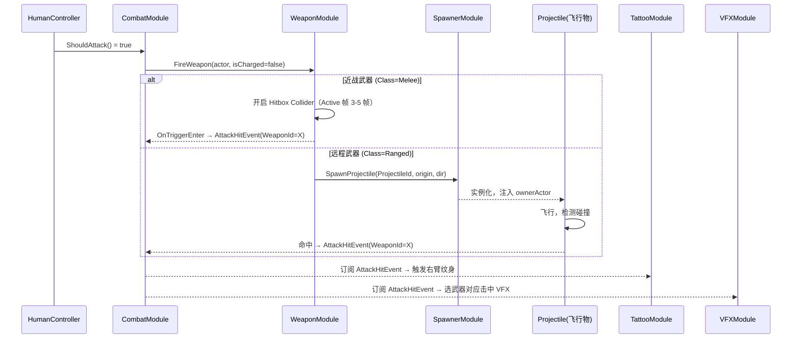

# 03-WeaponModule 模块详设

> **主导 Agent**：client-unity
> **依赖来源**：[CONTRACT.md §1.1](../../../openspec/changes/05-gdd-v2-full-design-docs/CONTRACT.md) / [systems/03-武器系统.md](../systems/03-武器系统.md) / [systems/02-战斗手感.md](../systems/02-战斗手感.md)
> **状态**：v1.0 初版（2026-06-25）

---

## 一、模块职责

WeaponModule 是武器生命周期的唯一权威，负责三件事：

**1. 武器装备管理**：维护每个 Actor 当前持有的武器槽（最多 3 槽）、当前激活槽索引、弹药数量。接收 `ItemPickedEvent`（武器类 item）后写入槽位；接收武器切换意图时更新激活槽。玩家丢弃武器时通知 SpawnerModule 生成地面拾取物。

**2. 当前持武器追踪**：对外暴露 `GetEquippedWeapon(Actor)` 查询接口，供 CombatModule（计算攻击参数）、TattooModule（读 BaseDamage 作 scaleStat）、BotControllerModule（AI 武器决策）实时同步获取。零开销同步读，不走事件。

**3. 攻击与蓄力执行（含飞行物 spawn）**：订阅 `IPlayerController.ShouldAttack` / `ShouldChargedAttack` 的轮询结果（由 CombatModule 转发），执行近战 Hitbox 开关时序（Active 帧期间开启 Collider）或远程 Projectile 实例化。命中后向 EventBus 发布 `AttackHitEvent`（含 `WeaponId`）/ `ChargedAttackEvent`。

**本模块不做**：伤害结算（→ CombatModule）、特效与音效（→ VFXModule / AudioModule）、纹身触发逻辑（→ TattooModule）、武器掉落权重（→ SpawnerModule）。

---

## 二、IGameModule 接口声明

```csharp
// Assets/Scripts/Modules/Weapon/WeaponModule.cs
public class WeaponModule : IGameModule
{
    public ModuleCategory Category => ModuleCategory.Gameplay; // Category = 3

    public IReadOnlyList<Type> Dependencies => new[] { typeof(DataTableModule) };

    public async UniTask InitAsync(CancellationToken ct) { /* 加载 WeaponConfig / ProjectileConfig */ }
    public async UniTask ShutdownAsync()                 { /* 清理飞行物对象池 */ }
}
```

**ModuleCategory 说明**：`Gameplay = 3`，晚于 `Infrastructure(0) → Core(1) → System(2)` 启动。Dependencies 仅声明 `DataTableModule`；CombatModule 通过事件与本模块协作，不进 Dependencies（避免循环）。

---

## 三、事件订阅与发布

### 3.1 订阅

| 事件 | 来源模块 | 处理 |
|---|---|---|
| `ItemPickedEvent` (ItemId 属武器类) | EconomyModule / SpawnerModule | 调 `EquipWeapon(actor, weaponId, slot)` 写入槽位；若槽位已满触发 UI 替换流程 |
| （CombatModule 内部分发）ShouldAttack poll | CombatModule | 触发 `FireWeapon(actor, isCharged=false)` |
| （CombatModule 内部分发）ShouldChargedAttack poll | CombatModule | 触发 `FireWeapon(actor, isCharged=true)` |
| `ShouldSwitchWeapon(slot)` ※ | InputModule → CombatModule | 切换 `_activeSlot[actor]` |

> ※ 武器切换意图目前由 `ShouldInteract` + 1/2/3 数字键复用；CONTRACT §三 `IPlayerController` 中若后续独立为 `ShouldSwitchWeapon(slot)` 方法，本模块直接适配，无需架构变动。

### 3.2 发布

| 事件 | 触发时机 | 关键字段 |
|---|---|---|
| `AttackHitEvent` | 近战 Hitbox 接触目标 / 远程 Projectile 命中目标 | `Attacker`, `Target`, `BaseDamage`, `WeaponId`, `IsCrit`, `IsCharged` |
| `ChargedAttackEvent` | 蓄力满后释放命中目标 | `Attacker`, `Target`, `ChargeRatio`, `BaseDamage`, `WeaponId` |

`WeaponId` 字段已在 CONTRACT §1.1 追加（2026-06-25），VFXModule / AudioModule / EnemyModule 可据此选择对应击中效果与弹道。

---

## 四、DataTable Schema

### 4.1 WeaponConfig.json

**路径**：`Assets/Resources/DataTable/WeaponConfig.json`

完整字段定义见 [systems/03-武器系统.md §4.1](../systems/03-武器系统.md)。模块侧关键字段摘要：

| 字段 | 类型 | 模块用途 |
|---|---|---|
| `WeaponId` | string | 主键，`GetEquippedWeapon` 返回值，写入事件 WeaponId |
| `Class` | string | `Melee / Ranged / Special`——决定走 Hitbox 还是 Projectile 路径 |
| `BaseDamage` | float | TattooModule 读取的 scaleStat 基准；写入攻击事件 |
| `BaseStartup / BaseActive / BaseRecovery` | int | 帧时序控制（60fps 基准） |
| `AttackSpeedModifier` | float | 叠加到 TattooPassiveStats.AttackSpeed，CombatModule 拿去算最终帧数 |
| `ChargedMul` | float | 蓄力伤害倍率，覆盖 CombatTuningConfig 默认 1.5× |
| `RequiresCharge` | bool | true = 弓，未蓄满时 Active 帧不生成有效 Hitbox |
| `Range` | float | 近战 Hitbox 球形半径 (m) |
| `ProjectileId` | string | 非空 = 远程，spawn 对应 Projectile |
| `MaxAmmo` | int | -1 = 无限（近战）；弹药耗尽后降级逻辑触发 |

### 4.2 ProjectileConfig.json

**路径**：`Assets/Resources/DataTable/ProjectileConfig.json`

| 字段 | 类型 | 模块用途 |
|---|---|---|
| `ProjectileId` | string | 外键，与 WeaponConfig.ProjectileId 关联 |
| `Speed` | float | 飞行速度 (m/s)，Projectile 组件每帧推进 |
| `MaxRange` | float | 超出后回池或销毁 (m) |
| `Piercing` | bool | true = 命中后继续飞行，触发多次 AttackHitEvent |
| `AoeRadius` | float | >0 = 着弹点 OverlapSphere 范围判定 |
| `VisualPrefabPath` | string | Resources/Prefabs/Projectiles/ 下的 Prefab 名 |

DataTable 生成前置步骤（必须手动执行）：若新增字段，先在 JSON 中编辑 → Unity 菜单 `Tools/DataTable/生成全部配置表代码` → 再编写读取逻辑。

---

## 五、与其他模块交互



**关键约定**：
- WeaponModule 只负责"打出去"——命中后发布事件，不自己做伤害结算。
- `GetEquippedWeapon(Actor)` 是同步零分配调用：内部 `Dictionary<Actor, EquippedWeaponState>` 按 Actor 索引，无字符串查找，无 Boxing。
- 飞行物 Projectile 的 `ownerActor` 信息在 spawn 时注入，命中时附在 `AttackHitEvent.Attacker` 字段——50 actor 同场不会混淆发起者。

---

## 六、50 Actor 性能预算

WeaponModule 采用单实例架构，用 `Dictionary<Actor, EquippedWeaponState>` 管理全场所有 Actor 的武器状态，避免每个 Actor 挂载独立 Component。

```
EquippedWeaponState {
    WeaponRow[] Slots;      // 3 槽，直接引用 DataTable 行，不拷贝
    int         ActiveSlot;
    int[]       CurrentAmmo; // 3 槽弹药
}
```

- **Bot 与玩家共用 API**：`FireWeapon(actor, ...)` 不区分 controller 类型，SmartBotPlayerController / LightBotPlayerController 同样调用此接口，帧表时序完全一致。
- **飞行物池化**：每个 `ProjectileId` 维护独立预分配池，默认每类型 30 个（见 §八 风险）。池满时复用最早发出的飞行物，避免 GC alloc。
- **Hitbox 时序**：Active 帧期间开启 `SphereCollider`（非 Kinematic Trigger），Active 帧结束立即关闭。不在 Update 中 alloc，用预缓存的 `RaycastHit[]` 做 OverlapSphereNonAlloc。
- **弹药耗尽降级**：`CurrentAmmo[slot] == 0` 时，远程武器退化为近战挥砸（`BaseDamage × 0.4`，`ProjectileId` 视作空），不切换槽位，保留 HUD 状态。
- **GC 约束**：武器切换、事件发布均不做临时 string 拼接；`AttackHitEvent` 走对象池复用（与其他战斗事件共用 EventBus 的 payload 池）。

---

## 七、伪联机 → 真联机迁移点

当前阶段（伪联机 = 单机 + AI）：武器命中判定完全在本地执行，无需网络同步。

真联机时需变更点（仅记录，本期不实施）：

| 变更点 | 说明 |
|---|---|
| **发起方权威** | 攻击命中由发起方（Attacker）本地判定并发布 `AttackHitEvent`，服务器接收后校验距离（近战 ≤ WeaponConfig.Range + 0.3m 容差，远程飞行物走服务端轨迹重算） |
| **飞行物同步** | Projectile 在发起方本地生成并飞行，服务器广播 `ProjectileSpawnedEvent`（含初速度/方向），接收方客户端本地模拟；命中以服务器确认为准 |
| **距离校验** | 主机 / 服务器在收到 `AttackHitEvent` 时检查 `Vector3.Distance(attacker.Pos, target.Pos) ≤ WeaponConfig.Range × 1.5`，超出则拒绝（×1.5 容差因网络抖动）；远程武器改为轨迹重算 |
| **弹药同步** | 弹药消耗在 authoritative side 执行，客户端预测扣弹药，服务端回执后修正 |
| **接口不变** | `FireWeapon(actor, ...)` / `GetEquippedWeapon(actor)` 签名不变；网络层仅在 WeaponModule 外部注入 NetworkPlayerController 实现 IPlayerController，本模块一行不改 |

---

## 八、测试策略

### EditMode 测试

| 测试用例 | 验证点 |
|---|---|
| `WeaponEquip_Slot` | `EquipWeapon(actor, "sword_basic", 0)` 后 `GetEquippedWeapon(actor).Slots[0].WeaponId == "sword_basic"` |
| `WeaponSwitch_ActiveSlot` | 切换至 slot 1，`GetEquippedWeapon(actor).ActiveSlot == 1` |
| `AmmoDecrease_OnRangedFire` | 手枪开火一次后 `CurrentAmmo[slot] == 17`（MaxAmmo=18） |
| `AmmoExhaust_Degradation` | 弹药归零后再 `FireWeapon`，`AttackHitEvent.BaseDamage ≈ BaseDamage × 0.4` 且 `ProjectileId == null` |
| `RequiresCharge_BowNoHitboxWithoutCharge` | 弓 `isCharged=false` 时 `FireWeapon` 不发布 `AttackHitEvent` |
| `WeaponConfig_AllFieldsLoaded` | DataTable 加载后 5 把 MVP 武器各字段非 null / 默认值校验 |

### PlayMode 测试

| 测试用例 | 验证点 |
|---|---|
| `MeleeHitbox_ActiveFrameOnly` | 录制 15 帧序列（短刀），只有 Frame 5–7 期间 `OnTriggerEnter` 被调用 |
| `ProjectileTrajectory_PistolHit` | 手枪发弹后 ≤ MaxRange/Speed 秒内命中 Dummy，`AttackHitEvent` 被发布且 `WeaponId == "pistol_basic"` |
| `ProjectilePiercing_BowCharged` | 弓蓄满（`isCharged=true`，`Piercing=true` 配置）射穿 2 个 Dummy，收到 2 次 `AttackHitEvent` |
| `BotAndPlayer_SameAPI` | SmartBotPlayerController 调 `FireWeapon` 与 HumanPlayerController 产出相同 `AttackHitEvent` 字段结构 |
| `50Actor_NoGCAlloc_Frame` | 场景内 50 Actor 同时挥刀，Profiler GC Alloc 一帧内 < 2KB（排除 Spawn 帧） |

---

## 九、风险与开放问题

### 9.1 飞行物对象池容量

**问题**：50 actor 中远程 AI 占比未定（最极端：50 个手枪 Bot 同时射击，每帧可能 spawn 50 个子弹）。默认每类型 30 个池的上限是否够用？

**推荐方案**：每武器类型维护独立池，容量 = `ceil(MaxAmmo × InViewBotCount × 0.3)`，以手枪为例：18 × 10 × 0.3 ≈ 54，建议池容量设为 60。轻量 AI（40 个）使用更低频率开火（视野外 0.5 Hz），同时在场飞行物理论峰值 ≤ 40。综合建议：手枪/子弹池 60，弓箭池 30，可在 `ProjectileConfig.PoolSize` 字段扩展（字段待追加）。

**当前定案（MVP）**：默认每类型池容量 30，项目后期按 profiling 结果扩容。池满时复用最旧飞行物（不销毁重建，避免 GC）。

### 9.2 近战 Hitbox 开关时序精度

**问题**：帧表要求 Active 帧精确对应 hitbox 开启区间（短刀 Frame 5–7，重锤 Frame 11–15）。Unity FixedUpdate（0.0166s / 帧）与动画帧存在 sub-frame 漂移，是否导致 hitbox 早开 / 晚关？

**推荐方案**：hitbox 时序由 CombatModule 以 fixed timestep 计数帧驱动（不依赖 Animator 事件），WeaponModule 暴露 `OpenHitbox(actor, durationFrames)` / `CloseHitbox(actor)` 接口。CombatModule 在帧计数器进入 Active 区间时调用，退出时关闭。这样时序完全由逻辑帧控制，与渲染帧无关。

**开放问题**：`OpenHitbox` 的具体 API 设计（返回 IDisposable 作用域 vs 显式 Open/Close 二段调用）由 02-CombatModule 详设确认后对齐，本模块预留两种路径。

### 9.3 弹药耗尽的 UX 提示时机

**问题**：远程武器最后一发打出后，玩家是否会收到 HUD 警告？若 WeaponModule 只发布 `AttackHitEvent`，UIModule 如何感知"弹药已空"状态变化？

**推荐方案（待确认）**：WeaponModule 在弹药变化时发布 `AmmoChangedEvent { Actor Owner; int Slot; int NewAmmo; int MaxAmmo; }`，UIModule 订阅后刷新武器槽 HUD（弹药显红 / 空弹提示）。该事件需追加至 CONTRACT §1.4（经济与拾取事件，归类语义最近），由主对话 review 后 append。

---

## 引用

- [CONTRACT.md §1.1](../../../openspec/changes/05-gdd-v2-full-design-docs/CONTRACT.md) — `AttackHitEvent` / `ChargedAttackEvent` / `ItemPickedEvent` 事件契约（WeaponId 字段已追加）
- [CONTRACT.md §三](../../../openspec/changes/05-gdd-v2-full-design-docs/CONTRACT.md) — `IPlayerController.ShouldAttack / ShouldChargedAttack`
- [CONTRACT.md §四](../../../openspec/changes/05-gdd-v2-full-design-docs/CONTRACT.md) — 50 actor 性能预算
- [systems/03-武器系统.md](../systems/03-武器系统.md) — WeaponConfig.json / ProjectileConfig.json 完整字段定义 / 5 把 MVP 武器帧参数
- [systems/02-战斗手感.md](../systems/02-战斗手感.md) — 三段帧公式 / Startup-Active-Recovery 时序规范 / IPlayerController 轮询契约
- [modules/01-TattooModule.md](./01-TattooModule.md) — scaleStat 消费 `WeaponModule.GetEquippedWeapon(actor).ActiveWeapon.BaseDamage`
- [modules/16-BotControllerModule.md](./16-BotControllerModule.md) — Smart AI 武器切换决策 / `FireWeapon` 调用路径

---

> **本模块状态**：v1.0 初版 / 职责边界已划定 / DataTable Schema 对齐 03-武器系统 GDD §4.1-4.2 / 50 actor 单实例字典方案已定 / 飞行物池化推荐容量待 profiling 确认 / AmmoChangedEvent 待主对话 review 后追加至 CONTRACT。
