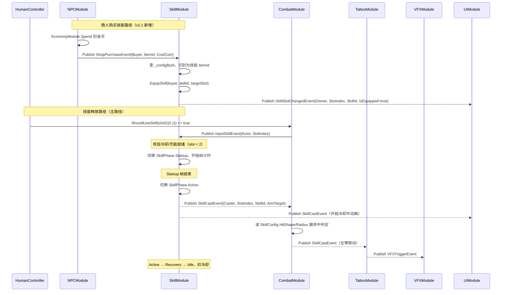

# 04-SkillModule 模块详设

> **版本**: v2.1 ｜ **修订日期**: 2026-06-25 ｜ 主要变更：MaxSlot 3→2
>
> **主导 Agent**: client-unity
> **对应系统 GDD**: ../systems/04-主动技能.md
> **当前代码状态**: 待实现
> **依赖契约**: [CONTRACT.md](../../../openspec/changes/05-gdd-v2-full-design-docs/CONTRACT.md) §1.1/1.4/§3 IPlayerController / §4 性能预算

---

## 一、模块职责

SkillModule 承载「**2 技能槽位** × 50 actor」的运行时状态管理。

**做什么**：
- 维护每个 actor 的 2 槽位技能装备（`slotToSkillId[2]`）
- 按 `ChargeModel` 逐帧推进冷却 / 充能 / 蓄力进度
- 消费 `IPlayerController.ShouldUseSkill(slot)` 轮询结果，执行技能释放前置校验（冷却是否就绪、充能层数是否足够）
- 在技能进入 Active 帧第 1 帧时发布 `SkillCastEvent`
- 响应 `ShopPurchaseEvent`（ItemId 命中 SkillConfig 时）将购买到的技能装入指定槽位，替换旧技能
- 响应 `EffectAppliedEvent` 中携带的冷却缩减 stat（MVP 阶段不启用，留扩展点）

**不做什么**：
- 帧表执行（归 CombatModule）
- Hitstop / 伤害结算（归 CombatModule）
- VFX 播放（归 VFXModule）
- HUD 冷却环渲染（归 UIModule，订阅 `SkillCastEvent` 自驱）
- 技能命中判定与 hitbox（归 CombatModule，按帧表读 `SkillConfig.HitShape / HitRadius`）
- 商人库存管理与购买流程（归 NPCModule，购买完成后发 `ShopPurchaseEvent`，SkillModule 响应）

---

## 二、IGameModule 接口签名

```csharp
public sealed class SkillModule : IGameModule
{
    public ModuleCategory ModuleCategory => ModuleCategory.Gameplay; // Category 3

    public Type[] Dependencies => new[]
    {
        typeof(DataTableModule),
        typeof(WeaponModule)        // 读取 BaseDamage 基准值，校验技能强度区间
    };

    public SkillModule(ModuleRunner runner, EventBus bus);

    // InitAsync：仅读 SkillConfig 表、建立 per-actor 字典，严禁发事件
    public UniTask InitializeAsync(CancellationToken ct = default);
    public UniTask ShutdownAsync(CancellationToken ct = default);
}
```

`ModuleCategory` 数值 3（Gameplay 层），在 DataTableModule（Category 0）和 WeaponModule（Category 3，同层无序但已先初始化）之后就绪。

`InitializeAsync` 仅做：
1. 从 `DataTableModule` 取 `SkillConfig` 行数组，建立 `_configById`（string → SkillConfig 行）
2. 为框架已注册的全部 actor 预分配 `SkillActorState`（初始 **2 槽**均为空）
3. 注册 `[EventHandler]`（框架在 InitAsync 完成后自动扫描）

---

## 三、订阅的事件 / 发布的事件（全签名）

### 3.1 订阅（`[EventHandler]`）

```csharp
// 技能输入：CombatModule 在帧表 Startup 入口轮询 IPlayerController.ShouldUseSkill(slot)
// 返回 true 时 CombatModule 发布此事件，SkillModule 接管冷却/充能状态变更
// SlotIndex 值域：0 或 1
[EventHandler] void OnInputSkill(InputSkillEvent e);
//   → 按 e.SlotIndex 取 SkillActorState，校验就绪条件
//   → 就绪则切换 SkillPhase.Startup，消耗充能层 / 记录冷却开始时刻
//   → 不就绪则吞掉（UI 层通过查询状态显示拒绝动画）

// 商人购买：NPCModule 在购买完成后发布
// SkillModule 检查 ItemId 是否命中 SkillConfig；命中则装入玩家指定槽位
[EventHandler] void OnShopPurchase(ShopPurchaseEvent e);
//   → 查 _configById[itemId.ToString()]，若存在则 EquipSkill(e.Buyer, skillId, targetSlot)
//   → 发布 SkillSlotChangedEvent（见 3.2）

// 冷却缩减（扩展点，MVP 阶段直接 return）
[EventHandler] void OnEffectApplied(EffectAppliedEvent e);
```

**SlotIndex 值域说明**：v2.1 起，槽位仅有 0 和 1，任何值 >= 2 的 SlotIndex 均应在 `OnInputSkill` 和 `OnShopPurchase` 处记录警告日志并忽略：

```csharp
if (e.SlotIndex < 0 || e.SlotIndex >= 2)
{
    FrameworkLogger.Warn("SkillModule", $"SlotIndex={e.SlotIndex} out of range [0,1], ignored");
    return;
}
```

### 3.2 发布

```csharp
// 技能进入 Active 帧第 1 帧时发布（CONTRACT §1.1 锁定签名，TattooModule 订阅触发左臂联动）
// SlotIndex 值域：0 或 1
class SkillCastEvent  { Actor Caster; int SlotIndex; string SkillId; Target AimTarget; }

// 槽位装备变化（装入 / 清除技能）
// 供 UIModule 刷新 2 槽技能图标
// 注：当前不在 CONTRACT 正式条目，暂在 SkillEvents.cs 内部声明为 internal sealed class
class SkillSlotChangedEvent { Actor Owner; int SlotIndex; string SkillId; bool IsEquipped; }
```

### 3.3 帧表时序与 CombatModule 协作

```
ShouldUseSkill(slot) → true
  ↓ OnInputSkill 校验通过（slot ∈ {0,1}，槽位非空，充能/冷却就绪）
  ↓ 切换 SkillPhase.Startup，记录 phaseStartTime
  ↓ Startup 帧满 → 切换 SkillPhase.Active，发布 SkillCastEvent
  ↓ Active 帧满 → 切换 SkillPhase.Recovery
  ↓ Recovery 帧满 → 切换 SkillPhase.Idle，扣除冷却 / 充能
```

帧数从 `SkillConfig.StartupFrames / ActiveFrames / RecoveryFrames` 读取（60fps 基准，转秒 = frames / 60f）。

---

## 四、DataTable Schema

### 4.1 SkillConfig.json（主表）

**路径**：`Assets/Resources/DataTable/SkillConfig.json`

已在 [04-主动技能 §四](../systems/04-主动技能.md) 完整定义，包含 MVP 8 行数据。关键字段摘要：

| 字段 | 类型 | 说明 |
|---|---|---|
| `SkillId` | string | 唯一 ID，如 `skill_fireball_01` |
| `ChargeModel` | int | 0=纯冷却 / 1=充能 / 2=蓄力释放 |
| `Cooldown` | float | 冷却时长(s)，ChargeModel=0 生效 |
| `MaxCharges` | int | 最大充能层数，ChargeModel=1 生效 |
| `ChargeRegenTime` | float | 单层恢复时间(s)，ChargeModel=1 生效 |
| `HoldDuration` | float | 蓄力满充时长(s)，ChargeModel=2 生效 |
| `OverchargeWindow` | float | 过载窗口时长(s)，ChargeModel=2 生效 |
| `StartupFrames` | int | 预备帧 (60fps 基准) |
| `ActiveFrames` | int | 激活帧 (60fps 基准) |
| `RecoveryFrames` | int | 恢复帧 (60fps 基准) |
| `DamageMul` | float | 伤害倍率，乘以 BaseDamage 得本体伤害 |
| `HitShape` | string | single / circle / line / cone |
| `CancelableByDodge` | bool | Startup 帧内是否允许闪避取消 |

修改此表后运行 Unity 菜单 `Tools/DataTable/生成全部配置表代码`，生成 `Assets/Scripts/DataTable/SkillConfig.cs`。

### 4.2 商人技能售卖对接（ShopStockConfig）

SkillModule 不直接读 `ShopStockConfig.json`，该表由 NPCModule 管理。对接方式：

- `ShopStockConfig.Category = "Skill"` 的条目，`ItemId` 与 `SkillConfig.SkillId` 通过约定映射（`ItemId` 的字符串形式 == `SkillId`，或通过 `SkillConfig` 新增 `ItemId` int 字段关联，由 DataTableGenerator 生成后 SkillModule 建立反查索引）
- 购买成功后 NPCModule 发 `ShopPurchaseEvent`，SkillModule 在 `OnShopPurchase` 中识别并装槽
- 目标槽位：MVP 阶段默认装入空槽（优先 slot 0 → slot 1）；若两槽均有装备，装入 slot 0 并发出 `SkillSlotChangedEvent`（`IsEquipped=false`）表示旧技能被替换

### 4.3 SkillTrajectoryConfig.json（弹道辅助表，SkillModule 不读）

**路径**：`Assets/Resources/DataTable/SkillTrajectoryConfig.json`

供 VFXModule 和 CombatModule 查询，字段定义待其详设落地，此处预留命名。

---

## 五、与其他模块的交互序列



**关键不变量**：
- SkillModule 只发 `SkillCastEvent` 和 `SkillSlotChangedEvent`，不直接调用任何其他模块方法
- 商人卖技能的金币扣减由 NPCModule → EconomyModule 完成，SkillModule 仅负责装槽逻辑
- `SkillCastEvent.SlotIndex` 值域保证为 0 或 1，CONTRACT §1.1 签名不变

---

## 六、50 actor 性能预算

### 核心数据结构（v2.1：槽位数组改为 [2]）

```csharp
private sealed class SkillActorState
{
    // 2 槽位当前装备的 SkillId，null 表示空槽（v2.1：MaxSlot = 2）
    public string[] SlotToSkillId = new string[2];

    // 2 槽位的当前相位
    public SkillPhase[] Phases = new SkillPhase[2];

    // 冷却剩余时间 (s) — ChargeModel=0 用
    public float[] CooldownRemaining = new float[2];

    // 当前充能层数 — ChargeModel=1 用
    public int[] CurrentCharges = new int[2];

    // 单层充能恢复计时 — ChargeModel=1 用
    public float[] ChargeRegenElapsed = new float[2];

    // 蓄力已持续时间 — ChargeModel=2 用
    public float[] HoldElapsed = new float[2];

    // 帧相位计时（Startup / Active / Recovery 内已过时间）
    public float[] PhaseElapsed = new float[2];
}

public enum SkillPhase { Idle, Startup, Active, Recovery }

private readonly Dictionary<Actor, SkillActorState> _states = new(64);
private SkillConfig[] _configTable;
private readonly Dictionary<string, SkillConfig> _configById = new(64);
```

### Tick 循环（无 GC alloc）

```csharp
// SkillModule 注册到 ModuleRunner.OnUpdate（每帧调用）
public void Tick(float dt)
{
    foreach (var (actor, state) in _states)
    {
        // v2.1：槽位上限 2，循环次数 = 50 actor × 2 = 100/帧
        for (int slot = 0; slot < 2; slot++)
        {
            TickSlot(actor, state, slot, dt);
        }
    }
}
```

### 预算对比（v2.0 → v2.1）

| 项 | v2.0（3 槽） | v2.1（2 槽） | 说明 |
|---|---|---|---|
| Tick 循环次数/帧 | 150（50×3） | **100（50×2）** | 减少 33% |
| SkillActorState 内存 | 7 数组 × 3 float/int = ~84 字节/actor | **7 数组 × 2 = ~56 字节/actor** | 减少 33% |
| GC alloc | 0 | **0**（同上，预分配后复用） | 无变化 |
| `SkillCastEvent` 最大发布量 | 24 events/帧（8 actor × 3） | **16 events/帧（8 actor × 2）** | 极端情况 |

---

## 七、伪联机 → 真联机迁移点

CONTRACT §3 确保所有 actor 走 `IPlayerController` 接口，SkillModule 对此透明：

| 阶段 | `ShouldUseSkill` 驱动源 | 网络消息 |
|---|---|---|
| 单机 / 伪联机（本期）| `HumanPlayerController` / `SmartBotPlayerController` | 无 |
| 真联机（未来）| `NetworkPlayerController`，帧同步 60Hz tick | 服务端权威：技能释放指令由发起方发出，服务端校验后广播；客户端预测释放动画，确认后真正扣冷却 |

**槽位数 2 的联机影响**：`SkillActorState.SlotToSkillId[2]` 序列化为网络消息比原先的 `[3]` 减少 1/3 数据量，冷却差量同步带宽相应降低。NetworkSyncModule 广播时需检查槽位数约束（len == 2）。

迁移改动点（与 v2.0 一致，无新增）：
- `NetworkPlayerController.ShouldUseSkill` 从帧同步缓冲队列读取（不改 SkillModule）
- `NetworkSyncModule` 把远端 actor 网络消息转为本地 `SkillCastEvent` 注入 EventBus（SkillModule 零改动）
- 服务端定期广播 `CooldownRemaining[2]` 做对齐，客户端插值修正

---

## 八、测试策略

### EditMode 测试——充能模型校验

**文件**：`Assets/Tests/EditMode/SkillChargeModelTests.cs`

| 用例 | 输入 | 期望 |
|---|---|---|
| `PureCooldown_FireThenBlock` | ChargeModel=0，Cooldown=8s；第 0s 用 slot 0 释放；第 4s 再请求 | 第 4s 返回"不可用"；第 8s 后返回"可用" |
| `ChargeStack_ConsumeAndRegen` | ChargeModel=1，MaxCharges=3，ChargeRegenTime=7s；slot 1 连续释放 3 次 | 第 3 次后 CurrentCharges=0；第 7s 后 CurrentCharges=1 |
| `HeldCast_NormalVsOvercharge` | ChargeModel=2，HoldDuration=1.5s，OverchargeWindow=0.8s | 1.5s 松开 → 普通释放；1.7s 松开 → 强化（DamageMul×1.3）；3.0s 强制释放 → 普通 |
| `EmptySlot_ShouldNotCast` | slot 0 空（SlotToSkillId=null）| `OnInputSkill` 不发 `SkillCastEvent`，无异常 |
| `SlotIndex_OutOfRange_Ignored` | `OnInputSkill` 传入 SlotIndex=2 | 记录 Warn 日志，不抛异常，`SkillCastEvent` 不发布 |
| `ShopPurchase_EquipSkill_EmptySlot` | 两槽均空，`ShopPurchaseEvent` 命中 SkillId | slot 0 装入技能，`SkillSlotChangedEvent{SlotIndex=0, IsEquipped=true}` 发布 |
| `ShopPurchase_EquipSkill_OverrideSlot0` | 两槽均有装备，`ShopPurchaseEvent` 命中 SkillId | slot 0 旧技能先发 `IsEquipped=false`，再发 slot 0 `IsEquipped=true` |

### PlayMode 测试——普攻取消窗口

**文件**：`Assets/Tests/PlayMode/SkillCancelWindowTests.cs`

| 用例 | 场景 | 期望 |
|---|---|---|
| `Skill_Startup_NotCancelableByDefault` | 技能进入 Startup 帧，同帧输入闪避（`CancelableByDodge=false`）| 闪避被忽略，技能正常完成到 Recovery |
| `Skill_Startup_CancelableWhenFlagged` | 技能 `CancelableByDodge=true`，Startup 帧内输入闪避 | 技能中断，返回 Idle，冷却不消耗 |
| `AttackCancel_IntoSkill_InputBuffer` | 普攻 Recovery 帧内，2 帧缓冲窗口内按下技能键 | 普攻结束后立即衔接技能 Startup |
| `SkillCast_TriggersTattooLeftArm` | TattooModule 左臂装备，slot 1 释放技能 | `SkillCastEvent{SlotIndex=1}` 发布后 `EffectAppliedEvent` 包含左臂 effectMagnitude > 0 |

---

## 九、风险与开放问题

### R1：MaxSlot 3→2 对现有引用方的影响

v2.0 中所有写死槽位上限为 3 的代码（`for slot < 3`、数组初始化 `new [3]`）需在实现阶段全部更新为 2。关联方：
- **CombatModule**：`ShouldUseSkill(slot)` 调用方，需确认 slot 传入值最大为 1
- **UIModule**：HUD 技能槽图标仅渲染 2 个，旧 Prefab 若存在第 3 个槽位节点需删除
- **InputModule**：`SkillSlot2`（原第 3 槽键位）绑定可废弃，或保留给未来扩展预留

**应对**：实现前由 client-unity 在 InputModule 详设中确认 2 槽键位命名（推荐 `Skill0`=Q / `Skill1`=E）；CombatModule 实现时加断言 `Assert(slot < 2)`。

### R2：商人技能售卖——ItemId 与 SkillId 映射方案

MVP 当前两种候选：
- 方案 A：`ShopStockConfig.ItemId`（int）与 `SkillConfig` 新增 `ItemId` 字段（int）一对一绑定
- 方案 B：`ShopStockConfig.ItemId` 直接存 `SkillId`（string），但 ItemId 类型在 CONTRACT §1.4 已定义为 int，改动需同步 CONTRACT

**建议方案 A**（避免改 CONTRACT）：SkillConfig 新增 `ItemId int` 字段，`0` 表示非商品；SkillModule 在 InitAsync 阶段建立 `_itemIdToSkillId Dictionary<int, string>` 反查索引。DataTableGenerator 需要在改 JSON 后重新生成，**实现前需通知用户运行 `Tools/DataTable/生成全部配置表代码`**。

### R3：技能 Active 帧发布时机的精确性（沿用 v2.0 R3）

`dt` 浮点推进可能造成 1 帧延迟。在 `TickFramePhase` 中检测"是否在本 dt 内跨越相位阈值"，跨越时同帧立即切相位并发布事件。与 CombatModule 联调时验证。

### R4：SkillSlotChangedEvent 未入 CONTRACT（沿用 v2.0 R4，已收窄）

当前在 `SkillEvents.cs` 声明为 `internal sealed class`，待主对话将其追加至 CONTRACT §1.4 后改为 `public`。UIModule 正式依赖此事件前不升级可见性。

### R5：Boss 技能 AI 路径（沿用 v2.0 R5）

EnemyModule 直接发布 `InputSkillEvent{Actor=bossActor, SlotIndex∈{0,1}}` 注入 EventBus，SkillModule 的 `OnInputSkill` 统一处理，Boss 与玩家走同一条校验路径。

### R6：UIModule HUD 槽位渲染适配（v2.1 新增）

从 3 槽缩减到 2 槽后，UIModule 的 HUD Prefab 需同步修改：删除第 3 个技能槽位 VisualElement / Image。UI 改动属于 art-ui 职责，SkillModule 实现前需确认 HUD Prefab 已完成 2 槽版本，否则槽位索引 1 的图标可能渲染到错误位置。

---

## 引用

- [CONTRACT.md §1.1 SkillCastEvent 签名 / §1.4 ItemPickedEvent / §3 IPlayerController / §4 性能预算](../../../openspec/changes/05-gdd-v2-full-design-docs/CONTRACT.md)
- [04-主动技能.md](../systems/04-主动技能.md)（2 槽位 / 3 充能模型 / SkillConfig 完整 JSON / 帧表规范）
- [01-TattooModule.md §三 OnSkillCast](./01-TattooModule.md)（左臂联动签名）
- [05-InputModule.md](./05-InputModule.md)（ShouldUseSkill 轮询实现，槽位键位命名待确认）
- [08-EnemyModule+BossModule.md](./08-EnemyModule+BossModule.md)（Boss 技能相位控制）
- [09-NPCModule.md §三 ShopPurchaseEvent](./09-NPCModule.md)（商人购买事件发布方）
- `Assets/Resources/DataTable/SkillConfig.json`（MVP 8 行，新增 ItemId 字段后重新生成）
- `Assets/Resources/DataTable/SkillTrajectoryConfig.json`（弹道辅助表，SkillModule 不读）
- `Assets/Scripts/Events/SkillEvents.cs`（待建，含 SkillCastEvent / SkillSlotChangedEvent）
- `Assets/Scripts/Modules/Skill/SkillModule.cs`（待建）
- `Assets/Tests/EditMode/SkillChargeModelTests.cs`（待建，含 v2.1 新增 3 个用例）
- `Assets/Tests/PlayMode/SkillCancelWindowTests.cs`（待建）
