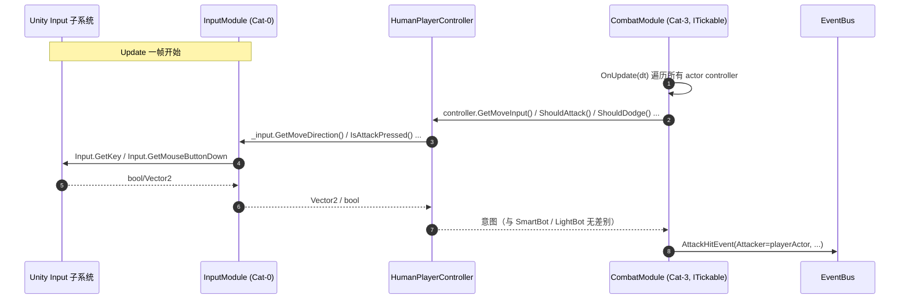
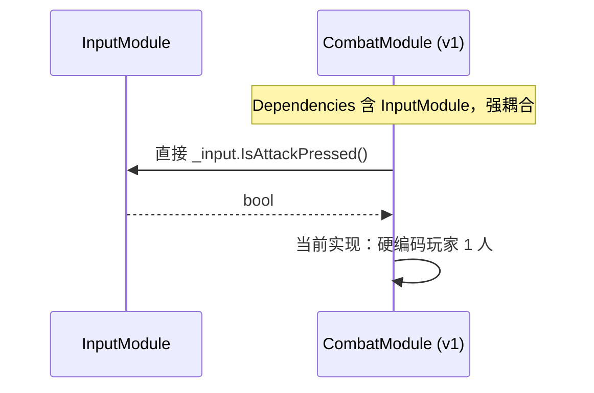

# 05-InputModule 模块详设

> **主导 Agent**: client-lead
> **对应系统 GDD**: ../systems/06-角色设定与骨架.md（玩家操作）/ ../systems/02-战斗与判定.md（输入→事件链路）
> **当前代码状态**: 已存在 [`Assets/Scripts/Modules/Input/InputModule.cs`](../../../Assets/Scripts/Modules/Input/InputModule.cs)（无状态键鼠查询）；本期需做的最大改造是**剥离消费者**——CombatModule 不再直接调用本模块。
> **CONTRACT**: [../../../openspec/changes/05-gdd-v2-full-design-docs/CONTRACT.md](../../../openspec/changes/05-gdd-v2-full-design-docs/CONTRACT.md) §1.10 / §3

---

## 一、模块职责一句话

所有键盘 / 鼠标 / 手柄 / 触屏原始按键的**唯一入口**，封装为「高层意图」查询接口（`GetMoveDirection / IsAttackPressed / IsSkillPressed / IsDodgePressed / IsInteractPressed`），**仅服务于 `HumanPlayerController` 一个消费者**——任何业务模块绕过本模块直接读 `KeyCode` 都是违反项目铁律的代码缺陷。

> **v2 关键升级**：本模块在 v1 中被 `CombatModule.OnUpdate` 直接轮询，相当于"输入直通战斗"；v2 引入 `IPlayerController` 抽象后，本模块**降级**为 `HumanPlayerController` 的私有数据源，`CombatModule` 不再持有 `InputModule` 引用（见 [CONTRACT §3](../../../openspec/changes/05-gdd-v2-full-design-docs/CONTRACT.md#三iplayercontroller-抽象接口)）。

## 二、IGameModule 接口签名

```csharp
public sealed class InputModule : IGameModule
{
    public int ModuleCategory => 0;          // Cat-0 基础设施层（与 DataTable / Resource 同级）
    public Type[] Dependencies => Type.EmptyTypes;
    // 无状态、零依赖、零事件订阅、零事件发布（默认行为）
}
```

> **为什么 Cat-0 而非 Cat-3**：本模块不依赖任何业务模块，且被 `HumanPlayerController`（由 SpawnerModule 在 Cat-3 阶段创建）即时调用。放 Cat-0 保证 `GetMoveDirection` 在 `RunStartedEvent` 触发瞬间已可用。
> **为什么不实现 `ITickable`**：本模块是**被动查询接口**，`HumanPlayerController.GetMoveInput()` 内部按需调用一次 `_input.GetMoveDirection()`，模块本身不需要每帧主循环。

## 三、订阅 / 发布事件

### 3.1 默认：纯查询接口，零事件发布

主路径（PC 端 + 内置 controller 直连）下，`HumanPlayerController` 每帧拉取本模块的 5 个查询接口，**不发布任何事件**——避免「按键 → 事件 → 订阅者 → 再判断」的迂回链路，保持 1 帧响应。

### 3.2 可选：CONTRACT §1.10 输入语义事件（仅特殊场景）

以下事件仅在「跨设备协议」或「输入录制 / replay / 远程串流」场景启用，本期**不默认订阅**：

```csharp
class InputAttackEvent   { }
class InputSkillEvent    { int SlotIndex; }
class InputDodgeEvent    { Vector2 Direction; }
class InputInteractEvent { }   // E 键 / 移动端交互键
```

启用条件（任一）：(a) `replay` 系统需要事件流持久化；(b) 输入设备 abstraction 层（手柄 / 触屏 / Steam Input）需要解耦设备实现；(c) Tutorial / Cutscene 需要拦截输入。**本期暂不启用**，由 `HumanPlayerController` 直接消费查询接口；如启用则本模块在内部 ITickable 中扫描边沿并 `EventBus.Publish`。

## 四、DataTable Schema

### 4.1 `InputBindingConfig.json`（预留重绑定，本期可全部用默认值）

```json
{
  "table": "InputBindingConfig",
  "fields": [
    { "name": "BindingId",       "type": "int" },
    { "name": "ActionName",      "type": "enum:Move|Attack|ChargedAttack|Skill0|Skill1|Skill2|Dodge|Interact|Pause" },
    { "name": "Device",          "type": "enum:Keyboard|Mouse|Gamepad|Touch" },
    { "name": "PrimaryKey",      "type": "string",  "comment": "KeyCode / MouseButton / GamepadButton / TouchAreaId" },
    { "name": "SecondaryKey",    "type": "string",  "comment": "可选的备用键，留空表示无" },
    { "name": "GamepadDeadzone", "type": "float",   "comment": "0..1 手柄摇杆死区，默认 0.15" },
    { "name": "TouchAreaRect",   "type": "vec4",    "comment": "移动端虚拟按钮屏幕归一化矩形 [x,y,w,h]，非触屏行留 0" },
    { "name": "ChargeThresholdMs","type": "int",   "comment": "蓄力按键判定阈值（仅 ChargedAttack 行），默认 350ms" }
  ]
}
```

**默认行表**（本期硬编码 fallback，未启用 PlayerPrefs 持久化前 5 行足够）：

| ActionName | Device | PrimaryKey | 备注 |
|---|---|---|---|
| Move | Keyboard | WASD | 8 方向归一化 |
| Attack | Mouse | 0（左键） | 触发 `IsAttackPressed` |
| ChargedAttack | Mouse | 0 长按 ≥350ms | 边沿松开发 `ChargedAttackEvent` |
| Skill0 | Keyboard | E | 主技能 |
| Dodge | Keyboard | Space | 与移动方向合成位移 |
| Interact | Keyboard | F | NPC / 拾取（与 Skill0 解耦） |

> **设计取舍**：未来重绑定通过「读 PlayerPrefs → 覆盖 DataTable 默认行」实现，本模块需要新增 `Rebind(actionName, newKey)` API，但本期不做。

## 五、与其他模块的交互序列

### 5.1 v2 新链路（本期落地）



### 5.2 v1 旧链路（**本期需要废除**）



> **改造点（落到 02-CombatModule 详设）**：`CombatModule.Dependencies` 移除 `typeof(InputModule)`，删除 `_input` 字段；`OnUpdate(dt)` 改为遍历 `_spawner.AllActors()` 调用 `GetControllerOf(actor).ShouldAttack()`。当前 [`CombatModule.cs:21`](../../../Assets/Scripts/Modules/Combat/CombatModule.cs#L21) 的 `Dependencies` 数组与 [`CombatModule.cs:80-101`](../../../Assets/Scripts/Modules/Combat/CombatModule.cs#L80-L101) 的 OnUpdate 是改造主战场。本模块**自身代码不动**——只是被引用的位置变了。

### 5.3 唯一消费者契约

| 调用方 | 关系 | 备注 |
|---|---|---|
| `HumanPlayerController` | 唯一合法消费者 | 在构造时通过 `ModuleRunner.GetModule<InputModule>()` 拿到引用 |
| `CombatModule` | **禁止直接调用**（v2 改造后） | 任何 `_runner.GetModule<InputModule>()` 都属违规 |
| UI / NPC / Inventory | **禁止直接调用** | UI 走 uGUI EventSystem，NPC 走 `InputInteractEvent` |
| `SmartBotPlayerController` / `LightBotPlayerController` / `NetworkPlayerController` | **不接触** | AI / 网络回放从内部状态机推断意图，与本模块无关 |

> **守护手段**：在 02-CombatModule / 16-BotControllerModule 详设的代码评审清单中加「grep `GetModule<InputModule>` 全工程仅应命中 `HumanPlayerController.cs` 一处」。

## 六、50 actor 性能预算

| 项 | 数量 | 调用频率 | 预算 |
|---|---|---|---|
| InputModule 实例 | **1** | 全局唯一 | — |
| `HumanPlayerController` 实例 | **1**（本期单机） | 每帧调用 5 个查询接口 | < 0.05 ms |
| `SmartBotPlayerController` | 8-10 | 视野内每帧 / 视野外 0.5s | **不经过本模块** |
| `LightBotPlayerController` | 40 | 视野内 0.2s / 视野外 2s | **不经过本模块** |
| `NetworkPlayerController` | 0（本期占位） | 60Hz tick | **不经过本模块** |

**关键性能保证**：

1. **本模块与 49 个 bot controller 完全无关**——50 actor 性能预算（[CONTRACT §四](../../../openspec/changes/05-gdd-v2-full-design-docs/CONTRACT.md#四50-actor-性能预算)）中 InputModule 永远只参与玩家这 1 个 actor 的链路。
2. **零 GC**：所有查询接口返回 `bool` 或 `Vector2`（值类型）；`GetMoveDirection` 内部不创建 `new Vector2` 之外的任何对象，归一化用 `sqrMagnitude` 比较避免 `Vector2.normalized` 二次 alloc 假象（实际是值类型，但保持习惯）。
3. **每帧调用次数**：玩家 1 个 controller × 5 个查询接口 = 每帧 5 次轻量查询，远低于 1µs/帧。
4. **未来联机扩展**：4 人合作时本模块仍只跑 1 实例（本机玩家），其他 3 人是 `NetworkPlayerController` 从快照取意图——本模块**不需要为联机做任何改造**。

## 七、伪联机 → 真联机迁移点

`NetworkPlayerController` 完全**不依赖本模块**——其 `GetMoveInput / ShouldAttack` 等接口的数据源是网络快照包 / `InputCommand` 回放，绕过 Unity Input 子系统直读。

迁移时本模块只需做两件事：

1. 在 `HumanPlayerController` 外**增加一份输入命令上传逻辑**——`InputCommand` 序列化为定长结构发到服务端（PvP 大逃杀阶段需要服务端权威）。这份逻辑放在 `HumanPlayerController` 内部，本模块自身不感知。
2. **延迟补偿 / 输入预测**：客户端把当前帧的 `InputCommand` 立即用本模块查询出的意图驱动本地玩家（client-side prediction），同时上传到服务端等回执——属于 `HumanPlayerController` 的职责，本模块只提供原始数据。

> **零改造承诺**：从单机到 4 人合作再到 PvP 大逃杀，本模块的接口 / Dependencies / 事件清单**全部保持不变**，与 [CONTRACT §三](../../../openspec/changes/05-gdd-v2-full-design-docs/CONTRACT.md#三iplayercontroller-抽象接口) 关于"业务模块永不感知背后是谁在驱动"的承诺一致。

## 八、测试策略

### 8.1 EditMode 单测（`Assets/Tests/EditMode/Input/InputModuleTests.cs`）

```csharp
[Test] public void GetMoveDirection_NoKey_ReturnsZero()
[Test] public void GetMoveDirection_DiagonalWS_ReturnsNormalized()      // mock Input.GetKey → 期望 magnitude≈1
[Test] public void GetMoveDirection_OppositeKeys_CancelOut()             // A+D 同按 → Vector2.zero
[Test] public void IsAttackPressed_RisingEdgeOnly()                      // 长按不应该每帧 true
```

> **Mock 难点**：UnityEngine.Input 是静态 API，单测需要抽出 `IInputProvider` 接口或用 `InputSystem` 包替代。**本期保留现状**——测试覆盖率不足由 8.2 集成测兜底。未来若启用新输入系统（Input System Package）则同步改造测试桩。

### 8.2 PlayMode 集成测（`Assets/Tests/PlayMode/Input/HumanControllerPassthroughTest.cs`）

模拟 `HumanPlayerController` 的完整链路：

```csharp
[UnityTest] public IEnumerator HumanController_PassesInputToCombat()
// 1. 起场景，注入 50 actor（1 玩家 + 49 bot）
// 2. 用 InputSystem TestFixture 注入键盘按键 W + 鼠标左键
// 3. 断言：CombatModule 当帧发出 AttackHitEvent，Attacker == playerActor
// 4. 断言：BotControllerModule **未**收到玩家的 InputAttackEvent（确认链路隔离）
```

### 8.3 50 actor controller 切换压力测（`Assets/Tests/PlayMode/Bot/ControllerSwitchTest.cs`）

复用 16-BotControllerModule §8.2 的同一测试场景，**额外断言** InputModule 的 5 个查询接口被调用次数严格 == 帧数（不是 50 × 帧数），保证 `CombatModule.OnUpdate` 改造后**没有遗留旧路径**。

### 8.4 守护测试：禁止跨模块调用

```csharp
[Test] public void Codebase_InputModuleConsumers_OnlyHumanController()
// 用 Roslyn 或简单 grep：扫描 Assets/Scripts，统计 GetModule<InputModule>() 调用
// 断言：只在 HumanPlayerController.cs 出现 1 次
```

## 九、风险与开放问题

1. **蓄力普攻判定**：v1 GDD 提到「鼠标左键长按 ≥350ms 触发蓄力」，与瞬发普攻共用按键。**当前问题**：[`InputModule.cs:42`](../../../Assets/Scripts/Modules/Input/InputModule.cs#L42) 的 `IsAttackPressed` 只检 `GetMouseButtonDown`，无法区分点按 / 蓄力。**方案**：本模块新增一组 API——
   ```csharp
   bool IsAttackHeld();           // 当前是否按住
   float GetAttackHoldDuration();  // 累计按住时间（秒），松开/未按时返回 0
   bool IsChargedAttackReleased(); // 松开瞬间且累计 ≥ ChargeThresholdMs → true 一帧
   ```
   由 `HumanPlayerController.ShouldChargedAttack()` 消费，对接 CONTRACT §1.1 `ChargedAttackEvent`。本期落 API 不落实现，留给 02-CombatModule 详设决定蓄力进度 UI 是否走事件。
2. **手柄死区配置**：`InputBindingConfig.GamepadDeadzone` 默认 0.15，但 Xbox 与 PS 手柄死区特性不同（Xbox 摇杆漂移更明显）。**推荐**：本期硬编码 0.15 单值，未来按手柄类型分两档（Xbox 0.18 / PS 0.12）。该决策与新输入系统（Input System Package）的 Processors 机制紧密绑定，是否升级新输入系统留作开放问题。
3. **移动端虚拟摇杆死区**：触屏摇杆需要「外圈死区（防误触移出激活区）」+「内圈死区（防抖动）」两档。`InputBindingConfig.TouchAreaRect` 仅描述按钮位置，**死区参数缺失**。建议追加 `TouchInnerDeadzone / TouchOuterDeadzone` 两字段，留待 14-移动端适配 GDD 决定。
4. **是否引入新输入系统 Package**：Unity 6 LTS 推荐 `com.unity.inputsystem`，但本模块当前用旧 `UnityEngine.Input`。**取舍**：
   - 升级新输入系统 → 重绑定 / 设备热插拔 / 联机回放更顺，但本期工作量 ≈ 2 人日，且需要 PlayMode 测试 fixture 改造。
   - 保持旧 Input → 本期零成本，但蓄力 / 重绑定 / 手柄全得手写。
   **建议**：本期保留旧 Input，2.0 阶段（真联机）一并升级。开放给 client-lead 评审。
5. **`InputInteractEvent` vs `IsInteractPressed`**：CONTRACT §1.10 列了 `InputInteractEvent` 但本模块默认走查询路径，**未实现 `IsInteractPressed`**。建议本期补 `IsInteractPressed() => Input.GetKeyDown(KeyCode.F)`，让 `HumanPlayerController.ShouldInteract()` 有数据源。否则 09-NPCModule 详设会卡 E vs F 键之争——E 已被技能占用，留 F 给交互。
6. **Editor Domain Reload 兼容**：[.claude/CLAUDE.md §十二](../../../.claude/CLAUDE.md) 提到「Domain Reload 会导致静态字段归零」，本模块无静态字段，**风险为零**。但若未来引入「上一帧按键缓存」做边沿检测，需用实例字段并由 `InitializeAsync` 重置——预先 flag。

---

## 引用

- [CONTRACT.md](../../../openspec/changes/05-gdd-v2-full-design-docs/CONTRACT.md) §1.10 / §3
- [Assets/Scripts/Modules/Input/InputModule.cs](../../../Assets/Scripts/Modules/Input/InputModule.cs)（已存在的实现，本期不改）
- [Assets/Scripts/Modules/Combat/CombatModule.cs](../../../Assets/Scripts/Modules/Combat/CombatModule.cs)（需做的最大改造在 02-CombatModule 详设）
- 同期模块详设：02-CombatModule（OnUpdate 改 IPlayerController 遍历）/ 16-BotControllerModule（49 个 bot controller，[已完成](./16-BotControllerModule.md)）
- [.claude/CLAUDE.md §十二](../../../.claude/CLAUDE.md)（项目铁律：所有按键输入必须走 InputModule）
