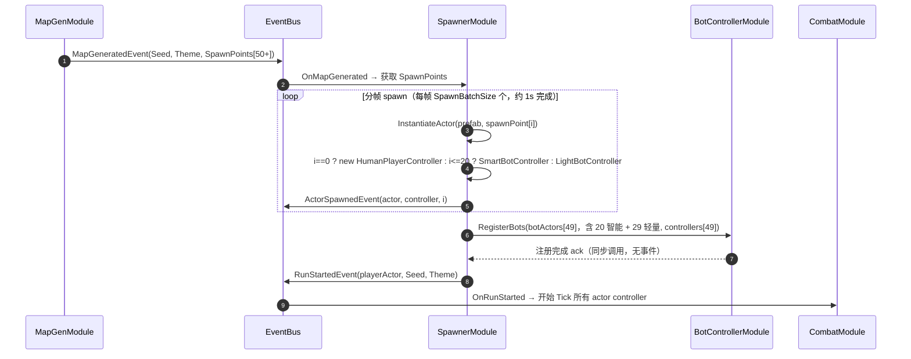

# 06-SpawnerModule 模块详设

> **版本**: v2.1 ｜ **修订日期**: 2026-06-25

> **主导 Agent**: client-unity
> **对应系统 GDD**: ../systems/06-角色设定与骨架.md（actor 抽象）
> **当前代码状态**: 已存在 `Assets/Scripts/Modules/Spawner/SpawnerModule.cs`（v1 CreatePrimitive 实现，v2 需重构）
> **CONTRACT**: [../../openspec/changes/05-gdd-v2-full-design-docs/CONTRACT.md](../../../openspec/changes/05-gdd-v2-full-design-docs/CONTRACT.md)

---

## 一、模块职责一句话

为每局 Run 批量创建 50 个 actor 实例（1 玩家 + 20 智能 bot + 29 轻量 bot）并为每个 actor 装配对应的 `IPlayerController`；相机 / 灯 / 地面 / NavMesh 交给 MapGenModule 负责；BR 模式不复活，死亡 actor 的 respawn 留空。

## 二、IGameModule 接口签名

```csharp
public sealed class SpawnerModule : IGameModule
{
    public int ModuleCategory => 3;
    public Type[] Dependencies => new[]
    {
        typeof(MapGenModule),          // 等待地图就绪后获取出生点列表
        typeof(BotControllerModule),   // spawn 完成后注册 49 个 bot actor
    };
    // CombatModule / VFXModule 走运行时事件，不进 Dependencies
}
```

> **ModuleCategory = 3**（Game Logic 层），与 [CONTRACT §二](../../../openspec/changes/05-gdd-v2-full-design-docs/CONTRACT.md#二模块依赖图) 依赖图一致：`MapGenModule → SpawnerModule → BotControllerModule`。

### 生命周期说明

- `InitializeAsync`：仅做结构初始化（预分配集合），不 spawn 任何 GameObject
- `OnMapGenerated`（订阅 `MapGeneratedEvent`）：触发实际 spawn 流程，分帧 amortize
- `ShutdownAsync`：销毁所有 actor GameObject，清空集合

## 三、订阅 / 发布事件全签名

### 3.1 发布（全部已在 CONTRACT §1.9 锁死）

```csharp
ActorSpawnedEvent  { Actor SpawnedActor; IPlayerController Controller; int SpawnIndex; }
RunStartedEvent    { Actor PlayerActor; int Seed; MapTheme Theme; }
```

`ActorSpawnedEvent` 每个 actor 完成 spawn + controller 装配后单独发布一次，共发 50 次；下游 VFXModule / UIModule 可订阅以显示入场动画。`RunStartedEvent` 在全部 50 个 actor spawn 完成后统一发布一次，`CombatModule` 以此为 Tick 开始的信号。

### 3.2 订阅

| 事件 | 用途 |
|---|---|
| `MapGeneratedEvent` | 地图就绪 → 获取 SpawnPoint 列表 → 开始分帧 spawn 50 actor |
| `RunEndedEvent` | 局结束 → 清理所有 actor（不复活，BR 模式） |
| `ActorDiedEvent` | 记录死亡 actor，标记 slot 不可再 spawn（BR 模式不复活） |

## 四、DataTable Schema

### `SpawnConfig.json`

```json
{
  "table": "SpawnConfig",
  "fields": [
    { "name": "ConfigId",          "type": "int" },
    { "name": "TotalActors",       "type": "int",   "comment": "每局 actor 总数，固定 50" },
    { "name": "SmartBotCount",     "type": "int",   "comment": "智能 AI 数量，固定 20（IntelligentBotCount）" },
    { "name": "LightBotCount",     "type": "int",   "comment": "轻量 AI 数量，固定 29；等式：TotalActors(50) = 1 + SmartBotCount(20) + LightBotCount(29)" },
    { "name": "SpawnBatchSize",    "type": "int",   "comment": "分帧 spawn 每帧批次，推荐 5-10" },
    { "name": "SpawnRadiusMin",    "type": "float", "comment": "起始散点圆最小半径(米)，避免 actor 重叠" },
    { "name": "SpawnRadiusMax",    "type": "float", "comment": "起始散点圆最大半径(米)，与地图尺寸匹配" },
    { "name": "SpawnAlgorithm",    "type": "enum:RandomScatter|PoissonDisk|GridJitter",
                                   "comment": "起始位置算法。RandomScatter=随机圆上点，PoissonDisk=泊松圆盘(推荐)，GridJitter=网格加噪" },
    { "name": "MinSpawnDistance",  "type": "float", "comment": "任意两个 actor 出生点最小距离(米)，防止堆叠" },
    { "name": "PlayerSpawnBias",   "type": "enum:Center|Edge|Random",
                                   "comment": "玩家出生位置偏好。Center=地图中心，Edge=边缘，Random=随机" },
    { "name": "ActorPrefabKey",    "type": "string","comment": "ResourceModule 资源 key，对应 actor Prefab" }
  ]
}
```

> **不要用 Excel / .bytes**；更改此表后请在 Unity 运行 `Tools/DataTable/生成全部配置表代码` 再写读取逻辑。

## 五、与其他模块的交互序列



**关键契约**：`SpawnerModule` 只负责实例化与 controller 装配，**不做任何战斗 / AI 逻辑**。`BotControllerModule.RegisterBots` 是 `SpawnerModule` 对外的唯一同步调用——之后 Bot 模块自主管理 49 个 controller（20 智能 + 29 轻量）的 LOD 与决策频率（详见 [16-BotControllerModule.md](./16-BotControllerModule.md) §五）。

## 六、50 actor 性能预算

### 分帧 amortize 策略

```
SpawnBatchSize = 8（DataTable 默认值）
50 / 8 = 7 帧完成（≈ 117ms @ 60fps）≤ 1s 目标
```

每帧 spawn 批次在 `UniTask.Yield()` 后继续，不阻塞主线程渲染：

```csharp
// 伪代码，仅供文档说明——实际实现时遵循项目 UniTask 规范
for (int i = 0; i < totalActors; i += batchSize)
{
    int end = Mathf.Min(i + batchSize, totalActors);
    for (int j = i; j < end; j++)
        SpawnOneActor(j, spawnPoints[j]);
    await UniTask.Yield(); // 让出一帧，保证帧率平稳
}
```

### 内存布局

- `_actors`：`Actor[50]` 预分配数组，index 0 = 玩家，1-20 = 智能 bot，21-49 = 轻量 bot
- `_controllers`：`IPlayerController[50]` 与 `_actors` 一一对应
- `_aliveFlags`：`bool[50]`，死亡时置 false，BR 模式不复活，无需 Compact
- Spawn 期间**不发 `BuildChangedEvent` / `AttackHitEvent`**——controller 装配完成才算活跃

### 单帧预算

| 操作 | 估计耗时 |
|---|---|
| `Instantiate(prefab)` × 8 | ~2ms（Prefab 已在 ResourceModule 预热） |
| `new HumanPlayerController` / `SmartBotPlayerController` | < 0.1ms |
| `ActorSpawnedEvent` × 8 | < 0.1ms（EventBus 同步分发） |
| `UniTask.Yield()` 让帧 | 0ms（让出控制权） |
| **单帧合计** | **≈ 2.2ms**（占 16.7ms/帧的 13%，可接受） |

## 七、伪联机 → 真联机迁移点

本模块是伪联机的「controller 装配层」，迁移代价最低：

| 阶段 | 玩家 actor | bot slot |
|---|---|---|
| 本期（伪联机） | `HumanPlayerController` × 1 | `SmartBotController` × 20 + `LightBotController` × 29 |
| 中期（4 人合作） | `HumanPlayerController` × 4 | `NetworkPlayerController` × N + Bot × (49-N) |
| 远期（PvP BR） | `Human/NetworkPlayerController` × 8-10 | Bot × (50-真人数) |

**迁移改动面**：`OnMapGenerated` 在创建 controller 前，读取一份 `RemoteSlotInfo[]`（来自网络层），对有 remote player 的 slot 创建 `NetworkPlayerController` 而非 bot controller。**SpawnerModule 之外的所有模块零改动**——这是 [CONTRACT §三](../../../openspec/changes/05-gdd-v2-full-design-docs/CONTRACT.md#三iplayercontroller-抽象接口) 的核心承诺。

真联机时 spawn 时机从「MapGeneratedEvent」迁移为「服务端下发 SpawnConfirmPacket」；SpawnerModule 只需把触发入口从事件订阅改为网络包回调，内部 spawn 流程**不变**。

## 八、测试策略

### 8.1 EditMode 单测（`Assets/Tests/EditMode/Spawner/SpawnConfigTests.cs`）

```csharp
[Test] public void SpawnConfig_TotalActors_IsAlways50()
[Test] public void SpawnConfig_SmartBotCount_Is20()                     // IntelligentBotCount = 20
[Test] public void SpawnConfig_LightBotCount_Is29()                     // LightBotCount = 29
[Test] public void SpawnConfig_SmartPlusLightPlusOne_EqualsTotalActors() // 20 + 29 + 1 = 50
[Test] public void SpawnPoints_PoissonDisk_RespectMinDistance()          // 验证算法输出无重叠
[Test] public void ActorIndex0_IsAlwaysPlayerController()                // index 0 = HumanPlayerController
[Test] public void ActorIndex1To20_AreSmartBotControllers()              // index 1-20 = SmartBotController
[Test] public void ActorIndex21To49_AreLightBotControllers()             // index 21-49 = LightBotController
```

### 8.2 PlayMode 集成测（`Assets/Tests/PlayMode/Spawner/FiftyActorSpawnTest.cs`）

- 用 mock `MapGeneratedEvent` 驱动 SpawnerModule，提供 50 个随机 SpawnPoint
- 断言：`RunStartedEvent` 在 50 个 `ActorSpawnedEvent` 全部发出后才触发
- 断言：index 1-20 的 controller 类型为 `SmartBotController`，index 21-49 为 `LightBotController`
- 断言：spawn 期间平均帧率 ≥ 55fps（ProfilerRecorder）
- 断言：spawn 完成后 GC alloc < 50KB（单次 spawn 无持续 alloc）
- 断言：所有 actor 位置间距 ≥ `MinSpawnDistance`（无重叠）

### 8.3 集成对齐验证

与 BotControllerModule PlayMode 测试共用同一场景（`FiftyActorPerfTest`，[16-BotControllerModule.md §8.2](./16-BotControllerModule.md#82-playmode-集成测assetstsestsplaymodebot50actorperftestcs) 定义），以确认：
- SpawnerModule 发出的 49 个 bot actor（20 智能 + 29 轻量）全部被 BotControllerModule 注册
- `RunStartedEvent` 发出后 CombatModule 开始 Tick，无 actor 停在出生点

## 九、风险与开放问题

1. **Prefab 准备时序**：v2 spawn 依赖 actor Prefab（`ActorPrefabKey` → ResourceModule），但 v1 用 `CreatePrimitive`。**过渡方案**：优先落 Prefab（由 art-3d / client-unity 创建占位体），ResourceModule 资源 key 由 [资源配置规范.md](../../../.claude/资源配置规范.md) 定义；Prefab 未就绪前保留 `CreatePrimitive` fallback，用 `#if UNITY_EDITOR` 宏隔离，不进发布包。

2. **SpawnPoint 来源**：`MapGeneratedEvent` 携带 `List<RoomInfo> Rooms`，SpawnerModule 需从 Rooms 中提取出生点。**推荐**：MapGenModule 在生成时专门计算「安全出生区域」并附到 `MapGeneratedEvent.SpawnPoints[]`，而非由 SpawnerModule 自行解析地图几何——避免两个模块都知道地图细节。该接口由 07-MapGenModule 详设落地。

3. **相机跟随玩家**：v1 SpawnerModule 负责相机创建与定位，v2 不再承担此职责。**推荐**：相机 GameObject 由 MapGenModule spawn（随地图整体），跟随逻辑交给独立 CameraModule（本 GDD 不涉及）；SpawnerModule 只在 spawn 完成后通过 `RunStartedEvent` 提供 `PlayerActor`，CameraModule 订阅后自行绑定目标。

4. **actor 销毁时机**：`ActorDiedEvent` 触发时立即 `Destroy(go)` 还是延迟？**推荐**：延迟 2s（播死亡动画），`_aliveFlags[i] = false` 立即置位（逻辑死亡），2s 后再调 `Destroy`；SpawnerModule 维护一个 `Queue<(GameObject, float destroyAt)>` 在 `OnUpdate` 中轮询，无 GC alloc。

5. **DataTable 生成顺序**：`SpawnConfig.json` 字段变更后，必须先在 Unity 运行 `Tools/DataTable/生成全部配置表代码` 生成 `Assets/Scripts/DataTable/SpawnConfig.cs`，再写 SpawnerModule 的读取代码。跳过此步骤会导致编译失败。

6. **50 个 actor 的 Collider 配置**：BR 场景中 actor 互相不应被物理推开（避免出生点堆叠穿插后物理爆炸）。**推荐**：actor Prefab 的 Collider Layer 使用 `Actor` Layer，Layer Collision Matrix 中 `Actor × Actor = 关闭`（碰撞检测仅保留 `Actor × Environment`）；伤害判定走 SphereCast / OverlapSphere 而非物理碰撞，交由 CombatModule 负责。

---

## 引用

- [CONTRACT.md](../../../openspec/changes/05-gdd-v2-full-design-docs/CONTRACT.md) §1.9（RunStartedEvent）/ §1.6（MapGeneratedEvent）/ §2（依赖图）/ §3（IPlayerController）/ §4（50 actor 预算）
- [Assets/Scripts/Modules/Spawner/SpawnerModule.cs](../../../Assets/Scripts/Modules/Spawner/SpawnerModule.cs)（当前 v1 实现，待重构）
- [modules/16-BotControllerModule.md](./16-BotControllerModule.md)（RegisterBots 调用方）
- [systems/06-角色设定与骨架.md](../systems/06-角色设定与骨架.md)（actor 抽象 + IPlayerController）
- 同期模块详设：07-MapGenModule（SpawnPoints 数据源）/ 02-CombatModule（RunStartedEvent 消费方）/ 05-InputModule（HumanPlayerController 实现）
