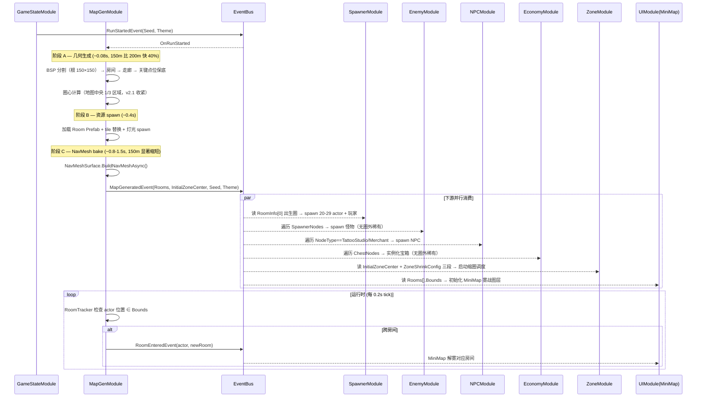

# 07-MapGenModule 模块详设

> **版本**: v2.1 ｜ **修订日期**: 2026-06-25
> **主导 Agent**: client-lead（架构定调）+ client-unity（落地）
> **对应系统 GDD**: [../systems/07-地图生成.md](../systems/07-地图生成.md) v2.1（150×150m / 缩圈三段 / 去圈外稀有）+ [../systems/15-世界观与轻剧情.md](../systems/15-世界观与轻剧情.md)（主题驱动资源池）
> **当前代码状态**: **新建**。`Assets/Scripts/Modules/MapGen/` 目录尚未存在，v1 无对应代码。
> **CONTRACT**: [../../../openspec/changes/05-gdd-v2-full-design-docs/CONTRACT.md](../../../openspec/changes/05-gdd-v2-full-design-docs/CONTRACT.md)

---

## 一、模块职责一句话

**Run 开始时一次性完成大地图生成**：执行 BSP 分割（**150×150m 根节点**）→ 房间/走廊几何 → 关键点位保底分配 → 缩圈中心计算（**地图中央 1/3 内**）→ 主题 tile 替换 → NavMesh 烘焙 → spawn 静态场景资源（地面 / 灯光 / 装饰）→ 发布 `MapGeneratedEvent`；运行时仅维护"玩家进入了哪个房间"的轻量判定，不做任何 per-frame 几何计算。

> **不做的事**（边界）：不 spawn actor（→ SpawnerModule）/ 不 spawn 怪物或宝箱实体（→ Enemy/EconomyModule 订阅事件后做）/ 不实例化 NPC（→ NPCModule）/ 不管相机（v2 由 SceneModule 或既有 PlayerCamera 处理，本模块**显式不接管**，详见 §九 §9.3）/ 不驱动缩圈逻辑（只输出初始圈心 + 三段阶段配置，缩圈推进由独立 `ZoneModule` 负责）/ **不 spawn 圈外稀有节点**（v2.1 移除，详见 §4.1）。

---

## 二、IGameModule 接口签名

```csharp
public sealed class MapGenModule : IGameModule
{
    public int ModuleCategory => 3;          // Game Logic 层
    public Type[] Dependencies => new[]
    {
        typeof(DataTableModule),             // 读 MapTemplateConfig / RoomConnectionRules / MapThemeConfig / ZoneShrinkConfig
        typeof(ResourceModule),              // 加载 Room Prefab、tileset、装饰物
    };
    // SpawnerModule / EnemyModule / NPCModule / ZoneModule 全部通过 EventBus 解耦，不进 Dependencies
}
```

> **ModuleCategory = 3** 与 [CONTRACT §二](../../../openspec/changes/05-gdd-v2-full-design-docs/CONTRACT.md) 依赖图一致：`DataTable / Resource → MapGen → Spawner / Enemy / NPC / Zone`。

### 生命周期

- `InitializeAsync`：仅做结构初始化（生成 RNG 占位、清空房间表）。**不读 DataTable 数据、不发事件**（遵守"InitAsync 期间不发事件"约束）。
- `OnRunStarted`（订阅 `RunStartedEvent`）：触发实际生成流程。整个流程异步（`UniTask`），目标 **≤ 2.5s**（v2.1 受益于 150m 地图，比 v2.0 的 3.0s 更紧），超时降级（见 §六）。
- `ShutdownAsync`：销毁所有 spawn 的场景 GameObject，释放 NavMeshData，清空 `RoomInfo` 缓存。

---

## 三、订阅 / 发布事件

### 3.1 发布（已在 CONTRACT §1.6 / §1.9 锁死，不允许修改签名）

```csharp
MapGeneratedEvent { int Seed; MapTheme Theme; List<RoomInfo> Rooms;
                    Vector2 InitialZoneCenter; }   // 字段已在 CONTRACT 锁死
RoomEnteredEvent  { Actor Enterer; RoomRef Room; } // 玩家/AI 跨房间触发
```

- `MapGeneratedEvent` 在地图全流程结束（含 NavMesh bake 完成）后**单次**发布，是 Run 内最关键的"地图就绪"信号。下游 SpawnerModule / EnemyModule / NPCModule / EconomyModule / ZoneModule / UIModule(MiniMap) 全部订阅它。
- `RoomEnteredEvent` 在运行时由 MapGenModule 内的轻量 `RoomTracker` 子组件检测发布——基于 actor 位置与 `RoomInfo.Bounds` AABB 判定，每 0.2s tick 一次（不是每帧）。

### 3.2 订阅

| 事件 | 用途 |
|---|---|
| `RunStartedEvent` | 唯一的生成触发点。携带 `Seed + MapTheme` |
| `RunEndedEvent` | 清理 spawn 的场景 GameObject，释放 NavMeshData |
| `ActorDiedEvent` | 仅用于停止该 actor 的 `RoomTracker` tick（避免对死亡 actor 继续做 AABB 判定） |

> **明确不订阅**：`ZoneShrinkPhaseEvent`（缩圈中心 + 三段阶段配置已通过 `MapGeneratedEvent.InitialZoneCenter` + ZoneShrinkConfig 一次性交付，本模块不参与缩圈推进）。

---

## 四、DataTable Schema

`MapTemplateConfig.json` / `RoomConnectionRules.json` 字段已在 [系统 GDD §4.1/§4.2](../systems/07-地图生成.md) 详细给出，此处仅声明本模块的**额外读取约定**：

| DataTable | 用途 | 关键字段 |
|---|---|---|
| `MapTemplateConfig` | BSP 叶节点填房时按 `ThemeId + SizeCategory + Weight` 加权随机采样 Room Prefab。**v2.1**：根节点尺寸字段 `MapSize` 从 200 改为 **150**（单位 m），同步影响所有按比例计算的 `MinRoomSize` 与 `BspMaxDepth` | `MapSize=150`, `PrefabPath`, `NodeSlots`, `NavMeshStatic`, `BspMaxDepth=4` |
| `RoomConnectionRules` | 走廊生成时按 `FromSize × ToSize` 查表确定 `CorridorWidth` 与 `Allowed`（若 false → 中间插入过渡房间） | `CorridorWidth`, `MaxAngle`, `Allowed` |
| `MapThemeConfig` | 读取 `TerrainPoolId` 决定 tile 替换池；读取 `DominantColors / HUDAccentColor` 仅做透传（写入 `RoomInfo.ThemeMetadata`），本模块不消费 | `TerrainPoolId`, `DominantColors` |
| `ZoneShrinkConfig` | **v2.1 三段式**：读取 5 个阶段参数（初始 / Phase1@3min / Phase2@6min / Phase3@9min 急收 / Phase4@11:30 慢收死圈），转发给 ZoneModule；本模块仅消费**初始安全圈半径 65m + 阶段 1 圈心约束**用于内部校验 | `Phase`, `StartTime`, `Duration`, `TargetRadius`, `OutZoneDamage` |

### 4.1 v2.1 关键点位差异（去圈外稀有）

| 点位类型 | v2.0 行为 | **v2.1 行为** |
|---|---|---|
| EnemySpawner（普通） | 全图随机 | 全图随机（不变） |
| EnemySpawner（精英） | 全图随机 | **优先分布在缩圈路径边缘**（距初始圈边界 20-40m，`SpawnBias = "ZoneEdge"`） |
| ChestNode（普通） | 全图随机 | 全图随机（不变） |
| **稀有怪 / 稀有宝箱节点** | 圈外区域加权刷新 | **完全移除**——MapGenModule 不在 `RoomInfo.SpawnerNodes` / `ChestNodes` 中标记任何 `Tier=Rare` 且 `OutsideInitialZone=true` 的节点 |

> **设计意图**：圈外仅作伤害区，不提供奖励诱因。避免玩家因"圈外稀有"而做高风险低收益迂回，保持决策清晰（系统 GDD §2.3 v2.1 决议）。

### 4.2 `RoomInfo` 运行时结构（事件 payload，非 DataTable）

```csharp
public sealed class RoomInfo {
    public RoomRef       RoomRef;       // 唯一 ID（int + 弱引用 GameObject）
    public Rect          Bounds;        // 世界坐标 AABB，用于 RoomEnteredEvent 判定 & MiniMap
    public RoomNodeType  NodeType;      // Normal | TattooStudio | Merchant | BossRoom | EnvNarrative
    public SizeCategory  Size;          // Small / Medium / Large
    public List<NodeSlot> SpawnerNodes; // EnemySpawner 槽（位置 + Tier + SpawnBias）；v2.1 不含 Rare+Outside
    public List<NodeSlot> ChestNodes;   // 宝箱槽；v2.1 不含 Rare+Outside
    public List<NodeSlot> NpcSlots;     // NPC 槽（仅 NodeType=TattooStudio/Merchant 时非空）
}
```

---

## 五、与其他模块的交互序列



**关键约束**：阶段 A/B/C 在单个 `UniTask` 内串行；阶段 C 内部使用 `NavMeshSurface.BuildNavMeshAsync()`（Unity 6 + AI Navigation 2.x）异步烘焙，期间主线程仍可渲染 loading 画面。下游订阅者一律在阶段 C 完成后才被唤醒，不允许中途 peek。

---

## 六、性能预算（v2.1 — 150m 地图 + 20-29 AI + 玩家）

| 指标 | v2.0 预算 | **v2.1 预算** | 实测/估算依据 |
|---|---|---|---|
| **总生成耗时（loading 期）** | ≤ 3.0s（PC）/ ≤ 5.0s（移动） | **≤ 2.5s（PC）/ ≤ 4.0s（移动）** | 150m 面积 -44%，BSP / Bake 同步缩短 |
| BSP 分割 + 房间/走廊数据结构 | ≤ 0.1s | **≤ 0.08s** | 50→约 30 个叶节点级别 |
| 关键点位保底分配 | ≤ 0.1s | ≤ 0.1s | O(N) 遍历 + 象限选择 |
| Room Prefab 加载 + tile 替换 | ≤ 0.5s | **≤ 0.4s** | 16-24 间房，比 v2.0 的 20-30 略少 |
| **NavMesh bake** | ≤ 2.0s | **≤ 1.5s** | 150m 烘焙面积 22500m² vs 40000m²，约 -44% |
| **运行时帧开销** | 0 ms / 帧 | 0 ms / 帧（不变） | 除 RoomTracker（0.2s tick） |
| RoomTracker tick 开销 | < 0.05ms / 50 actor / tick | **< 0.03ms / 30 actor / tick** | AABB 包含判定次数减少 |
| GC 分配（运行时） | 0 KB/s | 0 KB/s（不变） | `RoomEnteredEvent` 复用 struct payload |
| GC 分配（生成期） | < 5 MB 一次性 | **< 4 MB 一次性** | 房间数与 tile mesh 同比减少 |
| 内存常驻 | < 30 MB | **< 25 MB** | NavMeshData ~7MB + tile cache ~16MB |

**超时降级策略**（已在 [系统 GDD §7.2](../systems/07-地图生成.md) 决定）：

1. 静态房 prefab `NavMeshStatic = true`，运行时只 bake 走廊
2. 仍超时 → 分区懒加载（玩家未进入区域延迟 bake）
3. 仍超时 → NavMesh Agent 尺寸加倍降精度
4. 最终保底 → 离线预生成 50 个种子地图库，运行时直接读

实现优先级：先做 1，2/3/4 作为风险缓冲方案放进 `risks/` 备忘录，不在 MVP 实现。

---

## 七、伪联机 → 真联机迁移点

| 项 | 伪联机（本期） | 真联机（未来） | 迁移成本 |
|---|---|---|---|
| **生成职责** | 客户端 MapGenModule 本地生成 | 主机/服务器生成 + 广播 | **低** — 把 `OnRunStarted` 改为：主机继续本地生成；客户端等待主机的 `MapDataSyncMessage`（含 seed + theme + 关键点位）后跳过几何生成、仅做 NavMesh bake |
| **Seed 同步** | `RunStartedEvent.Seed` 本地生成 | 主机生成 seed → 网络广播 | **零** — Seed 已经在事件 payload 中，只需 NetworkPlayerController 注入 |
| **BSP 算法** | 单机本地决定性算法（同 seed → 同地图） | 同 seed → 同地图（无需同步几何） | **零** — BSP 算法已是确定性的（用 `System.Random(seed)`，不要用 `UnityEngine.Random`） |
| **关键点位** | 同 seed 必定一致 | 同 seed 必定一致 | **零** |
| **NavMesh** | 每客户端本地 bake | 仍每客户端本地 bake | **零** |
| **RoomEnteredEvent** | 本地 actor 触发 | 仍本地触发（仅本玩家视角的雾战相关） | **零** |

**迁移要点**：**禁止使用 `UnityEngine.Random`**（其状态全局共享，无法保证多客户端一致）。本模块**所有**随机决策必须用注入的 `System.Random(seed)` 实例。这是迁移的核心前提，必须从第一行代码起就遵守。

---

## 八、测试策略

### 8.1 EditMode 单元测试（必做）

| 测试用例 | 验证点 |
|---|---|
| `BSP_SameSeed_SameLayout_150m` | 相同 seed 重复生成 100 次，所有 `RoomInfo[].Bounds` 完全一致（确定性），且根边界 = 150×150 |
| `KeyNodes_AllPresent` | 100 个随机 seed，每次生成都满足：≥2 工作室 / ≥1 商人 / =1 BossRoom / 5-10 EnemySpawner / 15-25 ChestNode |
| `NoRareOutsideZone` | **v2.1 新增**：100 个 seed，验证 `RoomInfo.SpawnerNodes ∪ ChestNodes` 中**不存在** `Tier == Rare && IsOutsideInitialZone == true` 的节点 |
| `Studios_DistributedAcrossQuadrants` | 工作室节点不全堆在同一象限（任意 2 个工作室的角度差 ≥ 60°） |
| `ZoneCenter_InCentralThird_v21` | **v2.1 收紧**：圈心 x/y 始终 ∈ [50, 100]（中央 1/3 区域，含扰动）；不再是 v2.0 的 [40, 160] |
| `RoomConnections_Reachable` | BFS 验证从出生点能到达所有房间（连通性） |
| `BossRoom_SizeConstraint` | Boss 房 `Size == Large` 且 `Bounds.size.x/y ≥ 30` |
| `ZoneShrinkConfig_ThreePhases_v21` | **v2.1 新增**：读取 ZoneShrinkConfig 后，Phase 数组中存在 StartTime ∈ {0, 180, 360, 540, 690}（对应 0/3/6/9/11:30 min） |

### 8.2 PlayMode 集成测试（建议）

- `RunStarted_Triggers_MapGenerated_Within2_5s`：发 `RunStartedEvent`，**2.5 秒内**必须收到 `MapGeneratedEvent`（v2.1 收紧自 3s）
- `RoomTracker_FiresOnce_PerEntry`：actor teleport 进出房间，每次进入只触发 1 次 `RoomEnteredEvent`（防抖）
- `NavMeshReady_BeforeMapGeneratedEvent`：订阅 `MapGeneratedEvent` 后立即 `NavMesh.CalculatePath` 必须成功（即事件发布前 NavMesh 已就绪）

---

## 九、风险与开放问题

### 9.1 BSP vs WFC — 已决策

选 BSP。理由：[系统 GDD §2.2](../systems/07-地图生成.md) — 单人项目需要稳定可控、关键点位保底逻辑天然契合 BSP 树。WFC 留作未来扩展（可作为离线工具预生成 seed 库）。

### 9.2 Room Prefab 池预加载策略 — 开放

**问题**：16-24 间房（v2.1）每局都从 `Resources.LoadAsync` 加载，首局可能有 0.4-0.8s 的 IO 抖动（150m 减少后比 v2.0 略短）。

**候选方案**：
1. **A**（推荐）：`InitializeAsync` 时按 `MapThemeConfig` 中**所有主题**的 prefab key 预热到 `ResourceModule` 的 Addressable 缓存，常驻内存 ~16MB
2. **B**：每局 Run 开始时按当局 `MapTheme` 预热，跨主题切换时旧主题资源 Release
3. **C**：全 lazy，每个房间用到时再加载（简单但卡顿不可控）

**倾向**：A。本期实现先按方案 A 写，预留 B 的开关。

### 9.3 相机 spawn 责任归属 — 已决策

**问题**：v1 SpawnerModule 用 CreatePrimitive 拼了一个相机；v2 SpawnerModule 不再管相机。

**决策**：**MapGenModule v2 也不做**。相机由场景里的常驻 `MainCamera` GameObject 提供，或由独立 `SceneModule`（既有）在 GameApp 启动时一次性创建并 `DontDestroyOnLoad`。

**写入实现要点**：MapGenModule **不引用 Camera 类型**、**不调用任何 Camera API**。

### 9.4 主题 tileset 美术资源量 — 已识别风险

[系统 GDD §7.4](../systems/07-地图生成.md) 已决策：MVP 期只完整出 `AI_RUINS` 一套，其余两套用变色占位。150m 地图后 tile 数量级减少约 20%，但工作量仍可观。本模块**不感知主题完成度**——只要 `MapThemeConfig` 行存在就照常处理。

### 9.5 v2.1 新增风险：早期碰面密度上升 — 已识别

150m 地图早期（Phase 0 大圈 65m 半径）20-29 AI + 玩家碰面概率比 200m 显著上升，可能压缩玩家"刻纹身的安全窗口"。**应对**：纹身师工作室节点保底布在 BSP 树非根象限的不同分区，使得至少 1 间工作室距出生圈 ≥ 30m，作为玩家可以"先撤再刻"的缓冲区。详见系统 GDD §7.4。

### 9.6 开放问题（不阻塞 MVP）

1. **房间种子是否暴露给玩家**：在 Run 结算面板显示 seed，方便分享布局——倾向"显示"。
2. **垂直层差地形**：本期纯平面，v3 议题。
3. **`RoomTracker` 跳频策略**：actor 距 boundary > 1m 才认为完成跨入，避免反复触发。

---

## 十、引用

- [系统 GDD: 07-地图生成 v2.1](../systems/07-地图生成.md)
- [系统 GDD: 15-世界观与轻剧情](../systems/15-世界观与轻剧情.md)
- [CONTRACT.md §1.6 地图事件 / §1.9 Run 事件](../../../openspec/changes/05-gdd-v2-full-design-docs/CONTRACT.md)
- [模块详设: 06-SpawnerModule](./06-SpawnerModule.md)（消费 `MapGeneratedEvent` 的首要下游）
- [模块详设: 08-EnemyModule+BossModule](./08-EnemyModule+BossModule.md)（消费 `SpawnerNodes` / `BossRoom`）
