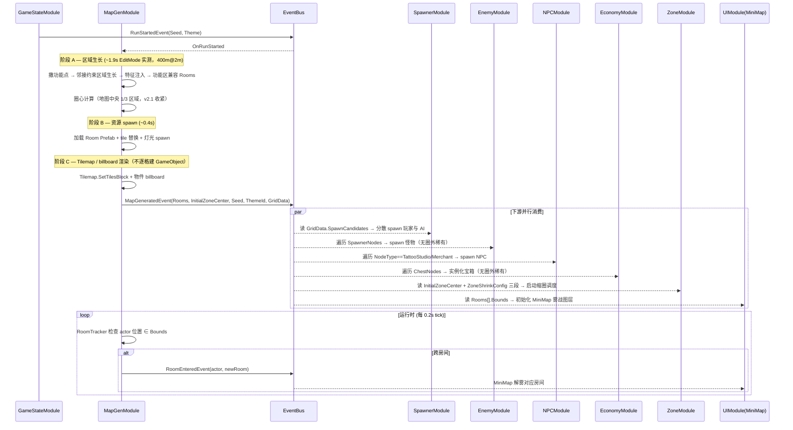

# 07-MapGenModule 模块详设

> **版本**: v2.2 ｜ **修订日期**: 2026-07-02
> **主导 Agent**: client-lead（架构定调）+ client-unity（落地）
> **对应系统 GDD**: [../systems/07-地图生成.md](../systems/07-地图生成.md) v2.2（400×400m / 区域生长 / Tilemap 地形 / 缩圈三段）+ [../systems/15-世界观与轻剧情.md](../systems/15-世界观与轻剧情.md)（主题驱动资源池）
> **当前代码状态**: `MapGenModule` 已接入区域生长生成、Tilemap 地形渲染、billboard 物件与 `MapGeneratedEvent.GridData`。
> **CONTRACT**: [../../../openspec/changes/05-gdd-v2-full-design-docs/CONTRACT.md](../../../openspec/changes/05-gdd-v2-full-design-docs/CONTRACT.md)

---

## 一、模块职责一句话

**Run 开始时一次性完成大地图生成**：执行区域生长（**400×400m，2m/格，200×200 逻辑网格**）→ 必需热点保底分配（Boss / 商人 / 纹身工作室）→ 生成开放式出生候选点 → 邻接约束填充地形 → 特征注入（河流 / 沼泽 / 废墟等）→ Tilemap 铺地面 + billboard 物件 → 缩圈中心计算（**地图中央 1/3 内**）→ 发布 `MapGeneratedEvent`；运行时仅维护"玩家进入了哪个功能区"和地形效果的轻量判定，不做任何 per-frame 几何生成。

> **不做的事**（边界）：不 spawn actor（→ SpawnerModule）/ 不 spawn 怪物或宝箱实体（→ Enemy/EconomyModule 订阅事件后做）/ 不实例化 NPC（→ NPCModule）/ 不管相机（v2 由 SceneModule 或既有 PlayerCamera 处理，本模块**显式不接管**，详见 §九 §9.3）/ 不驱动缩圈逻辑（只输出初始圈心 + 三段阶段配置，缩圈推进由独立 `ZoneModule` 负责）/ **不 spawn 圈外稀有节点**（v2.1 移除，详见 §4.1）。

---

## 二、IGameModule 接口签名

```csharp
public sealed class MapGenModule : IGameModule
{
    public int ModuleCategory => 3;          // Game Logic 层
    public Type[] Dependencies => new[]
    {
        typeof(DataTableModule),             // 读 MapTemplateConfig / RoomConnectionRules / MapThemeConfig / ZoneShrinkConfig
        typeof(ResourceModule),              // 加载 Room Prefab、tileset、装饰物
    };
    // SpawnerModule / EnemyModule / NPCModule / ZoneModule 全部通过 EventBus 解耦，不进 Dependencies
}
```

> **ModuleCategory = 3** 与 [CONTRACT §二](../../../openspec/changes/05-gdd-v2-full-design-docs/CONTRACT.md) 依赖图一致：`DataTable / Resource → MapGen → Spawner / Enemy / NPC / Zone`。

### 生命周期

- `InitializeAsync`：仅做结构初始化（生成 RNG 占位、清空房间表）。**不读 DataTable 数据、不发事件**（遵守"InitAsync 期间不发事件"约束）。
- `OnRunStarted`（后续订阅 `RunStartedEvent`）：触发实际生成流程。当前实现仍在初始化后一帧生成默认地图，作为 v2.2 过渡路径。400m@2m 区域生长 + Tilemap 渲染的 EditMode 验收预算为 **≤ 3.0s（PC）**，超时降级（见 §六）。
- `ShutdownAsync`：销毁所有 spawn 的场景 GameObject，释放 NavMeshData，清空 `RoomInfo` 缓存。

---

## 三、订阅 / 发布事件

### 3.1 发布（已在 CONTRACT §1.6 / §1.9 锁死，不允许修改签名）

```csharp
MapGeneratedEvent { int Seed; int ThemeId; List<RoomInfo> Rooms;
                    Vector2 InitialZoneCenter; float MapSize;
                    MapGridData GridData; float CellSize; }
RoomEnteredEvent  { Actor Enterer; RoomRef Room; } // 玩家/AI 跨房间触发
```

- `MapGeneratedEvent` 在地图生成与渲染接入完成后**单次**发布，是 Run 内最关键的"地图就绪"信号。下游 SpawnerModule / EnemyModule / NPCModule / EconomyModule / EventModule / CombatModule / UIModule(MiniMap) 可继续消费旧字段，也可读取 `GridData`。
- `RoomEnteredEvent` 在运行时由 MapGenModule 内的轻量 `RoomTracker` 子组件检测发布——基于 actor 位置与 `RoomInfo.Bounds` AABB 判定，每 0.2s tick 一次（不是每帧）。

### 3.2 订阅

| 事件 | 用途 |
|---|---|
| `RunStartedEvent` | 唯一的生成触发点。携带 `Seed + MapTheme` |
| `RunEndedEvent` | 清理 spawn 的场景 GameObject，释放 NavMeshData |
| `ActorDiedEvent` | 仅用于停止该 actor 的 `RoomTracker` tick（避免对死亡 actor 继续做 AABB 判定） |

> **明确不订阅**：`ZoneShrinkPhaseEvent`（缩圈中心 + 三段阶段配置已通过 `MapGeneratedEvent.InitialZoneCenter` + ZoneShrinkConfig 一次性交付，本模块不参与缩圈推进）。

---

## 四、DataTable Schema

`MapTemplateConfig.json` / `RoomConnectionRules.json` 字段已在 [系统 GDD §4.1/§4.2](../systems/07-地图生成.md) 详细给出，此处仅声明本模块的**额外读取约定**：

| DataTable | 用途 | 关键字段 |
|---|---|---|
| `MapTemplateConfig` | 地图主题入口。**v2.2**：`MapSize` 改为 **400**（单位 m）；`MinRoomSize` / `BspMaxDepth` 为 BSP 遗留字段，不再参与区域生长路径 | `MapSize=400`, `ThemeName`, `TerrainPoolId`, `PrefabPath` |
| `TerrainTypeConfig` | TerrainType 到资源键、可行走性、移速倍率、区域生长权重的映射 | `Id`, `TypeName`, `TileAssetKey`, `IsWalkable`, `MoveSpeedMul`, `GrowthWeight` |
| `TerrainAdjacencyRules` | 地形 4 邻接白名单，保证水→岸→陆等自然过渡 | `FromType`, `ToType`, `Allowed` |
| `FeatureInjectionConfig` | 河流 / 沼泽 / 废墟等特征注入配置 | `FeatureName`, `TerrainType`, `SpreadMode`, `CountMin/Max`, `SizeMin/Max` |
| `FeaturePointConfig` | 必需热点保底配置，不含出生点 | `PointType`, `Required`, `MinSpacing`, `SafeMargin`, `PreferredTerrain` |
| `ZoneShrinkConfig` | **v2.1 三段式**：读取 5 个阶段参数（初始 / Phase1@3min / Phase2@6min / Phase3@9min 急收 / Phase4@11:30 慢收死圈），转发给 ZoneModule；本模块仅消费**初始安全圈半径 65m + 阶段 1 圈心约束**用于内部校验 | `Phase`, `StartTime`, `Duration`, `TargetRadius`, `OutZoneDamage` |

### 4.1 v2.1 关键点位差异（去圈外稀有）

| 点位类型 | v2.0 行为 | **v2.1 行为** |
|---|---|---|
| EnemySpawner（普通） | 全图随机 | 全图随机（不变） |
| EnemySpawner（精英） | 全图随机 | **优先分布在缩圈路径边缘**（距初始圈边界 20-40m，`SpawnBias = "ZoneEdge"`） |
| ChestNode（普通） | 全图随机 | 全图随机（不变） |
| **稀有怪 / 稀有宝箱节点** | 圈外区域加权刷新 | **完全移除**——MapGenModule 不在 `RoomInfo.SpawnerNodes` / `ChestNodes` 中标记任何 `Tier=Rare` 且 `OutsideInitialZone=true` 的节点 |

> **设计意图**：圈外仅作伤害区，不提供奖励诱因。避免玩家因"圈外稀有"而做高风险低收益迂回，保持决策清晰（系统 GDD §2.3 v2.1 决议）。

### 4.2 `RoomInfo` 运行时结构（事件 payload，非 DataTable）

```csharp
public sealed class RoomInfo {
    public RoomRef       RoomRef;       // 唯一 ID（int + 弱引用 GameObject）
    public Rect          Bounds;        // 世界坐标 AABB，用于 RoomEnteredEvent 判定 & MiniMap
    public RoomNodeType  NodeType;      // Normal | TattooStudio | Merchant | BossRoom | EnvNarrative
    public SizeCategory  Size;          // Small / Medium / Large
    public List<NodeSlot> SpawnerNodes; // EnemySpawner 槽（位置 + Tier + SpawnBias）；v2.1 不含 Rare+Outside
    public List<NodeSlot> ChestNodes;   // 宝箱槽；v2.1 不含 Rare+Outside
    public List<NodeSlot> NpcSlots;     // NPC 槽（仅 NodeType=TattooStudio/Merchant 时非空）
}
```

---

## 五、与其他模块的交互序列


```mermaid
sequenceDiagram
    participant Run as GameStateModule
    participant Map as MapGenModule
    participant Bus as EventBus
    participant Spawn as SpawnerModule
    participant Enemy as EnemyModule
    participant NPC as NPCModule
    participant Econ as EconomyModule
    participant Zone as ZoneModule
    participant UI as UIModule(MiniMap)

    Run->>Bus: RunStartedEvent(Seed, Theme)
    Bus-->>Map: OnRunStarted
    Note over Map: 阶段 A — 区域生长 (~1.9s EditMode 实测，400m@2m)
    Map->>Map: 撒功能点 → 邻接约束区域生长 → 特征注入 → 功能区兼容 Rooms
    Map->>Map: 圈心计算（地图中央 1/3 区域，v2.1 收紧）
    Note over Map: 阶段 B — 资源 spawn (~0.4s)
    Map->>Map: 加载 Room Prefab + tile 替换 + 灯光 spawn
    Note over Map: 阶段 C — Tilemap / billboard 渲染（不逐格建 GameObject）
    Map->>Map: Tilemap.SetTilesBlock + 物件 billboard
    Map->>Bus: MapGeneratedEvent(Rooms, InitialZoneCenter, Seed, ThemeId, GridData)
    par 下游并行消费
        Bus-->>Spawn: 读 GridData.SpawnCandidates → 分散 spawn 玩家与 AI
        Bus-->>Enemy: 遍历 SpawnerNodes → spawn 怪物（无圈外稀有）
        Bus-->>NPC: 遍历 NodeType==TattooStudio/Merchant → spawn NPC
        Bus-->>Econ: 遍历 ChestNodes → 实例化宝箱（无圈外稀有）
        Bus-->>Zone: 读 InitialZoneCenter + ZoneShrinkConfig 三段 → 启动缩圈调度
        Bus-->>UI: 读 Rooms[].Bounds → 初始化 MiniMap 雾战图层
    end
    loop 运行时 (每 0.2s tick)
        Map->>Map: RoomTracker 检查 actor 位置 ∈ Bounds
        alt 跨房间
            Map->>Bus: RoomEnteredEvent(actor, newRoom)
            Bus-->>UI: MiniMap 解雾对应房间
        end
    end
```

**关键约束**：阶段 A/B/C 在单次生成流程内串行；当前 v2.2 不做运行时 NavMesh bake，地面走 Tilemap 批量铺设，物件只在有限放置点生成 billboard。下游订阅者一律在 `MapGeneratedEvent` 后读取地图状态，不允许中途 peek。

---

## 六、性能预算（v2.2 — 400m 地图 + 20-29 AI + 玩家）

| 指标 | v2.1 预算 | **v2.2 预算** | 实测/估算依据 |
|---|---|---|---|
| **总生成耗时（loading 期）** | ≤ 2.5s（PC）/ ≤ 4.0s（移动） | **≤ 3.0s（PC）/ ≤ 5.0s（移动）** | 400m@2m EditMode 实测约 1.9s，无 warning |
| 区域生长 + 特征注入 | 新增 | **≤ 3.0s（PC EditMode）** | 200×200 逻辑网格，O(格数) |
| 关键点位保底分配 | ≤ 0.1s | ≤ 0.1s | Required 功能点数量很小 |
| Tilemap 铺地 + billboard 物件 | 新增 | **不逐格建 GameObject** | 地面 40000 格走 Tilemap；物件数量受控 |
| **NavMesh bake** | ≤ 1.5s | 后续阶段补 | 当前 v2.2 使用直线/Transform 占位移动，不在本 change 烘焙 |
| **运行时帧开销** | 0 ms / 帧 | 0 ms / 帧（不变） | 除 RoomTracker（0.2s tick） |
| RoomTracker / TerrainEffect tick 开销 | < 0.03ms / 30 actor / tick | **0.2s tick，运行时 0 GC** | 地形效果按玩家当前位置查格，不逐帧分配 |
| GC 分配（运行时） | 0 KB/s | 0 KB/s（不变） | `RoomEnteredEvent` 复用 struct payload |
| GC 分配（生成期） | < 5 MB 一次性 | **< 4 MB 一次性** | 房间数与 tile mesh 同比减少 |
| 内存常驻 | < 30 MB | **< 25 MB** | NavMeshData ~7MB + tile cache ~16MB |

**超时降级策略**（已在 [系统 GDD §7.2](../systems/07-地图生成.md) 决定）：

1. 静态房 prefab `NavMeshStatic = true`，运行时只 bake 走廊
2. 仍超时 → 分区懒加载（玩家未进入区域延迟 bake）
3. 仍超时 → NavMesh Agent 尺寸加倍降精度
4. 最终保底 → 离线预生成 50 个种子地图库，运行时直接读

实现优先级：先做 1，2/3/4 作为风险缓冲方案放进 `risks/` 备忘录，不在 MVP 实现。

---

## 七、伪联机 → 真联机迁移点

| 项 | 伪联机（本期） | 真联机（未来） | 迁移成本 |
|---|---|---|---|
| **生成职责** | 客户端 MapGenModule 本地生成 | 主机/服务器生成 + 广播 | **低** — 把 `OnRunStarted` 改为：主机继续本地生成；客户端等待主机的 `MapDataSyncMessage`（含 seed + theme + 关键点位）后跳过几何生成、仅做 NavMesh bake |
| **Seed 同步** | `RunStartedEvent.Seed` 本地生成 | 主机生成 seed → 网络广播 | **零** — Seed 已经在事件 payload 中，只需 NetworkPlayerController 注入 |
| **区域生长算法** | 单机本地决定性算法（同 seed → 同地图） | 同 seed → 同地图（无需同步几何） | **低** — `RegionGrowthGenerator` 使用 `System.Random(seed)`，不要用 `UnityEngine.Random` |
| **关键点位** | 同 seed 必定一致 | 同 seed 必定一致 | **零** |
| **NavMesh** | 每客户端本地 bake | 仍每客户端本地 bake | **零** |
| **RoomEnteredEvent** | 本地 actor 触发 | 仍本地触发（仅本玩家视角的雾战相关） | **零** |

**迁移要点**：**禁止使用 `UnityEngine.Random`**（其状态全局共享，无法保证多客户端一致）。本模块**所有**随机决策必须用注入的 `System.Random(seed)` 实例。这是迁移的核心前提，必须从第一行代码起就遵守。

---

## 八、测试策略

### 8.1 EditMode 单元测试（必做）

| 测试用例 | 验证点 |
|---|---|
| `SameSeedProducesSameGridAndFeaturePoints` | 相同 seed 重复生成 100 次，`MapGridData.Grid` 和功能点完全一致 |
| `RequiredFeaturePointsExistAndRespectBounds` | Required 热点（Boss / 商人 / 工作室）每局存在且不越界；出生不作为 FeaturePoint |
| `SpawnCandidatesAreOpenMapWalkableAndAwayFromHotspots` | 出生候选点可行走、远离边界和热点，供玩家/AI 分散落地 |
| `NoRareOutsideZone` | **v2.1 新增**：100 个 seed，验证 `RoomInfo.SpawnerNodes ∪ ChestNodes` 中**不存在** `Tier == Rare && IsOutsideInitialZone == true` 的节点 |
| `Studios_DistributedAcrossQuadrants` | 工作室节点不全堆在同一象限（任意 2 个工作室的角度差 ≥ 60°） |
| `NoIllegalAdjacencyAfterFeatureInjectionAndRepair` | 区域生长 + 特征注入后无非法邻接 |
| `AllWalkableFeaturePointsAreConnected` | 任一出生候选点到所有可行走热点连通 |
| `Generate400mMapCompletesWithinEditModeBudget` | 400m@2m 生成 3 秒内完成且无 warning |
| `Render400mMapUsesTilemapAndLimitedBillboards` | 地面 40000 格走 Tilemap，场景中不出现 4 万个地面 GameObject |
| `ZoneShrinkConfig_ThreePhases_v21` | **v2.1 新增**：读取 ZoneShrinkConfig 后，Phase 数组中存在 StartTime ∈ {0, 180, 360, 540, 690}（对应 0/3/6/9/11:30 min） |

### 8.2 PlayMode 集成测试（建议）

- `Launch_PlayMode_Generates400mMap_WithoutErrors`：Launch 场景进 Play Mode 后 `GameApp` ready，`MapGeneratedEvent` 发布 `Grid=200x200 Cell=2 Size=400`，Console 0 Error。
- `RoomTracker_FiresOnce_PerEntry`：actor teleport 进出房间，每次进入只触发 1 次 `RoomEnteredEvent`（防抖）
- `TerrainEffectTracker_SwampSlowAndRestore`：进入沼泽减速、离开恢复、普通地形无影响。

---

## 九、风险与开放问题

### 9.1 BSP vs WFC vs 区域生长 — 已修订

v2.2 改选 **区域生长 + 邻接约束 + 特征注入**。理由：[系统 GDD §2.2](../systems/07-地图生成.md) — 第一张地图需要拼图式地形过渡（水旁必须是岸、沼泽/废墟自然嵌入），同时保底 Boss / 商人 / 纹身工作室热点，并用开放式出生候选支持随机落地。BSP 适合房间切割，但会把地图表达推向方正房间；WFC 可留作未来离线预生成工具。

### 9.2 Room Prefab 池预加载策略 — 开放

**问题**：16-24 间房（v2.1）每局都从 `Resources.LoadAsync` 加载，首局可能有 0.4-0.8s 的 IO 抖动（150m 减少后比 v2.0 略短）。

**候选方案**：
1. **A**（推荐）：`InitializeAsync` 时按 `MapThemeConfig` 中**所有主题**的 prefab key 预热到 `ResourceModule` 的 Addressable 缓存，常驻内存 ~16MB
2. **B**：每局 Run 开始时按当局 `MapTheme` 预热，跨主题切换时旧主题资源 Release
3. **C**：全 lazy，每个房间用到时再加载（简单但卡顿不可控）

**倾向**：A。本期实现先按方案 A 写，预留 B 的开关。

### 9.3 相机 spawn 责任归属 — 已决策

**问题**：v1 SpawnerModule 用 CreatePrimitive 拼了一个相机；v2 SpawnerModule 不再管相机。

**决策**：**MapGenModule v2 也不做**。相机由场景里的常驻 `MainCamera` GameObject 提供，或由独立 `SceneModule`（既有）在 GameApp 启动时一次性创建并 `DontDestroyOnLoad`。

**写入实现要点**：MapGenModule **不引用 Camera 类型**、**不调用任何 Camera API**。

### 9.4 主题 tileset 美术资源量 — 已识别风险

[系统 GDD §7.4](../systems/07-地图生成.md) 已决策：MVP 期只完整出 `AI_RUINS` 一套，其余两套用变色占位。150m 地图后 tile 数量级减少约 20%，但工作量仍可观。本模块**不感知主题完成度**——只要 `MapThemeConfig` 行存在就照常处理。

### 9.5 v2.1 新增风险：早期碰面密度上升 — 已识别

400m 开放地图早期（Phase 0 大圈）玩家与 AI 分散出生，碰面概率主要由 SpawnCandidates 的间距、候选密度和缩圈节奏决定。**应对**：出生候选点避开热点近旁并保持初始间距，纹身师工作室作为开放热点保底存在，但不再依赖“距出生圈 ≥ 30m”的线性缓冲规则。

### 9.6 开放问题（不阻塞 MVP）

1. **房间种子是否暴露给玩家**：在 Run 结算面板显示 seed，方便分享布局——倾向"显示"。
2. **垂直层差地形**：本期纯平面，v3 议题。
3. **`RoomTracker` 跳频策略**：actor 距 boundary > 1m 才认为完成跨入，避免反复触发。

---

## 十、引用

- [系统 GDD: 07-地图生成 v2.1](../systems/07-地图生成.md)
- [系统 GDD: 15-世界观与轻剧情](../systems/15-世界观与轻剧情.md)
- [CONTRACT.md §1.6 地图事件 / §1.9 Run 事件](../../../openspec/changes/05-gdd-v2-full-design-docs/CONTRACT.md)
- [模块详设: 06-SpawnerModule](./06-SpawnerModule.md)（消费 `MapGeneratedEvent` 的首要下游）
- [模块详设: 08-EnemyModule+BossModule](./08-EnemyModule+BossModule.md)（消费 `SpawnerNodes` / `BossRoom`）
