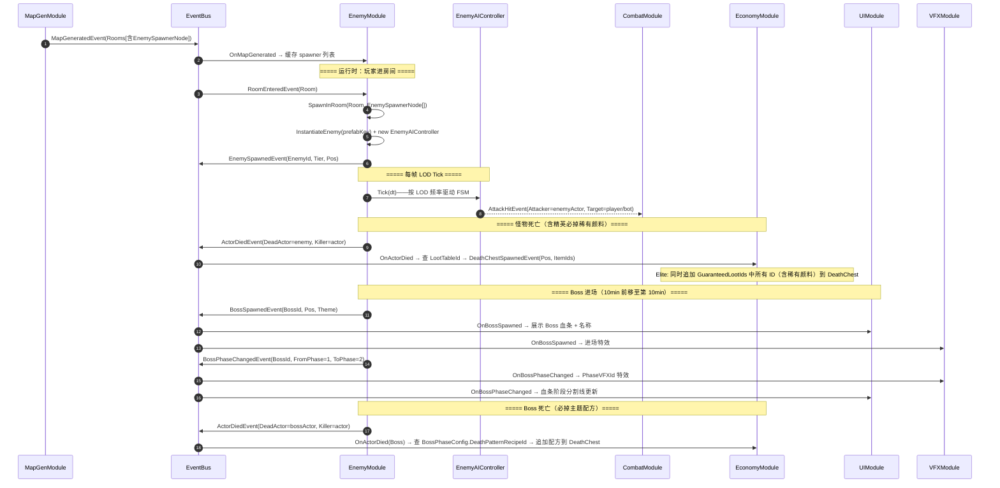
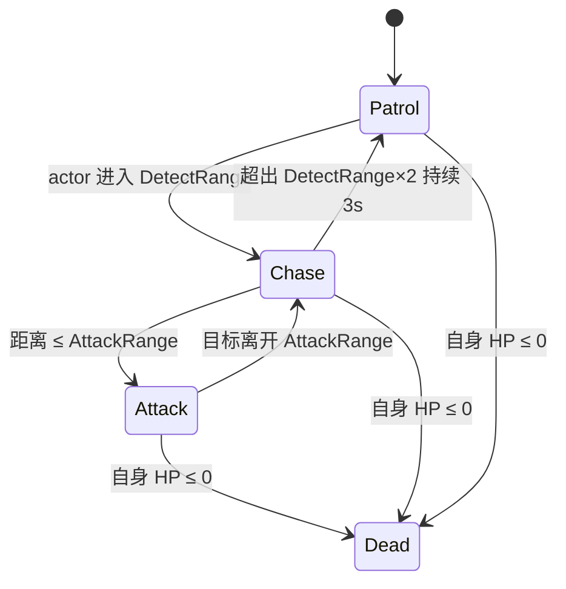
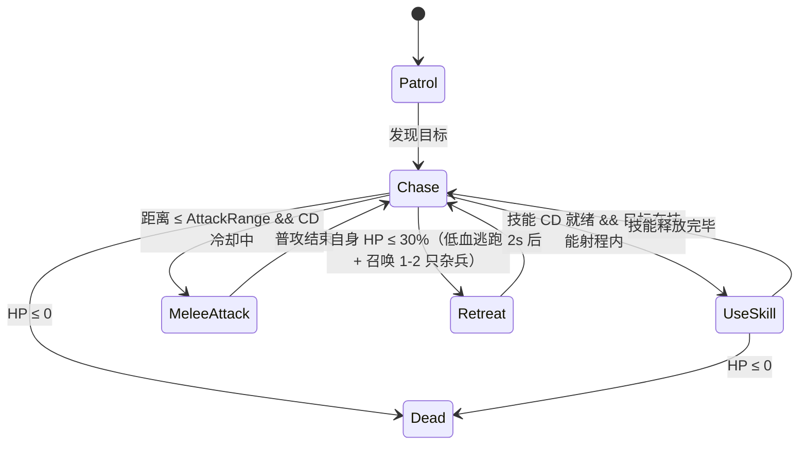
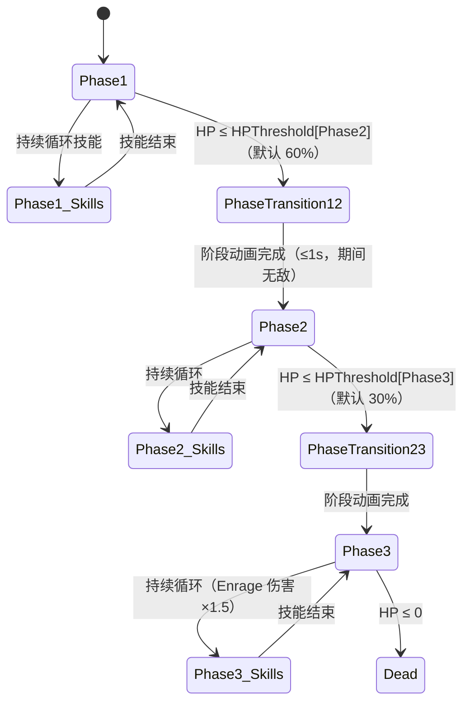

# 08-EnemyModule + BossModule 模块详设

> **版本**: v2.1 ｜ **修订日期**: 2026-06-25

> **主导 Agent**: client-unity
> **对应系统 GDD**: [../systems/11-怪物与Boss.md](../systems/11-怪物与Boss.md)（玩家视角设计；本详设是工程落地）
> **当前代码状态**: 新建（本期仅落契约与 9 节详设，不写实现代码）
> **CONTRACT**: [../../openspec/changes/05-gdd-v2-full-design-docs/CONTRACT.md](../../../openspec/changes/05-gdd-v2-full-design-docs/CONTRACT.md)

---

## 一、模块职责

### 一句话

`EnemyModule` 负责怪物（Light / Elite / Boss 三层）的 **spawn、LOD 驱动的 AI 决策、生命周期管理与掉落触发**；`BossModule` 作为 `EnemyModule` 的子系统，专属管理 Boss 的**阶段状态机、阶段转换特效与仇恨分散**——两者共用同一模块入口，以 `IGameModule` 形式注册，对外统一暴露为 `EnemyModule`。

### 三层职责分界

| 层级 | 怪物类型 | 核心职责 |
|---|---|---|
| **Light（杂兵）** | 40-80 只 / Run | spawn-on-demand、极简 5 节点 FSM、视野外冻结决策 |
| **Elite（精英）** | 5-10 只 / Run | 稀疏 spawn、追加 UseSkill / Retreat 状态、低血召唤援兵、**必掉稀有颜料** |
| **Boss** | 1 只 / Run | 三阶段 FSM + `BossPhaseConfig` 驱动 + 仇恨分散 + 全局地图标记 + **必掉主题配方** |

### 职责边界（不做什么）

- **不**创建玩家 / Bot actor（那是 `SpawnerModule` 的职责）
- **不**占用 50-actor 预算（怪物独立于 CONTRACT §四 的 50 actor 上限之外）
- **不**实现 `IPlayerController`（怪物用独立 `EnemyAIController`，见 §六）
- **不**做掉落物实体化（死亡后发布 `DeathChestSpawnedEvent`，由 `EconomyModule` 消费并生成 DeathChest）

---

## 二、IGameModule 接口签名

```csharp
public sealed class EnemyModule : IGameModule, ITickable
{
    public int ModuleCategory => 3;  // Game Logic 层

    public Type[] Dependencies => new[]
    {
        typeof(MapGenModule),       // 读取 EnemySpawnerNode 位置与触发条件
        typeof(DataTableModule),    // 读取 EnemyConfig / BossPhaseConfig
    };
    // CombatModule / VFXModule / AudioModule / EconomyModule / UIModule
    // 全部走运行时事件，不进 Dependencies
}
```

### 生命周期说明

| 方法 | 行为 |
|---|---|
| `InitializeAsync` | 从 `DataTableModule` 预加载 `EnemyConfig` / `BossPhaseConfig` 表；预分配 `EnemyAIController` 对象池 |
| `OnMapGenerated`（订阅） | 读取 `MapGeneratedEvent.Rooms` 中的 `EnemySpawnerNode` 列表，按 Tier 分桶缓存 |
| `OnRoomEntered`（订阅） | 触发对应 Room 内 Light / Elite spawner；`SpawnBias=ZoneEdge` 的精英 spawner 由 `ZoneShrinkPhaseEvent` 额外触发 |
| `OnUpdate(dt)` | 驱动 `EnemyLODScheduler` 分桶决策 Tick |
| `ShutdownAsync` | 销毁所有存活怪物 GameObject，回收 controller 池 |

---

## 三、订阅 / 发布事件全签名

### 3.1 发布

```csharp
// 怪物 spawn（玩家视角：精英 / Boss 用于 UI 标记）
EnemySpawnedEvent   { string EnemyId; EnemyTier Tier; Vector3 Pos; GameObject Go; }

// 怪物死亡——复用 CONTRACT §1.2 已有事件，Killer 可为 null（缩圈毒圈致死）
ActorDiedEvent      { Actor DeadActor; Actor Killer; Vector3 DeathPos; }

// Boss 专属：Boss 进场（地图标记 + UI Boss 血条启动信号）
// v2.1 新增：Theme 字段供 EconomyModule 查 BossPhaseConfig.DeathPatternRecipeId
BossSpawnedEvent    { string BossId; Vector3 Pos; MapTheme Theme; }

// Boss 专属：阶段转换
BossPhaseChangedEvent { string BossId; int FromPhase; int ToPhase; float NewEnrageMultiplier; }
```

> `EnemySpawnedEvent` 与 `BossSpawnedEvent` 均为本模块新增事件；`ActorDiedEvent` 已在 CONTRACT §1.2 锁死，本模块直接复用，Killer 字段为击杀者 actor（可为 Bot actor，保证怪物平等攻击所有 actor）。
>
> **v2.1 说明**：`BossSpawnedEvent` 与 `BossPhaseChangedEvent` 已写入 CONTRACT（本次修订同步更新），本模块负责发出，`EconomyModule` 消费 `ActorDiedEvent`（BossId 标识）后查 `BossPhaseConfig.DeathPatternRecipeId` 完成必掉配方逻辑。

### 3.2 订阅

| 事件 | 用途 |
|---|---|
| `MapGeneratedEvent` | 读取所有 `EnemySpawnerNode`，按 Tier / SpawnBias 分桶 |
| `RoomEnteredEvent` | 触发进入该 Room 对应的 spawner（Light 立即，Elite 延迟 2s 保留悬念） |
| `ZoneShrinkPhaseEvent` | `SpawnBias=ZoneEdge` 的精英 spawner 在该阶段触发；同时通知视野外 Light 冻结移动目标 |
| `ActorDiedEvent`（Killer 侧） | 通知 Boss 仇恨分散模块：本次杀伤玩家 / Bot 的 actor 列表 |
| `RunEndedEvent` | 全局清理：销毁所有怪物，重置 spawner 状态 |

---

## 四、DataTable Schema

两张表均来自 GDD `11-怪物与Boss.md §四` 草案，以下为工程落地版（补充 `rows[]` 字段与工具提示）。

### 4.1 `EnemyConfig.json`

**v2.1 新增字段**：`GuaranteedLootIds`（精英必掉物品列表）、`ElitePaintDropRare`（稀有颜料掉落标记）。

```json
{
  "table": "EnemyConfig",
  "fields": [
    { "name": "EnemyId",            "type": "string",   "desc": "怪物唯一 ID，如 enemy_ai_servo_light" },
    { "name": "DisplayName",        "type": "string",   "desc": "本地化键，如 enemy.ai_servo" },
    { "name": "ThemeId",            "type": "string",   "desc": "AI_RUINS | ALIEN_HIVE | VIRUS_SWAMP | common" },
    { "name": "Tier",               "type": "string",   "desc": "Light | Elite | Boss" },
    { "name": "BaseHP",             "type": "float",    "desc": "Run 第 0 分钟基础 HP" },
    { "name": "HPCurveK",           "type": "float",    "desc": "HP 线性增长系数，HP_t = BaseHP × (1 + K × t_min)" },
    { "name": "BaseDamage",         "type": "float",    "desc": "基础攻击伤害 (point)" },
    { "name": "DamageCurveK",       "type": "float",    "desc": "伤害随时间增长系数，逻辑同 HPCurveK" },
    { "name": "MoveSpeed",          "type": "float",    "desc": "移动速度 (m/s)" },
    { "name": "AttackRange",        "type": "float",    "desc": "攻击判定范围 (m)" },
    { "name": "DetectRange",        "type": "float",    "desc": "感知半径 (m)；失追距离 = DetectRange × 2" },
    { "name": "SkillIds",           "type": "string",   "desc": "技能 ID 逗号分隔；Light 通常空，Elite 1-3 个，Boss 3-6 个" },
    { "name": "LootTableId",        "type": "string",   "desc": "随机掉落表 ID，对应 LootTableConfig.json" },
    { "name": "GuaranteedLootIds",  "type": "string",   "desc": "v2.1 新增：必掉物品 ID 逗号分隔，如 paint_rare_001；Light 填空，Elite 必填 ≥1 个稀有颜料 ID，Boss 留空（走 BossPhaseConfig.DeathPatternRecipeId）" },
    { "name": "ElitePaintDropRare", "type": "int",      "desc": "v2.1 新增：精英必掉稀有颜料标记；1=必掉，0=不掉（仅对 Tier=Elite 生效，其他 Tier 填 0）" },
    { "name": "XPReward",           "type": "int",      "desc": "击杀奖励 XP（0 表示无局内成长）" },
    { "name": "CoinReward",         "type": "string",   "desc": "击杀掉落金币范围，格式 min-max，如 5-15" },
    { "name": "PoolIds",            "type": "string",   "desc": "所属怪物池 ID，逗号分隔，可跨主题" }
  ],
  "rows": []
}
```

### 4.2 `BossPhaseConfig.json`

**v2.1 新增字段**：`DeathPatternRecipeId`（Boss 死亡时必掉的主题配方 ID）。

```json
{
  "table": "BossPhaseConfig",
  "fields": [
    { "name": "BossId",               "type": "string",  "desc": "对应 EnemyConfig.EnemyId" },
    { "name": "PhaseIndex",           "type": "int",     "desc": "阶段编号：1 / 2 / 3" },
    { "name": "HPThreshold",          "type": "float",   "desc": "进入本阶段的 HP 百分比：1.0=满血，0.6=60%HP" },
    { "name": "NewSkillIds",          "type": "string",  "desc": "本阶段解锁技能 ID，逗号分隔，叠加不替换前阶段" },
    { "name": "EnrageMultiplier",     "type": "float",   "desc": "本阶段伤害倍率，1.0=无变化，1.5=伤害 ×1.5" },
    { "name": "PhaseVFXId",           "type": "string",  "desc": "阶段转换特效 ID，VFXModule 订阅 BossPhaseChangedEvent 消费" },
    { "name": "PhaseBGMCueId",        "type": "string",  "desc": "阶段 BGM cue ID，AudioModule 订阅 BossPhaseChangedEvent 切换" },
    { "name": "DeathPatternRecipeId", "type": "string",  "desc": "v2.1 新增：Boss 死亡时必掉的主题配方 ID（仅 PhaseIndex=3 即最终阶段有效，其他阶段填空）；EconomyModule 订阅 ActorDiedEvent 并读取本字段完成必掉逻辑；不同 Boss 对应各自主题配方，如 recipe_ai_ruins_boss / recipe_alien_hive_boss" }
  ],
  "rows": []
}
```

> **DataTable 工作流提示（v2.1）**：以上两张表新增了字段（`EnemyConfig` 增 2 个，`BossPhaseConfig` 增 1 个），必须先在 Unity 运行 `Tools/DataTable/生成全部配置表代码`，重新生成 `Assets/Scripts/DataTable/EnemyConfig.cs` / `BossPhaseConfig.cs`，再写读取逻辑。**请先完成此步骤再继续开发。**

---

## 五、与其他模块的交互序列



---

## 六、EnemyAIController — 架构与 FSM

### 6.1 为什么不复用 IPlayerController

`IPlayerController` 承载了纹身 Build 规划（`TattooModule.Equip`）、武器切换、技能释放、购买决策等接口，这些是 Bot 玩家行为所必需的，但怪物完全不需要。复用 `IPlayerController` 会把 Build 系统的所有依赖引入 `EnemyModule`，违反模块最小依赖原则。

| 对比维度 | IPlayerController（玩家/Bot） | EnemyAIController（怪物） |
|---|---|---|
| 纹身 Build | 需要 | 不需要 |
| 武器切换 | 需要 | 不需要，攻击逻辑内嵌 SkillIds |
| 决策驱动 | BotBuildPlanner + SmartBot | 纯 FSM（无 Build 规划） |
| 性能归属 | CONTRACT §四 50 actor 预算 | EnemyModule 独立预算 |
| 接口 | IPlayerController | EnemyAIController（独立类） |

### 6.2 Light 杂兵 FSM（5 节点）



- 目标选择：最近 actor（不区分玩家 / Bot），保证 AI Bot 也承受 PVE 压力
- 视野外冻结：超出 20m 时停止寻路，停在当前位置，决策频率降至 0.5 Hz（2s）
- 寻路策略：Light 不走完整 NavMesh，仅用「目标方向向量 + 单根障碍 Raycast」的 wander 模型（见 §六·6.5）

### 6.3 Elite 精英 FSM（追加 UseSkill / Retreat）



**精英必掉稀有颜料**：Elite 死亡时，`EconomyModule` 读取 `EnemyConfig.GuaranteedLootIds`，将其中所有 ID（至少含 1 个稀有颜料 ID）追加到 DeathChest 的物品列表，保证 100% 掉落。`ElitePaintDropRare=1` 时为必掉标记（供策划一眼确认），最终掉落物以 `GuaranteedLootIds` 字段内容为准。

### 6.4 Boss FSM（三阶段 + BossPhaseConfig 驱动）



阶段切换时发布 `BossPhaseChangedEvent`，`AudioModule` / `UIModule` / `VFXModule` 各自订阅消费，本模块不感知下游。

**Boss 必掉主题配方**：Boss 死亡时（HP ≤ 0，Phase3 → Dead），`EconomyModule` 订阅 `ActorDiedEvent`，识别 `DeadActor.Tier == Boss` 后，读取 `BossPhaseConfig`（PhaseIndex=3）的 `DeathPatternRecipeId`，将该配方 ID 追加到 DeathChest，保证 100% 掉落。每个 Boss 对应唯一主题配方，玩家首次击败 Boss 方可解锁对应配方，同一 Run 内重复击败不重复追加。

**仇恨分散**：Boss 的 AOE 技能优先针对最近 3 个 actor（不锁定单一目标），防止单人 skip Boss；实现为 `OverlapSphere(BossPos, AoeRadius)` 返回的 actor 列表按距离排序取前 3。

### 6.5 寻路策略分层

| Tier | 寻路方案 | 理由 |
|---|---|---|
| Light | 目标方向向量 + 单根障碍 Raycast | 数量最多（40-80），NavMesh 代价不可承受 |
| Elite | 完整 NavMesh（`NavMeshAgent`） | 数量少（5-10），要绕路 / 侧翼 / 召唤援兵 |
| Boss | 完整 NavMesh + 阶段专属位移技能 | 全程视野内，每帧决策，NavMesh 路径缓存 |

视野外（>20m）的 Light / Elite 停止寻路，冻结位置；Boss 不走 LOD，全程每帧决策（因其他 actor 可能正在战斗）。

---

## 七、Run 节奏与 Boss 刷新时序（v2.1 修订）

### 7.1 10-15min 节奏设计

| 时段 | 主要事件 |
|---|---|
| 0-5min | Light 杂兵刷新，玩家收集基础资源与颜料 |
| 5-8min | Elite 精英开始出现（`ZoneShrinkPhaseEvent` 触发 ZoneEdge spawner），稀有颜料开始流入 |
| **10min** | **Boss spawner 触发（v2.1 前移至第 10min）**；同时发布 `BossSpawnedEvent`，UI 展示 Boss 血条 |
| 10-12min | Boss Phase1；玩家可选择战斗或规避继续推进 |
| 12-14min | Boss Phase2（HP ≤ 60%）；地图缩圈加剧 |
| 14min+ | Boss Phase3（HP ≤ 30%）/ 地图极限压缩；击败 Boss 必掉主题配方，Run 进入收尾阶段 |

**设计依据**：v2.0 中 Boss 刷新设在 12min，玩家实际遭遇 Boss 时 Run 已接近尾声，互动窗口不足 3min，配方奖励的"期待感"被压缩。前移至 10min 后，玩家有完整 4-5min 与 Boss 周旋，且配方获得后仍有时间使用当 Run 的纹身合成系统。

### 7.2 50 actor 性能预算与怪物 LOD

CONTRACT §四 的 50-actor 上限针对玩家 + Bot actor（走 `IPlayerController` 接口的 actor）。怪物以独立 `EnemyAIController` 运行，不进 `SpawnerModule._actors[50]` 数组，有独立的性能预算分配。

### 7.3 怪物 LOD 调度表

| 距离玩家 | Light 决策频率 | Elite 决策频率 | Boss 决策频率 |
|---|---|---|---|
| ≤ 20m（视野内） | 5 Hz（0.2s） | 10 Hz（0.1s） | 60 Hz（每帧） |
| > 20m（视野外） | 0.5 Hz（2s），冻结寻路 | 1 Hz（1s） | 不适用（不走 LOD） |

### 7.4 EnemyLODScheduler 实现要点

```
EnemyModule 内维护两个 List<EnemyController>：
  _hotList  — 视野内（距玩家 ≤ 20m）
  _coldList — 视野外（距玩家 > 20m）

每 0.2s 做一次桶迁移扫描（sqrMagnitude < 20*20=400）
OnUpdate(dt)：
  _hotList  中的每个 controller 按各自 Tier 频率 Tick
  _coldList 用 stride 切片（frame % stride）均摊决策，避免同帧爆发
```

- `OnUpdate` 中**禁止 LINQ / foreach IEnumerable**，用 `for (int i)` + 缓存 `Count`
- 桶迁移不发任何事件（LOD 切换非行为，不写日志）
- `EnemyAIController` 决策返回值用 `struct EnemyIntent { Vector3 MoveDir; bool Attack; string SkillId; }`，避免每帧 alloc

---

## 八、伪联机 → 真联机迁移点

怪物在当前伪联机阶段完全本地化：spawn、AI 决策、死亡判定均在客户端本地运行。

| 阶段 | 怪物权威方 | 客户端行为 |
|---|---|---|
| **本期（伪联机）** | 本地客户端（单机） | 完整 spawn + AI 决策 + 死亡触发 |
| **中期（4 人合作）** | 主机（Host）权威 | 主机运行 EnemyModule，客户端接收同步快照 |
| **远期（PvP 大逃杀）** | 专用服务器权威 | 客户端只接收 `EnemySpawnedEvent` / `ActorDiedEvent` 同步包，本地 EnemyModule 退化为「视觉插值层」 |

**迁移代码改动面（预估）**：
1. `EnemyModule.SpawnInRoom` 替换为「接收服务端 SpawnPacket」触发实例化
2. `EnemyAIController.Tick` 在从机上置为 noop，改走网络状态同步
3. `ActorDiedEvent` 触发时机由本地判定改为服务端下发——`EnemyModule` 之外所有订阅者**零改动**

---

## 九、测试策略

### 9.1 EditMode 单测（`Assets/Tests/EditMode/Enemy/`）

```csharp
// EnemyAIControllerFSMTests.cs
[Test] public void LightFSM_Patrol_TransitionsToChase_WhenActorEntersDetectRange()
[Test] public void LightFSM_Chase_TransitionsToPatrol_WhenTargetExceedsLostTrackDistance()
[Test] public void EliteFSM_Chase_TransitionsToUseSkill_WhenCDReadyAndInRange()
[Test] public void EliteFSM_Retreat_TriggersAt30PercentHP()

// BossFSMTests.cs
[Test] public void BossFSM_Phase1ToPhase2_TriggeredAtHPThreshold()
[Test] public void BossFSM_Phase3_AppliesEnrageMultiplier()
[Test] public void BossFSM_PhaseTransition_PublishesBossPhaseChangedEvent()
[Test] public void BossPhaseConfig_ThreePhases_HPThresholds_Descending()  // 验证 1.0 > 0.6 > 0.3

// EnemyConfigTests.cs
[Test] public void EnemyConfig_HPCurve_Formula_MatchesGDDSpec()  // HP_t = BaseHP × (1 + K × t)
[Test] public void EnemyConfig_PoolIds_NotEmpty_ForAllEntries()

// v2.1 新增
[Test] public void EliteConfig_GuaranteedLootIds_NotEmpty_WhenElitePaintDropRareIsOne()
[Test] public void BossPhaseConfig_Phase3_DeathPatternRecipeId_NotEmpty_ForAllBosses()
[Test] public void BossDeath_DeathPatternRecipeId_AddedToDeathChest_ExactlyOnce()
```

### 9.2 PlayMode 集成测（`Assets/Tests/PlayMode/Enemy/`）

```
EnemySpawnIntegrationTest.cs：
  - 发布 mock MapGeneratedEvent（含 3 个 EnemySpawnerNode：Light×2, Elite×1）
  - 发布 mock RoomEnteredEvent → 断言 EnemySpawnedEvent 在 2s 内被发布 3 次
  - 断言 Light 无 NavMeshAgent（确保不走 NavMesh）
  - 断言 Elite 有 NavMeshAgent 且 isActiveAndEnabled = true

BossPhaseIntegrationTest.cs：
  - spawn 一个 Boss → 模拟伤害降至 60% HP → 断言 BossPhaseChangedEvent(FromPhase=1, ToPhase=2) 发布
  - 继续降至 30% → 断言 Phase 3 触发，EnrageMultiplier 已应用到 BaseDamage
  - 断言阶段转换期间（≤1s）Boss 处于无敌状态（不接受 DamagedEvent）
  - v2.1 新增：Boss HP 降至 0 → 断言 ActorDiedEvent 发布后 EconomyModule 收到 DeathPatternRecipeId 非空

EliteLootIntegrationTest.cs（v2.1 新增）：
  - spawn 一个 Elite（ElitePaintDropRare=1）→ 模拟击杀
  - 断言 DeathChestSpawnedEvent.ItemIds 包含 GuaranteedLootIds 中所有 ID
  - 断言稀有颜料 ID 存在于 ItemIds 列表中

EnemyLODTest.cs：
  - 场景内放 20 只 Light，玩家位于中心
  - 将 5 只移出 20m 圆 → 断言 0.2s 内 _coldList.Count == 5
  - 断言 _coldList 中的 controller 不在 _hotList 中（无重复 Tick）

BossSpawnTimingTest.cs（v2.1 新增）：
  - 模拟 Run 推进至 10min 时间节点 → 断言 BossSpawnedEvent 在该时刻发布（±0.5s 容差）
  - 断言 10min 前不发布 BossSpawnedEvent
```

### 9.3 手测验收清单

- Boss 在 Run 第 10min 准时进场（±10s 容差），进场仪式 0s-1.5s：血条淡入 / VFX / BGM Cue 顺序正确，期间玩家可自由移动
- 精英死亡掉落特效明显大于 Light，掉落物中可见稀有颜料图标（高亮/特殊颜色区分）
- Boss 死亡掉落物中可见主题配方道具，同 Run 二次击败不重复产出
- 缩圈危险区边缘可见精英 spawner 触发（`SpawnBias=ZoneEdge`）
- Boss AOE 技能覆盖多个 actor，不单一盯人
- Run 全程节奏检验：0-10min 正常推进、10-14min Boss 战斗、14min+ 收尾压缩感受流畅

---

## 十、风险与开放问题

### 10.1 Boss vs 普通怪是否共用 EnemyAIController（推荐：Boss 单独 BossAIController 继承）

当前 FSM 差异较大（普通怪 5 节点 vs Boss 三阶段多状态），若强行共用单一类则条件分支激增、可读性差。**推荐方案**：`EnemyAIController` 作为基类（含 Patrol / Chase / Attack / Dead 公共逻辑），`BossAIController : EnemyAIController` 覆写 FSM 入口，追加阶段状态机；Elite 亦可继承基类添加 UseSkill / Retreat，保持代码复用。

### 10.2 NavMesh 烘焙时序

地图 v2 为程序化生成，NavMesh 需要在 `MapGeneratedEvent` 发布后异步重烘焙（`NavMeshSurface.UpdateNavMesh`）。EnemyModule 的 Elite / Boss spawn 必须等 NavMesh 就绪后才能创建 `NavMeshAgent`。**推荐**：MapGenModule 在烘焙完成后追加 `NavMeshReadyEvent` 信号，EnemyModule 订阅此信号后才允许 Elite / Boss 启动 NavMeshAgent，Light 不依赖 NavMesh，可在 `EnemySpawnedEvent` 后立即激活。此问题**开放给 07-MapGenModule 详设**落地接口。

### 10.3 EnemyConfig 中 SkillIds / PoolIds / GuaranteedLootIds 使用逗号分隔字符串

DataTableGenerator 当前不原生支持 `string[]` 字段（JSON 字段只生成基本类型）。以上字段以逗号分隔字符串存储，运行时由 `EnemyModule` 调用 `string.Split(',')` 解析。这是已知折中——**不新增数组类型支持，保持现有 DataTableGenerator 工具链稳定**。

### 10.4 怪物不拾取物品

Light / Elite / Boss 均**不执行拾取逻辑**（不实现 `IPlayerController` 的 `ShouldPickup`）。掉落物对怪物透明，仅玩家 / Bot actor 可拾取。

### 10.5 50 只以上怪物 + 50 actor 同场的帧预算总压力

当 80 只 Light + 10 只 Elite + 1 只 Boss + 50 actor 全部激活时（极端情况：Run 终局），帧预算压力来自两侧。EnemyModule LOD 调度保证视野内同帧决策的怪物 ≤ 约 15 只（大部分在视野外 / 冻结），加上 CONTRACT §四 的 Bot LOD，估算总 AI 计算预算 ≤ 6ms / 帧（50 actor ≤ 3.7ms + 怪物 ≤ 2.3ms）。**需 qa-engineer 在 PlayMode 压测中验证 p99 < 25ms**，若超预算首选方案是进一步缩小 `_hotList` 半径（从 20m 缩至 15m）。

### 10.6 Boss 前移至 10min 的平衡影响（v2.1 新增开放问题）

Boss 刷新提前 2min 意味着玩家此时 Build 成熟度更低（纹身槽位可能只填满 60-70%）。**待 gd-system 评估**：是否相应调低 Boss Phase1 的 HP/伤害基准值，或为 10min Boss 增加一个"警告期"（倒计时 UI 提示玩家 Boss 即将出现，给予 30s 缓冲完成当前交互）。本模块已提供 `BossSpawnedEvent` 发布时序接口，具体数值平衡在 `BossPhaseConfig.json` 内调整，不影响本模块实现。

---

## 引用

- [CONTRACT.md](../../../openspec/changes/05-gdd-v2-full-design-docs/CONTRACT.md) §1.2（ActorDiedEvent / TargetKilledEvent）/ §1.6（MapGeneratedEvent / RoomEnteredEvent / ZoneShrinkPhaseEvent）/ §四（50 actor 预算）/ **v2.1 新增：BossSpawnedEvent / BossPhaseChangedEvent 已写入**
- [systems/11-怪物与Boss.md](../systems/11-怪物与Boss.md)（玩家视角 GDD，本详设的上游需求来源）
- [modules/16-BotControllerModule.md](./16-BotControllerModule.md)（EnemyAIController 与 IPlayerController 架构对比参照）
- [modules/06-SpawnerModule.md](./06-SpawnerModule.md)（怪物 spawn 独立于 SpawnerModule 50-actor 路径）
- 配置表：`Assets/Resources/DataTable/EnemyConfig.json` / `Assets/Resources/DataTable/BossPhaseConfig.json`
- 同期模块详设：07-MapGenModule（EnemySpawnerNode 节点数据 / NavMeshReadyEvent）/ 02-CombatModule（AttackHitEvent 消费方）/ VFXModule（BossPhaseChangedEvent 订阅）/ AudioModule（PhaseBGMCueId 切换）/ EconomyModule（GuaranteedLootIds / DeathPatternRecipeId 消费方）
