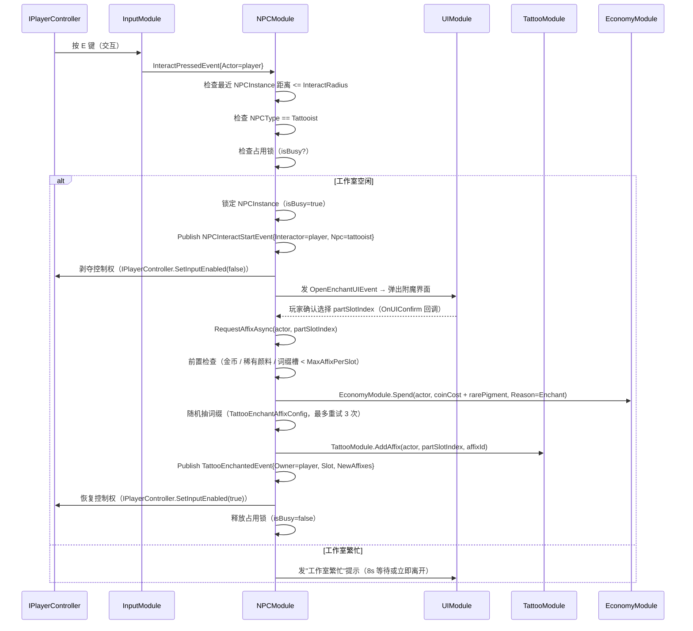
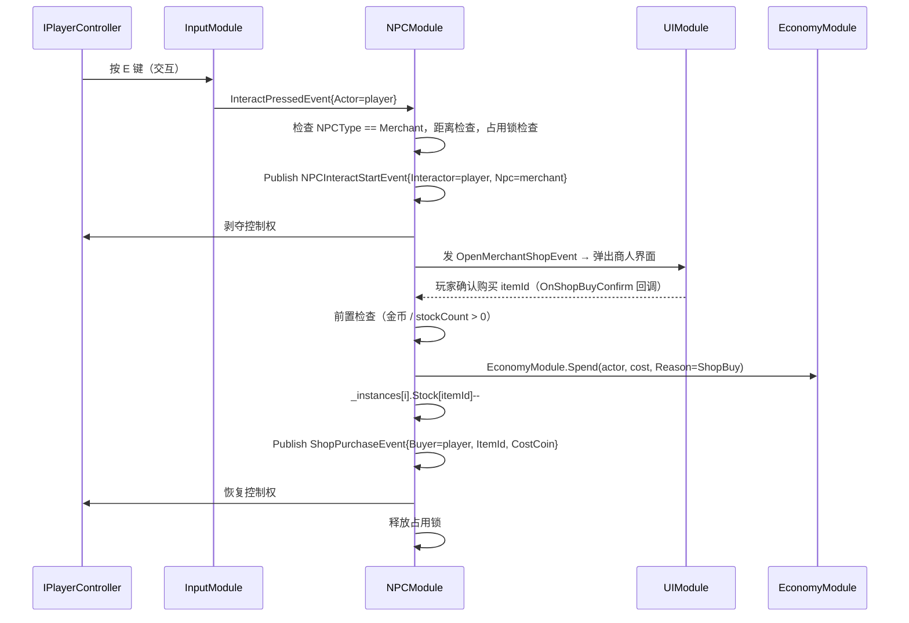

# 09-NPCModule 模块详设

> **版本**: v2.1 ｜ **修订日期**: 2026-06-25 ｜ 主要变更：纹身师=附魔工 / 商人改卖品 / 新增两表
>
> **主导 Agent**: client-unity
> **对应系统 GDD**: ../systems/09-纹身师与商人NPC.md
> **当前代码状态**: 待实现
> **依赖契约**: [CONTRACT.md](../../../openspec/changes/05-gdd-v2-full-design-docs/CONTRACT.md) §1.5 / §1.4（CoinChangedEvent）/ §3 IPlayerController / §4 性能预算

---

## 一、模块职责

NPCModule 承担局内两类 NPC（纹身师 / 商人）的**交互流程管理**与**运行时状态维护**：

- 检测玩家/Bot 进入交互半径，注入"交互提示"，响应交互输入
- 纹身师：执行**词缀附魔**流程（前置检查 → 暂停控制权 → 随机抽取词缀 → 写入 TattooSlot → 发布 TattooEnchantedEvent）
- 商人：维护每个商人实例的**本局库存**（初始抽取 + 可选手动刷新 1 次），处理购买/出售
- 维护每个工作室的"占用锁"（同时只服务 1 名客户）
- 发布 `NPCInteractStartEvent / TattooEnchantedEvent / ShopPurchaseEvent / ShopRefreshEvent`

**NPCModule 不做**：
- 玩家自刻纹身（→ 由 TattooModule + 输入模块自行处理，不经过本模块）
- 伤害判定（→ CombatModule）
- 纹身 Build 最终状态写入（→ TattooModule）
- 金币增减落地（→ EconomyModule，通过 CoinChangedEvent）
- UI 弹窗渲染（→ UIModule）
- NPC 角色 AI 巡逻动画（→ EnemyModule / art-anim）

**v2.1 核心变化**：纹身师**不再触发"刻纹身"四步流程**，其职责精确收窄为**词缀附魔工**；玩家自刻纹身在 TattooModule 内处理，与本模块无关。

---

## 二、IGameModule 接口签名

```csharp
public sealed class NPCModule : IGameModule
{
    public int    ModuleCategory => 3;  // 玩法逻辑层（高于数据层 1 / 地图层 2）
    public Type[] Dependencies   => new[] { typeof(DataTableModule), typeof(MapGenModule) };

    public NPCModule(ModuleRunner runner, EventBus bus);

    /// <summary>
    /// 从 NPCConfig + ShopStockConfig DataTable 初始化 NPC 实例表，
    /// 按 MapGenModule 提供的工作室节点位置注册 NPCInstance。
    /// 严格遵守：InitializeAsync 内不发事件。
    /// </summary>
    public UniTask InitializeAsync(CancellationToken ct = default);

    public UniTask ShutdownAsync(CancellationToken ct = default);

    // 纹身师附魔 API（供 UIModule 确认回调调用）
    // 返回失败原因；成功时 reason == None
    public UniTask<EnchantResult> RequestAffixAsync(
        Actor actor, int partSlotIndex, CancellationToken ct = default);
}

public enum EnchantResult
{
    None,                // 成功
    InsufficientCoin,
    InsufficientRarePigment,
    AffixSlotFull,       // 词缀槽已满 2 个
    AffixDuplicate,      // 重试 3 次仍抽到重复词缀
    NpcBusy,
    InvalidSlot,
}
```

**ModuleCategory = 3 理由**：依赖 DataTableModule（Category 1）和 MapGenModule（Category 2），必须晚于两者完成初始化，属于玩法逻辑层。

**Dependencies 限制**：仅声明具体类型，不声明接口。TattooModule、EconomyModule 是运行时 API 调用对象，在 `RequestAffixAsync` / `OnShopConfirm` 执行时通过 `ModuleRunner.GetModule<T>()` 获取，不放入 Dependencies（避免循环依赖风险）。

---

## 三、事件——发布与订阅

### 3.1 发布（5 条，参 CONTRACT §1.5 / §1.4 + v2.1 新增）

```csharp
// 玩家/Bot 开始与 NPC 交互（弹窗打开前）
class NPCInteractStartEvent  { Actor Interactor; NPCRef Npc; }

// 附魔完成、词缀写入 TattooSlot 后（v2.1 新增，替代旧 TattooSessionEndEvent 在附魔场景下的角色）
class TattooEnchantedEvent   { Actor Owner; TattooSlot Slot; List<TattooAffix> NewAffixes; }

// 商人购买完成
class ShopPurchaseEvent      { Actor Buyer; int ItemId; int CostCoin; }

// 商人库存刷新（初始化 + 手动刷新各触发一次）
class ShopRefreshEvent       { NPCRef Shop; List<int> NewStock; }

// 内部事件（不进 CONTRACT）：附魔会话被取消（超时 / ShutdownAsync 中断）
// 仅供 UIModule 关闭进度条弹窗，不对外广播
class EnchantSessionCancelledEvent { Actor Owner; string Reason; }
```

**发布时机**：
- `NPCInteractStartEvent`：前置检查通过、控制权移交给 UIModule 之前
- `TattooEnchantedEvent`：词缀随机抽取完毕、`TattooModule.AddAffix` 返回成功之后
- `ShopPurchaseEvent`：库存扣减完成、EconomyModule 的 CoinChangedEvent 发出之后
- `ShopRefreshEvent`：`InitializeAsync` 完成库存抽取后首帧延迟发，以及手动刷新后立即发

> **v2.1 变更说明**：旧版中 `TattooSessionEndEvent` 承载"刻纹身完成"语义，现在"刻纹身完成"由 TattooModule 自己发布 `TattooFinishedEvent`。NPCModule 仅发布附魔完成的 `TattooEnchantedEvent`，两者语义不再混用。

### 3.2 订阅（`[EventHandler]`，2 条）

```csharp
// 检测交互输入（InputModule 在玩家按 E / 手柄 A 时发出）
[EventHandler] void OnInteractPressed(InteractPressedEvent e);

// BotControllerModule 驱动 Bot 主动交互
[EventHandler] void OnBotInteractRequest(BotInteractRequestEvent e);
```

`InteractPressedEvent` 由 InputModule 发出，携带 `Actor Interactor`；NPCModule 在 handler 内检查最近 NPCInstance 距离是否小于 `NPCConfig.InteractRadius`，再决定是否进入流程。

---

## 四、DataTable Schema

NPCModule v2.1 消费四张表：NPCConfig / ShopStockConfig / TattooEnchantAffixConfig / TattooEnchantRecipeConfig。

### NPCConfig.json

**路径**：`Assets/Resources/DataTable/NPCConfig.json`

| 字段 | 类型 | 用途 |
|---|---|---|
| NPCId | string | 实例唯一 ID（如 `tattooist_default`） |
| Type | string | 枚举 `Tattooist \| Merchant` |
| MapTheme | string | 适用地图主题（`All / Slum / Lab / Alien`） |
| ThemePriceMul | float | 主题价格倍率（普通区 1.0 / 实验室 1.1 / 外星区 1.2） |
| ShopStockTable | string | 关联 ShopStockConfig 中的 TableId；**纹身师留空** |
| ExclusiveItemIds | int[] | 专卖物品 ID 列表（外星区商人填稀有颜料 ID） |
| GuardSpawnId | string | 被攻击时生成的警卫怪 PrefabId |
| GuardCount1 / GuardCount2 | int | 首次 / 升级警卫数量 |
| ServiceCooldown | float | 被攻击后关闭服务时长（s） |
| InteractRadius | float | 触发交互提示距离（m） |
| GuardRadius | float | 警卫怪巡逻半径（m） |

修改此文件后需运行 Unity 菜单 `Tools/DataTable/生成全部配置表代码`，生成 `Assets/Scripts/DataTable/NPCConfig.cs`。

---

### ShopStockConfig.json

**路径**：`Assets/Resources/DataTable/ShopStockConfig.json`

商人卖品范围（v2.1）：颜料 / 武器 / 技能 / 消耗品（解药、刮除剂）/ 稀有颜料（外星区专属）。**不含配方、不含附魔服务。**

| 字段 | 类型 | 用途 |
|---|---|---|
| TableId | string | 被 NPCConfig.ShopStockTable 引用 |
| ItemId | int | 物品 ID |
| Category | string | `Weapon / Skill / Ink / Antidote / Remover / RareInk` |
| Weight | float | 同 TableId 内归一化抽取权重 |
| MinCount / MaxCount | int | 本局库存数量范围 |
| BasePrice | int | 基础售价（× ThemePriceMul = 实际售价） |
| SellRatio | float | 玩家出售回收比例（× BasePrice） |

修改此文件后同样需运行 DataTableGenerator。

---

### TattooEnchantAffixConfig.json（v2.1 新增）

**路径**：`Assets/Resources/DataTable/TattooEnchantAffixConfig.json`

定义每个部位 × 颜料档的词缀抽取池，每条记录代表一个可抽取词缀。

| 字段 | 类型 | 用途 |
|---|---|---|
| AffixId | int | 词缀唯一 ID |
| PartId | int | 适用部位（0=全部位, 1=脑袋, 2=躯干, 3=左臂, 4=右臂, 5=左腿, 6=右腿） |
| ColorTier | string | 适用颜料档（`Common / Rare / Legendary / Any`） |
| AffixType | string | 效果类型（`StatBonus / CooldownReduce / DmgBonus / ConditionalDmg / StatusApply / DefenseBonus`） |
| StatKey | string | 影响的数值 Key（如 `MaxHP / CritRate / CooldownPct`） |
| Value | float | 词缀数值（百分比类已存储为小数，如 0.15 = 15%） |
| ConditionKey | string | 条件 Key（无条件留空；如 `DistanceGt8m / AfterDodge`） |
| ConditionVal | float | 条件阈值（ConditionKey 为空时 = 0） |
| DisplayText | string | UI 展示文案（如"距离>8m 攻击 +30%"） |
| Weight | float | 同 PartId+ColorTier 池内的抽取权重，归一化 |

**抽取规则**：
- 每次附魔从对应 PartId + ColorTier 的词缀池随机加权抽 1 个
- 抽到已有词缀则重试，最多重试 3 次；仍重复则返回 `EnchantResult.AffixDuplicate`
- 词缀池每个 PartId 至少 8 条，保证重试有足够选项

修改此文件后需运行 DataTableGenerator，生成 `Assets/Scripts/DataTable/TattooEnchantAffixConfig.cs`。

---

### TattooEnchantRecipeConfig.json（v2.1 新增）

**路径**：`Assets/Resources/DataTable/TattooEnchantRecipeConfig.json`

定义附魔花费参数，NPCModule 读此表决定消耗，不硬编码数值。

| 字段 | 类型 | 用途 |
|---|---|---|
| ColorTier | string | 颜料档（`Common / Rare / Legendary`） |
| CoinCost | int | 附魔金币花费 |
| RarePigmentCost | int | 附魔稀有颜料花费（固定 1 瓶） |
| MaxAffixPerSlot | int | 每个纹身槽最大词缀数（固定 2） |

| ColorTier | CoinCost | RarePigmentCost | MaxAffixPerSlot |
|---|---|---|---|
| Common（红/黄/绿/蓝） | 200 | 1 | 2 |
| Rare（紫/金） | 350 | 1 | 2 |
| Legendary（白） | 500 | 1 | 2 |

修改此文件后需运行 DataTableGenerator，生成 `Assets/Scripts/DataTable/TattooEnchantRecipeConfig.cs`。

> **DataTable 生成提示**：新增两张表（`TattooEnchantAffixConfig.json` / `TattooEnchantRecipeConfig.json`）后，请在 Unity 中运行菜单 `Tools/DataTable/生成全部配置表代码`，再编写读取这两张表的逻辑代码。生成前编写读取代码将导致编译错误。

---

## 五、与其他模块的交互序列

### 5.1 纹身师附魔流程



### 5.2 商人购买流程



**关键不变量**：
- NPCModule **不直接**写金币数值，所有金币变动通过 `EconomyModule` API，EconomyModule 负责发 `CoinChangedEvent`。
- NPCModule **不调用** TattooModule.Equip（自刻纹身），仅调用 `TattooModule.AddAffix`（附魔写词缀）。
- `IPlayerController.SetInputEnabled` 遵循 CONTRACT §3 接口约定。Bot 路径无需真正剥夺控制，只需标记"正在交互"以暂停 BotBuildPlanner 决策循环。

---

## 六、运行时数据结构

```csharp
// NPCInstance：轻量运行时对象（不是 MonoBehaviour，避免 GetComponent 开销）
struct NPCInstance
{
    public string   NPCId;
    public NPCType  Type;                   // Tattooist | Merchant
    public Vector3  Position;
    public bool     IsBusy;
    public float    ServiceCooldownUntil;
    public int      ManualRefreshUsed;      // 0 | 1，每局上限 1 次（仅 Merchant 有效）
    public Dictionary<int, int> Stock;      // ItemId → 当前库存数量（仅 Merchant 有效）
}

// 模块内单一集合，每局固定 5 个（3 纹身师 + 2 商人）
private readonly NPCInstance[] _instances = new NPCInstance[5];
```

### 每帧开销分析

| 项目 | 开销 | 说明 |
|---|---|---|
| 距离检查 | 5 次 `Vector3.SqrMagnitude`，≈0.01ms | 仅在 `InteractPressedEvent` 时触发，非 Update 轮询 |
| 库存查询 | O(1) Dictionary 查找 | 每次购买最多 1 次 |
| 词缀抽取 | O(n) 加权随机，n ≤ 16 | 仅在确认附魔时触发，非每帧执行 |
| 事件发布 | 5 类事件，每局总量 ≤ 60 次 | 远低于 EventBus 吞吐上限 |
| GC alloc | **0**（Update 路径不进 NPCModule） | NPCModule 全为事件驱动 |

NPCModule 在 50 actor 场景下几乎无运行时 CPU / GC 开销。最大并发场景：同一帧多个 Bot 同时触发 `BotInteractRequestEvent`，占用锁串行处理，无竞态问题（EventBus 单线程分发）。

---

## 七、伪联机 → 真联机迁移点

| 迁移项 | 伪联机（本期） | 真联机（未来） |
|---|---|---|
| 库存状态权威 | 本地 `_instances[].Stock` 即权威 | 主机权威：购买请求发主机验证后广播 `ShopPurchaseEvent` |
| 占用锁 | 本地锁，无冲突 | 主机持有锁，客户端发请求 → 主机回"允许 / 繁忙" |
| 刷新事件 | 本地发 `ShopRefreshEvent` | 主机发，广播到所有客户端 |
| TattooEnchantedEvent | 本地发，TattooModule 直接执行 | 主机验权后广播，与 TattooModule §七 迁移点对齐 |

结构预留：`NPCInstance.Stock` 使用 `Dictionary<int,int>` 而非 `int[]`，方便序列化后通过 `NetworkSyncModule` 广播差量更新。

---

## 八、测试策略

### EditMode 测试（无 Unity 运行时依赖）

**文件**：`Assets/Tests/EditMode/NPCModuleTests.cs`

| 用例 | 验证点 |
|---|---|
| `ShopStock_InitRoll_RespectsWeightDistribution` | 抽 1000 次库存，各 ItemId 出现频率在 `Weight ± 5%` 范围内（卡方检验） |
| `ShopStock_PurchaseDecrements_Correct` | `stockCount > 0` 时购买后 `stockCount--`；`stockCount == 0` 时购买被拒（返回 false）|
| `ShopStock_ManualRefresh_OnlyOncePerSession` | 第 1 次刷新成功，第 2 次拒绝且不发 `ShopRefreshEvent` |
| `Tattooist_OccupancyLock_BlocksConcurrent` | 两 Bot 同帧发 `BotInteractRequestEvent`：第 1 个进入流程，第 2 个收到"繁忙"，`NPCInteractStartEvent` 仅发 1 次 |
| `Tattooist_RequestAffix_InsufficientCoin` | 金币不足时返回 `EnchantResult.InsufficientCoin`，不剥夺控制权，不发 `NPCInteractStartEvent` |
| `Tattooist_RequestAffix_InsufficientRarePigment` | 稀有颜料为 0 时返回 `EnchantResult.InsufficientRarePigment` |
| `Tattooist_RequestAffix_SlotFull` | 词缀槽已满 2 个时返回 `EnchantResult.AffixSlotFull`，不扣任何资源 |
| `Tattooist_EnchantCost_ByColorTier` | Common=200coin+1瓶 / Rare=350coin+1瓶 / Legendary=500coin+1瓶，读 TattooEnchantRecipeConfig，不硬编码 |
| `Tattooist_AffixRoll_DuplicateRetry` | 词缀池仅含 1 条（已装备）时，3 次重试后返回 `EnchantResult.AffixDuplicate`，不写入 TattooSlot |

### 集成验证（PlayMode，手动 / CI 场景测试）

| 验证点 | 方法 |
|---|---|
| 附魔完整流程 | PlayMode 断言：`NPCInteractStartEvent` → `TattooEnchantedEvent`，两事件均携带正确 Actor |
| Bot 访问工作室不等待 | 工作室忙时，Bot 的第 2 次请求在 `30s RethinkInterval` 内重新寻路，不阻塞 BotControllerModule |
| ShutdownAsync 中断 | 附魔确认后立即卸载场景，验证 UniTask 被取消、控制权已返还、未写入 TattooSlot |

---

## 九、风险与开放问题

| # | 风险 / 问题 | 应对 |
|---|---|---|
| R1 | MapGenModule 尚未实现，工作室节点坐标来源不明 | 预留 `IMapNodeProvider` 接口由 MapGenModule 注入；MVP 阶段硬编码 5 个固定坐标，MapGenModule 完成后替换，不在 NPCModule 内调用 `GameObject.Find` |
| R2 | 多 Bot 并发 `BotInteractRequestEvent` 时占用锁安全性 | EventBus 单线程串行分发，`IsBusy=true` 在第 1 次 handler 返回前已设置，第 2 次 handler 读到 `IsBusy=true` 即拒绝，无竞态。用例 `Tattooist_OccupancyLock_BlocksConcurrent` 覆盖验证 |
| R3 | 附魔期间玩家断线 / 场景卸载，UniTask 悬空 | `ShutdownAsync` 中取消 `CancellationToken`，UniTask 响应取消后释放控制权并发 `EnchantSessionCancelledEvent`（内部事件，不进 CONTRACT），供 UIModule 关闭进度条弹窗 |
| R4 | 词缀池过少（< 8 条）导致 AffixDuplicate 频发 | TattooEnchantAffixConfig 中每个 PartId 词缀数量 >= 8；DataTableValidator 编辑器脚本检查此约束，不足时 Console 报 Warning |
| O1 | TattooEnchantedEvent 已在 CONTRACT §1.5（系统 GDD §七 7.3 追加）中登记，需同步更新 CONTRACT.md | 本次修订完成后由 tools-engineer 或主对话确认 CONTRACT.md 追加是否已落地 |
| O2 | 真联机时 `TattooEnchantedEvent.NewAffixes` 需要完整词缀列表序列化，当前 CONTRACT 定义 `List<TattooAffix>` 是否含足够字段 | MVP 阶段不改 CONTRACT，留开放问题等真联机阶段统一处理 |
| O3 | 技能槽 v2.1 改为 2 槽，商人 ShopStockConfig 已体现（Skill MaxCount=1），但 04-主动技能.md 尚未同步 | 建议同步修订 04-主动技能.md §2.1 和 SkillConfig.json 的 MaxSlot 字段，由主对话安排 |

---

## 引用

- [CONTRACT.md §1.4 / §1.5](../../../openspec/changes/05-gdd-v2-full-design-docs/CONTRACT.md)（事件签名，含 v2.1 追加的 TattooEnchantedEvent）
- [09-纹身师与商人NPC.md](../systems/09-纹身师与商人NPC.md)（机制规格 / DataTable 完整 JSON / AI 行为需求）
- [01-TattooModule.md](./01-TattooModule.md)（下游 `TattooModule.AddAffix` API；自刻相关 `TattooModule.Equip` 与本模块无关）
- `Assets/Resources/DataTable/NPCConfig.json`
- `Assets/Resources/DataTable/ShopStockConfig.json`
- `Assets/Resources/DataTable/TattooEnchantAffixConfig.json`（v2.1 新增）
- `Assets/Resources/DataTable/TattooEnchantRecipeConfig.json`（v2.1 新增）
- `Assets/Resources/DataTable/BalanceConstantsConfig.json`（`ShopRefreshCost = 80` 常量来源）
- [16-BotControllerModule.md](./16-BotControllerModule.md)（`BotInteractRequestEvent` 发出方 / AI 附魔 + 购物行为逻辑）
