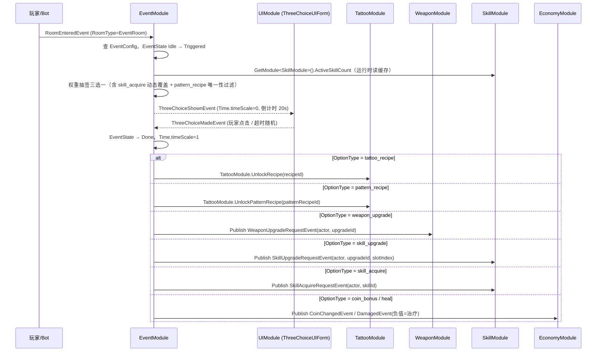

# 10-EventModule 模块详设

> **版本**: v2.1 ｜ **修订日期**: 2026-06-25
> **主导 Agent**: client-unity
> **对应系统 GDD**: ../systems/10-事件与三选一.md
> **当前代码状态**: 待实现
> **依赖契约**: [CONTRACT.md](../../../openspec/changes/05-gdd-v2-full-design-docs/CONTRACT.md) §1.6/1.7/1.8/§4 性能预算
>
> **v2.1 修订摘要**：
> ① 三选一选项池新增 `pattern_recipe` 类型（高稀有度图案配方渠道）
> ② 三选一触发频率 3 min/次 → 2 min/次；超时 30 s → 20 s
> ③ `skill_acquire` 新增选项类型，初始 0 技能前期权重 40，槽满（≥ 2）降至 5
> ④ `SkillSlot` 字段值域收窄为 `{0, 1, -1}`，不存在 slot 2

---

## 一、模块职责

EventModule 承载「事件房触发 → 三选一弹窗管理 → 权重抽签 → 奖励结算」的完整生命周期，职责边界如下：

**做什么**：
- 监听 `RoomEnteredEvent`，判断房间类型为 `EventRoom` 且 `EventState == Idle` 时触发对应事件流程
- 根据 `EventConfig` 驱动每个房间的事件状态机（Idle → Triggered → ShowingChoice/CombatActive/… → Done）
- 三选一选项池抽签：基础权重 + Build 联动加权 + 稀缺项补全 + 初期技能补全，保证三选项 OptionType 互不相同
- 倒计时管理：`choice_event` 超时 **20 秒**后随机选一项，发出 `ThreeChoiceMadeEvent`
- `skill_acquire` 权重动态覆盖：读取玩家当前已激活技能数，在候选池生成阶段覆盖 `WeightBase`（槽满降至 5，前 2 分钟 0 技能提至 40）
- `pattern_recipe` 唯一性守卫：同一 Run 已出现过 `pattern_recipe` 时将其从候选池移除（IsUnique）
- 响应 `ThreeChoiceMadeEvent`，路由奖励结算到对应模块（TattooModule / WeaponModule / SkillModule / EconomyModule）
- `curse_event` 的 Debuff 施加与高额奖励联动
- 将 `EventState` + 房间 ID 序列化给 SaveModule，保证 Run 内进度持久
- LightBot 路径：进入事件房直接跳过弹窗，随机抽一项走相同奖励结算通路

**不做什么**：
- 弹窗 UI 渲染（归 UIModule，`ThreeChoiceUIForm`）
- 战斗事件的敌人 Spawn（归 SpawnerModule，订阅 `RoomEventTriggeredEvent` 处理）
- 解谜事件的具体谜题逻辑（归 level-designer 定义的 PuzzleController，EventModule 只发出结果事件）
- 商人事件的商品购买流程（归 NPCModule，`merchant_event` 仅负责触发开门信号）
- 数值平衡调参（约束值来自 `ThreeChoiceOptionConfig`，运行时只读）
- VFX / 音效（归 VFXModule / AudioModule，订阅 `ThreeChoiceMadeEvent` 自驱）

---

## 二、IGameModule 接口签名

```csharp
public sealed class EventModule : IGameModule
{
    public ModuleCategory ModuleCategory => ModuleCategory.Gameplay; // Category 3

    public Type[] Dependencies => new[]
    {
        typeof(DataTableModule),   // 读 EventConfig / ThreeChoiceOptionConfig
        typeof(MapGenModule)       // 读 MapGeneratedEvent.Rooms 预加载事件配置
    };

    public EventModule(ModuleRunner runner, EventBus bus);

    // InitAsync：仅读配置表、建索引，严禁发事件
    public UniTask InitializeAsync(CancellationToken ct = default);
    public UniTask ShutdownAsync(CancellationToken ct = default);
}
```

`ModuleCategory` 为数值 3（Gameplay 层），在 DataTableModule（Category 0）和 MapGenModule（Category 3，但 EventModule 依赖它，故先完成）之后初始化。

`InitializeAsync` 仅做：
1. 从 `DataTableModule` 读 `EventConfig` 行数组，建立 `_eventConfigById`（string → EventConfig）
2. 从 `DataTableModule` 读 `ThreeChoiceOptionConfig` 行数组，按 `OptionType` 分组缓存到 `_optionsByType`
3. 初始化 `_roomEventStates`（RoomId → EventState），首次为 Idle
4. 初始化 `_usedUniqueOptionIds`（HashSet\<string\>），用于 IsUnique 守卫
5. 注册 `[EventHandler]`（框架在 InitAsync 完成后自动扫描，无需手动 Subscribe）

---

## 三、事件

### 3.1 发布（Publish）

| 事件 | 触发时机 | 主要字段 |
|---|---|---|
| `RoomEventTriggeredEvent` | 玩家/Bot 进入 EventRoom 且 EventState == Idle | `Actor Enterer; RoomEventId Id;` |
| `ThreeChoiceShownEvent` | choice_event 触发后，选项池抽签完成 | `Actor Chooser; ThreeChoiceOption[] Options;` |
| `ThreeChoiceMadeEvent` | 玩家点击选项或倒计时超时（20 s）随机选 | `Actor Chooser; int SelectedIndex; ThreeChoiceOption Selected;` |

> 签名锁定于 CONTRACT §1.7，EventModule **不得修改**，可向 CONTRACT append 新字段。

### 3.2 订阅（Subscribe via [EventHandler]）

| 事件 | 处理方法 | 说明 |
|---|---|---|
| `MapGeneratedEvent` | `OnMapGenerated` | 预建 RoomId → EventConfig 的映射表，避免进房时即时查找 |
| `RoomEnteredEvent` | `OnRoomEntered` | 判断 RoomType == EventRoom，驱动状态机 Idle → Triggered |
| `ThreeChoiceMadeEvent` | `OnThreeChoiceMade` | 路由奖励结算，恢复 Time.timeScale = 1 |
| `ActorDiedEvent` | `OnActorDied` | 玩家死亡时将所有 Triggered/ShowingChoice 房间强制推进到 Done（故障保底） |

---

## 四、DataTable Schema

### 4.1 EventConfig.json

**路径**：`Assets/Resources/DataTable/EventConfig.json`

```json
{
  "table": "EventConfig",
  "fields": [
    { "name": "EventId",          "type": "string",  "desc": "事件唯一 ID，格式 event_<type>_<序号>" },
    { "name": "EventType",        "type": "string",  "desc": "枚举：combat_event / choice_event / puzzle_event / merchant_event / boss_event / lore_event / curse_event" },
    { "name": "DisplayName",      "type": "string",  "desc": "玩家可见名称（本地化 Key）" },
    { "name": "TriggerCondition", "type": "string",  "desc": "前置条件 JSON：{ minElapsedSec, minRoomCleared, requiredFlag }；空字符串=无条件" },
    { "name": "BaseRewardCoin",   "type": "int",     "desc": "完成时发放基础金币；0=不发" },
    { "name": "RewardPoolId",     "type": "string",  "desc": "额外掉落池 ID，引用 LootPoolConfig；空=无额外掉落" },
    { "name": "TimeoutSec",       "type": "float",   "desc": "超时时间 (s)；choice_event 填 20（v2.1）；-1=不超时（merchant_event）" },
    { "name": "CurseDebuffId",    "type": "string",  "desc": "仅 curse_event 用：施加的 Debuff ID；其余留空" },
    { "name": "WeightBase",       "type": "int",     "desc": "地图生成时随机选取事件类型的基础权重 (1–100)" },
    { "name": "IsRepeatAllowed",  "type": "bool",    "desc": "同一 Run 内是否允许同一 EventId 重复出现" }
  ]
}
```

> 完整 rows 样例见系统 GDD §4.1（含 6 条示例行，choice_event TimeoutSec 均为 20）。

### 4.2 ThreeChoiceOptionConfig.json

**路径**：`Assets/Resources/DataTable/ThreeChoiceOptionConfig.json`

v2.1 新增字段 `SkillSlot`（值域 `{0, 1, -1}`）；`OptionType` 枚举扩充 `pattern_recipe` 与 `skill_acquire`。

```json
{
  "table": "ThreeChoiceOptionConfig",
  "fields": [
    { "name": "OptionId",         "type": "string",  "desc": "选项唯一 ID" },
    { "name": "OptionType",       "type": "string",  "desc": "枚举：tattoo_recipe / pattern_recipe / weapon_upgrade / skill_upgrade / skill_acquire / coin_bonus / heal / one_time_scroll" },
    { "name": "DisplayName",      "type": "string",  "desc": "选项标题（本地化 Key）" },
    { "name": "DescKey",          "type": "string",  "desc": "选项描述（本地化 Key）" },
    { "name": "ContentRef",       "type": "string",  "desc": "内容引用：tattoo_recipe/pattern_recipe=配方ID；weapon_upgrade=升级配置ID；skill_upgrade=技能升级ID；skill_acquire=技能ID；其余为空" },
    { "name": "SkillSlot",        "type": "int",     "desc": "仅 skill_upgrade 用：目标技能槽编号，值域 {0, 1}；其余类型填 -1" },
    { "name": "ValueInt",         "type": "int",     "desc": "数值型内容（金币量/治疗量/百分比）；非数值型填 0" },
    { "name": "WeightBase",       "type": "int",     "desc": "基础抽取权重 (1–100)" },
    { "name": "WeightBuildBonus", "type": "string",  "desc": "Build 联动加权 JSON：{ elementTag: bonusWeight }；与 Build 元素匹配时额外叠加" },
    { "name": "MinRunElapsedSec", "type": "float",   "desc": "最早出现时间 (s)；0=无限制" },
    { "name": "IsUnique",         "type": "bool",    "desc": "同一 Run 内只能出现一次（pattern_recipe = true）" }
  ]
}
```

> **DataTable 变更说明（相较 v2.0）**：
> - `ThreeChoiceOptionConfig` 新增字段 `SkillSlot`（int，值域 `{0, 1, -1}`）
> - `OptionType` 枚举新增两个值：`pattern_recipe`、`skill_acquire`
> - **操作顺序**：先按系统 GDD §4.2 更新 JSON → Unity 菜单 `Tools/DataTable/生成全部配置表代码` 重新生成 `ThreeChoiceOptionConfig.cs` → 再编写/修改 EventModule 读取逻辑

---

## 五、权重抽签实现要点

### 5.1 skill_acquire 动态权重覆盖

在候选池生成阶段（`BuildOptionPool` 方法），EventModule 从 `SkillModule`（`GetModule<SkillModule>()`）读取 `ActiveSkillCount`，按以下规则覆盖配置表中 `skill_acquire` 的 `WeightBase`：

```csharp
// 运行时权重覆盖（不修改配置表原值，仅影响本次抽签）
int OverrideSkillAcquireWeight(int activeSkillCount, float runElapsedSec)
{
    if (activeSkillCount >= 2) return 5;           // 槽满，降权
    if (runElapsedSec < 120f && activeSkillCount == 0) return 40; // 前 2 分钟无技能，补偿
    return 16;                                     // 标准权重
}
```

此覆盖在抽签临时计算时执行，不写回 `_optionsByType` 缓存，**无 GC alloc**（直接在 `_scratchWeightBuffer` 中修改对应位置）。

### 5.2 pattern_recipe 唯一性守卫

`InitializeAsync` 建立 `_usedUniqueOptionIds`（HashSet\<string\>）。每次 `ThreeChoiceMadeEvent` 结算后，若所选 `IsUnique == true`，将其 `OptionId` 写入集合。候选池生成时过滤已使用的唯一选项。

### 5.3 超时倒计时（20 s）

`ShowingChoice` 状态下每帧执行：

```csharp
_choiceTimer -= Time.unscaledDeltaTime; // 使用 unscaledDeltaTime，不受 timeScale=0 影响
if (_choiceTimer <= 0f)
    ResolveTimeout();
```

**无 GC alloc**：不做 string 拼接，倒计时进度通过事件通知 UIModule（`ChoiceTimerTickEvent`，每 0.5 s 发一次，降低事件频率）。

---

## 六、与其他模块交互



**注意事项**：
- `pattern_recipe` 结算调用 `TattooModule.UnlockPatternRecipe`（v2.1 新增），接口与 `UnlockRecipe` 区分；重复配方重随机逻辑相同
- `skill_acquire` 结算走 `SkillAcquireRequestEvent`（EventBus Publish），SkillModule 响应后占用第一个空槽；若两槽已满则 EventModule 在候选池生成阶段已过滤，此事件不应在槽满时发出
- `skill_upgrade` 的 `slotIndex` 严格为 0 或 1，EventModule 在路由前做断言校验（Debug.Assert），防止配置错误
- EventModule 对 WeaponModule / SkillModule 的奖励结算走 EventBus Publish，**不**走 Dependencies 直接调用（同层 Category 3，避免循环依赖）
- `TattooModule.UnlockRecipe` / `UnlockPatternRecipe` 是唯一例外的直接调用：因配方解锁需要同步校验"是否已持有"后再决定是否重新随机，依赖单向（EventModule → TattooModule），不成环

---

## 七、50 actor 性能预算

EventModule 的运行时开销**极低**，理由如下：

| 路径 | 频率 | 成本 |
|---|---|---|
| `OnRoomEntered` 触发状态机 | 每次进房触发一次（全局稀疏） | O(1) 字典查表，< 0.01 ms |
| 权重抽签三选一（含动态覆盖） | 每次 choice_event 触发一次 | 遍历 `_optionsByType` 分组（≤ 100 条）+ 动态权重覆盖（O(N) 单次），< 0.1 ms |
| 倒计时推进（20 s） | 仅 ShowingChoice 状态下每帧 | `float -= Time.unscaledDeltaTime`，**无 GC alloc** |
| `OnThreeChoiceMade` 结算 | 每次选择触发一次 | Publish 1–2 个事件，O(1) |
| LightBot 直通路径 | 每次 LightBot 进事件房 | 跳过 UI，直接调 `ResolveReward`，同上 |

**GC 保证**：
- 抽签时不 new List，使用 `_scratchWeightBuffer`（预分配 `int[128]`，InitAsync 分配一次）
- `skill_acquire` 动态权重覆盖直接写 `_scratchWeightBuffer[i]`，不产生临时对象
- 倒计时不用 string concat；FrameworkLogger 调用全走条件编译 Debug 路径
- `ThreeChoiceOption` 使用 struct（值类型），避免选项数组装箱

总 EventModule 在 50 actor 全部进入事件房的极端场景下单帧新增成本 < 0.2 ms，远低于帧预算中其他模块（Combat / VFX / Pathfinding）。

---

## 八、伪联机 → 真联机迁移点

当前版本（伪联机/本地模拟 50 actor）：
- EventModule 直接读 `RoomEnteredEvent.Enterer` 的本地状态，无网络同步
- `ThreeChoiceMadeEvent` 由本地 20 s 计时器或本地 UI 输入驱动

真联机迁移时需处理的关键点：

| 问题 | 迁移策略 |
|---|---|
| **主机权威触发**：谁先进房谁触发 | 改为服务端发出 `RoomEventTriggeredEvent`，客户端仅订阅展示 |
| **三选一结果同步**：两个客户端同一房间 | 主机抽签 → 广播 `ThreeChoiceShownEvent(Options)` → 各自本地显示 → 主机收到选择 → 广播 `ThreeChoiceMadeEvent` → 各自结算 |
| **倒计时权威**：超时随机 | 由主机触发超时事件（20 s），不依赖客户端本地计时器 |
| **EventState 持久化**：掉线重连 | `EventState` 已在 SaveModule 序列化，重连后从服务端同步 RoomState 覆盖本地存档 |

迁移范围局限于 EventModule 的**事件触发入口**（`OnRoomEntered`）和**倒计时驱动**，奖励结算路由代码不变。

---

## 九、测试策略

### 9.1 EditMode 测试（Unity Test Runner）

**权重抽签正确性**（`EventModuleWeightTests.cs`）：
```
测试点 1：三选一结果三项 OptionType 互不相同（循环 1000 次抽签）
测试点 2：Build 联动加权生效——fire Build 下 tattoo_recipe(fire) 出现概率显著高于基础权重
测试点 3：稀缺项补全——模拟玩家 8 分钟未获得任何配方后，抽签必定含 tattoo_recipe 或 pattern_recipe
测试点 4：IsUnique 条目在 Run 内第二次不出现（pattern_recipe 唯一性守卫）
测试点 5：MinRunElapsedSec 约束生效——elapsed=100s 时，MinRunElapsedSec=300 的选项不进入池
测试点 6：skill_acquire 动态权重——activeSkillCount=0 且 elapsed<120s 时权重覆盖为 40
测试点 7：skill_acquire 动态权重——activeSkillCount≥2 时权重覆盖为 5
测试点 8：skill_upgrade 路由时 slotIndex 值域只含 0 和 1，不出现其他值
```

**CD 锁 / 重复触发防护**（`EventRoomStateTests.cs`）：
```
测试点 9：EventState=Completed 的房间再次 RoomEnteredEvent 不重新触发
测试点 10：ActorDiedEvent 后所有 ShowingChoice 状态房间推进到 Done，Time.timeScale 恢复 1
测试点 11：超时 20 s 触发随机选择，与手动选择走同一结算通路
```

### 9.2 PlayMode / Playtest 检查点

| 场景 | 验收标准 |
|---|---|
| 正常三选一全流程 | 弹窗出现、暂停、选择、奖励到账，Time.timeScale 恢复 1 |
| 超时 20 秒 | 自动随机选一项，与手动选择路径相同 |
| pattern_recipe 出现与唯一性 | 同一局内最多出现 1 次，金色边框正确显示 |
| skill_acquire 前期补全 | 开局前 2 分钟内三选一必含 skill_acquire 选项 |
| skill_acquire 槽满降权 | 2 个技能槽均已占用时，skill_acquire 不再频繁出现（权重 5） |
| LightBot 进事件房 | 无 UI 弹窗，直接结算，奖励正确写入 Bot 状态 |
| 同一房间两 actor 先后进入 | 先到者触发，后到者显示"已完成"，不重复结算 |
| 诅咒事件接受/拒绝 | 接受→Debuff 施加+奖励；拒绝→无变化 |
| 一局 10-15 分钟完整 Run | choice_event 出现 5–7 次（健康区间），无事件状态卡死 |

---

## 风险与开放问题

### 三选一暂停是否影响其他 actor

**问题**：`Time.timeScale = 0` 会冻结所有 MonoBehaviour Update / FixedUpdate，导致场外 50 个 actor 全部静止，可能在真联机中产生异常（Bot 停走、投射物悬停）。

**当前决策（v2.1 / 伪联机）**：接受此限制，全局暂停符合单机 Roguelite 的体验预期（参考 Hades 选 Boon 时全暂停）。Bot 使用 `Time.unscaledDeltaTime` 的路径仅限于倒计时 float 推进，其余 Bot 决策在暂停时自然冻结。

**真联机迁移注意**：改为「仅对触发 actor 的本地 UI 暂停，服务器 tick 继续」，其他 actor 无感知。届时 `Time.timeScale` 调用需抽象为 `ITimePauseService`，EventModule 调用接口而非直接赋值。

### Bot 不弹 UI，走预设逻辑

**SmartBot**（v2.1 修订优先级）：调用 `BotBuildPlanner.EvaluateThreeChoice(options)` 按以下优先级选择：
```
skill_acquire（已激活技能 < 2 时）> pattern_recipe（当前无图案配方时）>
tattoo_recipe（与 build 方向匹配）> weapon_upgrade / skill_upgrade >
coin_bonus > heal（仅 HP < 50% 时优先）> one_time_scroll
```

**LightBot**：直接 `Random.Range(0, 3)` 随机选，跳过 BotBuildPlanner。

**风险**：若 LightBot 死亡过快导致"50 人局游戏感消失"，可调整为 70% 概率选 `coin_bonus`/`heal`，30% 随机——**无需改 EventModule**，只改 LightBot 抽签函数。

### 开放问题

| 问题 | 状态 | 默认决策 |
|---|---|---|
| `ThreeChoiceUIForm` Prefab 层级由谁定义？ | 待 art-ui 出图 + client-unity 绑定 | 阻塞点：UIModule 详设完成后再做绑定，不影响 EventModule 逻辑 |
| 解谜事件（puzzle_event）完成信号如何回传？ | 开放 | PuzzleController 发出 `PuzzleCompletedEvent`，EventModule 订阅后推进 Done |
| `ChoiceEventIntervalSec` 全局参数暴露位置 | 开放 | 建议加入 `GameBalanceConfig.json`（新表），QA playtest 后调参 |
| `skill_acquire` 是否允许玩家选择目标技能？ | 开放 | v1.0 固定随机池（ContentRef 指定），v1.1 可引入二级选择 |
| `pattern_recipe` 图案配方具体效果范围？ | 开放 | 委托 01-纹身构筑系统 §图案机制 定义；本模块只负责三选一渠道接入 |

---

## 引用与依赖文档链接

- [CONTRACT.md §1.6](../../../openspec/changes/05-gdd-v2-full-design-docs/CONTRACT.md) — 地图/房间事件签名
- [CONTRACT.md §1.7](../../../openspec/changes/05-gdd-v2-full-design-docs/CONTRACT.md) — `RoomEventTriggeredEvent` / `ThreeChoiceShownEvent` / `ThreeChoiceMadeEvent` 签名（锁死）
- [CONTRACT.md §1.8](../../../openspec/changes/05-gdd-v2-full-design-docs/CONTRACT.md) — `BotDecisionMadeEvent.ThreeChoicePick` 扩展点
- [CONTRACT.md §4](../../../openspec/changes/05-gdd-v2-full-design-docs/CONTRACT.md) — 50 actor 性能预算
- [systems/10-事件与三选一.md](../systems/10-事件与三选一.md) — 系统 GDD v2.1（玩家体验目标 / 机制 / 数值约束）
- [modules/01-TattooModule.md](./01-TattooModule.md) — UnlockRecipe / UnlockPatternRecipe 接口
- [modules/03-WeaponModule.md](./03-WeaponModule.md) — 武器升级事件路由
- [modules/04-SkillModule.md](./04-SkillModule.md) — 技能升级 / 技能获取事件路由；SkillSlot 0/1 约束
