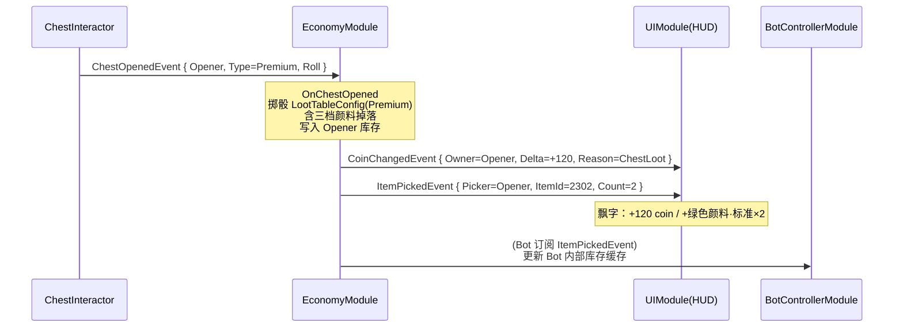
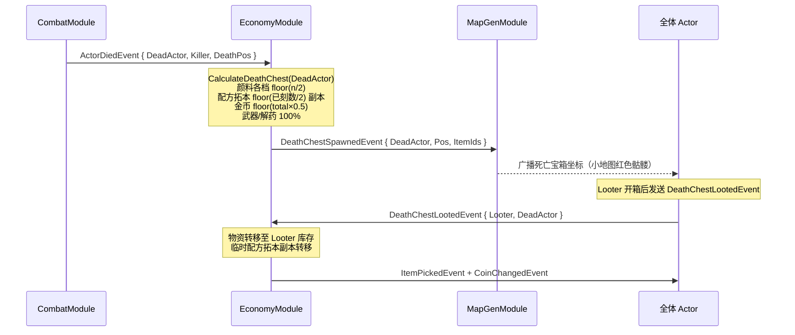
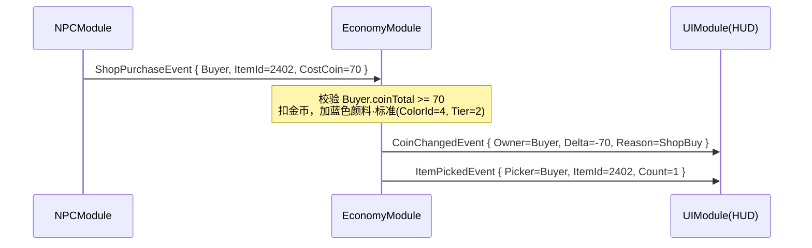

# 11-EconomyModule 模块详设

> **版本**: v2.1 ｜ **修订日期**: 2026-06-25

> **主导 Agent**：client-unity
> **协作 Agent**：gd-system（数值基线）/ client-lead（架构审定）
> **依赖系统**：DataTableModule（ItemConfig / LootTableConfig / ChestConfig 读取）
> **被依赖系统**：HUD（金币飘字）/ TattooModule（颜料消耗）/ BotControllerModule（库存查询）/ NPCModule（商人购买、刻纹身扣费）
> **CONTRACT 引用**：§1.4（CoinChangedEvent / ItemPickedEvent / ChestOpenedEvent / DeathChestSpawnedEvent / DeathChestLootedEvent）/ §1.5（ShopPurchaseEvent / TattooSessionEndEvent）

---

## 一、模块职责

EconomyModule 是局内**唯一的资源账本**，负责：

1. **库存管理**：维护每个 Actor（玩家 + Bot）的金币、颜料瓶（按 ColorId 分桶，每色三档）、配方拓本、武器道具的运行时存量。
2. **收支处理**：监听 `ChestOpenedEvent`（开箱分配战利品）、`ShopPurchaseEvent`（商人购买扣费）、`TattooSessionEndEvent`（刻纹身扣颜料+金币）等事件，原子地更新对应 Actor 的库存并发布变更通知。
3. **死亡宝箱生成**：监听 `ActorDiedEvent`，按**半半规则**（见 §二）快照死亡 Actor 的携带物资，发布 `DeathChestSpawnedEvent`，并将对应库存清零。
4. **数据查询接口**：提供 `GetInventory(Actor)` 同步接口，供 BotControllerModule、HUD、TattooModule 零开销读取。

**v2.1 新增职责**：
- 颜料三档（Basic / Standard / Premium）差异化处理——同色不同档位分别计量，掉落与消耗分档核算。
- `CalculateDeathChest(actor)` 标准函数——统一处理颜料半半、配方拓本半半（仅本局副本）、金币 50%、武器/技能 100% 的宝箱内容计算。

EconomyModule **不做**：战斗伤害计算、地图宝箱生成（归 MapGenModule）、NPC 对话流程（归 NPCModule）、UI 飘字渲染（归 UIModule）。

---

## 二、IGameModule 实现

```csharp
// Assets/Scripts/Modules/EconomyModule.cs（骨架，DataTableGenerator 生成 .cs 后再填实现）

public class EconomyModule : IGameModule
{
    public ModuleCategory Category => ModuleCategory.Gameplay;   // 3

    public IReadOnlyList<Type> Dependencies => new[]
    {
        typeof(DataTableModule)
        // 不依赖 TattooModule / NPCModule——它们通过事件单向通知本模块
    };

    public UniTask InitAsync(CancellationToken ct) { ... }
    public UniTask ShutdownAsync(CancellationToken ct) { ... }
}
```

**ModuleCategory = 3（Gameplay）**：EconomyModule 在 Core（0）/ Infrastructure（1）/ Service（2）之后初始化，确保 DataTableModule 已就绪。

**InitAsync 步骤**：
1. 从 `DataTableModule` 读取 `ItemConfig` 行（颜色 ID + 档位白名单、物品元数据）。
2. 初始化 `_inventories`（`Dictionary<int, ActorInventory>`，键为 `Actor.InstanceId`）。
3. 扫描 `[EventHandler]` 属性，ModuleRunner 自动注册事件订阅。

---

## 三、死亡宝箱半半规则（v2.1 新增）

### 3.1 规则定义

Actor 死亡时，`CalculateDeathChest(actor)` 按以下规则计算宝箱内容：

| 资源类型 | 进入宝箱的量 | 说明 |
|---|---|---|
| 颜料（各档各色） | `floor(当前数量 / 2)` | 7 色 × 3 档共 21 条目分别计算，每档各取一半；余数不进宝箱 |
| 配方拓本 | `floor(本局已刻数 / 2)` | 仅生成**本局副本**（临时 ItemId 段 9000+），不可跨局存储；原件留在 Actor 身上 |
| 金币 | `floor(coinTotal × 0.5)` | 50% 进宝箱，原 Actor 金币归零（模拟死亡折损） |
| 武器 / 技能道具 | 全部 100% | 所有 EquipmentItemIds 进宝箱，Actor 持有清零 |
| 解药 | 全部 100% | 所有 AntidoteItemIds 进宝箱，Actor 持有清零 |

> **"本局副本"**：配方拓本副本仅携带配方内容（TattooPatternId），不带配方原件的永久解锁属性。Looter 获得后可在本局内使用，局结束时销毁。

### 3.2 C# 伪代码

```csharp
/// <summary>
/// 计算死亡宝箱内容。不修改 actor 库存，由调用方决定何时执行快照 + 清零。
/// </summary>
public DeathChestSnapshot CalculateDeathChest(Actor actor)
{
    var inv = _inventories[actor.InstanceId];
    var snapshot = new DeathChestSnapshot();

    // 颜料：各档各色 floor(n/2)
    foreach (var (inkKey, count) in inv.InkBottles)   // inkKey = (ColorId, Tier)
    {
        int half = count / 2;   // floor
        if (half > 0)
            snapshot.InkBottles[inkKey] = half;
    }

    // 配方拓本：floor(已刻数/2)，生成临时副本
    int recipeCopies = inv.SessionEngravings / 2;   // floor
    if (recipeCopies > 0)
        snapshot.RecipeCopies = recipeCopies;

    // 金币 50%
    snapshot.Coins = inv.Coins / 2;   // floor

    // 武器/技能 100%
    snapshot.EquipmentItemIds.AddRange(inv.EquipmentItemIds);

    // 解药 100%
    snapshot.AntidoteItemIds.AddRange(inv.AntidoteItemIds);

    return snapshot;
}
```

### 3.3 中断惩罚（v2.1 新增）

玩家中途退出或自纹身中断时，额外扣除 **50 金币**（不受宝箱半半规则影响，直接从 Actor 金币中扣，最低归零不为负）。

```csharp
[EventHandler]
private void OnTattooSessionInterrupted(TattooInterruptedEvent e)
{
    const int INTERRUPT_PENALTY = 50;
    var inv = _inventories[e.Actor.InstanceId];
    int deduct = Mathf.Min(inv.Coins, INTERRUPT_PENALTY);
    inv.Coins -= deduct;
    if (deduct > 0)
        _eventBus.Publish(new CoinChangedEvent(e.Actor, -deduct, inv.Coins, CoinReason.TattooInterrupt));
    FrameworkLogger.Info("EconomyModule",
        $"Actor={e.Actor.InstanceId} TattooInterruptPenalty={deduct} NewCoins={inv.Coins}");
}
```

---

## 四、事件

### 4.1 发布（Publish）

| 事件 | 触发时机 | 携带信息 |
|---|---|---|
| `CoinChangedEvent` | 任何金币增减（开箱/购买/出售/死亡折损/中断惩罚） | `Owner, Delta, NewTotal, Reason` |
| `ItemPickedEvent` | 开箱/死亡宝箱战利品加入库存 | `Picker, ItemId, Count` |
| `DeathChestSpawnedEvent` | Actor 死亡 → 库存快照完成 | `DeadActor, Pos, List<ItemIds>` |

`CoinReason` 枚举新增值：`TattooInterrupt`（自纹身中断惩罚）。

### 4.2 订阅（Subscribe）

| 事件 | 处理方法 | 核心逻辑 |
|---|---|---|
| `ChestOpenedEvent` | `OnChestOpened` | 按 LootTableConfig 掷骰，将掉落物写入 Opener 的库存，依次发布 ItemPickedEvent / CoinChangedEvent |
| `ShopPurchaseEvent` | `OnShopPurchase` | 扣除 Buyer 金币（附魔消耗 200–500，见 §六金币流表），写入购买物品；发布 CoinChangedEvent(Reason=ShopBuy) |
| `TattooSessionEndEvent` | `OnTattooSessionEnd` | 扣除 Customer 颜料（按 ColorId+Tier）+ 金币（CostCoin）；自增 `SessionEngravings`；发布 CoinChangedEvent(Reason=Tattoo) |
| `TattooInterruptedEvent` | `OnTattooSessionInterrupted` | 扣 50 金币中断惩罚；发布 CoinChangedEvent(Reason=TattooInterrupt) |
| `ActorDiedEvent` | `OnActorDied` | 调用 `CalculateDeathChest` → 快照 → 发布 `DeathChestSpawnedEvent` → 清零库存（金币、武器、解药）；颜料/配方按半半规则更新 |
| `DeathChestLootedEvent` | `OnDeathChestLooted` | 将死亡宝箱中的物资转移至 Looter 库存；发布 ItemPickedEvent / CoinChangedEvent |

### 4.3 日志规范

```csharp
FrameworkLogger.Info("EconomyModule",
    $"Actor={actor.InstanceId} CoinDelta={delta} NewTotal={newTotal} Reason={reason}");
FrameworkLogger.Warn("EconomyModule",
    $"Actor={actor.InstanceId} InkBottle ColorId={colorId} Tier={tier} Deficit={deficit} 颜料不足警告");
```

---

## 五、DataTable Schema — ItemConfig.json（v2.1 升级）

**路径**：`Assets/Resources/DataTable/ItemConfig.json`

### 5.1 字段变更说明

v2.1 在原 `SubType` 基础上新增 `Tier` 字段，颜料由 7 行拆为 21 行（7 色 × 3 档）：

| 字段 | 类型 | 变更 | 说明 |
|---|---|---|---|
| `Tier` | `int` | **新增** | 颜料档位：1=Basic / 2=Standard / 3=Premium；非颜料物品填 0 |

> **操作要求**：新增 `Tier` 字段后，必须运行 Unity 菜单 `Tools/DataTable/生成全部配置表代码`，生成 `Assets/Scripts/DataTable/ItemConfig.cs`，再编写读取代码。

### 5.2 完整 JSON Schema

```json
{
  "table": "ItemConfig",
  "fields": [
    { "name": "ItemId",      "type": "int",    "desc": "物品唯一 ID，全局不重复" },
    { "name": "ItemType",    "type": "string", "desc": "枚举：Coin | InkBottle | RecipeShard | RecipeFull | Equipment | Antidote" },
    { "name": "SubType",     "type": "string", "desc": "细分类型：颜料填 ColorId（1–7）；武器填品质（Common/Uncommon/Rare/Legendary）；其他留空" },
    { "name": "Tier",        "type": "int",    "desc": "颜料档位：1=Basic / 2=Standard / 3=Premium；非颜料物品填 0" },
    { "name": "DisplayName", "type": "string", "desc": "本地化显示名（中文，运行时替换为 LocalizationKey）" },
    { "name": "Rarity",      "type": "string", "desc": "枚举：Common | Uncommon | Rare | Epic | Legendary" },
    { "name": "MaxStack",    "type": "int",    "desc": "单槽最大堆叠数；金币 = 9999，颜料 = 99，其他 = 1" },
    { "name": "BasePrice",   "type": "int",    "desc": "基础定价（coin）；供商人 ShopStockConfig 引用计算实际价格" },
    { "name": "SellRatio",   "type": "float",  "desc": "玩家出售时的回收比例（× BasePrice）；默认 0.4" }
  ],
  "rows": [
    { "ItemId": 1,    "ItemType": "Coin",        "SubType": "",  "Tier": 0, "DisplayName": "金币",             "Rarity": "Common",    "MaxStack": 9999, "BasePrice": 1,   "SellRatio": 0.0 },

    { "ItemId": 2101, "ItemType": "InkBottle",   "SubType": "1", "Tier": 1, "DisplayName": "红色颜料·基础",   "Rarity": "Common",    "MaxStack": 99,   "BasePrice": 40,  "SellRatio": 0.4 },
    { "ItemId": 2102, "ItemType": "InkBottle",   "SubType": "1", "Tier": 2, "DisplayName": "红色颜料·标准",   "Rarity": "Uncommon",  "MaxStack": 99,   "BasePrice": 60,  "SellRatio": 0.4 },
    { "ItemId": 2103, "ItemType": "InkBottle",   "SubType": "1", "Tier": 3, "DisplayName": "红色颜料·精品",   "Rarity": "Rare",      "MaxStack": 99,   "BasePrice": 100, "SellRatio": 0.4 },

    { "ItemId": 2201, "ItemType": "InkBottle",   "SubType": "2", "Tier": 1, "DisplayName": "黄色颜料·基础",   "Rarity": "Common",    "MaxStack": 99,   "BasePrice": 40,  "SellRatio": 0.4 },
    { "ItemId": 2202, "ItemType": "InkBottle",   "SubType": "2", "Tier": 2, "DisplayName": "黄色颜料·标准",   "Rarity": "Uncommon",  "MaxStack": 99,   "BasePrice": 60,  "SellRatio": 0.4 },
    { "ItemId": 2203, "ItemType": "InkBottle",   "SubType": "2", "Tier": 3, "DisplayName": "黄色颜料·精品",   "Rarity": "Rare",      "MaxStack": 99,   "BasePrice": 100, "SellRatio": 0.4 },

    { "ItemId": 2301, "ItemType": "InkBottle",   "SubType": "3", "Tier": 1, "DisplayName": "绿色颜料·基础",   "Rarity": "Common",    "MaxStack": 99,   "BasePrice": 40,  "SellRatio": 0.4 },
    { "ItemId": 2302, "ItemType": "InkBottle",   "SubType": "3", "Tier": 2, "DisplayName": "绿色颜料·标准",   "Rarity": "Uncommon",  "MaxStack": 99,   "BasePrice": 60,  "SellRatio": 0.4 },
    { "ItemId": 2303, "ItemType": "InkBottle",   "SubType": "3", "Tier": 3, "DisplayName": "绿色颜料·精品",   "Rarity": "Rare",      "MaxStack": 99,   "BasePrice": 100, "SellRatio": 0.4 },

    { "ItemId": 2401, "ItemType": "InkBottle",   "SubType": "4", "Tier": 1, "DisplayName": "蓝色颜料·基础",   "Rarity": "Common",    "MaxStack": 99,   "BasePrice": 50,  "SellRatio": 0.4 },
    { "ItemId": 2402, "ItemType": "InkBottle",   "SubType": "4", "Tier": 2, "DisplayName": "蓝色颜料·标准",   "Rarity": "Uncommon",  "MaxStack": 99,   "BasePrice": 70,  "SellRatio": 0.4 },
    { "ItemId": 2403, "ItemType": "InkBottle",   "SubType": "4", "Tier": 3, "DisplayName": "蓝色颜料·精品",   "Rarity": "Rare",      "MaxStack": 99,   "BasePrice": 120, "SellRatio": 0.4 },

    { "ItemId": 2501, "ItemType": "InkBottle",   "SubType": "5", "Tier": 1, "DisplayName": "紫色颜料·基础",   "Rarity": "Uncommon",  "MaxStack": 99,   "BasePrice": 60,  "SellRatio": 0.4 },
    { "ItemId": 2502, "ItemType": "InkBottle",   "SubType": "5", "Tier": 2, "DisplayName": "紫色颜料·标准",   "Rarity": "Rare",      "MaxStack": 99,   "BasePrice": 90,  "SellRatio": 0.4 },
    { "ItemId": 2503, "ItemType": "InkBottle",   "SubType": "5", "Tier": 3, "DisplayName": "紫色颜料·精品",   "Rarity": "Epic",      "MaxStack": 99,   "BasePrice": 150, "SellRatio": 0.4 },

    { "ItemId": 2601, "ItemType": "InkBottle",   "SubType": "6", "Tier": 1, "DisplayName": "金色颜料·基础",   "Rarity": "Uncommon",  "MaxStack": 99,   "BasePrice": 70,  "SellRatio": 0.4 },
    { "ItemId": 2602, "ItemType": "InkBottle",   "SubType": "6", "Tier": 2, "DisplayName": "金色颜料·标准",   "Rarity": "Rare",      "MaxStack": 99,   "BasePrice": 110, "SellRatio": 0.4 },
    { "ItemId": 2603, "ItemType": "InkBottle",   "SubType": "6", "Tier": 3, "DisplayName": "金色颜料·精品",   "Rarity": "Epic",      "MaxStack": 99,   "BasePrice": 180, "SellRatio": 0.4 },

    { "ItemId": 2701, "ItemType": "InkBottle",   "SubType": "7", "Tier": 1, "DisplayName": "白色颜料·基础",   "Rarity": "Rare",      "MaxStack": 99,   "BasePrice": 100, "SellRatio": 0.4 },
    { "ItemId": 2702, "ItemType": "InkBottle",   "SubType": "7", "Tier": 2, "DisplayName": "白色颜料·标准",   "Rarity": "Epic",      "MaxStack": 99,   "BasePrice": 150, "SellRatio": 0.4 },
    { "ItemId": 2703, "ItemType": "InkBottle",   "SubType": "7", "Tier": 3, "DisplayName": "白色颜料·精品",   "Rarity": "Legendary", "MaxStack": 99,   "BasePrice": 220, "SellRatio": 0.4 },

    { "ItemId": 3001, "ItemType": "RecipeShard", "SubType": "",  "Tier": 0, "DisplayName": "配方碎片",         "Rarity": "Uncommon",  "MaxStack": 99,   "BasePrice": 60,  "SellRatio": 0.3 },
    { "ItemId": 3100, "ItemType": "RecipeFull",  "SubType": "",  "Tier": 0, "DisplayName": "完整配方",         "Rarity": "Rare",      "MaxStack": 10,   "BasePrice": 200, "SellRatio": 0.3 },
    { "ItemId": 4001, "ItemType": "Equipment",   "SubType": "Common",    "Tier": 0, "DisplayName": "普通武器", "Rarity": "Common",    "MaxStack": 1,    "BasePrice": 80,  "SellRatio": 0.4 },
    { "ItemId": 4002, "ItemType": "Equipment",   "SubType": "Uncommon",  "Tier": 0, "DisplayName": "绿色武器", "Rarity": "Uncommon",  "MaxStack": 1,    "BasePrice": 150, "SellRatio": 0.4 },
    { "ItemId": 4003, "ItemType": "Equipment",   "SubType": "Rare",      "Tier": 0, "DisplayName": "蓝色武器", "Rarity": "Rare",      "MaxStack": 1,    "BasePrice": 250, "SellRatio": 0.4 },
    { "ItemId": 4004, "ItemType": "Equipment",   "SubType": "Legendary", "Tier": 0, "DisplayName": "传奇武器", "Rarity": "Legendary", "MaxStack": 1,    "BasePrice": 500, "SellRatio": 0.4 },
    { "ItemId": 5001, "ItemType": "Antidote",    "SubType": "Detox",     "Tier": 0, "DisplayName": "解毒剂",   "Rarity": "Common",    "MaxStack": 5,    "BasePrice": 70,  "SellRatio": 0.3 },
    { "ItemId": 5002, "ItemType": "Antidote",    "SubType": "Thaw",      "Tier": 0, "DisplayName": "解冻剂",   "Rarity": "Common",    "MaxStack": 5,    "BasePrice": 70,  "SellRatio": 0.3 },
    { "ItemId": 5003, "ItemType": "Antidote",    "SubType": "Unstun",    "Tier": 0, "DisplayName": "解麻剂",   "Rarity": "Common",    "MaxStack": 5,    "BasePrice": 70,  "SellRatio": 0.3 }
  ]
}
```

**ItemId 规则（v2.1）**：
- 颜料从 `2001–2007` 重编为 `2X01–2X03`（X=颜色编号 1–7，末位 01/02/03 对应 Tier 1/2/3）
- 旧 ItemId 2001–2007 废弃，升级时须迁移存量数据

**与现有表的关系**：
- `LootTableConfig.ItemId`（08 系统 §4.1）→ 引用本表 `ItemId`（需同步更新颜料行引用）
- `ShopStockConfig.ItemId`（09 系统 §四）→ 引用本表 `ItemId`
- `TattooColorConfig.ColorId` → 对应本表 InkBottle.SubType（颜色编号 1–7）；Tier 字段决定纹身效果品质

---

## 六、金币流入流出表（v2.1 更新）

### 6.1 流入来源

| 来源 | 金额范围 | 频率 |
|---|---|---|
| 普通宝箱开启 | 20–80 | 中频，遍地 |
| 精品宝箱开启 | 80–200 | 低频，热点 |
| 死亡宝箱拾取（金币部分） | 等于死亡者持有 ×50% | 击杀/拾取触发 |
| 出售物品（颜料/解药） | BasePrice × SellRatio | 主动行为 |
| 商人出售配方碎片 | 60–120 | 主动行为 |

### 6.2 流出来源

| 来源 | 金额范围 | 备注 |
|---|---|---|
| 刻纹身费用 | 根据纹身复杂度 | TattooSessionEndEvent.CostCoin |
| 自纹身中断惩罚 | **固定 50** | v2.1 新增；最低归零 |
| 附魔消耗 | **200–500** | v2.1 新增；按附魔等级分档：一阶 200 / 二阶 350 / 三阶 500 |
| 商人购买颜料 | BasePrice（40–220） | 按颜色+档位定价 |
| 商人购买武器 | 80–500 | 按品质定价 |
| 商人购买解药 | 70 / 件 | 固定价 |

### 6.3 平衡基线

- 典型局内玩家收入预期：200–600 金币（20–30 分钟局）
- 纹身消费应占收入 30–50%，确保颜料稀缺感
- 附魔上限 500 定位"局内高端消费"，不超过精品宝箱单次期望收益（~200 × 2 期望）

---

## 七、与其他模块的交互

### 7.1 主链路 Mermaid



### 7.2 死亡宝箱链路（v2.1 半半规则）



### 7.3 商人购买链路



### 7.4 模块依赖汇总

| 模块 | 交互方式 | 方向 |
|---|---|---|
| DataTableModule | `InitAsync` 时读 ItemConfig 行（含 Tier 字段），构建物品元数据缓存 | 单向读 |
| MapGenModule | 接收 `DeathChestSpawnedEvent`，在地图放置实体宝箱 | Eco → Map |
| UIModule (HUD) | 订阅 `CoinChangedEvent / ItemPickedEvent` 触发飘字 | Eco → UI |
| TattooModule | 订阅 `TattooSessionEndEvent / TattooInterruptedEvent` 由 Eco 扣颜料/金币 | NPC → Eco |
| BotControllerModule | 调用 `GetInventory(actor)` 同步读取库存（含分档颜料），决策购买/刻纹身 | Bot → Eco |
| NPCModule | 发布 `ShopPurchaseEvent / TattooSessionEndEvent` 给 Eco 处理 | NPC → Eco |

---

## 八、50 actor 性能预算

### 8.1 数据结构（v2.1 更新）

```csharp
// 颜料 Key：颜色+档位的二元组
public readonly struct InkKey : IEquatable<InkKey>
{
    public readonly int ColorId;   // 1–7
    public readonly int Tier;      // 1–3
    public InkKey(int colorId, int tier) { ColorId = colorId; Tier = tier; }
    public bool Equals(InkKey o) => ColorId == o.ColorId && Tier == o.Tier;
    public override int GetHashCode() => ColorId * 10 + Tier;
}

// 单 Actor 库存，运行时驻留内存
public sealed class ActorInventory
{
    public int Coins;
    public Dictionary<InkKey, int> InkBottles;   // (ColorId, Tier) → 数量（7色×3档，最多 21 条目）
    public int RecipeShards;
    public int SessionEngravings;                 // 本局已刻纹身数（用于配方拓本半半计算）
    public List<int> EquipmentItemIds;
    public List<int> AntidoteItemIds;
}

// 模块主存储
private readonly Dictionary<int, ActorInventory> _inventories = new(64);
```

### 8.2 性能约束

- **零 Update GC**：事件回调在帧内触发，避免在 `OnChestOpened` 中 `new List<>`——预分配临时 loot 缓冲（`static readonly List<LootRollResult> _rollBuffer = new(8)`），每次使用前 `Clear()`。
- **InkKey 为 struct**：避免装箱，Dictionary 使用 `IEqualityComparer<InkKey>` 或覆写 `GetHashCode`。
- **掷骰在事件回调中完成**（非每帧），50 actor 最高并发开箱场景：同帧内最多约 5–8 次 `OnChestOpened`，线性遍历 LootTable 行数（≤ 25 行），可接受。
- **`GetInventory` 同步零开销**：`_inventories.TryGetValue` 直接返回引用，Bot 每 30s 调用一次，无压力。
- **死亡宝箱快照**：`ActorDiedEvent` 触发时 `CalculateDeathChest` 遍历 21 档位颜料，约 < 0.1ms，不阻塞主线程。
- **不在 Inventory 中存字符串**：所有物品以 `ItemId(int)` 存储，展示名称通过 DataTable 查询。

### 8.3 内存估算（v2.1）

| 数据 | 单 Actor 大小 | 50 Actor 总量 |
|---|---|---|
| Coins (int) | 4 B | 200 B |
| InkBottles Dictionary（21 条目 InkKey-struct）| ~500 B | ~25 KB |
| RecipeShards + SessionEngravings (int×2) | 8 B | 400 B |
| EquipmentItemIds（≤8 件）| ~100 B | ~5 KB |
| AntidoteItemIds（≤5 件）| ~80 B | ~4 KB |
| **合计** | ~700 B | **~34 KB** |

34 KB 远低于任何平台内存预算，无需分帧或异步。

---

## 九、风险与开放问题

### 9.1 Bot 独立库存——推荐方案：是

Bot 共 49 个，每个 Bot 持有独立 `ActorInventory`（与玩家完全对称，含分档颜料）。

**推荐理由**：
- Bot 死亡时能生成死亡宝箱（颜料三档全继承半半规则），制造有价值的热点争夺目标，与系统设计目标（§一"复仇与贪婪"循环）一致。
- BotControllerModule 的购买决策（"背包高档颜料 < 1 瓶时优先买 Tier-2/3"）依赖精确的分档库存数量。
- 内存成本可接受：49 Bot × ~700 B ≈ 34 KB（参见 §八）。

### 9.2 开放问题

| 问题 | 优先级 | 当前决策 |
|---|---|---|
| 颜料碎片合成（3 碎片 → 1 配方）的触发时机：玩家手动合成还是自动合成？ | 中（v1.0） | 推荐**手动**，在纹身师 UI 内提供合成按钮，EconomyModule 提供 `TryComposeRecipe` 接口；自动合成会破坏配方稀缺感 |
| 三档颜料是否允许降档合成（2×Tier-1 → 1×Tier-2）？ | 低（v1.1） | MVP 不支持，锁死档位；v1.1 根据 playtest 决定是否开放合成 |
| 拾取上限：背包是否有格子限制？ | 低 | MVP 暂无硬上限，依赖 `MaxStack` 软上限（颜料 ×99）；v1.1 根据 playtest 判断 |
| 死亡宝箱金币折损比例（当前 50%）是否随缩圈阶段动态调整？ | 低（v1.1） | MVP 固定 50%；后期若 hit 率数据显示死亡宝箱争夺不足，可提升至 70% 激励击杀 |
| 同帧多个 Bot 同时开同一宝箱的竞争处理 | 高（v1.0） | 宝箱实体加"已开启"标志位，第一个 `ChestOpenedEvent` 到达后置 `IsOpened=true`，后续事件被 EconomyModule 提前丢弃并记录 Warn 日志 |
| 旧颜料 ItemId（2001–2007）存量数据迁移 | 高（v1.0） | 升级时 SaveMigrator 将旧 Id 映射为 Tier-1 版本（2001→2101，依此类推）；迁移函数见 `SaveMigrator` v2→v3 段 |

---

## 引用

### 契约
- [CONTRACT.md §1.4](../../../openspec/changes/05-gdd-v2-full-design-docs/CONTRACT.md)（CoinChangedEvent / ItemPickedEvent / ChestOpenedEvent / DeathChestSpawnedEvent / DeathChestLootedEvent）
- [CONTRACT.md §1.5](../../../openspec/changes/05-gdd-v2-full-design-docs/CONTRACT.md)（ShopPurchaseEvent / TattooSessionEndEvent / TattooInterruptedEvent）
- [CONTRACT.md §1.2](../../../openspec/changes/05-gdd-v2-full-design-docs/CONTRACT.md)（ActorDiedEvent，死亡宝箱触发源）

### 系统 GDD
- [08-宝箱与探财节奏](../systems/08-宝箱与探财节奏.md) — LootTableConfig / ChestConfig 定义，掉落率基线（需同步更新颜料 ItemId 范围）
- [09-纹身师与商人NPC](../systems/09-纹身师与商人NPC.md) — ShopPurchaseEvent / TattooSessionEndEvent / TattooInterruptedEvent 发布方，NPCConfig / ShopStockConfig

### DataTable 配置
- `Assets/Resources/DataTable/ItemConfig.json`（本文件 §五定义，v2.1 颜料 21 行）
- `Assets/Resources/DataTable/LootTableConfig.json`（08 §4.1 定义，需同步颜料 ItemId）
- `Assets/Resources/DataTable/ChestConfig.json`（08 §4.2 定义）

### 同级模块详设
- [01-TattooModule.md](./01-TattooModule.md) — 颜料消耗 API 入口（需感知 Tier 字段）
- [16-BotControllerModule.md](./16-BotControllerModule.md) — `GetInventory` 调用方，死亡宝箱优先探索逻辑

---

> **本文件状态**：v2.1 修订 / 9 节完整 / 颜料三档 21 行 ItemConfig 就绪（需运行 DataTableGenerator）/ 死亡宝箱半半规则 `CalculateDeathChest` 已定义 / 金币流表已更新（中断惩罚 50 / 附魔 200–500 / 商人分档定价）/ 旧 ItemId 2001–2007 迁移方案已规划 / 开放问题 6 项，宝箱并发竞争与 ItemId 迁移为 v1.0 必须处理项。
