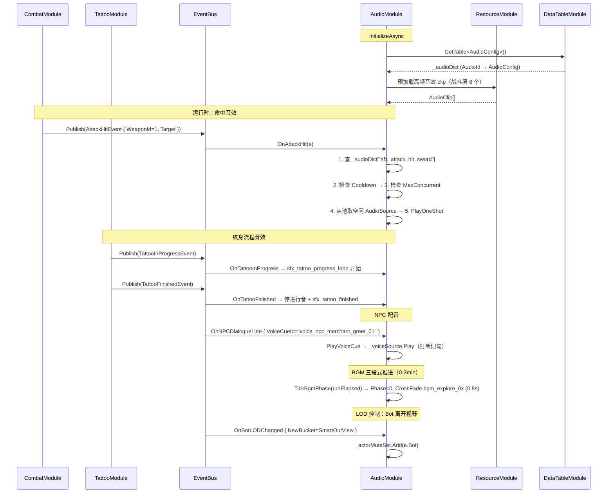

# 13-AudioModule 模块详设

> **版本**: v2.1 ｜ **修订日期**: 2026-06-25
>
> **主导 Agent**: client-unity
> **对应系统 GDD**: ../systems/14-音效与环境音.md
> **当前代码状态**: 待实现（本文档为首版详设，无对应 .cs 文件）

---

## 一、模块职责

AudioModule 负责游戏内**全部音频输出**，职责边界如下：

| 职责 | 说明 |
|---|---|
| 音效播放（SFX） | 订阅业务事件，按 `AudioId` 查表并调度 AudioSource 播放短片段 |
| BGM 切换 | 双 AudioSource 淡入淡出（默认 1.5s），10 首三段式结构（探索/紧张/决战），按局内时间段自动推进 |
| **伪语配音（Voice）** | 全局独立 Voice 通道，订阅关键 NPC 对话事件，按 `VoiceCueId` 查表播放配音片段 |
| **纹身音效** | 订阅 TattooInProgressEvent / TattooFinishedEvent / TattooCancelledEvent / TattooEnchantedEvent，分别播放对应提示音 |
| 3D 空间音效 | 依据 `SpatialBlend` / `MinDistance` / `MaxDistance` 配置 AudioSource 位置与衰减 |
| LOD 音效衰减 | 订阅 `BotLODChangedEvent`，视野外 actor 高频战斗音静音，关键音降 -12dB |
| 并发调度 | 全局同时播放上限 32 个；同 AudioId Cooldown + MaxConcurrent 过滤 |
| 音量分类控制 | BGM / SFX / Ambience / UI / Voice 五路独立音量，对接玩家设置 |

**不做**：音频文件的制作与选型（→ art-director §7.2）；AudioMixer 资产搭建（→ 见 §九 风险）。

---

## 二、IGameModule 接口签名

```csharp
namespace Game.Audio
{
    public sealed class AudioModule : IGameModule
    {
        // ModuleCategory 1 = 基础服务层（与 TattooModule / SaveModule 同级，早于游戏逻辑模块初始化）
        public int    ModuleCategory => 1;
        public Type[] Dependencies   => new[] { typeof(DataTableModule), typeof(ResourceModule) };

        /// <summary>
        /// 1. 从 DataTableModule 加载 AudioConfig 表到 _audioDict
        /// 2. 预分配 AudioSource 池（32 个，挂载到持久化 GameObject）
        /// 3. 初始化双 BGM AudioSource（_bgmA / _bgmB）
        /// 4. 初始化专用 Voice AudioSource（_voiceSource）
        /// 5. 初始化 BGM 三段式计时状态
        /// 6. 订阅所有 [EventHandler] 标注的事件
        /// </summary>
        public UniTask InitializeAsync(CancellationToken ct = default);

        /// <summary>
        /// 停止所有播放 → Dispose 订阅 → 销毁 AudioSource 池 GameObject
        /// </summary>
        public UniTask ShutdownAsync(CancellationToken ct = default);
    }
}
```

**关键内部数据结构**：

```csharp
// 音频池槽，预分配 32 个，复用 AudioSource
struct AudioSlot
{
    public AudioSource Source;
    public string      CurrentAudioId;  // 用于 Cooldown / MaxConcurrent 统计
    public float       StartTime;       // AudioSettings.dspTime，用于超时回收
}

// 运行时 Cooldown 追踪（无 GC alloc，string 不作 key——用 AudioConfig.Index 整型）
struct CooldownEntry
{
    public int   ConfigIndex;
    public float LastPlayTime;  // Time.unscaledTime
}

// BGM 三段式状态（§三 BGM 详情）
struct BgmPhaseState
{
    public int   PhaseIndex;    // 0=探索 1=紧张 2=决战
    public float PhaseStartTime;
}
```

AudioSource 池 GameObject 标记为 `DontDestroyOnLoad`；ShutdownAsync 时手动 Destroy。

---

## 三、BGM 三段式设计（10 首，0–15 min）

v2.1 将 BGM 从 5 首扩展至 **10 首**，按局内实际游玩时间三段自动推进：

| 阶段 | 时间段 | 曲目数 | 情绪 | 触发条件 |
|---|---|---|---|---|
| **探索段** | 0–3 min | 4 首 | 轻松探索，带神秘感 | 局开始时进入；Boss 战结束后回退 |
| **紧张段** | 3–9 min | 4 首 | 节奏加快，危机感上升 | `RunElapsedTime >= 3min` 自动切入；首次遭遇精英怪亦可提前触发 |
| **决战段** | 9–15 min | 2 首 | 高强度，终局感 | `RunElapsedTime >= 9min` 自动切入 |

**BGM 命名约定**：`bgm_explore_<01..04>` / `bgm_tense_<01..04>` / `bgm_final_<01..02>`。

**段内循环规则**：
- 每段内随机播放本段曲目，不重复直到全部播完再 shuffle（无 GC alloc：局内预生成一次排列）
- 同一段切曲用 **0.8s 交叉淡入淡出**（比 Boss 切换的 1.5s 更短，保持流畅不生硬）
- Boss 战期间挂起三段式计时，Boss 倒地后恢复，并依剩余局时回到对应段（不重置）

**段推进代码逻辑（在 Update 或 RunTimeTickEvent 中检查，避免帧级 GC alloc）**：

```csharp
void TickBgmPhase(float runElapsed)
{
    int targetPhase = runElapsed < 180f ? 0
                    : runElapsed < 540f ? 1
                    : 2;

    if (targetPhase != _bgmPhase.PhaseIndex && !_isBossBgmActive)
    {
        _bgmPhase.PhaseIndex = targetPhase;
        CrossFadeBgmToNextInPhase(targetPhase, fadeTime: 0.8f);
    }
}
```

---

## 四、订阅 / 发布事件（全签名）

### 4.1 战斗音效

```csharp
[EventHandler]
void OnAttackHit(AttackHitEvent e)
    // e.WeaponId → 查 AudioConfig 命中音变体（SFX，3D，SpatialBlend=1）
    // 在 e.Target.Position 播放

[EventHandler]
void OnCritHit(CritHitEvent e)
    // 暴击重击音 + 高频 ping，叠加但优先级高于普通命中音

[EventHandler]
void OnChargedAttack(ChargedAttackEvent e)
    // e.ChargeRatio == 1.0f → 播放蓄满"叮"（sfx_charge_full）
    // 蓄力渐强音由 CombatModule pitch/volume ramp 驱动——AudioModule 只负责最终触发

[EventHandler]
void OnDodgePressed(DodgePressedEvent e)
    // 闪避气流 swoosh（sfx_dodge_swoosh），SpatialBlend=0.3

[EventHandler]
void OnDamaged(DamagedEvent e)
    // 受击闷响（sfx_damaged），玩家额外叠呼吸急促 stinger

[EventHandler]
void OnSkillCast(SkillCastEvent e)
    // e.SkillSlot ∈ {0, 1}（v2.1 技能槽从 3 减为 2）→ 查 skill_sfx_slot<n>_cast

[EventHandler]
void OnEffectApplied(EffectAppliedEvent e)
    // 按 ElementType → Fire/Ice/Thunder 起手 cue
```

> **v2.1 变更**：`OnSkillCast` 从 3 技能槽改为 **2 技能槽**（SkillSlot 枚举值 0、1）；移除 slot 2 对应音效条目（`skill_sfx_slot2_*`）。AudioConfig.json 中对应行同步删除。

### 4.2 角色与局势音效

```csharp
[EventHandler]
void OnActorDied(ActorDiedEvent e)
    // 玩家死亡呼喊 / 怪物崩溃声 / Boss 倒地重低音，按 e.DeadActor.Type 分支

[EventHandler]
void OnBossSpawned(BossSpawnedEvent e)
    // 入场重低音（sfx_boss_spawn）+ 切 BGM → bgm_boss_<bossId>
    // 同时设 _isBossBgmActive = true，暂停三段式计时

[EventHandler]
void OnBossPhaseChanged(BossPhaseChangedEvent e)
    // BGM 淡入淡出 1.5s 切换到 bgm_boss_<bossId>_phase<e.NewPhase>

[EventHandler]
void OnBossDefeated(BossDefeatedEvent e)
    // 恢复三段式计时，_isBossBgmActive = false，CrossFade 回三段式 BGM（0.8s）

[EventHandler]
void OnBuildChanged(BuildChangedEvent e)
    // 纹身装备 confirmation 音；按装备部位颜色微调 pitch ±0.1

[EventHandler]
void OnCoinChanged(CoinChangedEvent e)
    // 金币叮当；Cooldown=0.05s 防连捡刷屏

[EventHandler]
void OnItemPicked(ItemPickedEvent e)

[EventHandler]
void OnChestOpened(ChestOpenedEvent e)
    // 宝箱开启重锁解开音（sfx_chest_open）

[EventHandler]
void OnDeathChestSpawned(DeathChestSpawnedEvent e)
    // 低沉 boom（sfx_death_chest_spawn），3D，播放于 e.Pos
```

### 4.3 纹身音效（v2.1 新增）

```csharp
[EventHandler]
void OnTattooInProgress(TattooInProgressEvent e)
    // 刺纹进行中持续低嗡音（sfx_tattoo_progress_loop，LoopMode=Loop）
    // 记录槽句柄 _tattooProgressSlot，用于后续停止

[EventHandler]
void OnTattooFinished(TattooFinishedEvent e)
    // 1. 停止 _tattooProgressSlot（淡出 0.3s）
    // 2. 播放完成提示音（sfx_tattoo_finished，Category=Tattoo）

[EventHandler]
void OnTattooCancelled(TattooCancelledEvent e)
    // 1. 停止 _tattooProgressSlot（立即停止，不淡出）
    // 2. 播放取消提示音（sfx_tattoo_cancelled，Category=Tattoo）

[EventHandler]
void OnTattooEnchanted(TattooEnchantedEvent e)
    // 附魔完成专属音效（sfx_tattoo_enchanted，Category=Tattoo）
    // pitch 随 e.EnchantTier（1-3）线性 +0.0 / +0.1 / +0.2，突显稀有度
```

### 4.4 NPC 伪语配音（v2.1 新增）

```csharp
[EventHandler]
void OnNPCInteractStart(NPCInteractStartEvent e)
    // 1. NPC 互动 chime（sfx_npc_interact，SFX 通道）
    // 2. 若 e.NpcConfig.VoiceCueId != null → PlayVoiceCue(e.NpcConfig.VoiceCueId)

[EventHandler]
void OnNPCDialogueLine(NPCDialogueLineEvent e)
    // 按 e.VoiceCueId 查 AudioConfig Voice 条目
    // 通过 _voiceSource 播放（全局 Voice 通道，打断前一句）
    // SpatialBlend=0（2D，不受距离衰减）

[EventHandler]
void OnShopPurchase(ShopPurchaseEvent e)
    // 商人找零音（sfx_shop_buy）
    // 若商人有 VoiceCueId 配置，随机播放一条 voice_merchant_sell_<01..03>
```

**PlayVoiceCue 实现要点**：
```csharp
void PlayVoiceCue(string voiceCueId)
{
    if (!_audioDict.TryGetValue(voiceCueId, out var cfg)) return;
    // Voice 通道同时只允许一条——打断策略：新句打断旧句（与电影配音惯例一致）
    if (_voiceSource.isPlaying) _voiceSource.Stop();
    _voiceSource.clip   = GetClipForConfig(cfg);
    _voiceSource.volume = cfg.Volume * _volumeMultipliers[AudioCategory.Voice];
    _voiceSource.pitch  = cfg.Pitch;
    _voiceSource.Play();
}
```

### 4.5 地图与环境音

```csharp
[EventHandler]
void OnMapGenerated(MapGeneratedEvent e)
    // 1. 停止当前 ambience（淡出 0.5s）
    // 2. 按 e.Theme → 加载 MapThemeConfig 中的 AmbienceCueId
    // 3. 淡入 2s

[EventHandler]
void OnRoomEntered(RoomEnteredEvent e)
    // 进房 stinger（普通 / 精英 / Boss 房）

[EventHandler]
void OnZoneShrinkPhase(ZoneShrinkPhaseEvent e)
    // e.PhaseIndex 1/2/3 → 对应警报节奏（见 系统 GDD §5.2）

[EventHandler]
void OnOutsideZoneTick(OutsideZoneTickEvent e)
    // 区外持续低频 tick（loop，Cooldown 保护 0.9s）

[EventHandler]
void OnRunStarted(RunStartedEvent e)
    // 入局 fanfare（sfx_run_start_stinger）
    // 重置 BGM 三段式计时，从探索段第一首开始

[EventHandler]
void OnRunEnded(RunEndedEvent e)
    // e.Win → sfx_run_victory；else sfx_run_death + DeathChest stinger
    // 停止三段式计时
```

### 4.6 LOD 声场控制

```csharp
[EventHandler]
void OnBotLODChanged(BotLODChangedEvent e)
    // 见 §六 详细说明
```

### 4.7 发布

AudioModule 纯消费侧，**不向 EventBus 发布任何事件**。

---

## 五、DataTable Schema

**文件**：`Assets/Resources/DataTable/AudioConfig.json`

v2.1 新增 `VoiceCueId` 字段与 `Voice` Category 枚举值。

```json
{
  "table": "AudioConfig",
  "fields": [
    "AudioId", "Path", "Category", "Volume", "Pitch",
    "SpatialBlend", "MinDistance", "MaxDistance",
    "Cooldown", "MaxConcurrent", "LoopMode", "VoiceCueId"
  ],
  "rows": [
    {
      "AudioId":       "sfx_attack_hit_sword",
      "Path":          "Audio/Combat/attack_hit_sword_01",
      "Category":      "Combat",
      "Volume":        0.85,
      "Pitch":         1.0,
      "SpatialBlend":  1.0,
      "MinDistance":   5.0,
      "MaxDistance":   25.0,
      "Cooldown":      0.03,
      "MaxConcurrent": 4,
      "LoopMode":      "OneShot",
      "VoiceCueId":    ""
    },
    {
      "AudioId":       "bgm_explore_01",
      "Path":          "Audio/BGM/bgm_explore_01",
      "Category":      "BGM",
      "Volume":        0.7,
      "Pitch":         1.0,
      "SpatialBlend":  0.0,
      "MinDistance":   0.0,
      "MaxDistance":   0.0,
      "Cooldown":      0.0,
      "MaxConcurrent": 1,
      "LoopMode":      "Loop",
      "VoiceCueId":    ""
    },
    {
      "AudioId":       "voice_npc_merchant_greet_01",
      "Path":          "Audio/Voice/npc_merchant_greet_01",
      "Category":      "Voice",
      "Volume":        0.9,
      "Pitch":         1.0,
      "SpatialBlend":  0.0,
      "MinDistance":   0.0,
      "MaxDistance":   0.0,
      "Cooldown":      0.0,
      "MaxConcurrent": 1,
      "LoopMode":      "OneShot",
      "VoiceCueId":    "voice_npc_merchant_greet_01"
    },
    {
      "AudioId":       "sfx_tattoo_progress_loop",
      "Path":          "Audio/Tattoo/tattoo_progress_loop",
      "Category":      "Tattoo",
      "Volume":        0.6,
      "Pitch":         1.0,
      "SpatialBlend":  0.0,
      "MinDistance":   0.0,
      "MaxDistance":   0.0,
      "Cooldown":      0.0,
      "MaxConcurrent": 1,
      "LoopMode":      "Loop",
      "VoiceCueId":    ""
    },
    {
      "AudioId":       "sfx_tattoo_finished",
      "Path":          "Audio/Tattoo/tattoo_finished",
      "Category":      "Tattoo",
      "Volume":        0.8,
      "Pitch":         1.0,
      "SpatialBlend":  0.0,
      "MinDistance":   0.0,
      "MaxDistance":   0.0,
      "Cooldown":      0.0,
      "MaxConcurrent": 1,
      "LoopMode":      "OneShot",
      "VoiceCueId":    ""
    },
    {
      "AudioId":       "amb_ai_factory_loop",
      "Path":          "Audio/Ambience/amb_ai_factory_loop",
      "Category":      "Ambience",
      "Volume":        0.5,
      "Pitch":         1.0,
      "SpatialBlend":  0.0,
      "MinDistance":   0.0,
      "MaxDistance":   0.0,
      "Cooldown":      0.0,
      "MaxConcurrent": 1,
      "LoopMode":      "LoopFade",
      "VoiceCueId":    ""
    }
  ]
}
```

**新增字段说明**：

| 字段 | 类型 | 说明 |
|---|---|---|
| `VoiceCueId` | string | 非空时表示该条目是配音 cue，可被 `PlayVoiceCue(id)` 直接引用；普通 SFX/BGM 填空字符串 |

**Category 枚举值**（v2.1 新增 `Tattoo` / `Voice`）：`UI` / `Combat` / `Tattoo` / `NPC` / `Ambience` / `BGM` / **`Voice`**（与全局音量分类对应，共 7 路）。

**LoopMode 枚举值**：`OneShot` / `Loop` / `LoopFade`（停止时自动淡出 0.5s）。

> **注意**：修改 `AudioConfig.json` 后，需在 Unity 菜单执行 `Tools/DataTable/生成全部配置表代码`，重新生成 `Assets/Scripts/DataTable/AudioConfig.cs`，再编写读取逻辑。

---

## 六、与其他模块的交互序列



---

## 七、50 actor 性能预算与 LOD 音效衰减

### 7.1 并发上限策略

| 指标 | 预算 |
|---|---|
| 全局同时播放上限 | **32 个** AudioSource（含 BGM 2 + Ambience 1 + Voice 1 = 剩余 28 个 SFX 槽） |
| 单帧 SFX 播放上限 | 8 个（超出排队至下一帧，避免 spike） |
| 视野外 actor 高频战斗音 | **不播**（OnAttackHit / OnCritHit / OnDodgePressed 等） |
| 视野外 actor 关键音 | 保留但额外衰减 **-12dB**（0.25 倍 volume） |

当 32 个槽全满时，按以下优先级抢占最低优先级槽：

```
BGM(5) > Voice(4) > Ambience(3) > 玩家战斗音(3) > 视野内 bot 战斗音(2) > UI(1) > 视野外关键音(0)
```

### 7.2 BotLODChangedEvent 处理逻辑

```csharp
// _actorMuteSet：HashSet<Actor>，存储当前处于"视野外"的 bot

[EventHandler]
void OnBotLODChanged(BotLODChangedEvent e)
{
    bool isOutView = e.NewBucket == LODBucket.SmartOutView
                  || e.NewBucket == LODBucket.LightOutView;

    if (isOutView)
        _actorMuteSet.Add(e.Bot);
    else
        _actorMuteSet.Remove(e.Bot);
}

bool ShouldMute(Actor actor) => _actorMuteSet.Contains(actor);

float GetLODVolume(Actor actor, AudioConfig cfg)
    => _actorMuteSet.Contains(actor) ? cfg.Volume * 0.25f : cfg.Volume;
```

`HashSet<Actor>` 查询 O(1)，不在 Update 里做遍历，满足 GC 预算。

### 7.3 视野内 actor 音效最坏情况分析

视野内最多 10 个 actor 同时挥击（CONTRACT §4）：
- 10 × `AttackHitEvent` 同帧 → 10 个命中音请求
- 命中音 `Cooldown=0.03s`，`MaxConcurrent=4`
- 实际最多同帧触发 4 个新 AudioSource
- 剩余 6 个被 Cooldown 过滤（同 AudioId 合并）
- 帧开销估算：4 × `PlayOneShot` ≈ 0.1ms，可接受

---

## 八、伪联机 → 真联机迁移点

AudioModule 是**纯本地表现层**，不参与网络同步：

| 场景 | 当前（伪联机） | 真联机 |
|---|---|---|
| 事件来源 | 本地 EventBus（BotControllerModule 模拟行为后 Publish） | 网络层接收远端 actor 操作，在本地重新 Publish 相同事件 |
| Actor 坐标（3D 音效定位） | 从 SpawnerModule 查 actor 位置 | 从 NetworkActorModule 查，接口签名一致 |
| BGM / Ambience / Voice | 完全本地，无需同步 | 保持不变（音频表现本地决策） |
| 关键帧同步（命中音与 Hitstop 同帧） | CombatModule 与 AudioModule 同帧 Publish/Subscribe | 网络延迟 <100ms，视觉与音频感知同步误差在可接受范围（VFX 持续时间 >150ms） |

**唯一需要改动的接口**：获取 actor 世界坐标的 `TryGetActorPosition(Actor a)` 辅助方法——真联机时改为查 NetworkActorModule，其余代码不感知网络层。

---

## 九、测试策略

### 9.1 EditMode 测试

```csharp
[Test]
public void AudioConfig_Table_ContainsRequiredIds()
{
    // 断言 "sfx_attack_hit_sword" / "bgm_explore_01" / "amb_ai_factory_loop" 均存在
    // 断言所有 BGM 行 SpatialBlend == 0
    // 断言所有 Combat 行 SpatialBlend == 1
    // 断言所有 Voice 行 VoiceCueId != ""
}

[Test]
public void AudioModule_Cooldown_SkipsPlayWhenTooFrequent()
{
    // 模拟连续两次触发同一 AudioId，间隔 0.01s（< Cooldown 0.03s）
    // 断言第二次调用不触发 source.Play
}

[Test]
public void AudioModule_MaxConcurrent_CapsFourSources()
{
    // 模拟 8 次触发 sfx_attack_hit_sword（MaxConcurrent=4）
    // 断言同时活跃 AudioSource 数量 <= 4
}

[Test]
public void AudioModule_BotLODChanged_MutesOutViewActor()
{
    // 发送 BotLODChangedEvent { NewBucket = SmartOutView }
    // 断言 _actorMuteSet.Contains(bot) == true
    // 再发送 { NewBucket = SmartInView }
    // 断言 _actorMuteSet.Contains(bot) == false
}

[Test]
public void AudioModule_TattooFinished_StopsProgressLoop()
{
    // 模拟 TattooInProgressEvent → 验证 _tattooProgressSlot 被占用
    // 再模拟 TattooFinishedEvent → 验证 progress loop 停止 + sfx_tattoo_finished 播放
}

[Test]
public void AudioModule_VoiceCue_InterruptsPreviousCue()
{
    // 模拟第一条 NPCDialogueLineEvent 触发 _voiceSource.Play
    // 再模拟第二条 → 断言 _voiceSource.Stop 被调用后重新 Play
}

[Test]
public void AudioModule_BgmPhase_AdvancesAtThreeMinutes()
{
    // TickBgmPhase(runElapsed=181f) → 断言 PhaseIndex 从 0 变为 1
}
```

### 9.2 PlayMode 测试（50 actor 压测）

```csharp
[UnityTest]
public IEnumerator AudioModule_50ActorConcurrentHits_RespectsCap()
{
    // 1. 初始化 DataTableModule + ResourceModule + AudioModule
    // 2. 同帧 Publish 50 个 AttackHitEvent（WeaponId=1，Target 位置各异）
    // 3. yield return null（等一帧处理）
    // 4. 断言活跃 AudioSource 数量 <= 32（全局上限）
    // 5. 断言 GC.GetTotalMemory 增量 < 20KB
}
```

---

## 十、风险与开放问题

### 风险 1：Unity AudioMixer 选型

**问题**：当前通过 `_volumeMultipliers[Category]` float 数组（现 7 路，含 Voice）实现分类音量控制，未接入 AudioMixer。

**推荐**：MVP 阶段**不使用 AudioMixer**，若后续需要 Boss 战低通混响或 Snapshot，再引入并迁移。迁移成本约 1 天。

### 风险 2：移动端音效压缩与包体

| 类型 | 压缩格式 | Load Type | 估算大小 |
|---|---|---|---|
| BGM（10 首，循环） | Vorbis 192kbps | Streaming | ~5MB/首 × 10 = 50MB |
| Ambience Loop（3 段） | Vorbis 128kbps | Streaming | ~3MB/段 × 3 = 9MB |
| Voice（NPC 配音，短） | Vorbis 96kbps | Compressed in Memory | ~80KB/条 × 40 = 3.2MB |
| 战斗 SFX（高频，短） | ADPCM | Compressed in Memory | ~50KB/段 × 30 = 1.5MB |
| Tattoo / UI SFX | ADPCM | Compressed in Memory | ~30KB/段 × 25 = 0.75MB |

总 RAM 占用估算 <12MB，包体估算 <70MB（BGM 走 Streaming，不入 RAM）。

### 风险 3：同帧多命中音叠加糊掉

`Cooldown=0.03s` + `MaxConcurrent=2-4` 配置，配置表控制即可，AudioModule 不需额外逻辑。

### 风险 4：伪语配音量与 NPC 台词数量

**问题**：Voice 条目若 NPC 台词量大（>100 条），包体增长显著。

**缓解**：初版每个关键 NPC 仅配 3–5 条高频台词（问候、购买确认、受伤），其余走 chime 替代。正式版根据玩家反馈追加。

### 开放问题 1：TattooEnchantedEvent 的 EnchantTier 定义

`OnTattooEnchanted` 中 `e.EnchantTier` 值域（1-3）待 TattooModule 详设确认；pitch 偏移量（+0.0/+0.1/+0.2）为初步设计，可在音频调试阶段微调。

### 开放问题 2：AmmoChangedEvent 空弹音效

优先级低，首版不实现，WeaponModule beta 阶段补入。

### 开放问题 3：听觉无障碍（暴击高频 ping 强制开关）

AudioModule 持有 `bool _critPingEnabled`，预留字段，对接 SaveModule 玩家设置。

---

## 引用

- `openspec/changes/05-gdd-v2-full-design-docs/CONTRACT.md` §1.1–§1.10（订阅事件签名）
- `openspec/changes/05-gdd-v2-full-design-docs/CONTRACT.md` §4（50 actor 性能预算）
- `项目知识库（AI自行维护）/GDD-v2/systems/14-音效与环境音.md`（系统设计依据）
- `项目知识库（AI自行维护）/GDD-v2/modules/15-VFXModule.md`（并发削峰模式参考）
- `项目知识库（AI自行维护）/GDD-v2/modules/16-BotControllerModule.md`（BotLODChangedEvent 来源）
- `Assets/Resources/DataTable/AudioConfig.json`（待创建，需用户先建文件后运行 DataTableGenerator）
