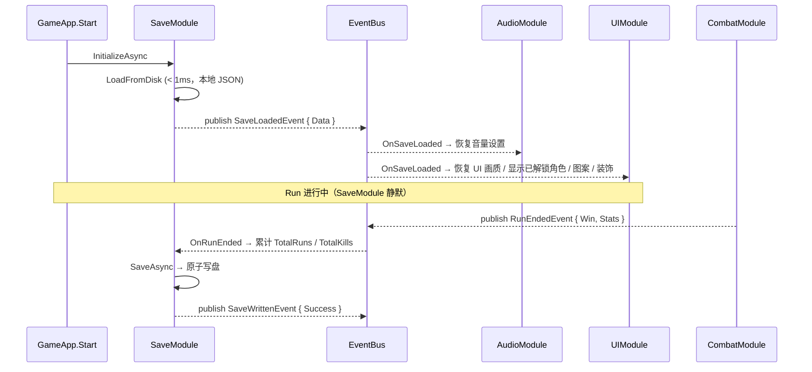

# 14-SaveModule 模块详设

> **版本**: v2.1 ｜ **修订日期**: 2026-06-25
>
> **主导 Agent**: client-unity
> **对应系统 GDD**: 无对应系统 GDD（纯工程模块）
> **当前代码状态**: 新建
> **依赖契约**: [CONTRACT.md](../../../openspec/changes/05-gdd-v2-full-design-docs/CONTRACT.md) §1.9 RunEndedEvent / §二 模块依赖图
>
> **v2.1 变更摘要**：取消初始颜料/金币库存解锁项；局外解锁收窄为角色（9 槽位）、图案配方（按图案 ID 6 个解锁位）、装饰/衔号/画廊；SaveData 结构相应调整。

---

## 一、模块职责（一句话）

管理玩家持久化数据，仅局外；局内 Run 状态不涉及——伪 BR 体验的"死亡 = 数据丢失"由此保证。

具体边界：

- **存**：局外解锁状态（角色 9 槽位 / 图案配方 6 解锁位 / 装饰 / 衔号 / 画廊）、设置数据（音量 / 键位 / 画质）、统计数据（总 Run 数 / 累计击杀 / 纹身配方解锁进度）
- **不存**：局内实体状态（血量 / 当前 Build / 地图进度）；Run 中途关游戏下次重进是全新 Run；**不存**初始颜料库存、初始金币库存（已取消）
- **抽象层**：通过 `ISaveProvider` 隔离"存到哪"，本期实现 `LocalFileSaveProvider`，接口预留云存档扩展位

---

## 二、IGameModule 接口签名

```csharp
public sealed class SaveModule : IGameModule
{
    public int    ModuleCategory => 1;   // 配置 / 数据层（与 TattooModule / AudioModule 同级）
    public Type[] Dependencies   => Array.Empty<Type>();  // 无依赖，可最早启动

    public SaveModule(ModuleRunner runner, EventBus bus);

    // 启动时同步加载存档（本地 JSON，< 1ms，不需要 await 网络）
    public UniTask InitializeAsync(CancellationToken ct = default);
    public UniTask ShutdownAsync (CancellationToken ct = default);

    // ---- 对外公共 API（其他模块通过 GetModule<SaveModule>() 读取）----
    public SaveData        Data         { get; }               // 当前存档快照，只读
    public UniTask         SaveAsync();                        // 手动触发写盘（也可内部自动调用）
    public void            SetCharacterUnlocked(int slot, bool unlocked);
    public void            SetPatternUnlocked(string patternId, int bitIndex, bool unlocked);
    public void            SetDecorationUnlocked(string decorationId, bool unlocked);
    public void            SetTitleUnlocked(string titleId, bool unlocked);
    public void            SetGalleryUnlocked(string galleryId, bool unlocked);
    public void            AddRunStats  (RunStats stats);      // RunEndedEvent 订阅时内部调用
    public void            SetSettings  (SettingsData settings);
}
```

> `ModuleCategory = 1` 参照 CONTRACT §二 依赖图：SaveModule 与 AudioModule 同属 cat1，不依赖任何其他模块，保证最先就绪。

---

## 三、订阅 / 发布事件（全签名）

### 3.1 发布（2 条）

```csharp
// 存档首次加载完成，其他模块订阅后读取初始状态
class SaveLoadedEvent  { SaveData Data; }

// 写盘完成（原子重命名成功）
class SaveWrittenEvent { bool Success; string FilePath; }
```

### 3.2 订阅（2 条）

```csharp
// 每局结束（Win or Lose）自动累计统计并触发写盘
[EventHandler] void OnRunEnded(RunEndedEvent e);
// RunEndedEvent: { Actor PlayerActor; bool Win; RunStats Stats; }  ← CONTRACT §1.9

// 成就解锁（MVP 阶段成就在同一张 SaveData 里记录，不单独建模块）
[EventHandler] void OnAchievementUnlocked(AchievementUnlockedEvent e);
```

> `AchievementUnlockedEvent` 属于 MVP 扩展事件，CONTRACT 未列出；若主对话 review 后追加至 §1.x，此处签名随行更新。

---

## 四、DataTable Schema

**SaveModule 不使用 DataTable**——存档结构由 `SaveData` 类定义，版本字段内嵌，见下方 `SaveSchema` 文档化说明。DataTable 只存配置数据，存档是运行时数据。

### SaveData 类结构（v2.1，文档化，不自动生成）

```csharp
[Serializable]
public sealed class SaveData
{
    public int     Version         = CURRENT_VERSION;
    public const int CURRENT_VERSION = 2;   // v2.1 升为 2

    // --- 局外解锁：角色 ---
    // 预留 9 个槽位；本期 MVP 仅 slot[0] 对应唯一角色，其余默认 false
    public bool[]  CharacterSlots  = new bool[9];

    // --- 局外解锁：图案配方 ---
    // key = patternId（字符串），value = bool[6]（6 个解锁位）
    // 6 位含义由 TattooModule 约定，SaveModule 只负责存储，不解释语义
    public Dictionary<string, bool[]> PatternUnlocks = new();

    // --- 局外解锁：装饰 / 衔号 / 画廊 ---
    public HashSet<string> UnlockedDecorations = new();
    public HashSet<string> UnlockedTitles      = new();
    public HashSet<string> UnlockedGallery     = new();

    // --- 成就 ---
    public List<string> CompletedAchievements = new();

    // --- 统计数据 ---
    public int     TotalRuns       = 0;
    public int     TotalKills      = 0;
    // 纹身配方解锁进度：key = "partId_colorId_patternId"，value = 解锁次数
    public Dictionary<string, int> TattooRecipeProgress = new();

    // --- 设置 ---
    public SettingsData Settings   = new();

    // --- 元信息（用于云存档冲突判定）---
    public string  LastModifiedUtc = "";   // DateTime.UtcNow.ToString("O")
    public string  DeviceId        = "";
    public float   TotalPlayTime   = 0f;   // 单位：秒
}

[Serializable]
public sealed class SettingsData
{
    public float MasterVolume = 1f;
    public float MusicVolume  = 0.8f;
    public float SfxVolume    = 1f;
    public int   QualityLevel = 2;         // 对应 Unity QualitySettings.names 索引
    // 键位重绑定：key = actionName，value = InputBinding JSON（InputSystem 序列化）
    public Dictionary<string, string> KeyBindings = new();
}
```

**v2.1 变更点**：
- 移除 v2.0 中不存在的颜料/金币初始库存字段（该设计已取消）
- 新增 `PatternUnlocks`（图案配方 6 位解锁，替换原来模糊的 `TattooRecipeProgress` 解锁语义）
- 新增 `UnlockedDecorations` / `UnlockedTitles` / `UnlockedGallery`
- `Version` 升为 `2`，迁移器须从 v1 → v2 补充空集合默认值

> **版本字段第一天就加入**，v1.0 无迁移逻辑也要保留字段位置，后续扩展时迁移器只往里加分支。

---

## 五、与其他模块的交互序列



关键约束：
- `InitializeAsync` 期间**不发事件**——`SaveLoadedEvent` 在 `InitializeAsync` 返回后由 `ModuleRunner` 扫描时机触发，或改为 `InitializeAsync` 完成后手动 `Publish`（与框架约定对齐）
- 其他模块在 `OnSaveLoaded` 里读 `GetModule<SaveModule>().Data`，不缓存指针

---

## 六、50 actor 性能预算

SaveModule 与 actor 数无关——存档只有玩家 1 份，无论 50 actor 在场还是 1 个。

| 项 | 开销 | 说明 |
|---|---|---|
| 初始化（读盘） | < 1ms | 本地 JSON，< 10KB |
| 写盘（RunEnd） | < 5ms（后台线程） | `File.WriteAllBytesAsync` + 原子重命名 |
| 内存占用 | < 50KB | `SaveData` 对象常驻内存，不重复 alloc |
| GC / 帧预算消耗 | 0（Update 内无逻辑） | SaveModule 无 Update，零帧预算 |

---

## 七、伪联机 → 真联机迁移点

本期通过 `ISaveProvider` 抽象隔离"存到哪"：

```csharp
public interface ISaveProvider
{
    UniTask<SaveData> LoadAsync(CancellationToken ct);
    UniTask           WriteAsync(SaveData data, CancellationToken ct);
}

// 本期实现
public sealed class LocalFileSaveProvider : ISaveProvider
{
    private readonly string _path;   // Application.persistentDataPath + "/save.json"
    // 写盘走：写 .tmp → File.Replace(.tmp, .json, .bak)（原子重命名）
}

// 未来扩展（不改 SaveModule 内部逻辑）
// public sealed class SteamCloudSaveProvider  : ISaveProvider { ... }
// public sealed class CustomServerSaveProvider : ISaveProvider { ... }
```

迁移步骤（未来真联机时）：
1. 实现 `SteamCloudSaveProvider`（Steam RemoteStorage API）或 `CustomServerSaveProvider`
2. `SaveModule` 构造函数注入替换 `ISaveProvider` 实现
3. 冲突判定：`SaveData.LastModifiedUtc` + `TotalPlayTime` 取"玩时更长"策略（Last Write Wins 简化版）
4. **无需改动 SaveModule 内部逻辑或其他订阅模块**

---

## 八、测试策略

### EditMode 测试（序列化往返）

```csharp
// Assets/Tests/EditMode/SaveModuleTests.cs
[Test]
public void SaveData_RoundTrip_PreservesAllFields()
{
    var original = new SaveData();
    original.CharacterSlots[0] = true;
    original.TotalRuns = 42;
    original.Settings.MasterVolume = 0.5f;
    original.PatternUnlocks["pat_001"] = new bool[] { true, false, true, false, false, false };
    original.UnlockedDecorations.Add("deco_crown");
    original.UnlockedTitles.Add("title_veteran");

    string json = JsonConvert.SerializeObject(original, _settings);
    var loaded = JsonConvert.DeserializeObject<SaveData>(json, _settings);

    Assert.AreEqual(true,  loaded.CharacterSlots[0]);
    Assert.AreEqual(42,    loaded.TotalRuns);
    Assert.AreEqual(0.5f,  loaded.Settings.MasterVolume, 0.001f);
    Assert.IsTrue(loaded.PatternUnlocks["pat_001"][0]);
    Assert.IsFalse(loaded.PatternUnlocks["pat_001"][1]);
    Assert.IsTrue(loaded.UnlockedDecorations.Contains("deco_crown"));
    Assert.IsTrue(loaded.UnlockedTitles.Contains("title_veteran"));
}
```

### EditMode 测试（v1 → v2 版本迁移）

```csharp
// 模拟 v1.0 存档（缺少 PatternUnlocks / UnlockedDecorations 等新字段）
[Test]
public void SaveMigrator_V1ToV2_AddsNewUnlockCollections()
{
    const string v1Json = "{\"Version\":1,\"TotalRuns\":5,\"CharacterSlots\":[true,false,false,false,false,false,false,false,false]}";
    SaveData result = SaveMigrator.Load(v1Json);

    Assert.AreEqual(SaveData.CURRENT_VERSION, result.Version);
    Assert.AreEqual(5, result.TotalRuns);
    Assert.IsTrue(result.CharacterSlots[0]);
    Assert.IsNotNull(result.PatternUnlocks);        // 迁移后空字典
    Assert.IsNotNull(result.UnlockedDecorations);   // 迁移后空集合
    Assert.IsNotNull(result.UnlockedTitles);
    Assert.IsNotNull(result.UnlockedGallery);
}
```

### PlayMode 测试（原子写盘 fallback）

模拟写盘中断（`.tmp` 残留），验证下次加载自动 fallback 到 `.bak`：

```csharp
[UnityTest]
public IEnumerator LoadAsync_FallbackToBak_WhenMainFileMissing()
{
    // 准备：删除 save.json，保留 save.json.bak
    // Act：SaveModule.InitializeAsync
    // Assert：Data.TotalRuns 与 .bak 内容一致
    yield return null;
}
```

---

## 九、风险与开放问题

### 风险 1：JSON vs Binary 序列化

**现状**：推荐 `Newtonsoft.Json`（项目已引入），文件 < 10KB，可读性好，调试友好。

**风险**：玩家直接编辑 JSON 改数值（如 `TotalKills`）。

**应对**：AES-128 加密 + Base64 存储。密钥用 `byte[]` 拼接（非字符串字面量）+ IL2CPP 混淆。存档文件头部 16 字节为随机 IV，每次写盘重新生成。

**注意**：本期 MVP 可先明文，加密作为第一个迭代追加（`ISaveProvider` 层加解密，零改上层）。

### 风险 2：存档损坏 fallback

**策略**：原子写盘（`.tmp` → `File.Replace` → `.bak`）保证最多丢失最近 1 次写盘。

加载逻辑：
```
load(save.json) 成功 → 正常
load(save.json) 失败 → 尝试 load(save.json.bak) + 记录警告日志
两者都失败 → 创建默认 SaveData（初次运行）
```

### 风险 3：`Dictionary<string, string> KeyBindings` 与 InputSystem 兼容

`BindingOverridesAsJson`（InputSystem 原生序列化字符串）可直接序列化为 value，Newtonsoft 无特殊处理。重载时调用 `action.ApplyBindingOverridesFromJson(json)`。风险低。

### 风险 4（v2.1 新增）：`PatternUnlocks` key 格式与 TattooModule 对齐

`PatternUnlocks` 的 key 为 `patternId`，6 位数组的每一位语义由 TattooModule 约定（例如 color0~color5 或 variant0~variant5）。SaveModule 不解释语义，只负责存储与读取。**需在 TattooModule 详设中明确 bit index 映射表**，并反向更新本文档。

### 开放问题

| # | 问题 | 预计决策时机 |
|---|---|---|
| 1 | MVP 是否加 AES 加密？ | 第一次真机测试前确认 |
| 2 | 成就系统是否独立为 `AchievementModule`？ | 第 2 迭代，本期直接存 `SaveData.CompletedAchievements` |
| 3 | `PatternUnlocks` 6 位的具体语义（color / variant / quality）？ | 需 TattooModule 详设确认 |
| 4 | `UnlockedGallery` 的 ID 格式（作品 ID / 关卡 ID / 成就 ID）？ | 需 GalleryModule / AchievementModule 详设确认 |
| 5 | 多平台存档路径（主机 / 移动端）？ | `Application.persistentDataPath` 统一处理，移动端 iOS 需标记不参与 iCloud 备份 |

---

## 引用

- [CONTRACT.md §1.9](../../../openspec/changes/05-gdd-v2-full-design-docs/CONTRACT.md) — RunEndedEvent 签名
- [CONTRACT.md §二](../../../openspec/changes/05-gdd-v2-full-design-docs/CONTRACT.md) — 模块依赖图（cat1）
- [01-TattooModule.md](./01-TattooModule.md) — PatternUnlocks key 格式对齐
- save-serialization SKILL — 原子写盘、版本迁移、AES 加密模式
- Unity 文档：`Application.persistentDataPath`、`JsonConvert`（Newtonsoft）
