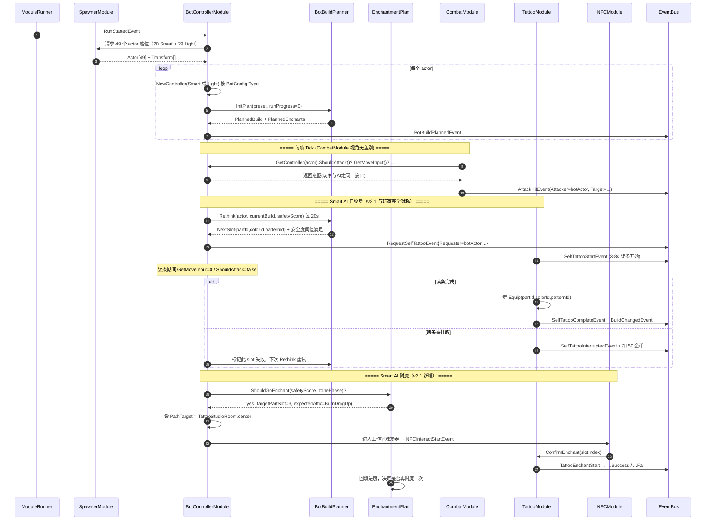

# 16-BotControllerModule 模块详设

> **版本**: v2.1 ｜ **修订日期**: 2026-06-25 ｜ 主要变更：20+29 配比 + 智能 Bot 走自纹身 + 附魔规划

> **主导 Agent**: client-lead
> **对应系统 GDD**: ../systems/06-角色设定与骨架.md（actor 抽象）/ ../systems/11-怪物与Boss.md（轻量 AI 行为）/ ../systems/01-纹身构筑系统.md（自纹身读条 / AI 装备链路）/ ../systems/09-纹身师与商人NPC.md（附魔上游）/ ../systems/04-主动技能.md（2 槽决策模型）
> **当前代码状态**: 新建（本期不写代码，仅落契约与 9 节详设）
> **CONTRACT**: [../../openspec/changes/05-gdd-v2-full-design-docs/CONTRACT.md](../../../openspec/changes/05-gdd-v2-full-design-docs/CONTRACT.md)

---

## 一、模块职责一句话

承载「伪联机」的 AI 大脑：管理 1 个玩家之外的 49 个 actor（**20 智能 AI + 29 轻量 AI**），为每个 actor 持有一份 `IPlayerController` 实现，按 LOD 节奏驱动其移动 / 攻击 / **发起自纹身读条** / **赶赴纹身师附魔** / 拾取交互，使其在 `CombatModule` 眼中与真人玩家完全无差别——包括"读条期间脆弱"这一关键对称机制。

## 二、IGameModule 接口签名

```csharp
public sealed class BotControllerModule : IGameModule, ITickable
{
    public int ModuleCategory => 3;
    public Type[] Dependencies => new[]
    {
        typeof(TattooModule),     // AI 自纹身读条结束后走 TattooModule.Equip 同 API；附魔走 ConfirmEnchant 同 API
        typeof(WeaponModule),     // AI SwitchWeapon
        typeof(SkillModule),      // AI 释放技能（v2.1 SlotIndex ∈ {0,1}）
        typeof(SpawnerModule),    // AI actor 由 Spawner 实例化，本模块只挂 controller
    };
    // 运行时通过 EventBus 与 CombatModule / MapGenModule / EconomyModule / NPCModule 通信，不进 Dependencies
}
```

> 注：`MapGenModule` / `EconomyModule` / `NPCModule` 走事件（`ZoneShrinkPhaseEvent` / `CoinChangedEvent` / `NPCInteractStartEvent`），不进 Dependencies——AI 听到收缩就重规划路径，听到经济变化就重估购买，听到自己进入纹身师工作室触发器就启动附魔流程，符合 CONTRACT §二虚线规则。

## 三、订阅 / 发布事件全签名

### 3.1 发布（v2.1 在 v2 基础上扩展，仍受 CONTRACT 锁定）

```csharp
BotDecisionMadeEvent  { Actor Bot; BotDecisionType Type; object Payload; }
BotBuildPlannedEvent  { Actor Bot; List<TattooSlot> PlannedBuild; List<EnchantPlan> PlannedEnchants; }
BotTargetChangedEvent { Actor Bot; Target NewTarget; }

// v2.1 关键：Bot 与玩家共用同一个「发起读条」请求事件
RequestSelfTattooEvent { Actor Requester; int PartId; int ColorId; int PatternId; }
```

`BotDecisionType` 本模块私有枚举：`Move / Attack / ChargedAttack / Dodge / UseSkillQ / UseSkillE / RequestSelfTattoo / GoEnchant / Purchase / Interact / Idle`。`Payload` 是匿名结构，仅供 debug overlay 消费，业务模块不应解析。

> **v2.1 核心变更**：`EquipTattoo` 决策类型**作废**——智能 AI 不再直接调 `TattooModule.Equip()` 走"场外"通道，改为**发布 `RequestSelfTattooEvent`**，由 01-TattooModule 走与玩家完全相同的读条状态机（3-8s 可中断、被打作废、扣金币不扣颜料）。这是 v2.1「自纹身读条 = 战场信号」对称性的必要保证（详见 §七 设计变更点）。

### 3.2 订阅

| 事件 | 用途 |
|---|---|
| `ActorDiedEvent` | 死亡时清理对应 controller，释放 LOD slot；如该 actor 正在读条则向 01 同步 `SelfTattooInterrupted` 来源 |
| `BuildChangedEvent` | 监听 AI 自身 build 变化以更新 `BotBuildPlanner` 的「已拥有 build」缓存 |
| `ZoneShrinkPhaseEvent` | 收缩阶段切换时，所有 AI 重规划移动目标点（往新 center 漂移），并触发 `BotBuildPlanner` 一次紧急重评估（缩圈期可能要从"刻第 4 块"切换为"先去附魔"） |
| `RoomEnteredEvent` | 智能 AI 进新房间时触发探宝评估；如果进入的是**纹身师工作室触发器**，启动附魔会话 |
| `DeathChestSpawnedEvent` | 智能 AI 评估是否绕路捡死亡宝箱（与击杀者距离 + 自身 build 缺口） |
| `RunStartedEvent` | 局开始：批量创建 49 个 controller + 注入起手 build preset |
| `SelfTattooStartEvent` / `SelfTattooCompleteEvent` / `SelfTattooInterruptedEvent` | 监听**自己发出**的读条事件以更新内部状态机（Reading→Idle）；同时监听**其他 actor** 的读条事件，提供"猎物机会"信号给 `SmartBotPlayerController.ShouldAttack()`——AI 看到玩家或其他 Bot 在读条会主动扑过去（见 §九 9.4） |
| `TattooEnchantStartEvent` / `TattooEnchantSuccessEvent` / `TattooEnchantFailEvent` | 监听自己发起的附魔结果，回填 `EnchantmentPlan` 进度 |

## 四、DataTable Schema

### 4.1 `BotConfig.json`（每行 = 一类 bot 的行为画像）

```json
{
  "table": "BotConfig",
  "fields": [
    { "name": "BotId",              "type": "int" },
    { "name": "Type",               "type": "enum:Smart|Light" },
    { "name": "DisplayName",        "type": "string" },
    { "name": "RethinkInterval",    "type": "float",  "comment": "BuildPlanner 重评估周期(秒) Smart=20 Light=45（v2.1 节奏前移，原 30/60 → 20/45）" },
    { "name": "AttackCooldown",     "type": "float",  "comment": "两次普攻最小间隔(秒)" },
    { "name": "VisionRadius",       "type": "float",  "comment": "感知半径(米) 默认20" },
    { "name": "AggroRadius",        "type": "float",  "comment": "进入战斗的半径，<=Vision" },
    { "name": "DodgeReactionMs",    "type": "int",    "comment": "感知到威胁→闪避的反应时间，越大越像新手玩家" },
    { "name": "Confidence",         "type": "float",  "comment": "0..1 决策置信度，影响走位与目标切换稳定性" },
    { "name": "PreferredPreset",    "type": "int",    "comment": "BotBuildPreset.PresetId 起手 build" },
    { "name": "LootGreedFactor",    "type": "float",  "comment": "拾取贪婪度 0..2 Smart 默认1.0 Light 默认0.3" },
    { "name": "SelfTattooBoldness", "type": "float",  "comment": "v2.1 新增：自纹身的'胆量' 0..1 — 影响 Smart AI 在什么安全度下才敢蹲下来读条 3-8s（详见 §九 9.3）" },
    { "name": "EnchantGreed",       "type": "float",  "comment": "v2.1 新增：去工作室附魔的执着度 0..1 — 影响 EnchantmentPlan 子规划器的优先级权重" }
  ]
}
```

### 4.2 `BotBuildPreset.json`（AI 的 build「人设」库，玩家不可见）

```json
{
  "table": "BotBuildPreset",
  "fields": [
    { "name": "PresetId",         "type": "int" },
    { "name": "Name",             "type": "string", "comment": "如 火爆右臂流 / 寒冰防御流 / 圣光奶妈流" },
    { "name": "Tendency",         "type": "float[7]","comment": "7 元素倾向 vector [Fire,Lightning,Nature,Frost,Mutation,Holy,Pure] sum=1.0" },
    { "name": "PreferredParts",   "type": "int[]",  "comment": "推荐刻的部位 ID 序列，按优先级排" },
    { "name": "RecommendedSeq",   "type": "string", "comment": "推荐 build 序列 JSON：[{partId,colorId,patternId},...] 长度1..6" },
    { "name": "EarlyGameWeapon",  "type": "int",    "comment": "WeaponId 默认起手武器" },
    { "name": "BehaviorMacro",    "type": "enum:Rush|Camp|Pivot|Hybrid", "comment": "高层战斗倾向" },
    { "name": "PreferredSkillQ",  "type": "int",    "comment": "v2.1 新增：起手 Q 槽推荐技能 SkillId" },
    { "name": "PreferredSkillE",  "type": "int",    "comment": "v2.1 新增：起手 E 槽推荐技能 SkillId" },
    { "name": "TargetEnchantAffixes", "type": "int[]", "comment": "v2.1 新增：希望最终在 build 上叠到的词缀 ID 列表（EnchantmentPlan 输入）" }
  ]
}
```

> 设计取舍：本期不引入「神经网络 build 评估器」，preset 是 7 维 tendency vector + 推荐序列 + **2 槽技能偏好** + **目标词缀清单**四轨——`BotBuildPlanner` 在 preset 基础上做小幅 mutation（±10% tendency），保证同 preset 的两个 bot 不会刻成一模一样。

## 五、与其他模块的交互序列



**关键契约**：序列中 Smart AI 走 `RequestSelfTattooEvent` 与玩家走完全同一 API；附魔则走 `NPCInteractStartEvent`，与玩家点击 NPC 完全同一通路——`CombatModule` / `TattooModule` / `NPCModule` 在 OnUpdate 里**不应区分** controller 是 `HumanPlayerController` 还是 `SmartBotPlayerController`。

## 六、50 actor 性能预算（实现策略）

按 [CONTRACT §四](../../../openspec/changes/05-gdd-v2-full-design-docs/CONTRACT.md#四50-actor-性能预算) 落地（v2.1 智能 AI 从 8-10 提升至 20，预算重新分配）：

| 桶 | 数量 | 决策频率 | 每帧预算 |
|---|---|---|---|
| 玩家 | 1 | 每帧 | 0.2 ms |
| 智能 AI · 视野内 | ≤10 | 每帧 (60Hz) | ≤2.5 ms |
| 智能 AI · 视野外 | ≤10（其余智能） | 2Hz (0.5s) | ≤0.4 ms 摊薄 |
| 轻量 AI · 视野内 | 视分布（典型 ≤8） | 5Hz (0.2s) | ≤0.6 ms 摊薄 |
| 轻量 AI · 视野外 | ≤21 | 0.5Hz (2s) | ≤0.1 ms 摊薄 |
| **合计** | 50 | — | **≤3.8 ms** (~23% of 16.7ms) |

> **v2.1 vs v2 增量**：智能 AI 总数 ×2.2，但视野内热桶仍以「玩家可视半径」为天花板（≤10），所以热路径每帧预算只增 0.5 ms。视野外冷桶用 2Hz 摊薄，对帧时长影响小于轻量 AI 减少 11 个所节省的开销，**总预算实际略降**。

### 实现要点

1. **TickGroup 分桶**：模块内维护 4 个 `List<ControllerEntry>`：`SmartHot / SmartCold / LightHot / LightCold`。每帧只跑 `SmartHot` 全量 + `*Cold` 的 `idx % stride == frame % stride` 切片，**保证逐帧均摊**而不是 0.5s 一次性爆 N 个决策。
2. **无 GC**：决策返回的意图用 `struct BotIntent { bool Attack; bool Dodge; Vector2 Move; SkillSlot SkillToCast; ... }`，避免每次决策 alloc。`BotBuildPlanner` 与 `EnchantmentPlan` 内部用 `ArrayPool<TattooSlot>` / `ArrayPool<AffixId>` 借出临时缓冲。
3. **`OnUpdate(dt)` 中禁止 LINQ / `foreach IEnumerable`**：只用 `for (int i)` + 缓存 `Count`，符合 [.claude/CLAUDE.md §十二](../../../.claude/CLAUDE.md) 红线「不在 Update 里做 GC alloc」。
4. **Pathfinding**：智能 AI 走 NavMesh `NavMeshAgent`，但 `CalculatePath` 限频到 2Hz；轻量 AI 不接 NavMesh，仅用「玩家方向向量 + 障碍 raycast 一根」的 wander 模型。50 actor 寻路总预算 ≤2ms/帧（CONTRACT §四）。智能 AI 数量翻倍后仍可承受，因为热桶天花板未变。
5. **视野进出判定**：用 `sqrMagnitude < 20*20=400` 与玩家比对，每 0.2s 触发一次桶迁移；迁移时**不**发 `BuildChanged`（CONTRACT §四明确：LOD 切换非行为）。
6. **BotBuildPlanner / EnchantmentPlan 决策预算**：合计 ≤0.15 ms/actor/decision（CONTRACT §四 Tattoo 计算预算 0.1 ms + v2.1 附魔规划预算 0.05 ms）。Planner 内部本质是 `PresetTendency × CurrentBuildGap` 的加权打分；EnchantmentPlan 是 `TargetAffixSet ∩ CurrentAffixSet` 的差集打分，O(目标词缀数 × 当前 build 数) ≤ 6×6 = 36。
7. **2 技能槽决策树**：`SkillSlotCount = 2` 让 Smart AI 的「选哪个技能放」决策从 v2 的 3-叉简化为 2-叉，**每次决策少 33% 评分项**——这是 v2.1 即使智能 AI ×2.2 仍能塞进预算的隐性收益（[02-战斗手感.md L133 已锚定](../systems/02-战斗手感.md)）。

## 七、伪联机 → 真联机的迁移点

**核心思想**：49 个 bot slot 是「人形 slot」，本期全部由 Bot 占据，未来开真联机时按需替换为 `NetworkPlayerController`。

| 阶段 | 玩家 1 | 智能 AI | 轻量 AI |
|---|---|---|---|
| 本期 伪联机 (v2.1) | Human×1 | **Smart×20** | **Light×29** |
| 中期 4 人合作 | Human×4 | Smart×17 | Light×29 |
| 远期 PvP 大逃杀 | Human×20 | Smart×0-9（人不足补位） | Light×29 |

### 迁移代码改动面（预估）

1. `BotControllerModule.OnRunStarted` 收到一份 `RemotePlayerSlotInfo[]`，对每个远端玩家**不创建** `SmartBotPlayerController` 而是 `NetworkPlayerController`，挂同一个 `IPlayerController` 接口。
2. 业务模块（`CombatModule` / `TattooModule` / `NPCModule` / `EconomyModule`）**零改动**——这是 [CONTRACT §三](../../../openspec/changes/05-gdd-v2-full-design-docs/CONTRACT.md#三iplayercontroller-抽象接口) 的核心承诺。**v2.1 强化**：因为 Smart Bot 现在也走 `RequestSelfTattooEvent` 和 `NPCInteractStartEvent`，自纹身读条与附魔流程在伪联机和真联机下**完全同构**，真联机时直接复用现成的事件链路。
3. 轻量 AI×29 在所有阶段都保留——这是大逃杀「世界感」的填充物，不需要网络化。
4. 服务端权威化时，`IPlayerController` 实例化位置从客户端 BotControllerModule 迁移到服务端「actor sim」进程，客户端只接收快照——此时本模块退化为「轻量 AI 客户端 fallback」与「调试 overlay 数据源」。

### v2.1 设计变更的真联机收益

v2 时代 Smart AI 通过「场外」`TattooModule.Equip` 直刻 build，真联机化时需要单独写一套「服务端 AI 直接改 build」逻辑；v2.1 让 Smart AI 走 `RequestSelfTattooEvent` 后，**Bot 和 NetworkPlayer 在服务端是同一份代码路径**——这是 v2.1 把「场外」改为「场内」的最大架构收益。

## 八、测试策略

### 8.1 EditMode 单测（`Assets/Tests/EditMode/Bot/BotBuildPlannerTests.cs`）

```csharp
[Test] public void BuildPlanner_GivenFireRushPreset_ProducesFireDominantBuild()
[Test] public void BuildPlanner_GivenRunProgress80Percent_FillsAllSixParts()
[Test] public void BuildPlanner_RethinkInterval_Respected_20s_Smart()   // v2.1: mock 时间推进 19s 不重评估 / 21s 重评估
[Test] public void EnchantmentPlan_GivenSafetyHigh_PrioritizesEnchantOverNewTattoo()  // v2.1 新增
[Test] public void EnchantmentPlan_GivenAffixAlreadyOnSlot_SkipsThatSlot()            // v2.1 新增
[Test] public void SmartController_RequestSelfTattoo_DoesNotDirectlyCallTattooEquip() // v2.1 关键回归：禁止旁路
[Test] public void SmartController_ShouldAttack_BoostedWhenTargetIsReadingTattoo()    // v2.1 猎物机会信号
[Test] public void SmartController_SkillDecision_SlotIndex_In_0_or_1_Only()           // v2.1 2 技能槽值域
[Test] public void LightController_ZeroAlloc_PerDecision()                            // 用 NUnit + Allocator profiler 断言 0 GC
```

### 8.2 PlayMode 集成测（`Assets/Tests/PlayMode/Bot/FiftyActorPerfTest.cs`）

- 起一场含 1 玩家 + 20 Smart + 29 Light 的场景，跑 **15 分钟**（v2.1 单局上限）
- 用 `ProfilerRecorder` 采样 `PlayerLoop` / `Scripts.Update` / GC alloc
- 断言：**平均帧时长 < 16.7ms、p99 < 25ms、GC alloc < 100KB/s**（CONTRACT §四 GC 预算）
- 同场 50 actor 不应有 actor 卡在出生点（覆盖 LOD 切换 + 寻路 bug）
- **v2.1 新增断言**：15 分钟内至少 50% Smart AI 完成 ≥1 次自纹身读条 + ≥1 次附魔；至少 20% 因受击中断过读条——这验证「读条 = 战场信号」的对称性在 AI 侧确实成立

### 8.3 行为对齐验证（手测 + 录像 diff）

录两段相同 build / 相同地图 / 相同种子的 15min 视频：一段全玩家操作，一段 `SmartBotPlayerController` 自动玩。人工判断 AI 是否「像新手玩家」（CONTRACT §五 Confidence 是关键参数）；**v2.1 重点观察**：AI 选择什么时候蹲下来读条 / 是否会主动去工作室附魔 / 是否会扑向正在读条的玩家。这是非自动化测试，写入 `tests/plan.md`。

## 九、风险与开放问题

### 9.1 Pathfinding 选型
NavMesh vs 自建 A*。**推荐 NavMesh**——50 actor 同 NavMesh 在 Unity 6 NavMeshAgent 实测可承受，且与未来动态 NavMesh（房间被破坏）兼容。**风险**：智能 AI 从 8-10 提升至 20 后，NavMesh `CalculatePath` 调用频次按比例上升，可能突破 2ms 寻路预算。**缓解**：把 2Hz 重规划降为 1Hz + 增加"Smart AI 共享路径池"（同 preset 的两个 AI 去同一个工作室时，path 复用）。

### 9.2 决策置信度泄露
玩家若发现「这些『玩家』总在 0.2s 整点闪避」会识破 AI 身份。**缓解**：`DodgeReactionMs` 加 ±30% jitter，`Confidence < 1.0` 的 bot 允许「误判闪避」。需要 13-UI 详设留观察席位 + qa-engineer 验证。

### 9.3 ⭐ Smart AI 何时敢"蹲下来读条" — `SelfTattooBoldness` 的关键调优
v2.1 让 Smart AI 走完整 3-8s 自纹身读条后，AI 必须解决「什么时候安全到敢蹲下」这个新决策维度。**当前方案**：综合"周围 20m 内敌对 actor 数 + 最近一次受击时间 + 当前血量比 + `BotConfig.SelfTattooBoldness`"算 safetyScore，阈值通过则发起读条。**风险**：阈值过严→AI 全局只刻 1-2 块，build 体验缺失；阈值过宽→AI 频繁读条被打断，玩家观察到"AI 总在乱试"穿帮。**留交 qa-engineer 在 PlayMode 集成测里通过 8.2 的"50% 完成 / 20% 中断"目标范围反向标定**。

### 9.4 ⭐ 读条 actor 的"猎物机会"信号
v2.1 自纹身读条让任何 actor（玩家或 Smart Bot）在 3-8s 内"明显脆弱"。Smart AI 应在 `ShouldAttack()` 中给"读条中的目标"加权重——这是对称性的另一半。**风险**：如果所有 20 个 Smart AI 都扑向同一个读条 Bot，会出现"狼群"穿帮。**缓解**：每个 Smart AI 用 `Confidence × distance × random` 做去重，只有最近的 2-3 个会去；其余继续原任务。**开放问题**：是否需要在 CONTRACT 补 `SelfTattooDetectedEvent`（由远处 AI 主动 sense 触发）vs 直接订阅 `SelfTattooStartEvent`？**当前选直接订阅**（事件已存在，零成本），CONTRACT 不追加。

### 9.5 ⭐ AI 去附魔的 UX 表现
v2.1 Smart AI 会走进纹身师工作室触发器 → 启动附魔会话。玩家是否能看到「另一个『玩家』在纹身师那里搞附魔」？**推荐**：能看到——AI 占用工作室会显示"工作中"指示，玩家可以选择等待或换 NPC。这与"读条 = 战场信号"对称：附魔也是战场信号，意味着这个 AI 现在脆弱（在屋内、不能反击）。**风险**：玩家围殴正在附魔的 AI 会撕裂"伪联机"幻觉。**缓解**：工作室房间用半透明罩 + 进入有 0.5s grace period 给 AI 起身逃跑。具体见 9-NPC GDD。

### 9.6 CONTRACT 是否需要追加事件
- **建议追加** `RequestSelfTattooEvent`——v2.1 新主线事件，目前仅本模块 + 01 TattooModule 涉及，但未来 NetworkPlayerController 也要发；需要主对话审 CONTRACT §1.3 增订。
- **建议追加** `BotLODChangedEvent { Actor Bot; LODBucket Old; LODBucket New; }`——qa-engineer 与 client-ta 都需要订阅它来做 debug overlay 与 VFX LOD 切换。本期文档先 flag，主对话评审后决定。
- 暂不追加：`BotTargetChanged` 已能覆盖「换敌人」语义；`SelfTattooDetected` 用直接订阅 `SelfTattooStart` 替代。

### 9.7 OnUpdate vs ITickable
当前 [CombatModule](../../../Assets/Scripts/Modules/Combat/CombatModule.cs#L18) 实现 `ITickable.OnUpdate(dt)`。本模块同样用 `ITickable`，但 LOD 分桶可能要求「半帧切片」，需 ModuleRunner 暴露固定步长 / 跳帧 hint。**开放给 client-lead 评审** ModuleRunner 是否需要扩 `IFixedTickable` / `ITickGrouped`。

### 9.8 Smart 与 Light 边界游戏内可观察吗
玩家应能感知到「这是个高级对手」与「这是杂兵」的差别。v2.1 隐性区分加强：Smart AI 会读条 / 会附魔 / 用 2 技能槽；Light AI 不会读条（即从不去刻新纹身，只用初始 build）/ 只普攻 + 闪避。这种行为分层让玩家自然感受到威胁等级差异，留待 11-怪物与 Boss GDD 收口。

---

## 引用

- [CONTRACT.md](../../../openspec/changes/05-gdd-v2-full-design-docs/CONTRACT.md) §1.3 / §1.8 / §2 / §3 / §4 / §5
- [brainstorm.md](../../../openspec/changes/05-gdd-v2-full-design-docs/brainstorm.md) 阶段 A 第 2 条 (c) AI 完备度分级混合
- [systems/01-纹身构筑系统.md](../systems/01-纹身构筑系统.md) §2.8 自纹身读条流程（v2.1 新增）
- [systems/04-主动技能.md](../systems/04-主动技能.md) 2 技能槽 Q/E（v2.1）
- [systems/09-纹身师与商人NPC.md](../systems/09-纹身师与商人NPC.md) 附魔上游（v2.1 重定位）
- [systems/02-战斗手感.md](../systems/02-战斗手感.md) 单局 10-15min 节奏（v2.1）
- [Assets/Scripts/Modules/Combat/CombatModule.cs](../../../Assets/Scripts/Modules/Combat/CombatModule.cs)（待改造点）
- [Assets/Scripts/Modules/Spawner/SpawnerModule.cs](../../../Assets/Scripts/Modules/Spawner/SpawnerModule.cs)（actor 生成上游，v2.1 已同步 20+29 配比）
- [Assets/Scripts/Modules/Tattoo/TattooModule.cs](../../../Assets/Scripts/Modules/Tattoo/TattooModule.cs)（AI 走 `RequestSelfTattoo` → `Equip` 同 API）
- 同期模块详设：02-CombatModule（OnUpdate IPlayerController 改造）/ 05-InputModule（HumanPlayerController 抽出）/ 06-SpawnerModule（v2.1 20+29 已同步）/ 01-TattooModule（v2.1 读条状态机）
