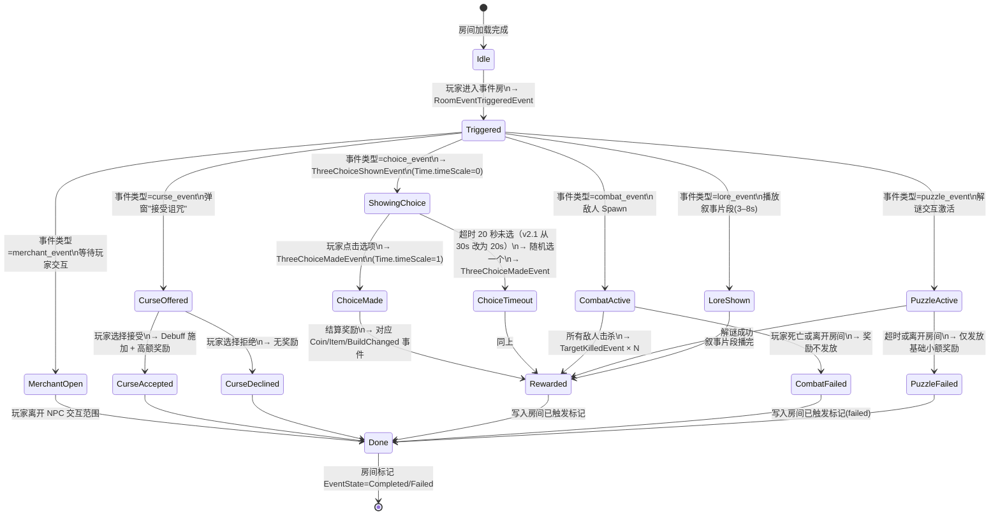

# 10-事件与三选一

> **版本**: v2.1 ｜ **修订日期**: 2026-06-25 ｜ 主要变更：三选一加配方选项 + 技能槽 0/1 + 2min/次

> **主导 Agent**: gd-system
> **协作 Agent**: gd-lead（体验目标审定）/ client-unity（EventModule 实现）/ art-ui（三选一弹窗 UI）
> **依赖系统**: 07-地图生成（事件房节点）/ 11-经济（奖励投放）
> **被依赖系统**: 01-纹身构筑系统（三选一可提供纹身配方 / 图案配方）/ 03-武器系统（三选一可提供武器词条）/ 04-主动技能（三选一可提供技能升级/获取）/ 12-数值平衡与曲线（事件奖励量级约束）
> **对应模块**: EventModule / UIModule（ThreeChoiceUIForm）
> **v2.1 修订说明**: ① 三选一选项池新增 `pattern_recipe`（图案配方）高稀有度奖励渠道；② 技能槽数量从 3 → 2，SkillSlot 字段值域收窄为 0/1；③ 单局时长 10-15min 节奏下，三选一频率从 3min/次 → 2min/次，超时上限同步从 30s → 20s；④ 初始 0 技能设计新增 `skill_acquire` 选项类型，前期权重补偿。

---

## 一、玩家体验目标

### 事件房 = 短决策爽点

玩家在一局 10-15 分钟的 Battle Royale run 里，不应只有"跑图 → 打人"这一种节奏。事件房是游戏地图中散布的**短暂暂停点**——玩家踏入后触发一段微体验（5–30 秒），获得信息、资源或叙事片段，然后立即继续行动。

体验关键词：**意外感**（不知道下一个事件房里有什么）、**决策感**（哪个房优先进）、**密度感**（平均每 2 分钟遇到一次有效事件，短局节奏更紧凑）。

### 三选一 = 肉鸽 Build 路线的关键节点

三选一弹窗是局内 build 分叉的主要入口。每次出现时游戏暂停，玩家从三个选项中选一个，选择直接影响后续打法走向。

参考：Hades 的 Boon 选择（强调方向感 + 惊喜感）、杀戮尖塔的牌选（强调协同与节制）。本游戏三选一的独特性在于：**选项可以跨系统**——同一次三选一里，一个选项可能是"图案配方"（高稀有度），另一个可能是"武器强化"，另一个可能是"获取新技能"，迫使玩家做真正有代价的比较。

---

## 二、核心机制

### 2.1 事件分类

| 类型 ID | 名称 | 触发方式 | 持续时间 | 典型内容 |
|---|---|---|---|---|
| `combat_event` | 战斗事件 | 进入事件房自动触发 | 15–60 秒 | 精英怪 / 特殊小队，击杀奖励丰厚 |
| `choice_event` | 选择事件（三选一） | 进入事件房自动触发 | 5–15 秒（暂停） | Build 强化选项 × 3，见 §2.2 |
| `puzzle_event` | 解谜事件 | 进入事件房自动触发 | 10–30 秒 | 交互解谜（如找符号 / 按顺序踩区域），成功给额外奖励 |
| `merchant_event` | 商人事件 | 进入事件房后与 NPC 交互 | 玩家控制 | 即时购买 / 换购，同 09-纹身师与商人 NPC |
| `boss_event` | Boss 事件 | 特殊标记房间进入 | 30–120 秒 | 独立 Boss 战，见 11-怪物与 Boss |
| `lore_event` | 叙事事件 | 进入事件房自动触发 | 3–8 秒 | 文字/图标叙事片段 + 小额金币奖励，强化世界观 |
| `curse_event` | 诅咒事件（v1.0 引入） | 特定条件触发（见 §7.3） | 5–10 秒（暂停） | 给玩家施加一个持续 Debuff，换取高额奖励 |

**MVP 数量建议**：每类型 3–5 个具体事件，合计 ≥ 20 个事件配置条目（见 §4.1）。一局 10-15 分钟内玩家平均触发 5–7 次 choice_event（含重复），全事件房触发 8–12 次。

### 2.2 三选一弹窗机制

**触发条件**：玩家进入类型为 `choice_event` 的事件房 → 立即发出 `RoomEventTriggeredEvent` → EventModule 计算选项池 → 发出 `ThreeChoiceShownEvent` → UIModule 弹出 `ThreeChoiceUIForm`，**游戏时间暂停**（Time.timeScale = 0）。

**选项生成规则**：

```
可选项池 = 当前 Build 相关加权选项 ∪ 全局随机选项 ∪ 当前稀缺项补全选项 ∪ 新技能获取补全选项（初期）
三选一 = 从可选项池中权重抽取，保证三个选项类型互不相同
```

- **当前 Build 相关**：根据玩家已装备纹身的元素 / 图案，权重增加同方向强化选项
- **类型互不相同**：一次三选一中，三个选项必须来自不同的 OptionType（防止"三个配方"或"三个武器"让玩家无从比较）
- **稀缺项补全**：若玩家超过 8 分钟未获得任何配方（纹身配方或图案配方），权重强制提升 `tattoo_recipe` 或 `pattern_recipe` 类型
- **初期技能补全**（v2.1 新增）：若玩家当前已激活技能数量 < 1（初始状态），前 2 分钟内强制将 `skill_acquire` 纳入候选池，权重上调至 40，确保玩家早期能获得第一个技能

**OptionType 枚举**（v2.1 修订）：

| OptionType | 内容示例 | 频率权重（基础） | v2.1 变更 |
|---|---|---|---|
| `tattoo_recipe` | "解锁「火焰·螺旋·胸口」配方" | 28 | 原 30，让出 2 权重给 pattern_recipe |
| `pattern_recipe` | "解锁「暗影裂纹」图案配方" | 10 | **新增**；高稀有，每局最多出现 1 次（IsUnique=true）|
| `weapon_upgrade` | "当前武器暴击率 +8%" | 20 | 不变 |
| `skill_upgrade` | "技能槽 0 冷却时间 -15%" | 18 | SkillSlot 值域限定为 0/1 |
| `skill_acquire` | "获取新技能（占用空槽）" | 16 | **新增**；初期权重补偿，槽满后自动降权至 5 |
| `coin_bonus` | "立即获得 80 金币" | 14 | 微调 -1 |
| `heal` | "恢复 30% 最大生命值" | 10 | 不变 |
| `one_time_scroll` | "获得一次性技能卷轴：闪电锁链" | 4 | 微调 -1 |

**权重合计**：120（归一化分母，抽取时按比例计算）。

**`skill_acquire` 槽满降权逻辑**：

```
if (player.activeSkillCount >= 2) {
    // 技能槽已满（最大 2 槽），skill_acquire 权重降至 5
    weight_skill_acquire = 5
} else if (runElapsedSec < 120 && player.activeSkillCount == 0) {
    // 前 2 分钟且无技能，强力补偿
    weight_skill_acquire = 40
} else {
    weight_skill_acquire = 16  // 标准权重
}
```

### 2.3 技能槽约束（v2.1 修订）

**技能槽总数**：2（SkillSlot 0 和 SkillSlot 1）。`skill_upgrade` 类选项的 `ContentRef` 中 `slotIndex` 值域严格限定为 `{0, 1}`，不存在 slot 2。

**升级目标选择规则**：若 `skill_upgrade` 选项落地时，目标槽由 EventModule 优先选择**已装备技能中冷却时间更长的槽**（给玩家最明显的收益感知）；若两槽均未装备技能，该选项从池中移除，替换为 `skill_acquire`。

### 2.4 事件触发状态机



**Trigger 表**：

| 触发器 | 条件 | 副作用 |
|---|---|---|
| 进入事件房 | `RoomType == EventRoom` + `EventState == Idle` | 发出 `RoomEventTriggeredEvent` |
| 三选一超时 | `ShowingChoice` 持续 > **20s**（v2.1 修订） | 随机 index 选择，发出 `ThreeChoiceMadeEvent` |
| 战斗失败 | 玩家离开事件房范围 > 5m（战斗进行中） | 发出 `CombatEndedEvent(reason=Escaped)` |
| 重复进入 | `EventState == Completed/Failed` | 不重新触发，仅显示"已完成"视觉标记 |

**失败回退保证**：任何状态下玩家强制离开（死亡 / 掉线 / 缩圈）均能转移到 `Done` 状态，不会卡死。`EventState` 与房间 ID 一起序列化到 SaveModule。

---

## 三、与其它系统的耦合点

| 系统 | 耦合方式 | 说明 |
|---|---|---|
| **07-地图生成** | 地图生成时确定每个房间的 `RoomType` 和 `EventId` | EventModule 读取 `MapGeneratedEvent.Rooms` 中的 `RoomType=EventRoom` 字段来预加载配置 |
| **01-纹身构筑系统** | 三选一 `tattoo_recipe` 选项调用 `TattooModule.UnlockRecipe` | 需确认玩家未持有该配方（重复配方重新随机）|
| **01-纹身构筑系统** | 三选一 `pattern_recipe` 选项调用 `TattooModule.UnlockPatternRecipe`（v2.1 新增） | 图案配方稀有度高，UnlockPatternRecipe 接口须区别于普通 UnlockRecipe；重复时重随机 |
| **03-武器系统** | 三选一 `weapon_upgrade` 选项调用 WeaponModule 强化接口 | 升级幅度受 §4.2 数值表约束 |
| **04-主动技能** | 三选一 `skill_upgrade` 选项调用 SkillModule 升级接口 | SkillSlot 值域 0/1；冷却/伤害降幅受 §4.2 约束 |
| **04-主动技能** | 三选一 `skill_acquire` 选项调用 SkillModule.AcquireNewSkill（v2.1 新增） | 占用第一个空槽；两槽均占满时此类型从候选移除 |
| **11-经济（EconomyModule）** | `coin_bonus` / `heal` 选项发出 `CoinChangedEvent` / `DamagedEvent(负值)` | 金币量级参考 12-数值平衡 §经济曲线 |
| **09-纹身师与商人 NPC** | `merchant_event` 复用 NPCModule 的商人逻辑 | 商人事件房中的商品池可能是随机子集 |
| **12-数值平衡与曲线** | 所有三选一奖励量级须在 §4.2 的值域内 | 防止单次事件破坏 Run 的经济曲线 |
| **13-UI 与 HUD** | `ThreeChoiceUIForm` 弹窗 / 事件房标识 HUD 图标 | 见 §5 |

---

## 四、数值与配置

### 4.1 EventConfig.json（DataTable schema）

**路径**：`Assets/Resources/DataTable/EventConfig.json`

```json
{
  "table": "EventConfig",
  "fields": [
    { "name": "EventId",          "type": "string",  "desc": "事件唯一 ID，格式 event_<type>_<序号>" },
    { "name": "EventType",        "type": "string",  "desc": "枚举：combat_event / choice_event / puzzle_event / merchant_event / boss_event / lore_event / curse_event" },
    { "name": "DisplayName",      "type": "string",  "desc": "玩家可见名称（本地化 Key）" },
    { "name": "TriggerCondition", "type": "string",  "desc": "触发前置条件 JSON：{ minElapsedSec, minRoomCleared, requiredFlag }；空=无条件" },
    { "name": "BaseRewardCoin",   "type": "int",     "desc": "完成时发放基础金币 (point)，0=不发" },
    { "name": "RewardPoolId",     "type": "string",  "desc": "奖励池 ID，引用 LootPoolConfig.json；空=无额外掉落" },
    { "name": "TimeoutSec",       "type": "float",   "desc": "超时时间 (s)；choice_event 为 20（v2.1 改）；-1=不超时（如 merchant_event）" },
    { "name": "CurseDebuffId",    "type": "string",  "desc": "仅 curse_event 用：施加的 Debuff ID；其余事件留空" },
    { "name": "WeightBase",       "type": "int",     "desc": "地图生成时随机选取事件类型的基础权重 (1–100)" },
    { "name": "IsRepeatAllowed",  "type": "bool",    "desc": "同一 Run 内是否允许同一 EventId 重复出现" }
  ],
  "rows": [
    { "EventId": "event_choice_001", "EventType": "choice_event", "DisplayName": "LOC_EVENT_CHOICE_001", "TriggerCondition": "{}", "BaseRewardCoin": 0, "RewardPoolId": "", "TimeoutSec": 20, "CurseDebuffId": "", "WeightBase": 25, "IsRepeatAllowed": true },
    { "EventId": "event_choice_002", "EventType": "choice_event", "DisplayName": "LOC_EVENT_CHOICE_002", "TriggerCondition": "{\"minElapsedSec\":180}", "BaseRewardCoin": 0, "RewardPoolId": "", "TimeoutSec": 20, "CurseDebuffId": "", "WeightBase": 20, "IsRepeatAllowed": true },
    { "EventId": "event_combat_001", "EventType": "combat_event", "DisplayName": "LOC_EVENT_COMBAT_001", "TriggerCondition": "{}", "BaseRewardCoin": 40, "RewardPoolId": "loot_combat_event_normal", "TimeoutSec": -1, "CurseDebuffId": "", "WeightBase": 20, "IsRepeatAllowed": true },
    { "EventId": "event_combat_002", "EventType": "combat_event", "DisplayName": "LOC_EVENT_COMBAT_002", "TriggerCondition": "{\"minElapsedSec\":360}", "BaseRewardCoin": 70, "RewardPoolId": "loot_combat_event_elite", "TimeoutSec": -1, "CurseDebuffId": "", "WeightBase": 10, "IsRepeatAllowed": false },
    { "EventId": "event_lore_001",   "EventType": "lore_event",   "DisplayName": "LOC_EVENT_LORE_001",   "TriggerCondition": "{}", "BaseRewardCoin": 15, "RewardPoolId": "", "TimeoutSec": -1, "CurseDebuffId": "", "WeightBase": 15, "IsRepeatAllowed": false },
    { "EventId": "event_curse_001",  "EventType": "curse_event",  "DisplayName": "LOC_EVENT_CURSE_001",  "TriggerCondition": "{\"minElapsedSec\":180}", "BaseRewardCoin": 0, "RewardPoolId": "loot_curse_reward_001", "TimeoutSec": 20, "CurseDebuffId": "debuff_slow_10pct", "WeightBase": 5, "IsRepeatAllowed": false }
  ]
}
```

> **v2.1 修订说明**：`choice_event` 的 `TimeoutSec` 从 30 → 20；`event_combat_002` 的 `minElapsedSec` 从 480 → 360（适配短局节奏）。

### 4.2 ThreeChoiceOptionConfig.json（DataTable schema）

**路径**：`Assets/Resources/DataTable/ThreeChoiceOptionConfig.json`

```json
{
  "table": "ThreeChoiceOptionConfig",
  "fields": [
    { "name": "OptionId",         "type": "string",  "desc": "选项唯一 ID" },
    { "name": "OptionType",       "type": "string",  "desc": "枚举：tattoo_recipe / pattern_recipe / weapon_upgrade / skill_upgrade / skill_acquire / coin_bonus / heal / one_time_scroll" },
    { "name": "DisplayName",      "type": "string",  "desc": "选项标题（本地化 Key）" },
    { "name": "DescKey",          "type": "string",  "desc": "选项描述（本地化 Key）" },
    { "name": "ContentRef",       "type": "string",  "desc": "内容引用：tattoo_recipe/pattern_recipe=配方ID；weapon_upgrade=升级配置ID；skill_upgrade=技能升级ID(slotIndex 值域 0/1)；skill_acquire=技能ID；其余为空" },
    { "name": "SkillSlot",        "type": "int",     "desc": "仅 skill_upgrade 用：目标技能槽编号，值域 {0, 1}；其余类型填 -1" },
    { "name": "ValueInt",         "type": "int",     "desc": "数值型内容（金币量/治疗量/百分比），单位见 OptionType；非数值型填 0" },
    { "name": "WeightBase",       "type": "int",     "desc": "基础抽取权重 (1–100)" },
    { "name": "WeightBuildBonus", "type": "string",  "desc": "Build 联动加权 JSON：{ elementTag: bonusWeight }；若玩家 Build 含对应元素则额外加权" },
    { "name": "MinRunElapsedSec", "type": "float",   "desc": "最早出现时间 (s)；0=无限制" },
    { "name": "IsUnique",         "type": "bool",    "desc": "同一 Run 内只能出现一次" }
  ],
  "rows": [
    {
      "OptionId": "opt_tattoo_fire_spiral_chest",
      "OptionType": "tattoo_recipe",
      "DisplayName": "LOC_OPT_TATTOO_FIRE_SPIRAL_CHEST",
      "DescKey": "LOC_OPT_DESC_TATTOO_FIRE_SPIRAL_CHEST",
      "ContentRef": "recipe_fire_spiral_chest",
      "SkillSlot": -1, "ValueInt": 0, "WeightBase": 28,
      "WeightBuildBonus": "{\"fire\":20}", "MinRunElapsedSec": 0, "IsUnique": false
    },
    {
      "OptionId": "opt_pattern_shadow_crack",
      "OptionType": "pattern_recipe",
      "DisplayName": "LOC_OPT_PATTERN_SHADOW_CRACK",
      "DescKey": "LOC_OPT_DESC_PATTERN_SHADOW_CRACK",
      "ContentRef": "pattern_recipe_shadow_crack",
      "SkillSlot": -1, "ValueInt": 0, "WeightBase": 10,
      "WeightBuildBonus": "{\"shadow\":15}", "MinRunElapsedSec": 0, "IsUnique": true
    },
    {
      "OptionId": "opt_weapon_crit_plus8",
      "OptionType": "weapon_upgrade",
      "DisplayName": "LOC_OPT_WPN_CRIT_PLUS8",
      "DescKey": "LOC_OPT_DESC_WPN_CRIT_PLUS8",
      "ContentRef": "wpn_upgrade_crit_8pct",
      "SkillSlot": -1, "ValueInt": 8, "WeightBase": 20,
      "WeightBuildBonus": "{}", "MinRunElapsedSec": 120, "IsUnique": false
    },
    {
      "OptionId": "opt_skill_cd_minus15_slot0",
      "OptionType": "skill_upgrade",
      "DisplayName": "LOC_OPT_SKILL_CD_MINUS15_SLOT0",
      "DescKey": "LOC_OPT_DESC_SKILL_CD_MINUS15",
      "ContentRef": "skill_upgrade_cd_15pct_slot0",
      "SkillSlot": 0, "ValueInt": 15, "WeightBase": 18,
      "WeightBuildBonus": "{}", "MinRunElapsedSec": 120, "IsUnique": false
    },
    {
      "OptionId": "opt_skill_cd_minus15_slot1",
      "OptionType": "skill_upgrade",
      "DisplayName": "LOC_OPT_SKILL_CD_MINUS15_SLOT1",
      "DescKey": "LOC_OPT_DESC_SKILL_CD_MINUS15",
      "ContentRef": "skill_upgrade_cd_15pct_slot1",
      "SkillSlot": 1, "ValueInt": 15, "WeightBase": 18,
      "WeightBuildBonus": "{}", "MinRunElapsedSec": 120, "IsUnique": false
    },
    {
      "OptionId": "opt_skill_acquire_thunder_step",
      "OptionType": "skill_acquire",
      "DisplayName": "LOC_OPT_SKILL_ACQUIRE_THUNDER_STEP",
      "DescKey": "LOC_OPT_DESC_SKILL_ACQUIRE_THUNDER_STEP",
      "ContentRef": "skill_thunder_step",
      "SkillSlot": -1, "ValueInt": 0, "WeightBase": 16,
      "WeightBuildBonus": "{\"lightning\":20}", "MinRunElapsedSec": 0, "IsUnique": false
    },
    {
      "OptionId": "opt_coin_80",
      "OptionType": "coin_bonus",
      "DisplayName": "LOC_OPT_COIN_80",
      "DescKey": "LOC_OPT_DESC_COIN_80",
      "ContentRef": "", "SkillSlot": -1, "ValueInt": 80, "WeightBase": 14,
      "WeightBuildBonus": "{}", "MinRunElapsedSec": 0, "IsUnique": false
    },
    {
      "OptionId": "opt_heal_30pct",
      "OptionType": "heal",
      "DisplayName": "LOC_OPT_HEAL_30PCT",
      "DescKey": "LOC_OPT_DESC_HEAL_30PCT",
      "ContentRef": "", "SkillSlot": -1, "ValueInt": 30, "WeightBase": 10,
      "WeightBuildBonus": "{}", "MinRunElapsedSec": 0, "IsUnique": false
    },
    {
      "OptionId": "opt_scroll_lightning_chain",
      "OptionType": "one_time_scroll",
      "DisplayName": "LOC_OPT_SCROLL_LIGHTNING_CHAIN",
      "DescKey": "LOC_OPT_DESC_SCROLL_LIGHTNING_CHAIN",
      "ContentRef": "scroll_lightning_chain",
      "SkillSlot": -1, "ValueInt": 0, "WeightBase": 4,
      "WeightBuildBonus": "{\"lightning\":15}", "MinRunElapsedSec": 240, "IsUnique": false
    }
  ]
}
```

> **v2.1 关键字段说明**：
> - `SkillSlot` 字段新增，值域 `{0, 1, -1}`（-1 表示该选项不绑定技能槽）。`skill_upgrade` 类型必须填 0 或 1，不允许填 2。
> - `pattern_recipe` 类型 `IsUnique = true`，每局只出现一次，制造稀缺感。
> - `skill_acquire` 与 `skill_upgrade` 视为不同 OptionType，二者可在同一次三选一中共存（不违反"类型互不相同"规则）。

### 4.3 三选一频率与量级约束（v2.1 修订）

| 约束项 | 旧值（v2.0） | 新值（v2.1） | 依据 |
|---|---|---|---|
| 三选一平均出现间隔 | 3 min（±30s） | **2 min（±20s）** | 单局 10-15min，保证每局 5–7 次 |
| 三选一超时时间 | 30 秒 | **20 秒** | 15min 局内 7 次 × 20s = 140s，暂停占比 ≤ 1.6%，远低于 5% 上限 |
| `coin_bonus` 上限 | 100 金币 | 100 金币 | 不变 |
| `heal` 上限 | MaxHP × 35% | MaxHP × 35% | 不变 |
| 单次武器/技能升级数值 | ≤ 10%（基础属性） | ≤ 10%（基础属性） | 不变 |
| 诅咒 Debuff 强度 | -10% ~ -20% 单属性 | -10% ~ -20% 单属性 | 不变 |
| `pattern_recipe` 每局出现次数 | N/A | **≤ 1 次**（IsUnique=true） | 新增；高稀有度保护 |
| `skill_acquire` 槽满降权阈值 | N/A | 已激活技能 ≥ 2 时权重降至 5 | 新增；防止槽满后继续刷无效选项 |

---

## 五、UX / UI 触点

### 5.1 事件房入口标识

- 地图上事件房图标（小地图 / 俯视角门口）按 `EventType` 显示不同颜色图标（见 art-ui 出图需求）
- 玩家靠近事件房入口时显示交互提示（E 键图标 + 事件类型名称）
- 已触发的事件房用灰色"已完成"图标标记，避免重复绕路

### 5.2 三选一弹窗规格（v2.1 修订）

- 位置：屏幕中央，背景半透明遮罩（Time.timeScale = 0）
- 布局：三张卡片水平排列，每张卡含图标 / 标题 / 描述 / 类型标签
- **`pattern_recipe` 卡片**：显示金色边框 + "稀有"角标，区分于普通 `tattoo_recipe`（蓝色边框）
- **`skill_acquire` 卡片**：显示绿色边框 + "新技能"角标，便于玩家快速识别
- 交互：鼠标悬停高亮 + 键盘快捷键（1/2/3）
- 倒计时条：**20 秒**可见进度条（v2.1 修订），超时随机选择，用橙色警告色标注
- 选中动效：卡片放大 → 入场 VFX（不超过 0.5 秒，不阻塞游戏恢复）
- **无滚动条**：三选一最多三项，永不出现滚动，信息一屏读完

### 5.3 诅咒事件弹窗

- 双按钮：「接受诅咒（显示奖励内容）」vs「拒绝（无奖励）」
- 诅咒 Debuff 以红色图标实时显示在 HUD 角色状态栏

---

## 六、AI 行为侧需求

SmartBot（视野内 8–10 个）在进入事件房时应做 build 倾向选择：

**三选一选择策略**（BotBuildPlanner 扩展点，v2.1 修订）：

```
优先级：
  skill_acquire（当前已激活技能 < 2 时） > 
  pattern_recipe（当前无图案配方时） > 
  tattoo_recipe（与当前 build 方向匹配）> 
  weapon_upgrade / skill_upgrade > 
  coin_bonus > 
  heal（仅 HP < 50% 时优先） > 
  one_time_scroll
```

- `BotDecisionMadeEvent` 的 `BotDecisionType` 新增枚举值 `ThreeChoicePick`（CONTRACT §1.8 已预留扩展空间）
- SmartBot 选择结果与玩家走完全相同的 `ThreeChoiceMadeEvent` 通路，不旁路奖励结算
- LightBot（40 个轻量 AI）进入事件房不触发三选一弹窗，直接随机选一个选项（结算走同一通路）
- 战斗类事件房：SmartBot 正常参与战斗；LightBot 1s 延迟后进入，数据上视为"已完成"直接发放奖励（节省决策算力）

**诅咒事件**：SmartBot 拒绝诅咒（保守策略，v1.0 不做 AI 诅咒权衡决策，预留 v1.1 调参口）。

---

## 七、风险与开放问题

### 7.1 事件数量（MVP 验收线）

**推荐 MVP 数量：20 个事件配置条目**（每类型至少 2–3 个），上线前确保 choice_event 不少于 6 个、combat_event 不少于 4 个。事件数量不足会导致"每局感觉都一样"的负面反馈，属于 must-have。

### 7.2 三选一频率调参（v2.1 修订）

- 基础频率：每 **2 分钟**一次 choice_event 触发机会（v2.1 改，原 3 分钟）
- **退化风险 1**：频率过高（每 1 分钟）→ 弹窗打断感节奏破碎；频率过低（每 5 分钟）→ 玩家感觉缺少 build 驱动力。10-15min 局的黄金区间：每局 5–7 次。
- **退化风险 2**：`pattern_recipe` 稀有度过低 → 玩家不再期待三选一。对策：`IsUnique=true` + `WeightBase=10` 确保全局稀缺；若 playtest 反馈「从未见过」，可提升至 15。
- **退化风险 3**：`skill_acquire` 槽满后仍频繁出现 → 玩家感到浪费。对策：槽满时权重降至 5，EventModule 在候选池生成阶段动态覆盖 `WeightBase`。
- 建议在 DataTable 中暴露全局参数 `ChoiceEventIntervalSec`，QA 阶段 playtest 后调整，不硬编码
- 平衡检查基线：一局 10-15 分钟内 choice_event 出现 **5–7 次**为健康区间（v2.1 修订，原 7–9 次）

### 7.3 诅咒事件（curse_event）设计决策

**推荐 v1.0 引入 1–2 个诅咒事件**（而非 v1.1），理由：
1. 诅咒事件是"高风险高回报"的 build 决策，与纹身系统的"表达 + 代价感"哲学一致
2. 需要 art-ui 提供诅咒状态的 HUD 表现（红色图标），触点已在 §5.3 列出
3. 风险：Debuff 强度不平衡可能让玩家感觉被强迫。对策：初始仅引入单属性 Debuff（-10% 移动速度），奖励仅为金币加成，不引入影响 build 方向的高复杂诅咒

**触发条件限制（v1.0）**：诅咒事件仅在 Run 进行 ≥ 3 分钟后出现（`minElapsedSec: 180`），且同一 Run 只出现一次（`IsRepeatAllowed: false`）。

### 7.4 开放问题（待确认）

| 问题 | 状态 | 默认决策 |
|---|---|---|
| 三选一是否允许"跳过"（弃权）？ | 开放 | v1.0 不允许跳过，超时随机选；v1.1 可加"跳过"选项但无奖励 |
| 同一事件房被两个 actor 同时进入时如何处理？ | 开放 | 以先到者触发为准，后到者进入后显示"已触发"状态（不重复结算） |
| 解谜事件（puzzle_event）具体 puzzle 类型？ | 开放 | 本 GDD 仅定义接口和奖励规则，具体 puzzle 设计委托 level-designer |
| `pattern_recipe` 图案配方的具体效果范围？ | 开放 | 委托 01-纹身构筑系统 §图案机制 定义；本文档仅规定三选一渠道接入规则 |
| `skill_acquire` 是否允许玩家选择目标技能？ | 开放 | v1.0 固定随机池（由 ContentRef 指定），v1.1 可引入"从 3 个候选技能中选 1 个"的二级选择 |

---

## 八、引用与依赖文档链接

- [CONTRACT.md §1.7](../../../openspec/changes/05-gdd-v2-full-design-docs/CONTRACT.md) — `RoomEventTriggeredEvent` / `ThreeChoiceShownEvent` / `ThreeChoiceMadeEvent` 签名
- [CONTRACT.md §1.8](../../../openspec/changes/05-gdd-v2-full-design-docs/CONTRACT.md) — `BotDecisionMadeEvent` 扩展点
- [design.md §2.1](../../../openspec/changes/05-gdd-v2-full-design-docs/design.md) — 系统 GDD 8 节模板
- [12-数值平衡与曲线.md](./12-数值平衡与曲线.md) — 经济曲线与奖励量级约束
- [01-纹身构筑系统.md](./01-纹身构筑系统.md) — 配方解锁机制 / UnlockPatternRecipe 接口
- [04-主动技能.md](./04-主动技能.md) — SkillModule.AcquireNewSkill 接口 / 技能槽 0/1 约束
- [09-纹身师与商人 NPC.md](./09-纹身师与商人NPC.md) — merchant_event 复用 NPCModule
- [11-怪物与 Boss.md](./11-怪物与Boss.md) — boss_event 战斗规格
