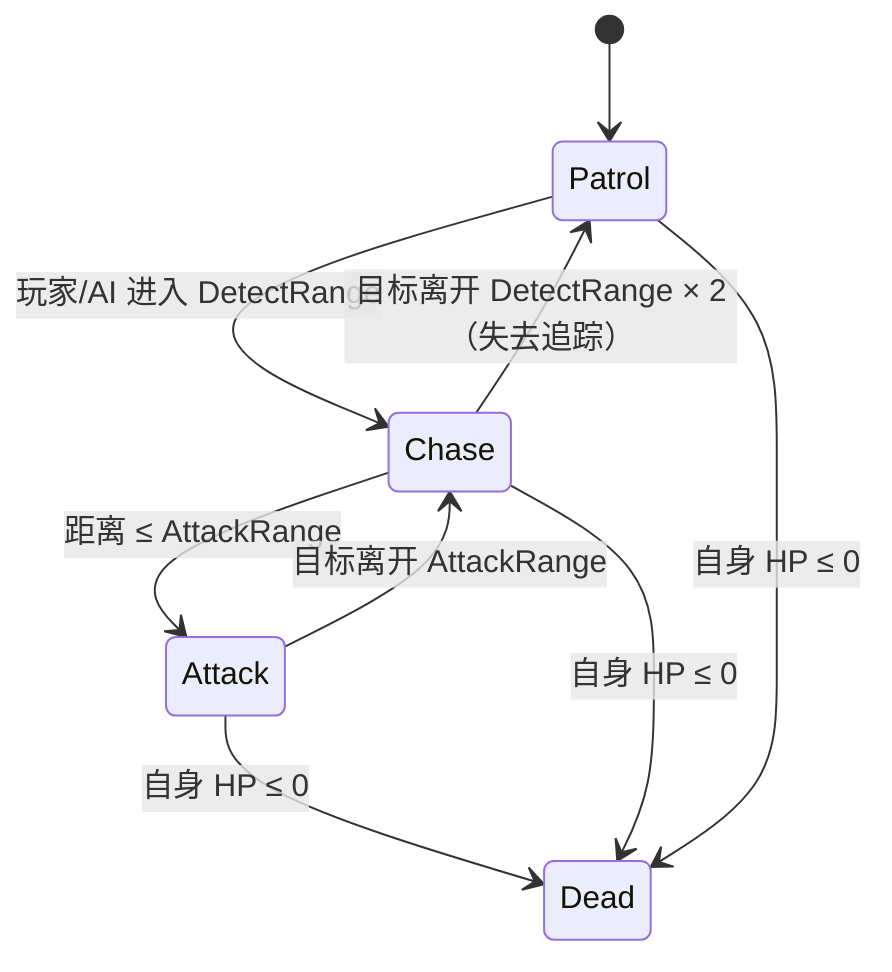
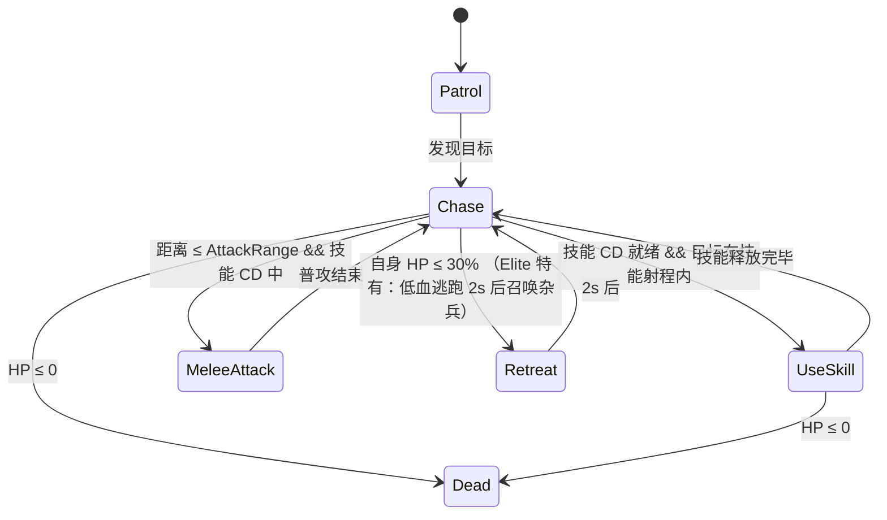
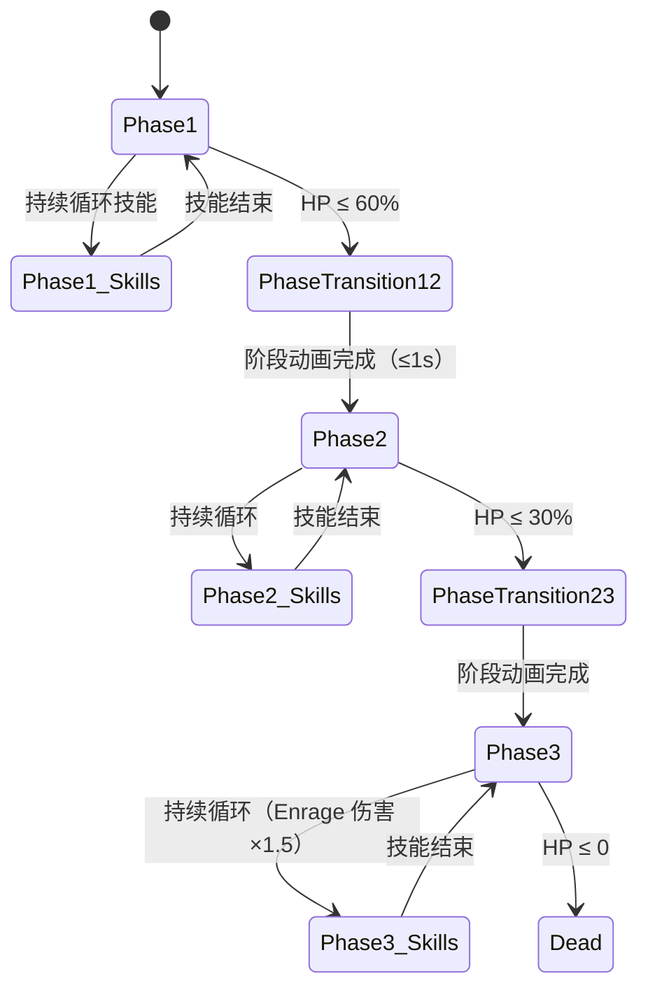

# 11 - 怪物与 Boss GDD

> **版本**: v2.1 ｜ **修订日期**: 2026-06-25 ｜ 主要变更：Boss 掉配方 / 精英掉颜料 / 10-15min 节奏
>
> **主 Agent**：gd-system
> **协作 Agent**：level-designer
> **依赖系统**：15-世界观与轻剧情 / 07-地图生成 / 08-宝箱与探财节奏 / 12-数值平衡与曲线
> **被依赖系统**：07-地图生成（spawner 节点） / 12-数值平衡与曲线（怪物 CR 参照）
> **对应模块**：EnemyModule / BossModule / SpawnerModule
> **配置文件**：`Assets/Resources/DataTable/EnemyConfig.json`
> **状态**：v2.1

---

## 一、玩家体验目标

**一句话**：怪物提供"危险但可控"的 PVE 压力，让玩家在 **10-15 分钟 Run** 里自然地**被迫消耗资源、被迫上交 Build 决策，同时从精英 / Boss 处获取关键升级物资**——PVE 不是主食，是催化剂。

具体体验设计目标（v2.1 节奏调整：单局目标 10-15 min，怪物出现频率整体前移）：

| 阶段 | 时间段（v2.1） | 怪物提供的体验 | 设计意图 |
|---|---|---|---|
| **早期** | 0-4 分钟 | 杂兵出没，零散威胁，新玩家不会第一时间阵亡 | 给玩家刻第 1 个纹身的空间，建立"先 build 后 PVE"的节奏感 |
| **中期** | 4-10 分钟 | 精英怪在偏险位置刷新，玩家主动冒险可拿**稀有颜料** | 制造"要不要拼"的风险回报决策，区隔强弱玩家；颜料稀缺度与冒险距离正相关 |
| **终局** | 10-15 分钟 | Boss 刷新 + 缩圈逼近，三方混战：玩家 / AI / Boss；Boss 掉主题专属配方 | 把单局推上戏剧性高潮，配方是决赛圈的 Build 定胜器 |

**v2.1 节奏变更说明**：原 v2 以 20 分钟为基准设计出现频率；v2.1 缩短至 10-15 min，各阶段时间节点等比前移（×0.75），怪物基础数量不变（Light 数十只 / Elite 数只 / Boss 1 只），但刷新批次间隔压缩，使中后期压力感提前到位。

**反例（明确不要）**：
- 不要怪物密度高到"场上永远有 10+ 只杂兵追着玩家跑"——BR 场景中过高 PVE 密度会把玩家逼离 PVP 热点。
- 不要 Boss 秒杀——Boss 威胁感来自"不可无视"，不来自一刀 80% 血量。
- 不要怪物随缩圈 spawn 均匀平铺——精英应集中在高价值区域（见第七节）。

---

## 二、核心机制 — 三层怪物体系

### 2.1 Tier 定义（v2.1 新增掉落字段）

| Tier | 名称 | 数量 / Run | AI 复杂度 | 核心职责 | **v2.1 必掉** |
|---|---|---|---|---|---|
| **Light** | 杂兵 | 数十只（分批次 spawn，中期前移） | 极低：巡逻 + 追击 + 单一攻击 | 制造压力 / 消耗耗材 / 推进探索节奏 | 金币（5-15）|
| **Elite** | 精英 | 数只（稀疏分布，4 min 后开始刷） | 中：多段技能 + 位移 + 召唤 1-2 杂兵 | **必掉 1 瓶稀有颜料（紫/金档）** / 武器改良 / 引导玩家冒险 | **1 瓶稀有颜料**（紫 or 金，见 2.4） |
| **Boss** | 独立 Boss | 每 Run 1 个（10 min 刷新） | 高：2-3 阶段 + 阶段触发技能 + 场地互动 | 终局高潮 / **必掉该主题专属配方 1 张** | **1 张主题专属图案配方**（见 2.5） |

**"AI 复杂度 ≤ Bot 玩家"原则**：怪物 AI 决策树节点数不超过 SmartBot，保证在 50 actor 帧预算内 EnemyAI 不成为瓶颈。

**怪物独立于 50 actor 预算**（v2 既定）：怪物不计入 CONTRACT §四 50 actor 配额（20 智能 + 29 轻量 + 1 玩家），EnemyModule 有独立帧预算，不挤占 BotControllerModule。

### 2.2 LOD 与 CONTRACT §4 对齐

怪物 AI 决策频率遵循 CONTRACT §四 50 actor 预算的 LOD 规则：

| 距离玩家 | Light 决策频率 | Elite 决策频率 | Boss 决策频率 |
|---|---|---|---|
| ≤ 20m（视野内） | 5 Hz（0.2s） | 10 Hz（0.1s） | 60 Hz（每帧，Boss 永远视野内） |
| > 20m（视野外） | 0.5 Hz（2s） | 1 Hz（1s） | 不适用（Boss 在全局地图标记，玩家可追踪） |

注意：Boss 不走 LOD——Boss 是唯一一只"玩家视野外仍然每秒决策"的怪物，因为其他玩家（包括 AI）可能正在和 Boss 交战。

### 2.3 三类主题怪物池

根据 §15-世界观 的三大末日主题，怪物外观、动效与世界观同源：

| 主题 | Light 代表 | Elite 代表 | Boss | **Boss 专属配方** |
|---|---|---|---|---|
| `AI_RUINS` | 伺服巡逻机器人（双足、电火花特效） | 精英管理型机器人（护盾充能、电磁脉冲） | **「第零号控制核」**（巨型机械蜘蛛，三阶段） | **螺旋纹配方**（机械螺旋纹身图案） |
| `ALIEN_HIVE` | 异变触手爬虫（低矮、多肢） | 巢穴守卫（寄生体召唤、毒液喷射） | **「深渊母巢」**（浮游型，阶段性展开触手阵列） | **星形纹配方**（六角星状异星纹身图案） |
| `VIRUS_SWAMP` | 感染变异体（肿胀人形、冲撞） | 孢子宿主（范围孢子爆、伤口再生） | **「终末宿体」**（巨型肿胀形态，分裂阶段） | **孢子环纹配方**（有机环状孢子纹身图案） |

每个主题 1 个 Boss，共 3 个，复用同一套"2-3 阶段模板"（见 §四）。每个 Boss **必掉本主题唯一专属配方 1 张**，保证 Build 多样性的同时形成明确的高风险高回报契约。

### 2.4 精英颜料掉落规则（v2.1 新增）

精英怪死亡时**必掉 1 瓶稀有档颜料**，具体档位按以下概率表确定：

| 颜料档位 | 稀有度标签 | 精英掉落概率 | 颜色示例 |
|---|---|---|---|
| **紫档** | Rare | 70% | 霓虹紫 / 深紫 / 冷紫 |
| **金档** | Epic | 30% | 金棕 / 炽金 / 熔岩橙 |

设计意图：
- 紫档更常见，保证玩家冒险拿精英有稳定收益；金档稀少但存在，制造"这只精英爆出金瓶"的尖叫时刻。
- 精英颜料掉落**不可叠加 Boss 配方**：精英只掉颜料，Boss 才掉配方，职责分离，玩家目标明确。
- 颜料稀缺感：全局同时存活精英数只（4 min 后刷，死亡不重生），整局颜料总量可控。

### 2.5 Boss 配方掉落规则（v2.1 新增）

Boss 死亡时**必掉本主题专属图案配方 1 张**，并额外随机掉落 2-3 管普通颜料：

| 掉落槽 | 内容 | 数量 | 保底 |
|---|---|---|---|
| **槽 A（必掉）** | 主题专属图案配方（如 AI 主题 = 螺旋纹配方） | 1 张 | 100% |
| **槽 B（随机）** | 普通颜料（白/蓝档） | 2-3 管 | 100% |
| **槽 C（低概率）** | 额外稀有颜料（紫档） | 0-1 管 | 25% |

配方唯一性约束：同一 Run 内若同主题 Boss 已被击杀（理论上每 Run 只有 1 个 Boss），配方不重复掉落。若玩家已拥有该配方（跨 Run 永久解锁），槽 A 替换为 2 管额外颜料。

---

## 三、与其它系统的耦合

| 系统 | 耦合方式 | 数据流方向 |
|---|---|---|
| **15-世界观与轻剧情** | 主题决定本 Run 使用哪个怪物池（`EnemyPoolIds` / `BossPoolIds`）及 Boss 专属配方 ID | `MapThemeConfig.EnemyPoolIds` → SpawnerModule → EnemyModule |
| **07-地图生成** | 地图上预标记 `EnemySpawnerNode`（位置、Tier、数量范围、触发条件）；10-15min 缩短版批次间隔在此配置 | MapGenModule 生成 spawner 节点 → SpawnerModule 消费 |
| **08-宝箱与探财节奏** | 精英 / Boss 死亡后替代宝箱触发 `DeathChestSpawnedEvent`，掉落物从 `EnemyLootTable` 查询 | EnemyModule → EconomyModule → `DeathChestSpawnedEvent` |
| **12-数值平衡与曲线** | 怪物 HP / 伤害曲线参照 §12 定义的"威胁系数基准"校准 | §12 输出 CR 参考值 → 本 GDD 填入 `EnemyConfig.HPCurve` |
| **配方系统（新）** | Boss 死亡触发 `BossDefeatedEvent`，PatternModule 订阅后解锁对应配方 ID | EnemyModule → `BossDefeatedEvent` → PatternModule |
| **CONTRACT 事件** | `ActorDiedEvent`（怪物死亡，Killer 字段填玩家/AI）/ `AttackHitEvent`（怪物发出的攻击）/ `VFXTriggerEvent`（攻击特效） | EnemyModule 发布，CombatModule / VFXModule 订阅 |

---

## 四、数值与配置

### 4.1 EnemyConfig.json 字段草案（v2.1 新增掉落字段）

```json
{
  "table": "EnemyConfig",
  "fields": [
    { "name": "EnemyId",            "type": "string",   "desc": "怪物唯一 ID，如 enemy_ai_servo_light" },
    { "name": "DisplayName",        "type": "string",   "desc": "本地化键，如 enemy.ai_servo" },
    { "name": "ThemeId",            "type": "string",   "desc": "所属世界观主题：AI_RUINS | ALIEN_HIVE | VIRUS_SWAMP | common" },
    { "name": "Tier",               "type": "enum",     "desc": "怪物层级：Light | Elite | Boss" },
    { "name": "BaseHP",             "type": "float",    "desc": "Run 第 0 分钟时的基础生命值 (point)" },
    { "name": "HPCurveK",           "type": "float",    "desc": "HP 随 Run 时间线性增长系数：HPt = BaseHP × (1 + HPCurveK × t_min)，t_min∈[0,15]（v2.1 上限从 20 降为 15）" },
    { "name": "BaseDamage",         "type": "float",    "desc": "基础攻击伤害 (point)，每次命中" },
    { "name": "DamageCurveK",       "type": "float",    "desc": "伤害随时间增长系数，同 HPCurveK 逻辑" },
    { "name": "MoveSpeed",          "type": "float",    "desc": "移动速度 (m/s)" },
    { "name": "AttackRange",        "type": "float",    "desc": "攻击判定范围 (m)" },
    { "name": "DetectRange",        "type": "float",    "desc": "侦测玩家/AI 的感知范围 (m)" },
    { "name": "SkillIds",           "type": "string[]", "desc": "怪物技能 ID 列表（从 EnemySkillConfig 表读取）；Light 通常空或 1 个，Elite 1-3 个，Boss 3-6 个" },
    { "name": "LootTableId",        "type": "string",   "desc": "掉落表 ID（对应 LootTableConfig.json）；精英行须指向含稀有颜料的表" },
    { "name": "GuaranteedLootIds",  "type": "string[]", "desc": "v2.1 新增：必掉物品 ID 列表。Elite 填稀有颜料槽 ID；Boss 填主题专属配方 ID；Light 留空" },
    { "name": "ElitePaintDropRare", "type": "float",    "desc": "v2.1 新增：精英掉紫档颜料概率 (%)，默认 70；剩余 30% 掉金档" },
    { "name": "XPReward",           "type": "int",      "desc": "击杀奖励 XP（如有局内成长系统，否则为 0）(point)" },
    { "name": "CoinReward",         "type": "string",   "desc": "击杀掉落金币范围：格式为 min-max，如 '5-15'" },
    { "name": "PoolIds",            "type": "string[]", "desc": "所属怪物池 ID，可属于多个池（允许跨主题公共怪物）" }
  ]
}
```

### 4.2 Boss 专属阶段配置（BossPhaseConfig.json，v2.1 新增配方字段）

```json
{
  "table": "BossPhaseConfig",
  "fields": [
    { "name": "BossId",              "type": "string",   "desc": "对应 EnemyConfig.EnemyId" },
    { "name": "PhaseIndex",          "type": "int",      "desc": "阶段编号：1 / 2 / 3" },
    { "name": "HPThreshold",         "type": "float",    "desc": "进入本阶段的 HP 百分比触发点：如 1.0=满血进入，0.6=60%HP 进入，0.3=30%HP 进入" },
    { "name": "NewSkillIds",         "type": "string[]", "desc": "本阶段解锁的新技能（叠加，不替换前阶段）" },
    { "name": "EnrageMultiplier",    "type": "float",    "desc": "本阶段伤害倍率：1.0 = 无变化，1.5 = 伤害 ×1.5" },
    { "name": "PhaseVFXId",          "type": "string",   "desc": "阶段转换特效 ID（玩家感知节点）" },
    { "name": "PhaseBGMCueId",       "type": "string",   "desc": "阶段音乐 cue（AudioModule 订阅 BossPhaseChangedEvent 切换）" },
    { "name": "DeathPatternRecipeId","type": "string",   "desc": "v2.1 新增：Boss 死亡时必掉的图案配方 ID（仅 PhaseIndex=最终阶段行填写，其余阶段留空）。例：AI_RUINS Boss 填 recipe_pattern_spiral" }
  ]
}
```

### 4.3 三层怪物基准数值表（v2.1 时间轴调整至 15min）

基于 CharacterConfig 玩家 MaxHealth = 100 作为校准基准：

| Tier | BaseHP | HPCurveK（/min） | BaseDamage | DamageCurveK | DetectRange | 备注 |
|---|---|---|---|---|---|---|
| Light | 25 | +2.0 | 6 | +0.2 | 8 m | 满血玩家挨 2 刀还活着，不构成直接击杀威胁 |
| Elite | 120 | +5.0 | 12 | +0.4 | 12 m | 约等于玩家 1.2 倍 HP，1v1 需要用技能或 build 克制 |
| Boss | 800 | +20.0 | 18 | +0.6 | 全局 | 纯正面 1v1 约 30-40s 可击杀（v2.1 缩短至 10-15min 局，Boss 10min 刷新） |

HP 随时间公式：`HP_actual = BaseHP × (1 + HPCurveK × t_min)`，t_min 上限从 v2 的 20 修正为 15。

v2.1 数值校验（balance-check 视角）：

| 时间点 | 对象 | HP 计算 | 预期结果 | 是否健康 |
|---|---|---|---|---|
| 第 0 min | Light | 25 × 1.0 = 25 | 无 build 玩家 1-2 刀击杀 | 正常 |
| 第 10 min | Light | 25 × (1+2.0×10÷100×10) = 25 × 1.2 = 30 | 中期 build 1 刀击杀，弱 build 2 刀 | 正常，不退化 |
| 第 7 min | Elite | 120 × (1+5.0×7÷100×7) → 120 × 1.35 = 162 | 高 build 约 4-5 刀，低 build 约 8-10 刀 | 区隔清晰 |
| 第 10 min | Boss（刷新） | 800 × (1+20.0×10÷100×10) = 800 × 1.20 = 960 | 三方围攻 15-30s；单人 35-40s | 终局高潮，不碾压 |
| 第 13 min | Boss（中段） | 800 × 1.26 = 1008 | 三方围攻约 20s，压力适中 | 正常 |

退化路径识别：若 HPCurveK 过高（>4.0/min for Light），中后期杂兵过于耐打，玩家陷入"PVE 苦力"而无力 PVP。当前系数 2.0 在 15min 上限内安全边际充足（第 15min Light HP = 25 × 1.3 = 32.5，仍属一刀或两刀范围）。

### 4.4 精英颜料掉落表（LootTableId 参考行）

| 行 ID | ThemeId | 必掉槽（GuaranteedLootIds） | 颜料档位概率 |
|---|---|---|---|
| elite_loot_ai | AI_RUINS | paint_rare_purple_70% \| paint_epic_gold_30% | 紫 70% / 金 30% |
| elite_loot_alien | ALIEN_HIVE | paint_rare_purple_70% \| paint_epic_gold_30% | 紫 70% / 金 30% |
| elite_loot_virus | VIRUS_SWAMP | paint_rare_purple_70% \| paint_epic_gold_30% | 紫 70% / 金 30% |

注：`paint_rare_purple` / `paint_epic_gold` 为 ItemConfig 中的颜料 ID，档位与颜色解耦（同档可有多种颜色，具体颜色由 ItemConfig.ColorVariants 随机取）。

### 4.5 Boss 配方 ID 对照表

| BossId | ThemeId | DeathPatternRecipeId | 图案描述 |
|---|---|---|---|
| boss_ai_core_zero | AI_RUINS | recipe_pattern_spiral | 机械螺旋纹，齿轮与电路元素融合 |
| boss_alien_hive_mother | ALIEN_HIVE | recipe_pattern_star | 六角异星纹，触手放射状收敛 |
| boss_virus_terminus | VIRUS_SWAMP | recipe_pattern_spore_ring | 有机孢子环纹，细胞裂变造型 |

---

## 五、UX / UI 触点

### 5.1 HP 条分层显示策略

| Tier | HP 条位置与样式 |
|---|---|
| **Light** | **无 HP 条**。玩家从颜色反馈（怪物受击闪烁）判断存活状态。减少战场 UI 噪音，保证可读性。 |
| **Elite** | 头顶**细条**（宽约 40px，白色填充 + 黑色轮廓，无背景），仅在受击或锁定时出现，死亡时消失。**精英死亡时额外显示颜料掉落图标 0.8s**（玩家感知"有好东西"）。 |
| **Boss** | **屏幕顶部满条**（全宽）+ Boss 名称标题 + 阶段分割线（如 3 阶段显示 3 格），配合 HP 条下方阶段标识（如 "Phase 2 / 3"）。Boss 死亡时顶部显示**配方获得提示**（如"螺旋纹配方 已解锁"，持续 3s）。 |

### 5.2 Boss 进场仪式（≤3 秒）

不做长动画，保持 BR 节奏感（v2.1：Boss 10 min 刷新，此时缩圈已进入中段，进场仪式更需简洁）：

1. **0s**：`BossSpawnedEvent` 发布，地图上标记 Boss 位置图标（所有玩家可见）
2. **0.2s**：屏幕上方 Boss HP 条从透明淡入（0.3s 渐显）+ Boss 名称文字出现
3. **0.5s**：Boss 进场 VFX（主题专属，如"第零号控制核"地面裂开机械臂伸出）
4. **1.0s**：阶段 BGM cue 触发（AudioModule 订阅 `BossSpawnedEvent`）
5. **1.5s 后**：完全可战斗状态，无镜头锁定，无强制引导

UI 精髓：**不锁定镜头**——Boss 出场期间玩家仍可移动 / 战斗 / 逃跑，保证 BR"被迫卷入还是主动接近"的决策空间。

### 5.3 精英怪视觉差异化

精英怪必须在 20m 外就能与杂兵视觉区分：
- 体型比同主题杂兵大 30-50%
- 主题主导色有高饱和度亮点（如 AI 精英肩部电弧常亮）
- **精英死亡时掉落特效比杂兵更亮、更大（玩家知道"有好东西"）+ 颜料瓶图标弹出动画**

---

## 六、AI 行为侧需求 — EnemyAIController

### 6.1 架构隔离原则

怪物使用**独立的 `EnemyAIController`**，不复用 `IPlayerController` 接口：

| 对比维度 | IPlayerController（玩家/Bot） | EnemyAIController（怪物） |
|---|---|---|
| 纹身 Build | 需要（TattooModule 接口） | **不需要**——怪物无纹身系统 |
| 武器选择 | ShouldPurchase / ShouldEquipNewTattoo | **不需要**——攻击逻辑内嵌于 SkillIds |
| 决策驱动 | BotBuildPlanner + SmartBot策略 | **SkillTree FSM**（有限状态机） |
| 性能归属 | CONTRACT §四 AI 预算（Bot 额度） | **独立 EnemyModule 预算，不占 Bot 配额** |

### 6.2 Light 杂兵 FSM（极简 5 节点）



| Trigger | 条件 | 副作用 |
|---|---|---|
| 进入 Chase | 玩家/AI actor 进入 DetectRange | 切换 LOD 到视野内频率 |
| 进入 Attack | 距离 ≤ AttackRange | 触发 `AttackHitEvent`，播放攻击动画 |
| 失去追踪 | 超出 DetectRange × 2 持续 3s | 重置 Patrol 路点 |
| 进入 Dead | HP ≤ 0 | 触发 `ActorDiedEvent`，掉落金币（Light 无 DeathChest，无颜料） |

### 6.3 Elite 精英 FSM（追加技能层）

在 Light FSM 基础上增加 `UseSkill` 状态：



死亡时：触发 `ActorDiedEvent`，EconomyModule 生成 DeathChest，从 `GuaranteedLootIds` 执行**必掉稀有颜料**逻辑，再查 `LootTableId` 随机附加掉落。

### 6.4 Boss FSM（三阶段）



死亡时（Phase3 → Dead）：
1. 触发 `BossDefeatedEvent { BossId, KillerId, ThemeId }`
2. EnemyModule 从 `DeathPatternRecipeId` 字段取配方 ID，通过 `DeathChestSpawnedEvent` 写入掉落
3. PatternModule 订阅 `BossDefeatedEvent`，校验玩家是否已拥有该配方：
   - 未拥有 → 永久解锁（跨 Run），显示「配方解锁」浮层
   - 已拥有 → 槽 A 替换为 2 管白/蓝颜料

阶段转换触发：`BossPhaseChangedEvent { BossId, FromPhase, ToPhase }` —— BossModule 发布，AudioModule / UIModule / VFXModule 订阅。

---

## 七、风险与开放问题

### 7.1 Boss 设计成本

**问题**：3 个主题 × 3 阶段 = 实质上要设计 9 套技能包 + 3 套模型 + 3 套阶段转换动画，对 1 人项目成本极高。

**推荐方案**：
- 3 个 Boss 共享**同一套阶段模板逻辑**（HPThreshold 阈值、EnrageMultiplier 系数、技能槽位结构完全一致），只替换 VFX / BGM / 技能 ID 填充内容
- 先交付 1 个 Boss（AI_RUINS「第零号控制核」）完整可玩，另 2 个先用占位 Asset（同模型不同色）+ 相同技能 ID 凑数，后续替换

| 优先级 | Boss | 配方 | 状态 |
|---|---|---|---|
| P0（MVP）| 第零号控制核（AI_RUINS） | 螺旋纹配方 | 完整三阶段实现 |
| P1 | 深渊母巢（ALIEN_HIVE） | 星形纹配方 | 完整三阶段实现 |
| P2 | 终末宿体（VIRUS_SWAMP） | 孢子环纹配方 | 完整三阶段实现 |

### 7.2 精英怪是否 Spawn 在缩圈危险区

**问题**：精英应出现在地图哪里？

| 方案 | 描述 | 玩家体验 |
|---|---|---|
| A. 全图随机分布 | 精英在地图生成时随机放置，与缩圈无特殊关联 | 安全，简单实现 |
| **B. 偏置危险边缘区（推荐）** | 精英 Spawn 节点优先标记在**缩圈路径边缘**（危险但仍在圈内 1-2 分钟的位置） | 玩家面临"冒险拿稀有颜料"的张力决策（v2.1 颜料必掉后此决策更鲜明） |

**推荐 B**：精英必掉稀有颜料后，缩圈边缘精英的"高风险高回报"更加明确。实现：`EnemySpawnerNode.SpawnBias = "ZoneEdge"`，精英 spawner 节点距缩圈边界 30-50m 范围内。

### 7.3 10-15min 节奏下 Boss 刷新时机

v2.1 将 Boss 刷新时间从原 v2 的"第 16 min"前移至**第 10 min**。平衡检查：
- 第 10 min Boss HP = 800 × 1.2 = 960（见 4.3），三方围攻 15-30s 可击杀，不构成不可击杀状态。
- 风险：第 10 min 部分玩家 build 仍不完整，正面挑战 Boss 代价高——符合设计意图（自愿冒险 vs 绕开 Boss）。
- 若数据回收后发现 Boss 10 min 刷新过早（<20% 玩家参与），上移至 11-12 min 为调整余地。

### 7.4 次要风险

| 风险 | 等级 | 应对 |
|---|---|---|
| 50 actor + 数十只怪物 navmesh 寻路超帧预算 | 中 | 杂兵用简化 grid 寻路而非全 NavMesh；仅 Elite / Boss 走完整 NavMesh；视野外杂兵停止寻路（冻结位置） |
| Boss 被多个玩家/AI 同时围攻 10s 内即死 | 中 | Boss 有"仇恨分散"逻辑：攻击范围技能优先针对最近 3 个 actor，防止单人 skip Boss，但不锁目标 |
| Light 杂兵忽略 AI bot 只追玩家 | 低 | 怪物目标选择 = 最近 actor（不区分人/AI），保证 AI bot 也在承受 PVE 压力 |
| Boss 仅 1 个 / Run，玩家可能一局完全不打 | 低 | Boss 位置在全局地图标记，高价值配方诱导靠近；但不强制，远离 Boss 是合法策略 |
| 精英必掉颜料导致颜料过剩 | 低 | 精英数只（全 Run 约 5-8 只），颜料总产出可控；调节旋钮：降低 ElitePaintDropRare，或精英数量上限 |
| Boss 配方玩家已全解锁后掉落无意义 | 低 | 槽 A 替换为 2 管颜料（见 2.5 配方唯一性约束），维持击杀激励 |

### 7.5 开放问题

1. **Light 杂兵是否参与 PVP**（主动攻击 AI bot）？推荐 yes（目标=最近 actor），但需验证 50 actor 同场时 AI 路径计算压力。
2. **精英是否重生**？推荐本 Run 内死亡不重生（稀缺感），但可在地图新区域开放时追加新 spawner。
3. **颜料档位是否应与主题挂钩**（AI 主题精英掉冷色系紫，异星主题掉暖金）？当前版本颜色随机，可后期迭代为主题偏置色池。

---

## 八、引用与依赖文档链接

### 来源文档
- [openspec/changes/05-gdd-v2-full-design-docs/CONTRACT.md](../../../openspec/changes/05-gdd-v2-full-design-docs/CONTRACT.md) —— `ActorDiedEvent` / `AttackHitEvent` / `VFXTriggerEvent` / 50 actor 预算 §四
- [openspec/changes/05-gdd-v2-full-design-docs/brainstorm.md](../../../openspec/changes/05-gdd-v2-full-design-docs/brainstorm.md) —— Phase A 共识：伪联机 / 分级 AI / LOD

### 上游 GDD
- [15-世界观与轻剧情.md](./15-世界观与轻剧情.md) —— 三大主题定义 / `EnemyPoolIds` / 主题→怪物风格映射
- [06-角色设定与骨架.md](./06-角色设定与骨架.md) —— `MaxHealth=100` 作为怪物数值校准基准；IPlayerController 接口（怪物明确不复用）
- [00-总策划案v2.md](../00-总策划案v2.md) —— 第 9 局旅程"Boss 掉稀有图案"承诺；10-15min 单局时长目标

### 下游 / 耦合 GDD
- [07-地图生成系统.md](./07-地图生成系统.md) —— EnemySpawnerNode 节点放置规则；刷新批次间隔（v2.1 压缩版）
- [08-宝箱与探财节奏.md](./08-宝箱与探财节奏.md) —— 精英 / Boss 掉落接口（`LootTableId` / `GuaranteedLootIds`）
- [12-数值平衡与曲线.md](./12-数值平衡与曲线.md) —— CR 参考值反哺本 GDD HPCurveK / DamageCurveK
- **配方系统 GDD（待建）** —— `BossDefeatedEvent` 下游消费方；`recipe_pattern_*` ID 注册

### 对应模块详设
- [08-EnemyModule + BossModule 详设](../modules/08-EnemyModule+BossModule.md)
- [06-SpawnerModule 详设](../modules/06-SpawnerModule.md)
- [16-BotControllerModule 详设](../modules/16-BotControllerModule.md)

### 配置表
- `Assets/Resources/DataTable/EnemyConfig.json` —— 怪物基础属性表（v2.1 新增 `GuaranteedLootIds` / `ElitePaintDropRare` 字段）
- `Assets/Resources/DataTable/BossPhaseConfig.json` —— Boss 阶段配置表（v2.1 新增 `DeathPatternRecipeId` 字段）
